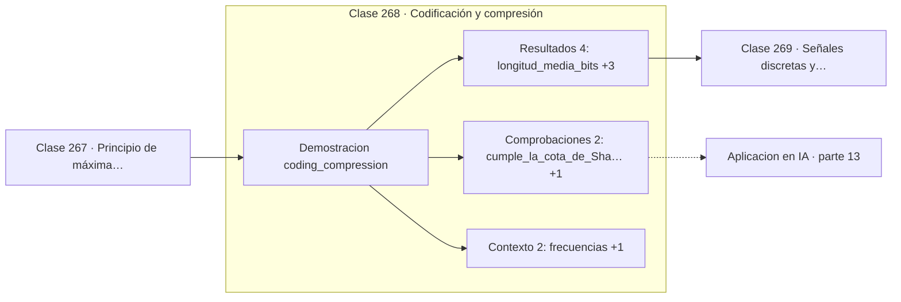

# 268 — Codificación y compresión

> [⬅️ 267 Principio de máxima entropía](../267-principio-de-maxima-entropia/README.md) · [📚 Parte 13](../README.md) · [🏠 Programa](../../../README.md) · [269 Señales discretas y continuas ➡️](../269-senales-discretas-y-continuas/README.md)

**Parte:** 13 — Teoría de la información, señales y series · **Nivel:** `avanzado` · **Horas estimadas:** 4
**Motor:** `engines.part13` · **Demostración:** `coding_compression` · **Clase 8 de 20** de la parte

---

## 🎯 Propósito

**Huffman da códigos cortos a lo frecuente y se acerca al límite de Shannon.**

Entropía, entropía cruzada, divergencias, información mutua, codificación, muestreo, convolución, Fourier, FFT, filtros y series temporales.

## ✅ Resultados de aprendizaje

Al terminar podrás:

1. Explicar **Codificación y compresión** con lenguaje cotidiano y con notación matemática.
2. Resolver un caso pequeño a mano y anticipar el orden de magnitud del resultado.
3. Ejecutar y modificar `lab.py`, que corre la demostración `coding_compression`.
4. Interpretar las 8 salidas del laboratorio y decir qué comprueba cada una.
5. Detectar el error típico de esta parte: comparar entropías calculadas en bases logarítmicas distintas.

## 🧩 Fórmulas de la clase

```text
longitud media = Σ p(x)·len(código(x))
H(p) ≤ longitud media < H(p) + 1
código de prefijo: ninguno es prefijo de otro
```

## 🗺️ Ubicación en el programa



## 📖 Fundamentos

La compresión sin pérdida explota que los símbolos no son equiprobables. Un código de
**longitud fija** gasta `⌈log₂ n⌉` bits por símbolo sea cual sea su frecuencia; uno de
longitud variable puede gastar menos en los frecuentes y más en los raros, reduciendo el
promedio.

La condición para que eso funcione sin separadores es que sea un **código de prefijo**:
ningún código puede ser el comienzo de otro. Así el decodificador sabe dónde termina cada
símbolo sin marcadores adicionales. La construcción de Huffman garantiza esa propiedad por
diseño, fusionando repetidamente los dos símbolos menos probables en un árbol binario.

Huffman es **óptimo** entre los códigos de prefijo de símbolo a símbolo, y su longitud
media queda siempre a menos de un bit por encima de la entropía. Esa cota es ajustada: la
pérdida viene de que las longitudes deben ser enteras, y las probabilidades rara vez son
potencias de dos.

Para acercarse más al límite hay que codificar bloques de símbolos o abandonar la
restricción de longitudes enteras, que es lo que hace la **codificación aritmética**. Los
compresores modernos combinan modelado estadístico con codificación aritmética, y los
modelos de lenguaje son, vistos desde aquí, modelos de compresión: minimizar la pérdida es
minimizar los bits necesarios para transmitir el texto.

## 🧮 Ejemplo trabajado

Código de Huffman para cinco símbolos con frecuencias dispares.

```text
símbolo   p        código Huffman   longitud
  a      0,45          0                1
  b      0,25          10               2
  c      0,15          110              3
  d      0,10          1111             4
  e      0,05          1110             4

longitud media = 0,45·1 + 0,25·2 + 0,15·3 + 0,10·4 + 0,05·4
               = 2,0 bits/símbolo

entropía = 1,977235 bits/símbolo
cota: 1,9772 ≤ 2,0 < 2,9772                          ✓

longitud fija necesaria: ⌈log₂ 5⌉ = 3 bits
ahorro: 33,3 %

Prefijo: ningún código empieza por otro → decodificable.
```

## 🔬 Qué ejecuta el laboratorio

`coding_compression` — Código de Huffman frente a codificación de longitud fija.

| Grupo | Salidas |
|---|---|
| 🔢 Resultados numéricos (4) | `longitud_media_bits`, `entropia_bits`, `longitud_fija_necesaria`, `ahorro_vs_longitud_fija_%` |
| ✅ Comprobaciones de invariante (2) | `cumple_la_cota_de_Shannon`, `codigo_libre_de_prefijos` |

Las claves booleanas no son adorno: si alguna fuera `False`, el resultado numérico
no sería fiable aunque el programa terminase sin error.

```bash
python classes/part-13-teoria-de-la-informacion-senales-y-series/268-codificacion-y-compresion/lab.py
compmath run 268
```

> [!TIP]
> Antes de ejecutar, **escribe tu predicción**. Un laboratorio que confirma lo que
> esperabas enseña tanto como uno que te contradice, pero solo si la predicción
> existía antes del resultado.

## ⚠️ Errores conceptuales frecuentes

1. Construir un código de longitud variable que no sea de prefijo.
2. Esperar alcanzar exactamente la entropía con longitudes enteras.
3. Aplicar Huffman a fuentes con fuerte dependencia entre símbolos sin modelarla.

## 🚀 Dónde se usa de verdad

Compresión de archivos y de imágenes, tokenización BPE, codificación de entropía en vídeo
y evaluación de modelos de lenguaje por bits por carácter.

## 🤖 Conexión con IA

La función de pérdida de casi todo clasificador es entropía cruzada; el VAE optimiza un ELBO con un término KL; las CNN son convoluciones aprendidas.

## 📓 Notebooks

| Archivo | Para qué |
|---|---|
| [`notebook.ipynb`](notebook.ipynb) | recorrido guiado con la demostración ejecutada |
| [`notebook_student.ipynb`](notebook_student.ipynb) | versión con `TODO` para resolver |
| [`notebook_solution.ipynb`](notebook_solution.ipynb) | solución de referencia verificada |

## 📝 Evaluación

| Criterio | Peso |
|---|---:|
| Comprensión conceptual | 25 % |
| Resolución manual | 25 % |
| Implementación y verificación | 25 % |
| Interpretación y comunicación | 15 % |
| Conexión con aplicación real | 10 % |

Detalle y criterios de error crítico en [`assessment.md`](assessment.md).

## ❓ Preguntas de comprobación

1. ¿Cuál es la entrada, cuál la salida y qué unidades tienen?
2. ¿Qué operación domina el comportamiento del resultado?
3. ¿Qué caso extremo revelaría un error conceptual?
4. ¿Cómo verificarías el resultado por un método independiente?
5. ¿Dónde aparece esto en compresión?

Si necesitas releer el código para responderlas, la clase todavía no está superada.

## 📥 Entregable

`notebook_student.ipynb` resuelto más un párrafo que explique el resultado **sin citar
código**: qué entra, qué sale, qué invariante se comprueba y qué pasaría en un caso límite.

## 📚 Bibliografía de la clase

Esta clase enseña **Teoría de la información · Procesamiento de señales · Series temporales**. Cada obra dice qué aporta aquí y cómo se comprobó su localizador:

- [Huffman, D. *A method for the construction of minimum-redundancy codes*, Proceedings of the IRE, 1952](https://doi.org/10.1109/JRPROC.1952.273898) — Teoría de la información: el tema de esta clase · DOI `10.1109/jrproc.1952.273898` verificado en Crossref (2026-08-19).
- [Cover, T.; Thomas, J. *Elements of Information Theory*, 2ª ed., Wiley, 2006, cap. 5](https://doi.org/10.1002/047174882X) — Teoría de la información: el tema de esta clase · DOI `10.1002/047174882x` verificado en Crossref (2026-08-19).

Bibliografía de todas las clases, con el porqué de cada obra, en [`docs/BIBLIOGRAPHY.md`](../../../docs/BIBLIOGRAPHY.md) · localizador y estado de cada obra en [`sources/bibliography.json`](../../../sources/bibliography.json).

## 📂 Material de la clase

[`intuition.md`](intuition.md) · [`theory.md`](theory.md) · [`derivation.md`](derivation.md) · [`exercises.md`](exercises.md) · [`assessment.md`](assessment.md) · [`where-is-this-used.md`](where-is-this-used.md) · [`lesson.yaml`](lesson.yaml)

---

> [⬅️ 267 Principio de máxima entropía](../267-principio-de-maxima-entropia/README.md) · [📚 Parte 13](../README.md) · [🏠 Programa](../../../README.md) · [269 Señales discretas y continuas ➡️](../269-senales-discretas-y-continuas/README.md)
