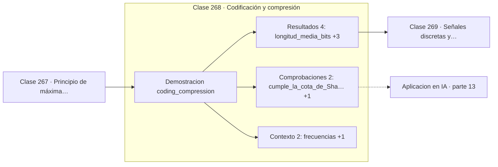

# 268 — Codificación y compresión

> [⬅️ 267 Principio de máxima entropía](../267-principio-de-maxima-entropia/README.md) · [📚 Parte 13](../README.md) · [🏠 Programa](../../../README.md) · [269 Señales discretas y continuas ➡️](../269-senales-discretas-y-continuas/README.md)

**Parte:** 13 — Teoría de la información, señales y series · **Nivel:** `avanzado` · **Horas estimadas:** 4
**Motor:** `engines.part13` · **Demostración:** `coding_compression` · **Clase 8 de 20** de la parte

---

## 🎯 Propósito

Entropía, entropía cruzada, divergencias, información mutua, codificación, muestreo, convolución, Fourier, FFT, filtros y series temporales.

Esta clase concreta ese objetivo sobre **Codificación y compresión**: qué es, cómo se
calcula a mano, cómo se implementa sin ocultar el procedimiento y cómo se verifica
que el resultado es correcto y no solo plausible.

## ✅ Resultados de aprendizaje

Al terminar podrás:

1. Explicar **Codificación y compresión** con lenguaje cotidiano y con notación matemática.
2. Resolver un caso pequeño a mano y anticipar el orden de magnitud del resultado.
3. Ejecutar y modificar `lab.py`, que corre la demostración `coding_compression`.
4. Interpretar las 8 salidas del laboratorio y decir qué comprueba cada una.
5. Detectar el error típico de esta parte: comparar entropías calculadas en bases logarítmicas distintas.

## 🗺️ Ubicación en el programa



## 🧠 Idea rectora de la parte 13

> KL no es simétrica ni es una distancia; JS sí es simétrica.

## 🔬 Qué ejecuta el laboratorio

`coding_compression` — Código de Huffman frente a codificación de longitud fija.

| Grupo | Salidas |
|---|---|
| 🔢 Resultados numéricos (4) | `longitud_media_bits`, `entropia_bits`, `longitud_fija_necesaria`, `ahorro_vs_longitud_fija_%` |
| ✅ Comprobaciones de invariante (2) | `cumple_la_cota_de_Shannon`, `codigo_libre_de_prefijos` |

Las claves booleanas no son adorno: si alguna fuera `False`, el resultado numérico
no sería fiable aunque el programa terminase sin error.

```bash
python classes/part-13-teoria-de-la-informacion-senales-y-series/268-codificacion-y-compresion/lab.py
compmath run 268
```

> [!TIP]
> Antes de ejecutar, **escribe tu predicción**. Un laboratorio que confirma lo que
> esperabas enseña tanto como uno que te contradice, pero solo si la predicción
> existía antes del resultado.

## ⚠️ Errores frecuentes en esta parte

- Calcular log(0) sin epsilon de estabilidad.
- Comparar entropías calculadas en bases logarítmicas distintas.
- Muestrear por debajo de Nyquist y culpar al modelo del ruido resultante.

## 🤖 Conexión con IA

La función de pérdida de casi todo clasificador es entropía cruzada; el VAE optimiza un ELBO con un término KL; las CNN son convoluciones aprendidas.

## 📓 Notebooks

| Archivo | Para qué |
|---|---|
| [`notebook.ipynb`](notebook.ipynb) | recorrido guiado con la demostración ejecutada |
| [`notebook_student.ipynb`](notebook_student.ipynb) | versión con `TODO` para resolver |
| [`notebook_solution.ipynb`](notebook_solution.ipynb) | solución de referencia verificada |

## 📝 Evaluación

| Criterio | Peso |
|---|---:|
| Comprensión conceptual | 25 % |
| Resolución manual | 25 % |
| Implementación y verificación | 25 % |
| Interpretación y comunicación | 15 % |
| Conexión con aplicación real | 10 % |

Detalle y criterios de error crítico en [`assessment.md`](assessment.md).

## ❓ Preguntas de comprobación

1. ¿Cuál es la entrada, cuál la salida y qué unidades tienen?
2. ¿Qué operación domina el comportamiento del resultado?
3. ¿Qué caso extremo revelaría un error conceptual?
4. ¿Cómo verificarías el resultado por un método independiente?
5. ¿Dónde aparece esto en compresión?

Si necesitas releer el código para responderlas, la clase todavía no está superada.

## 📥 Entregable

`notebook_student.ipynb` resuelto más un párrafo que explique el resultado **sin citar
código**: qué entra, qué sale, qué invariante se comprueba y qué pasaría en un caso límite.

## 🔗 Referencias

- Cover, T.; Thomas, J. *Elements of Information Theory*. 2ª ed., Wiley, 2006.
- MacKay, D. *Information Theory, Inference, and Learning Algorithms*. Cambridge, 2003.
- Oppenheim, A.; Schafer, R. *Discrete-Time Signal Processing*. 3ª ed., Pearson, 2009.

## 📂 Material de la clase

[`intuition.md`](intuition.md) · [`theory.md`](theory.md) · [`derivation.md`](derivation.md) · [`exercises.md`](exercises.md) · [`assessment.md`](assessment.md) · [`where-is-this-used.md`](where-is-this-used.md) · [`lesson.yaml`](lesson.yaml)

---

> [⬅️ 267 Principio de máxima entropía](../267-principio-de-maxima-entropia/README.md) · [📚 Parte 13](../README.md) · [🏠 Programa](../../../README.md) · [269 Señales discretas y continuas ➡️](../269-senales-discretas-y-continuas/README.md)
