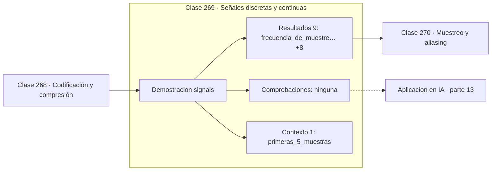

# 269 — Señales discretas y continuas

> [⬅️ 268 Codificación y compresión](../268-codificacion-y-compresion/README.md) · [📚 Parte 13](../README.md) · [🏠 Programa](../../../README.md) · [270 Muestreo y aliasing ➡️](../270-muestreo-y-aliasing/README.md)

**Parte:** 13 — Teoría de la información, señales y series · **Nivel:** `avanzado` · **Horas estimadas:** 4
**Motor:** `engines.part13` · **Demostración:** `signals` · **Clase 9 de 20** de la parte

---

## 🎯 Propósito

**Muestrear convierte una función continua en una lista de números con la que se puede calcular.**

Entropía, entropía cruzada, divergencias, información mutua, codificación, muestreo, convolución, Fourier, FFT, filtros y series temporales.

## ✅ Resultados de aprendizaje

Al terminar podrás:

1. Explicar **Señales discretas y continuas** con lenguaje cotidiano y con notación matemática.
2. Resolver un caso pequeño a mano y anticipar el orden de magnitud del resultado.
3. Ejecutar y modificar `lab.py`, que corre la demostración `signals`.
4. Interpretar las 10 salidas del laboratorio y decir qué comprueba cada una.
5. Detectar el error típico de esta parte: muestrear por debajo de nyquist y culpar al modelo del ruido resultante.

## 🧩 Fórmulas de la clase

```text
x(t) = A·sin(2πft + φ)
x[n] = x(n/fs),  n = 0,1,…,N−1
duración = N / fs
```

## 🗺️ Ubicación en el programa



## 📖 Fundamentos

Una señal es una magnitud que varía con el tiempo o el espacio. En el mundo físico es
**continua**: definida para todo instante y con precisión infinita. Un ordenador solo puede
manejar señales **discretas**: una secuencia finita de números.

El paso de una a otra tiene dos etapas independientes. El **muestreo** discretiza el
tiempo, tomando valores a intervalos regulares. La **cuantización** discretiza la amplitud,
redondeando cada valor a un número finito de niveles. El muestreo tiene una teoría exacta
—Nyquist—; la cuantización introduce un ruido que se caracteriza estadísticamente.

Tres parámetros describen una sinusoide y merecen distinguirse bien. La **amplitud** es la
altura del pico, la **frecuencia** es cuántos ciclos ocurren por segundo, y la **fase** es
el desplazamiento horizontal. La transformada de Fourier de la clase 273 devuelve amplitud
y fase para cada frecuencia, y la fase es la parte que casi siempre se ignora al graficar
y que resulta ser esencial para reconstruir la señal.

La **frecuencia de muestreo** es la decisión de diseño más importante y la que no se puede
corregir después. Muestrear de más gasta memoria y cómputo; muestrear de menos destruye
información de forma irreversible, y la clase siguiente explica por qué.

## 🧮 Ejemplo trabajado

Una sinusoide muestreada durante un segundo.

```text
señal:  x(t) = 2,0 · sin(2π · 5,0 · t + 0,785398)

  amplitud   A = 2,0
  frecuencia f = 5,0 Hz    → 5 ciclos en 1 segundo
  fase       φ = 0,785398 rad = π/4 = 45°

muestreo:
  fs = 100,0 Hz        duración = 1,0 s
  muestras = 100

muestras por ciclo: 100 / 5 = 20        holgado

Frecuencia de Nyquist: 100/2 = 50 Hz
La señal de 5 Hz está muy por debajo: sin aliasing.
```

## 🔬 Qué ejecuta el laboratorio

`signals` — Señal continua muestreada: amplitud, frecuencia y fase.

| Grupo | Salidas |
|---|---|
| 🔢 Resultados numéricos (9) | `frecuencia_de_muestreo_Hz`, `duracion_s`, `muestras`, `frecuencia_de_la_señal_Hz`, `amplitud`, `fase_rad`, `maximo_observado`, `energia`, `periodo_en_muestras` |
| ✅ Comprobaciones de invariante (0) | — |

Las claves booleanas no son adorno: si alguna fuera `False`, el resultado numérico
no sería fiable aunque el programa terminase sin error.

```bash
python classes/part-13-teoria-de-la-informacion-senales-y-series/269-senales-discretas-y-continuas/lab.py
compmath run 269
```

> [!TIP]
> Antes de ejecutar, **escribe tu predicción**. Un laboratorio que confirma lo que
> esperabas enseña tanto como uno que te contradice, pero solo si la predicción
> existía antes del resultado.

## ⚠️ Errores conceptuales frecuentes

1. Confundir frecuencia de la señal con frecuencia de muestreo.
2. Ignorar la fase al analizar o reconstruir una señal.
3. Fijar la frecuencia de muestreo sin conocer el contenido espectral esperado.

## 🚀 Dónde se usa de verdad

Audio digital, sensores e IoT, adquisición de datos biomédicos y preprocesamiento de
series para modelos.

## 🤖 Conexión con IA

La función de pérdida de casi todo clasificador es entropía cruzada; el VAE optimiza un ELBO con un término KL; las CNN son convoluciones aprendidas.

## 📓 Notebooks

| Archivo | Para qué |
|---|---|
| [`notebook.ipynb`](notebook.ipynb) | recorrido guiado con la demostración ejecutada |
| [`notebook_student.ipynb`](notebook_student.ipynb) | versión con `TODO` para resolver |
| [`notebook_solution.ipynb`](notebook_solution.ipynb) | solución de referencia verificada |

## 📝 Evaluación

| Criterio | Peso |
|---|---:|
| Comprensión conceptual | 25 % |
| Resolución manual | 25 % |
| Implementación y verificación | 25 % |
| Interpretación y comunicación | 15 % |
| Conexión con aplicación real | 10 % |

Detalle y criterios de error crítico en [`assessment.md`](assessment.md).

## ❓ Preguntas de comprobación

1. ¿Cuál es la entrada, cuál la salida y qué unidades tienen?
2. ¿Qué operación domina el comportamiento del resultado?
3. ¿Qué caso extremo revelaría un error conceptual?
4. ¿Cómo verificarías el resultado por un método independiente?
5. ¿Dónde aparece esto en compresión?

Si necesitas releer el código para responderlas, la clase todavía no está superada.

## 📥 Entregable

`notebook_student.ipynb` resuelto más un párrafo que explique el resultado **sin citar
código**: qué entra, qué sale, qué invariante se comprueba y qué pasaría en un caso límite.

## 📚 Bibliografía de la clase

Esta clase enseña **Teoría de la información · Procesamiento de señales · Series temporales**. Cada obra dice qué aporta aquí y cómo se comprobó su localizador:

- [Oppenheim, A.; Schafer, R. *Discrete-Time Signal Processing*, 3ª ed., Pearson, 2009, cap. 1](https://openlibrary.org/isbn/9780131988422) — Procesamiento de señales: el tema de esta clase · ISBN-13 `9780131988422` verificado en International ISBN Agency (2026-08-20).
- [Smith, S. *The Scientist and Engineer's Guide to Digital Signal Processing*, 1997](https://www.dspguide.com/) — Procesamiento de señales: el tema de esta clase · URL de la fuente primaria comprobada en sitio de la obra o de su editorial (2026-08-19).

Bibliografía de todas las clases, con el porqué de cada obra, en [`docs/BIBLIOGRAPHY.md`](../../../docs/BIBLIOGRAPHY.md) · localizador y estado de cada obra en [`sources/bibliography.json`](../../../sources/bibliography.json).

## 📂 Material de la clase

[`intuition.md`](intuition.md) · [`theory.md`](theory.md) · [`derivation.md`](derivation.md) · [`exercises.md`](exercises.md) · [`assessment.md`](assessment.md) · [`where-is-this-used.md`](where-is-this-used.md) · [`lesson.yaml`](lesson.yaml)

---

> [⬅️ 268 Codificación y compresión](../268-codificacion-y-compresion/README.md) · [📚 Parte 13](../README.md) · [🏠 Programa](../../../README.md) · [270 Muestreo y aliasing ➡️](../270-muestreo-y-aliasing/README.md)
