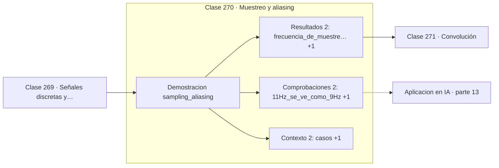

# 270 — Muestreo y aliasing

> [⬅️ 269 Señales discretas y continuas](../269-senales-discretas-y-continuas/README.md) · [📚 Parte 13](../README.md) · [🏠 Programa](../../../README.md) · [271 Convolución ➡️](../271-convolucion/README.md)

**Parte:** 13 — Teoría de la información, señales y series · **Nivel:** `avanzado` · **Horas estimadas:** 4
**Motor:** `engines.part13` · **Demostración:** `sampling_aliasing` · **Clase 10 de 20** de la parte

---

## 🎯 Propósito

**Por debajo de Nyquist la información se pierde y ningún procesamiento la recupera.**

Entropía, entropía cruzada, divergencias, información mutua, codificación, muestreo, convolución, Fourier, FFT, filtros y series temporales.

## ✅ Resultados de aprendizaje

Al terminar podrás:

1. Explicar **Muestreo y aliasing** con lenguaje cotidiano y con notación matemática.
2. Resolver un caso pequeño a mano y anticipar el orden de magnitud del resultado.
3. Ejecutar y modificar `lab.py`, que corre la demostración `sampling_aliasing`.
4. Interpretar las 6 salidas del laboratorio y decir qué comprueba cada una.
5. Detectar el error típico de esta parte: calcular log(0) sin epsilon de estabilidad.

## 🧩 Fórmulas de la clase

```text
fs > 2·f_max   (criterio de Nyquist)
frecuencia de Nyquist = fs / 2
f aparente = |f − k·fs| para el k que la lleve bajo fs/2
```

## 🗺️ Ubicación en el programa



## 📖 Fundamentos

El teorema de muestreo de Nyquist-Shannon establece que una señal cuyo contenido no supera
`f_max` puede reconstruirse **exactamente** a partir de muestras tomadas a más de `2·f_max`
por segundo. Es un resultado sorprendentemente fuerte: no una aproximación, sino
reconstrucción perfecta desde datos discretos.

Por debajo de ese umbral aparece el **aliasing**: las frecuencias altas se hacen pasar por
bajas. Una señal de 11 Hz muestreada a 20 Hz produce exactamente las mismas muestras que
una de 9 Hz, y ninguna operación posterior puede distinguirlas porque los datos son
idénticos. La información no está degradada: está ausente.

El efecto es visible en la vida cotidiana. Las ruedas que parecen girar hacia atrás en el
cine son aliasing temporal a 24 fotogramas por segundo. Los patrones de muaré en fotos de
tejidos o pantallas son aliasing espacial. En todos los casos el sistema muestrea más lento
que la frecuencia del patrón observado.

La única defensa es un **filtro antialiasing analógico antes de muestrear**, que elimine
físicamente las frecuencias por encima de `fs/2`. Es imprescindible que sea antes: una vez
tomadas las muestras, el daño está hecho. En redes convolucionales, hacer submuestreo sin
suavizado previo produce exactamente el mismo problema, y es una de las causas conocidas de
falta de invariancia a traslaciones.

## 🧮 Ejemplo trabajado

Muestreo a 20 Hz de señales de distintas frecuencias.

```text
fs = 20 Hz      frecuencia de Nyquist = 10 Hz

señal      ¿cumple Nyquist?    frecuencia aparente
3 Hz             sí                  3 Hz
9 Hz             sí                  9 Hz
11 Hz            no                  9 Hz    ← alias
19 Hz            no                  1 Hz    ← alias
21 Hz            no                  1 Hz    ← alias

11 Hz y 9 Hz producen muestras idénticas: son
indistinguibles a partir de los datos.

El aliasing es irreversible.
Solución: filtro paso-bajo analógico antes del conversor.
```

## 🔬 Qué ejecuta el laboratorio

`sampling_aliasing` — Nyquist: muestrear por debajo del límite crea una señal falsa.

| Grupo | Salidas |
|---|---|
| 🔢 Resultados numéricos (2) | `frecuencia_de_muestreo_Hz`, `frecuencia_de_nyquist_Hz` |
| ✅ Comprobaciones de invariante (2) | `11Hz_se_ve_como_9Hz`, `el_aliasing_es_irreversible` |

Las claves booleanas no son adorno: si alguna fuera `False`, el resultado numérico
no sería fiable aunque el programa terminase sin error.

```bash
python classes/part-13-teoria-de-la-informacion-senales-y-series/270-muestreo-y-aliasing/lab.py
compmath run 270
```

> [!TIP]
> Antes de ejecutar, **escribe tu predicción**. Un laboratorio que confirma lo que
> esperabas enseña tanto como uno que te contradice, pero solo si la predicción
> existía antes del resultado.

## ⚠️ Errores conceptuales frecuentes

1. Muestrear por debajo de Nyquist y culpar al modelo del ruido resultante.
2. Aplicar el filtro antialiasing después del muestreo.
3. Submuestrear en una CNN sin suavizado previo.

## 🚀 Dónde se usa de verdad

Diseño de sistemas de adquisición, audio y vídeo digital, submuestreo en redes
convolucionales y remuestreo de series temporales.

## 🤖 Conexión con IA

La función de pérdida de casi todo clasificador es entropía cruzada; el VAE optimiza un ELBO con un término KL; las CNN son convoluciones aprendidas.

## 📓 Notebooks

| Archivo | Para qué |
|---|---|
| [`notebook.ipynb`](notebook.ipynb) | recorrido guiado con la demostración ejecutada |
| [`notebook_student.ipynb`](notebook_student.ipynb) | versión con `TODO` para resolver |
| [`notebook_solution.ipynb`](notebook_solution.ipynb) | solución de referencia verificada |

## 📝 Evaluación

| Criterio | Peso |
|---|---:|
| Comprensión conceptual | 25 % |
| Resolución manual | 25 % |
| Implementación y verificación | 25 % |
| Interpretación y comunicación | 15 % |
| Conexión con aplicación real | 10 % |

Detalle y criterios de error crítico en [`assessment.md`](assessment.md).

## ❓ Preguntas de comprobación

1. ¿Cuál es la entrada, cuál la salida y qué unidades tienen?
2. ¿Qué operación domina el comportamiento del resultado?
3. ¿Qué caso extremo revelaría un error conceptual?
4. ¿Cómo verificarías el resultado por un método independiente?
5. ¿Dónde aparece esto en compresión?

Si necesitas releer el código para responderlas, la clase todavía no está superada.

## 📥 Entregable

`notebook_student.ipynb` resuelto más un párrafo que explique el resultado **sin citar
código**: qué entra, qué sale, qué invariante se comprueba y qué pasaría en un caso límite.

## 🔗 Referencias

- [Shannon, C. *Communication in the presence of noise*, Proceedings of the IRE, 1949](https://doi.org/10.1109/JRPROC.1949.232969) — *uso:* artículo de origen consultado en «Muestreo y aliasing».
- [Zhang, R. *Making convolutional networks shift-invariant again*, ICML, 2019](https://arxiv.org/abs/1904.11486) — *uso:* artículo de origen consultado en «Muestreo y aliasing».

Bibliografía completa de la parte en [`../../../docs/BIBLIOGRAPHY.md`](../../../docs/BIBLIOGRAPHY.md) · localizador verificable de cada obra en [`sources/bibliography.json`](../../../sources/bibliography.json).

## 📂 Material de la clase

[`intuition.md`](intuition.md) · [`theory.md`](theory.md) · [`derivation.md`](derivation.md) · [`exercises.md`](exercises.md) · [`assessment.md`](assessment.md) · [`where-is-this-used.md`](where-is-this-used.md) · [`lesson.yaml`](lesson.yaml)

---

> [⬅️ 269 Señales discretas y continuas](../269-senales-discretas-y-continuas/README.md) · [📚 Parte 13](../README.md) · [🏠 Programa](../../../README.md) · [271 Convolución ➡️](../271-convolucion/README.md)
