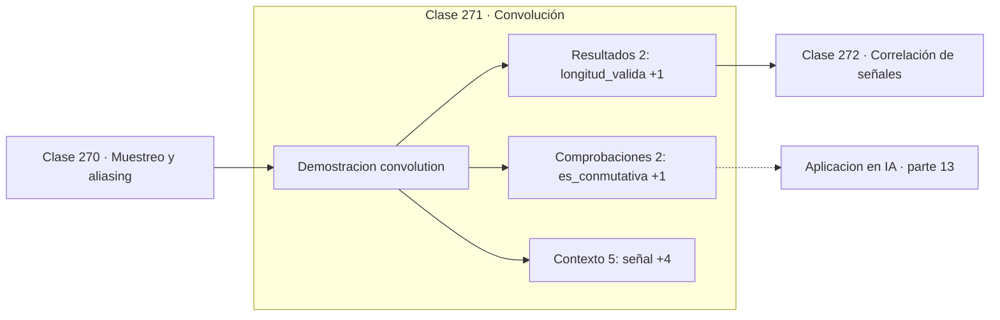

# 271 — Convolución

> [⬅️ 270 Muestreo y aliasing](../270-muestreo-y-aliasing/README.md) · [📚 Parte 13](../README.md) · [🏠 Programa](../../../README.md) · [272 Correlación de señales ➡️](../272-correlacion-de-senales/README.md)

**Parte:** 13 — Teoría de la información, señales y series · **Nivel:** `avanzado` · **Horas estimadas:** 4
**Motor:** `engines.part13` · **Demostración:** `convolution` · **Clase 11 de 20** de la parte

---

## 🎯 Propósito

**Convolucionar es deslizar un núcleo y sumar productos: filtrar y detectar son lo mismo.**

Entropía, entropía cruzada, divergencias, información mutua, codificación, muestreo, convolución, Fourier, FFT, filtros y series temporales.

## ✅ Resultados de aprendizaje

Al terminar podrás:

1. Explicar **Convolución** con lenguaje cotidiano y con notación matemática.
2. Resolver un caso pequeño a mano y anticipar el orden de magnitud del resultado.
3. Ejecutar y modificar `lab.py`, que corre la demostración `convolution`.
4. Interpretar las 9 salidas del laboratorio y decir qué comprueba cada una.
5. Detectar el error típico de esta parte: comparar entropías calculadas en bases logarítmicas distintas.

## 🧩 Fórmulas de la clase

```text
(f * g)[n] = Σₖ f[k]·g[n−k]
media móvil: núcleo [1/3, 1/3, 1/3]
detector de bordes: núcleo [−1, 0, 1]
```

## 🗺️ Ubicación en el programa



## 📖 Fundamentos

La convolución desliza un núcleo sobre una señal y en cada posición calcula una suma
ponderada de los valores vecinos. Es la operación fundamental del procesamiento de señales
y, desde 2012, la operación fundamental de la visión por computador.

Lo notable es cuánto cambia el comportamiento con el núcleo, siendo la operación idéntica.
Un núcleo de valores iguales y positivos **promedia** y por tanto suaviza, eliminando ruido
de alta frecuencia. Un núcleo antisimétrico como `[−1, 0, 1]` **resta** vecinos y por tanto
detecta cambios: es una derivada discreta y responde a los bordes.

La diferencia entre convolución y correlación cruzada es que la primera **invierte** el
núcleo antes de deslizarlo. Esa inversión importa en teoría de sistemas, donde garantiza
propiedades como la conmutatividad. En aprendizaje profundo no importa: como el núcleo se
aprende, aprender el invertido es equivalente, y por eso lo que las bibliotecas llaman
convolución es técnicamente correlación cruzada.

La razón de que las CNN funcionen está en dos propiedades de la convolución. Los
**parámetros se comparten**: el mismo núcleo se aplica en toda la señal, así que un
detector de bordes aprendido sirve en cualquier posición. Y la **conectividad es local**:
cada salida depende solo de un vecindario. Ambas cosas reducen drásticamente el número de
parámetros e incorporan la invariancia a traslaciones como sesgo inductivo.

## 🧮 Ejemplo trabajado

Dos núcleos sobre la misma señal triangular.

```text
señal: [0, 1, 2, 3, 2, 1, 0]

núcleo media móvil [1/3, 1/3, 1/3]:
  resultado: [1,0 ; 2,0 ; 2,333 ; 2,0 ; 1,0]
  la señal se suaviza, los picos se rebajan

núcleo detector de bordes [−1, 0, 1]:
  resultado: [−2, −2, 0, 2, 2]
  responde donde la señal cambia, y cero en el pico

longitud de salida en modo válido: 7 − 3 + 1 = 5

Misma operación, comportamientos opuestos:
todo depende de los coeficientes del núcleo.
```

## 🔬 Qué ejecuta el laboratorio

`convolution` — Convolución discreta: el operador de las CNN.

| Grupo | Salidas |
|---|---|
| 🔢 Resultados numéricos (2) | `longitud_valida`, `longitud_completa` |
| ✅ Comprobaciones de invariante (2) | `es_conmutativa`, `en_frecuencia_es_multiplicacion` |

Las claves booleanas no son adorno: si alguna fuera `False`, el resultado numérico
no sería fiable aunque el programa terminase sin error.

```bash
python classes/part-13-teoria-de-la-informacion-senales-y-series/271-convolucion/lab.py
compmath run 271
```

> [!TIP]
> Antes de ejecutar, **escribe tu predicción**. Un laboratorio que confirma lo que
> esperabas enseña tanto como uno que te contradice, pero solo si la predicción
> existía antes del resultado.

## ⚠️ Errores conceptuales frecuentes

1. Confundir convolución con correlación cruzada al portar fórmulas.
2. Ignorar el tratamiento de los bordes y su efecto en la longitud de salida.
3. Usar un núcleo que no suma 1 cuando se pretendía promediar.

## 🚀 Dónde se usa de verdad

Redes convolucionales, filtrado de imágenes, procesamiento de audio, suavizado de series y
detección de patrones.

## 🤖 Conexión con IA

La función de pérdida de casi todo clasificador es entropía cruzada; el VAE optimiza un ELBO con un término KL; las CNN son convoluciones aprendidas.

## 📓 Notebooks

| Archivo | Para qué |
|---|---|
| [`notebook.ipynb`](notebook.ipynb) | recorrido guiado con la demostración ejecutada |
| [`notebook_student.ipynb`](notebook_student.ipynb) | versión con `TODO` para resolver |
| [`notebook_solution.ipynb`](notebook_solution.ipynb) | solución de referencia verificada |

## 📝 Evaluación

| Criterio | Peso |
|---|---:|
| Comprensión conceptual | 25 % |
| Resolución manual | 25 % |
| Implementación y verificación | 25 % |
| Interpretación y comunicación | 15 % |
| Conexión con aplicación real | 10 % |

Detalle y criterios de error crítico en [`assessment.md`](assessment.md).

## ❓ Preguntas de comprobación

1. ¿Cuál es la entrada, cuál la salida y qué unidades tienen?
2. ¿Qué operación domina el comportamiento del resultado?
3. ¿Qué caso extremo revelaría un error conceptual?
4. ¿Cómo verificarías el resultado por un método independiente?
5. ¿Dónde aparece esto en compresión?

Si necesitas releer el código para responderlas, la clase todavía no está superada.

## 📥 Entregable

`notebook_student.ipynb` resuelto más un párrafo que explique el resultado **sin citar
código**: qué entra, qué sale, qué invariante se comprueba y qué pasaría en un caso límite.

## 🔗 Referencias

- [Goodfellow, I.; Bengio, Y.; Courville, A. *Deep Learning*, MIT Press, 2016, cap. 9](https://www.deeplearningbook.org/) — *uso:* obra de referencia consultada en «Convolución».
- [Oppenheim, A.; Schafer, R. *Discrete-Time Signal Processing*, 3ª ed., Pearson, 2009](https://www.pearson.com/) — *uso:* obra de referencia consultada en «Convolución».

Bibliografía completa de la parte en [`../../../docs/BIBLIOGRAPHY.md`](../../../docs/BIBLIOGRAPHY.md) · localizador verificable de cada obra en [`sources/bibliography.json`](../../../sources/bibliography.json).

## 📂 Material de la clase

[`intuition.md`](intuition.md) · [`theory.md`](theory.md) · [`derivation.md`](derivation.md) · [`exercises.md`](exercises.md) · [`assessment.md`](assessment.md) · [`where-is-this-used.md`](where-is-this-used.md) · [`lesson.yaml`](lesson.yaml)

---

> [⬅️ 270 Muestreo y aliasing](../270-muestreo-y-aliasing/README.md) · [📚 Parte 13](../README.md) · [🏠 Programa](../../../README.md) · [272 Correlación de señales ➡️](../272-correlacion-de-senales/README.md)
