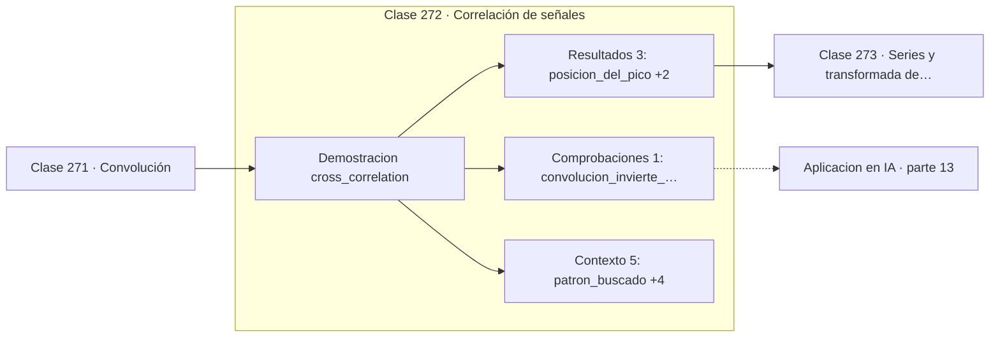

# 272 — Correlación de señales

> [⬅️ 271 Convolución](../271-convolucion/README.md) · [📚 Parte 13](../README.md) · [🏠 Programa](../../../README.md) · [273 Series y transformada de Fourier ➡️](../273-series-y-transformada-de-fourier/README.md)

**Parte:** 13 — Teoría de la información, señales y series · **Nivel:** `avanzado` · **Horas estimadas:** 4
**Motor:** `engines.part13` · **Demostración:** `cross_correlation` · **Clase 12 de 20** de la parte

---

## 🎯 Propósito

**La correlación cruzada localiza dónde aparece un patrón dentro de una señal.**

Entropía, entropía cruzada, divergencias, información mutua, codificación, muestreo, convolución, Fourier, FFT, filtros y series temporales.

## ✅ Resultados de aprendizaje

Al terminar podrás:

1. Explicar **Correlación de señales** con lenguaje cotidiano y con notación matemática.
2. Resolver un caso pequeño a mano y anticipar el orden de magnitud del resultado.
3. Ejecutar y modificar `lab.py`, que corre la demostración `cross_correlation`.
4. Interpretar las 9 salidas del laboratorio y decir qué comprueba cada una.
5. Detectar el error típico de esta parte: muestrear por debajo de nyquist y culpar al modelo del ruido resultante.

## 🧩 Fórmulas de la clase

```text
(f ⋆ g)[n] = Σₖ f[k]·g[n+k]
sin inversión del núcleo
el máximo indica la posición de mejor coincidencia
```

## 🗺️ Ubicación en el programa



## 📖 Fundamentos

La correlación cruzada mide el parecido entre una señal y un patrón desplazado. Es
idéntica a la convolución salvo que no invierte el núcleo, y su interpretación es directa:
en cada posición calcula el producto escalar entre el patrón y el trozo de señal que hay
allí.

Ese producto escalar es exactamente la medida de alineación de la parte 05: grande cuando
los vectores apuntan en la misma dirección. Por eso el **máximo de la correlación indica
dónde está el patrón**, y su valor mide cuán buena es la coincidencia. Es la base del
emparejamiento de plantillas.

Hay una precaución importante: la correlación sin normalizar favorece las zonas de mayor
energía. Un tramo de señal con valores grandes puede dar más correlación que una
coincidencia perfecta con valores pequeños. Por eso en la práctica se usa la **correlación
normalizada**, que divide por las normas y es invariante a la escala.

La conexión con la inteligencia artificial actual es directa: el mecanismo de **atención**
calcula productos escalares entre consultas y claves, los normaliza y los pasa por softmax.
Es una correlación entre representaciones, con el mismo principio de que el producto
escalar mide alineación. Reconocerlo hace mucho más legible la fórmula de la atención.

## 🧮 Ejemplo trabajado

Localización de un patrón dentro de una señal más larga.

```text
patrón buscado: [1, 2, 1]
señal: [0, 0, 1, 2, 1, 0, 0,5, 1, 0,5, 0]

correlación: [1,0 ; 4,0 ; 6,0 ; 4,0 ; 1,5 ; 2,0 ; 3,0 ; 2,0]

pico en la posición 2, con valor 6,0

Comprobación: en la posición 2 la señal vale [1,2,1],
exactamente el patrón. Producto escalar = 1+4+1 = 6.     ✓

En la posición 6 hay el mismo patrón a mitad de escala:
correlación 3,0, la mitad. Sin normalizar, una copia
atenuada puntúa menos que la original.
```

## 🔬 Qué ejecuta el laboratorio

`cross_correlation` — Correlación cruzada: convolución sin invertir el kernel.

| Grupo | Salidas |
|---|---|
| 🔢 Resultados numéricos (3) | `posicion_del_pico`, `valor_del_pico`, `coincidencia_exacta_en` |
| ✅ Comprobaciones de invariante (1) | `convolucion_invierte_el_kernel` |

Las claves booleanas no son adorno: si alguna fuera `False`, el resultado numérico
no sería fiable aunque el programa terminase sin error.

```bash
python classes/part-13-teoria-de-la-informacion-senales-y-series/272-correlacion-de-senales/lab.py
compmath run 272
```

> [!TIP]
> Antes de ejecutar, **escribe tu predicción**. Un laboratorio que confirma lo que
> esperabas enseña tanto como uno que te contradice, pero solo si la predicción
> existía antes del resultado.

## ⚠️ Errores conceptuales frecuentes

1. Usar correlación sin normalizar y dejar que gane la zona de más energía.
2. Confundir el signo del desplazamiento al interpretar la posición del pico.
3. Aplicarla a señales de escalas muy distintas sin estandarizar.

## 🚀 Dónde se usa de verdad

Emparejamiento de plantillas, sincronización de señales, radar y sonar, alineación de
series y mecanismo de atención.

## 🤖 Conexión con IA

La función de pérdida de casi todo clasificador es entropía cruzada; el VAE optimiza un ELBO con un término KL; las CNN son convoluciones aprendidas.

## 📓 Notebooks

| Archivo | Para qué |
|---|---|
| [`notebook.ipynb`](notebook.ipynb) | recorrido guiado con la demostración ejecutada |
| [`notebook_student.ipynb`](notebook_student.ipynb) | versión con `TODO` para resolver |
| [`notebook_solution.ipynb`](notebook_solution.ipynb) | solución de referencia verificada |

## 📝 Evaluación

| Criterio | Peso |
|---|---:|
| Comprensión conceptual | 25 % |
| Resolución manual | 25 % |
| Implementación y verificación | 25 % |
| Interpretación y comunicación | 15 % |
| Conexión con aplicación real | 10 % |

Detalle y criterios de error crítico en [`assessment.md`](assessment.md).

## ❓ Preguntas de comprobación

1. ¿Cuál es la entrada, cuál la salida y qué unidades tienen?
2. ¿Qué operación domina el comportamiento del resultado?
3. ¿Qué caso extremo revelaría un error conceptual?
4. ¿Cómo verificarías el resultado por un método independiente?
5. ¿Dónde aparece esto en compresión?

Si necesitas releer el código para responderlas, la clase todavía no está superada.

## 📥 Entregable

`notebook_student.ipynb` resuelto más un párrafo que explique el resultado **sin citar
código**: qué entra, qué sale, qué invariante se comprueba y qué pasaría en un caso límite.

## 🔗 Referencias

- [Oppenheim, A.; Schafer, R. *Discrete-Time Signal Processing*, 3ª ed., Pearson, 2009](https://www.pearson.com/) — *uso:* obra de referencia consultada en «Correlación de señales».
- [Vaswani, A. et al. *Attention Is All You Need*, NeurIPS, 2017](https://arxiv.org/abs/1706.03762) — *uso:* artículo de origen consultado en «Correlación de señales».

Bibliografía completa de la parte en [`../../../docs/BIBLIOGRAPHY.md`](../../../docs/BIBLIOGRAPHY.md) · localizador verificable de cada obra en [`sources/bibliography.json`](../../../sources/bibliography.json).

## 📂 Material de la clase

[`intuition.md`](intuition.md) · [`theory.md`](theory.md) · [`derivation.md`](derivation.md) · [`exercises.md`](exercises.md) · [`assessment.md`](assessment.md) · [`where-is-this-used.md`](where-is-this-used.md) · [`lesson.yaml`](lesson.yaml)

---

> [⬅️ 271 Convolución](../271-convolucion/README.md) · [📚 Parte 13](../README.md) · [🏠 Programa](../../../README.md) · [273 Series y transformada de Fourier ➡️](../273-series-y-transformada-de-fourier/README.md)
