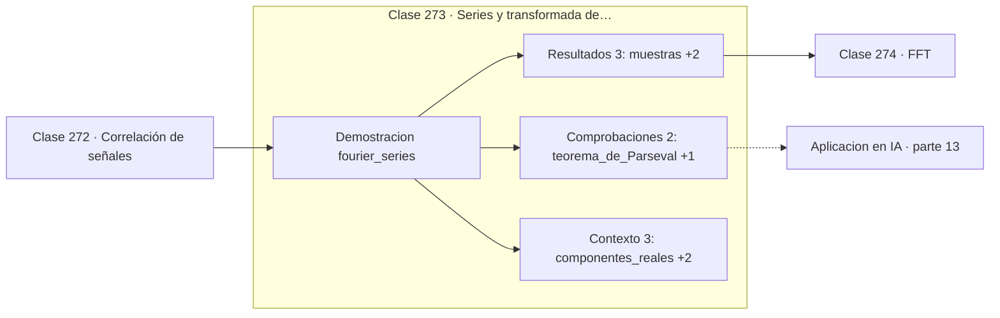

# 273 — Series y transformada de Fourier

> [⬅️ 272 Correlación de señales](../272-correlacion-de-senales/README.md) · [📚 Parte 13](../README.md) · [🏠 Programa](../../../README.md) · [274 FFT ➡️](../274-fft/README.md)

**Parte:** 13 — Teoría de la información, señales y series · **Nivel:** `avanzado` · **Horas estimadas:** 4
**Motor:** `engines.part13` · **Demostración:** `fourier_series` · **Clase 13 de 20** de la parte

---

## 🎯 Propósito

**Toda señal es una suma de sinusoides, y Fourier dice cuáles y con qué peso.**

Entropía, entropía cruzada, divergencias, información mutua, codificación, muestreo, convolución, Fourier, FFT, filtros y series temporales.

## ✅ Resultados de aprendizaje

Al terminar podrás:

1. Explicar **Series y transformada de Fourier** con lenguaje cotidiano y con notación matemática.
2. Resolver un caso pequeño a mano y anticipar el orden de magnitud del resultado.
3. Ejecutar y modificar `lab.py`, que corre la demostración `fourier_series`.
4. Interpretar las 8 salidas del laboratorio y decir qué comprueba cada una.
5. Detectar el error típico de esta parte: calcular log(0) sin epsilon de estabilidad.

## 🧩 Fórmulas de la clase

```text
X[k] = Σₙ x[n]·e^(−2πikn/N)
magnitud = |X[k]|,  fase = arg(X[k])
Parseval: Σ|x[n]|² = (1/N)·Σ|X[k]|²
```

## 🗺️ Ubicación en el programa



## 📖 Fundamentos

La transformada de Fourier descompone una señal en sinusoides de distintas frecuencias,
cada una con su amplitud y su fase. Es un **cambio de base** en el sentido exacto de la
parte 06: la señal no cambia, cambia el sistema de coordenadas desde el que se describe.

Ese cambio de perspectiva es útil porque muchas propiedades que están escondidas en el
dominio del tiempo son evidentes en el de la frecuencia. Una señal que parece ruido puede
revelar dos picos limpios; el ruido de red eléctrica aparece como una línea en 50 o 60 Hz;
y un filtro que en el tiempo es una convolución compleja se convierte en una simple
multiplicación.

El **teorema de Parseval** garantiza que la energía se conserva: la suma de los cuadrados en
el tiempo es igual a la suma en frecuencia, salvo normalización. Comprobarlo
numéricamente es la mejor prueba unitaria de una implementación de la transformada.

La **fase** es la parte que sistemáticamente se ignora. Casi todas las visualizaciones
muestran solo la magnitud, pero la fase contiene la información sobre **dónde** ocurren las
cosas. Un experimento clásico: intercambiar las magnitudes de dos imágenes conservando sus
fases produce imágenes reconocibles como las originales de la fase. La estructura está en
la fase.

## 🧮 Ejemplo trabajado

Señal con dos componentes conocidas, analizada por Fourier.

```text
64 muestras, señal construida con:
  componente de 4 Hz con amplitud 3,0
  componente de 9 Hz con amplitud 1,5

picos detectados: 4 Hz y 9 Hz                        ✓
magnitudes:       3,0  y  1,5                        ✓

Parseval:
  energía en el tiempo      = 360,0
  energía en frecuencia     = 360,0                  ✓

La transformada recuperó exactamente las amplitudes
y las frecuencias que se usaron para construir la señal.
```

## 🔬 Qué ejecuta el laboratorio

`fourier_series` — Descomponer una señal en senos y cosenos.

| Grupo | Salidas |
|---|---|
| 🔢 Resultados numéricos (3) | `muestras`, `energia_en_el_tiempo`, `energia_en_frecuencia` |
| ✅ Comprobaciones de invariante (2) | `teorema_de_Parseval`, `cualquier_periodica_es_suma_de_senoidales` |

Las claves booleanas no son adorno: si alguna fuera `False`, el resultado numérico
no sería fiable aunque el programa terminase sin error.

```bash
python classes/part-13-teoria-de-la-informacion-senales-y-series/273-series-y-transformada-de-fourier/lab.py
compmath run 273
```

> [!TIP]
> Antes de ejecutar, **escribe tu predicción**. Un laboratorio que confirma lo que
> esperabas enseña tanto como uno que te contradice, pero solo si la predicción
> existía antes del resultado.

## ⚠️ Errores conceptuales frecuentes

1. Analizar solo la magnitud y descartar la fase.
2. Olvidar que el espectro de una señal real es simétrico y contar los picos dos veces.
3. Aplicar la transformada a una señal no estacionaria sin ventanear.

## 🚀 Dónde se usa de verdad

Análisis de audio y vibraciones, compresión JPEG y MP3, filtrado en frecuencia y
codificación posicional en Transformers.

## 🤖 Conexión con IA

La función de pérdida de casi todo clasificador es entropía cruzada; el VAE optimiza un ELBO con un término KL; las CNN son convoluciones aprendidas.

## 📓 Notebooks

| Archivo | Para qué |
|---|---|
| [`notebook.ipynb`](notebook.ipynb) | recorrido guiado con la demostración ejecutada |
| [`notebook_student.ipynb`](notebook_student.ipynb) | versión con `TODO` para resolver |
| [`notebook_solution.ipynb`](notebook_solution.ipynb) | solución de referencia verificada |

## 📝 Evaluación

| Criterio | Peso |
|---|---:|
| Comprensión conceptual | 25 % |
| Resolución manual | 25 % |
| Implementación y verificación | 25 % |
| Interpretación y comunicación | 15 % |
| Conexión con aplicación real | 10 % |

Detalle y criterios de error crítico en [`assessment.md`](assessment.md).

## ❓ Preguntas de comprobación

1. ¿Cuál es la entrada, cuál la salida y qué unidades tienen?
2. ¿Qué operación domina el comportamiento del resultado?
3. ¿Qué caso extremo revelaría un error conceptual?
4. ¿Cómo verificarías el resultado por un método independiente?
5. ¿Dónde aparece esto en compresión?

Si necesitas releer el código para responderlas, la clase todavía no está superada.

## 📥 Entregable

`notebook_student.ipynb` resuelto más un párrafo que explique el resultado **sin citar
código**: qué entra, qué sale, qué invariante se comprueba y qué pasaría en un caso límite.

## 🔗 Referencias

- [Oppenheim, A.; Schafer, R. *Discrete-Time Signal Processing*, 3ª ed., Pearson, 2009, cap. 8](https://www.pearson.com/) — *uso:* obra de referencia consultada en «Series y transformada de Fourier».
- [Bracewell, R. *The Fourier Transform and Its Applications*, 3ª ed., McGraw-Hill, 2000](https://www.mheducation.com/) — *uso:* obra de referencia consultada en «Series y transformada de Fourier».

Bibliografía completa de la parte en [`../../../docs/BIBLIOGRAPHY.md`](../../../docs/BIBLIOGRAPHY.md) · localizador verificable de cada obra en [`sources/bibliography.json`](../../../sources/bibliography.json).

## 📂 Material de la clase

[`intuition.md`](intuition.md) · [`theory.md`](theory.md) · [`derivation.md`](derivation.md) · [`exercises.md`](exercises.md) · [`assessment.md`](assessment.md) · [`where-is-this-used.md`](where-is-this-used.md) · [`lesson.yaml`](lesson.yaml)

---

> [⬅️ 272 Correlación de señales](../272-correlacion-de-senales/README.md) · [📚 Parte 13](../README.md) · [🏠 Programa](../../../README.md) · [274 FFT ➡️](../274-fft/README.md)
