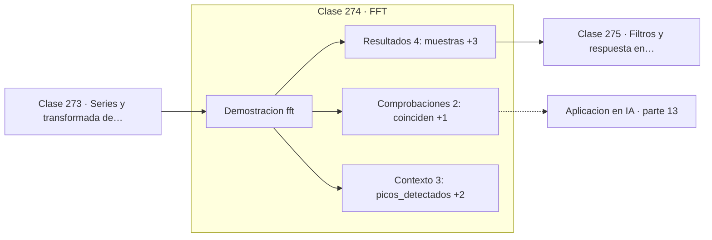

# 274 — FFT

> [⬅️ 273 Series y transformada de Fourier](../273-series-y-transformada-de-fourier/README.md) · [📚 Parte 13](../README.md) · [🏠 Programa](../../../README.md) · [275 Filtros y respuesta en frecuencia ➡️](../275-filtros-y-respuesta-en-frecuencia/README.md)

**Parte:** 13 — Teoría de la información, señales y series · **Nivel:** `avanzado` · **Horas estimadas:** 4
**Motor:** `engines.part13` · **Demostración:** `fft` · **Clase 14 de 20** de la parte

---

## 🎯 Propósito

**La FFT da el mismo resultado que la DFT y convierte n² en n log n.**

Entropía, entropía cruzada, divergencias, información mutua, codificación, muestreo, convolución, Fourier, FFT, filtros y series temporales.

## ✅ Resultados de aprendizaje

Al terminar podrás:

1. Explicar **FFT** con lenguaje cotidiano y con notación matemática.
2. Resolver un caso pequeño a mano y anticipar el orden de magnitud del resultado.
3. Ejecutar y modificar `lab.py`, que corre la demostración `fft`.
4. Interpretar las 9 salidas del laboratorio y decir qué comprueba cada una.
5. Detectar el error típico de esta parte: comparar entropías calculadas en bases logarítmicas distintas.

## 🧩 Fórmulas de la clase

```text
coste DFT: O(n²)   coste FFT: O(n log n)
n = 10⁶:  10¹² frente a 2·10⁷ operaciones
teorema de convolución: f * g = IFFT(FFT(f)·FFT(g))
```

## 🗺️ Ubicación en el programa



## 📖 Fundamentos

La transformada discreta de Fourier calculada de forma directa necesita `n²` operaciones
complejas. Para un millón de muestras eso son `10¹²` operaciones: horas o días. La
**FFT** obtiene exactamente el mismo resultado en `O(n log n)`, unas `2·10⁷` operaciones:
una fracción de segundo.

El algoritmo, publicado por Cooley y Tukey en 1965 —aunque Gauss ya lo conocía en 1805—,
explota que la transformada de una señal se puede construir a partir de las transformadas
de sus muestras pares e impares. Aplicar esa descomposición recursivamente da el
logaritmo. Es un divide y vencerás de manual.

Su impacto es difícil de exagerar. La FFT es lo que hace posible el audio digital, las
telecomunicaciones modernas, la resonancia magnética, el análisis sísmico y la
multiplicación rápida de polinomios y de enteros grandes. Está en la lista habitual de
algoritmos más influyentes del siglo XX.

El **teorema de convolución** convierte esa velocidad en una herramienta general:
convolucionar en el tiempo es multiplicar en frecuencia, así que para núcleos grandes es
más rápido transformar, multiplicar punto a punto y volver, que convolucionar
directamente. El punto de cruce está alrededor de núcleos de 50 a 100 elementos, y por eso
las CNN con núcleos de 3×3 no usan FFT.

## 🧮 Ejemplo trabajado

FFT y DFT sobre la misma señal de 256 muestras.

```text
256 muestras con componentes en 10 Hz y 40 Hz

picos detectados:  [10, 40]
frecuencias reales: [10, 40]        coinciden        ✓
FFT y DFT dan resultados idénticos                   ✓

Coste:
  DFT: 256² = 65 536 operaciones
  FFT: 256 · log₂ 256 = 256 · 8 = 2 048 operaciones
  ganancia: 32×

Para n = 10⁶ la ganancia sería de 50 000×:
la diferencia entre imposible y instantáneo.
```

## 🔬 Qué ejecuta el laboratorio

`fft` — FFT frente a DFT: mismo resultado, coste muy distinto.

| Grupo | Salidas |
|---|---|
| 🔢 Resultados numéricos (4) | `muestras`, `operaciones_DFT`, `operaciones_FFT`, `factor_de_ahorro` |
| ✅ Comprobaciones de invariante (2) | `coinciden`, `fft_y_dft_coinciden` |

Las claves booleanas no son adorno: si alguna fuera `False`, el resultado numérico
no sería fiable aunque el programa terminase sin error.

```bash
python classes/part-13-teoria-de-la-informacion-senales-y-series/274-fft/lab.py
compmath run 274
```

> [!TIP]
> Antes de ejecutar, **escribe tu predicción**. Un laboratorio que confirma lo que
> esperabas enseña tanto como uno que te contradice, pero solo si la predicción
> existía antes del resultado.

## ⚠️ Errores conceptuales frecuentes

1. Implementar la DFT directa cuando existe FFT.
2. Usar FFT para convolucionar con núcleos pequeños, donde es más lenta.
3. Olvidar que la FFT clásica es más eficiente con longitudes potencia de dos.

## 🚀 Dónde se usa de verdad

Procesamiento de audio en tiempo real, telecomunicaciones, imagen médica, convoluciones
rápidas y multiplicación de enteros grandes.

## 🤖 Conexión con IA

La función de pérdida de casi todo clasificador es entropía cruzada; el VAE optimiza un ELBO con un término KL; las CNN son convoluciones aprendidas.

## 📓 Notebooks

| Archivo | Para qué |
|---|---|
| [`notebook.ipynb`](notebook.ipynb) | recorrido guiado con la demostración ejecutada |
| [`notebook_student.ipynb`](notebook_student.ipynb) | versión con `TODO` para resolver |
| [`notebook_solution.ipynb`](notebook_solution.ipynb) | solución de referencia verificada |

## 📝 Evaluación

| Criterio | Peso |
|---|---:|
| Comprensión conceptual | 25 % |
| Resolución manual | 25 % |
| Implementación y verificación | 25 % |
| Interpretación y comunicación | 15 % |
| Conexión con aplicación real | 10 % |

Detalle y criterios de error crítico en [`assessment.md`](assessment.md).

## ❓ Preguntas de comprobación

1. ¿Cuál es la entrada, cuál la salida y qué unidades tienen?
2. ¿Qué operación domina el comportamiento del resultado?
3. ¿Qué caso extremo revelaría un error conceptual?
4. ¿Cómo verificarías el resultado por un método independiente?
5. ¿Dónde aparece esto en compresión?

Si necesitas releer el código para responderlas, la clase todavía no está superada.

## 📥 Entregable

`notebook_student.ipynb` resuelto más un párrafo que explique el resultado **sin citar
código**: qué entra, qué sale, qué invariante se comprueba y qué pasaría en un caso límite.

## 🔗 Referencias

- [Cooley, J.; Tukey, J. *An algorithm for the machine calculation of complex Fourier series*, 1965](https://doi.org/10.1090/S0025-5718-1965-0178586-1) — *uso:* artículo de origen consultado en «FFT».
- [Press, W. et al. *Numerical Recipes*, 3ª ed., Cambridge, 2007, cap. 12](https://numerical.recipes/) — *uso:* obra de referencia consultada en «FFT».

Bibliografía completa de la parte en [`../../../docs/BIBLIOGRAPHY.md`](../../../docs/BIBLIOGRAPHY.md) · localizador verificable de cada obra en [`sources/bibliography.json`](../../../sources/bibliography.json).

## 📂 Material de la clase

[`intuition.md`](intuition.md) · [`theory.md`](theory.md) · [`derivation.md`](derivation.md) · [`exercises.md`](exercises.md) · [`assessment.md`](assessment.md) · [`where-is-this-used.md`](where-is-this-used.md) · [`lesson.yaml`](lesson.yaml)

---

> [⬅️ 273 Series y transformada de Fourier](../273-series-y-transformada-de-fourier/README.md) · [📚 Parte 13](../README.md) · [🏠 Programa](../../../README.md) · [275 Filtros y respuesta en frecuencia ➡️](../275-filtros-y-respuesta-en-frecuencia/README.md)
