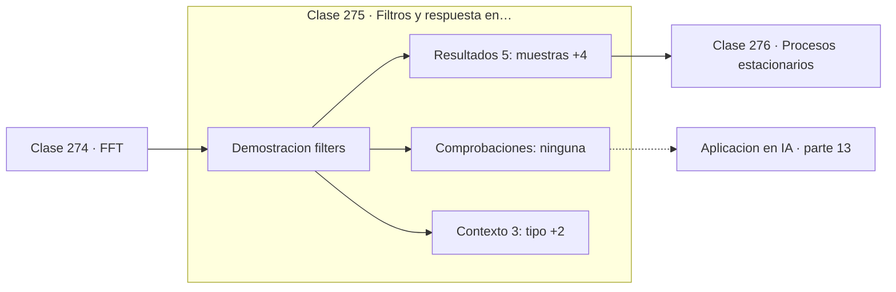

# 275 — Filtros y respuesta en frecuencia

> [⬅️ 274 FFT](../274-fft/README.md) · [📚 Parte 13](../README.md) · [🏠 Programa](../../../README.md) · [276 Procesos estacionarios ➡️](../276-procesos-estacionarios/README.md)

**Parte:** 13 — Teoría de la información, señales y series · **Nivel:** `avanzado` · **Horas estimadas:** 4
**Motor:** `engines.part13` · **Demostración:** `filters` · **Clase 15 de 20** de la parte

---

## 🎯 Propósito

**Filtrar es decidir qué frecuencias sobreviven, y una media móvil ya es un filtro.**

Entropía, entropía cruzada, divergencias, información mutua, codificación, muestreo, convolución, Fourier, FFT, filtros y series temporales.

## ✅ Resultados de aprendizaje

Al terminar podrás:

1. Explicar **Filtros y respuesta en frecuencia** con lenguaje cotidiano y con notación matemática.
2. Resolver un caso pequeño a mano y anticipar el orden de magnitud del resultado.
3. Ejecutar y modificar `lab.py`, que corre la demostración `filters`.
4. Interpretar las 8 salidas del laboratorio y decir qué comprueba cada una.
5. Detectar el error típico de esta parte: muestrear por debajo de nyquist y culpar al modelo del ruido resultante.

## 🧩 Fórmulas de la clase

```text
media móvil de ventana k: núcleo de k valores 1/k
paso-bajo conserva bajas, paso-alto conserva altas
compromiso: más suavizado, menos detalle
```

## 🗺️ Ubicación en el programa



## 📖 Fundamentos

Un filtro atenúa unas frecuencias y deja pasar otras. Su descripción completa es la
**respuesta en frecuencia**: qué factor aplica a cada componente. Diseñar un filtro es
elegir esa curva y encontrar los coeficientes que la producen.

Los tipos básicos se nombran por lo que dejan pasar. **Paso-bajo** conserva las
frecuencias bajas y elimina las altas, que es lo que se necesita para quitar ruido.
**Paso-alto** hace lo contrario y sirve para eliminar tendencias o el nivel continuo.
**Paso-banda** conserva una franja, y es lo que hace un ecualizador.

La **media móvil** es el filtro paso-bajo más simple, y ya ilustra el compromiso central:
una ventana más ancha suaviza más ruido pero también borra más detalle real. No hay ajuste
óptimo universal; depende de qué frecuencias son señal y cuáles son ruido en el problema
concreto.

Hay una tensión inevitable entre el dominio del tiempo y el de la frecuencia. Un filtro con
corte muy abrupto en frecuencia necesita una respuesta muy larga en el tiempo, lo que
introduce retardo y oscilaciones en los bordes. Es una manifestación del principio de
incertidumbre aplicado al análisis de señales, y explica por qué los filtros reales siempre
son un compromiso.

## 🧮 Ejemplo trabajado

Media móvil sobre una señal con ruido de alta frecuencia.

```text
128 muestras, ventana del filtro = 7

RMSE antes del filtro:  0,282735
RMSE después:           0,066077
mejora: 76,6 %

El ruido de alta frecuencia se promedia a casi cero;
la señal de baja frecuencia sobrevive casi intacta.

Compromiso de la ventana:
  ventana 3   → poco suavizado, poco retardo
  ventana 7   → buen equilibrio aquí
  ventana 31  → suaviza mucho, borra los picos reales

Una media móvil es un filtro FIR paso-bajo con
todos los coeficientes iguales.
```

## 🔬 Qué ejecuta el laboratorio

`filters` — Filtro paso-bajo aplicado a una señal con ruido de alta frecuencia.

| Grupo | Salidas |
|---|---|
| 🔢 Resultados numéricos (5) | `muestras`, `ventana_del_filtro`, `RMSE_antes_del_filtro`, `RMSE_despues_del_filtro`, `mejora_%` |
| ✅ Comprobaciones de invariante (0) | — |

Las claves booleanas no son adorno: si alguna fuera `False`, el resultado numérico
no sería fiable aunque el programa terminase sin error.

```bash
python classes/part-13-teoria-de-la-informacion-senales-y-series/275-filtros-y-respuesta-en-frecuencia/lab.py
compmath run 275
```

> [!TIP]
> Antes de ejecutar, **escribe tu predicción**. Un laboratorio que confirma lo que
> esperabas enseña tanto como uno que te contradice, pero solo si la predicción
> existía antes del resultado.

## ⚠️ Errores conceptuales frecuentes

1. Elegir la ventana sin conocer qué frecuencias son señal y cuáles ruido.
2. Ignorar el retardo que introduce un filtro causal.
3. Filtrar antes de comprobar si el problema real era aliasing.

## 🚀 Dónde se usa de verdad

Eliminación de ruido en sensores, ecualización de audio, suavizado de series financieras y
preprocesamiento de señales biomédicas.

## 🤖 Conexión con IA

La función de pérdida de casi todo clasificador es entropía cruzada; el VAE optimiza un ELBO con un término KL; las CNN son convoluciones aprendidas.

## 📓 Notebooks

| Archivo | Para qué |
|---|---|
| [`notebook.ipynb`](notebook.ipynb) | recorrido guiado con la demostración ejecutada |
| [`notebook_student.ipynb`](notebook_student.ipynb) | versión con `TODO` para resolver |
| [`notebook_solution.ipynb`](notebook_solution.ipynb) | solución de referencia verificada |

## 📝 Evaluación

| Criterio | Peso |
|---|---:|
| Comprensión conceptual | 25 % |
| Resolución manual | 25 % |
| Implementación y verificación | 25 % |
| Interpretación y comunicación | 15 % |
| Conexión con aplicación real | 10 % |

Detalle y criterios de error crítico en [`assessment.md`](assessment.md).

## ❓ Preguntas de comprobación

1. ¿Cuál es la entrada, cuál la salida y qué unidades tienen?
2. ¿Qué operación domina el comportamiento del resultado?
3. ¿Qué caso extremo revelaría un error conceptual?
4. ¿Cómo verificarías el resultado por un método independiente?
5. ¿Dónde aparece esto en compresión?

Si necesitas releer el código para responderlas, la clase todavía no está superada.

## 📥 Entregable

`notebook_student.ipynb` resuelto más un párrafo que explique el resultado **sin citar
código**: qué entra, qué sale, qué invariante se comprueba y qué pasaría en un caso límite.

## 📚 Bibliografía de la clase

Esta clase enseña **Teoría de la información · Procesamiento de señales · Series temporales**. Cada obra dice qué aporta aquí y cómo se comprobó su localizador:

- [Oppenheim, A.; Schafer, R. *Discrete-Time Signal Processing*, 3ª ed., Pearson, 2009, cap. 7](https://openlibrary.org/isbn/9780131988422) — Procesamiento de señales: el tema de esta clase · ISBN-13 `9780131988422` verificado en International ISBN Agency (2026-08-20).
- [Smith, S. *The Scientist and Engineer's Guide to Digital Signal Processing*, 1997](https://www.dspguide.com/) — Procesamiento de señales: el tema de esta clase · URL de la fuente primaria comprobada en sitio de la obra o de su editorial (2026-08-19).

Bibliografía de todas las clases, con el porqué de cada obra, en [`docs/BIBLIOGRAPHY.md`](../../../docs/BIBLIOGRAPHY.md) · localizador y estado de cada obra en [`sources/bibliography.json`](../../../sources/bibliography.json).

## 📂 Material de la clase

[`intuition.md`](intuition.md) · [`theory.md`](theory.md) · [`derivation.md`](derivation.md) · [`exercises.md`](exercises.md) · [`assessment.md`](assessment.md) · [`where-is-this-used.md`](where-is-this-used.md) · [`lesson.yaml`](lesson.yaml)

---

> [⬅️ 274 FFT](../274-fft/README.md) · [📚 Parte 13](../README.md) · [🏠 Programa](../../../README.md) · [276 Procesos estacionarios ➡️](../276-procesos-estacionarios/README.md)
