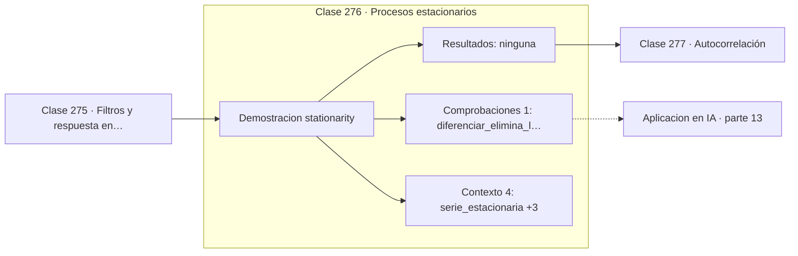

# 276 — Procesos estacionarios

> [⬅️ 275 Filtros y respuesta en frecuencia](../275-filtros-y-respuesta-en-frecuencia/README.md) · [📚 Parte 13](../README.md) · [🏠 Programa](../../../README.md) · [277 Autocorrelación ➡️](../277-autocorrelacion/README.md)

**Parte:** 13 — Teoría de la información, señales y series · **Nivel:** `avanzado` · **Horas estimadas:** 4
**Motor:** `engines.part13` · **Demostración:** `stationarity` · **Clase 16 de 20** de la parte

---

## 🎯 Propósito

**Casi todo el análisis clásico de series supone estacionariedad, y diferenciar la consigue.**

Entropía, entropía cruzada, divergencias, información mutua, codificación, muestreo, convolución, Fourier, FFT, filtros y series temporales.

## ✅ Resultados de aprendizaje

Al terminar podrás:

1. Explicar **Procesos estacionarios** con lenguaje cotidiano y con notación matemática.
2. Resolver un caso pequeño a mano y anticipar el orden de magnitud del resultado.
3. Ejecutar y modificar `lab.py`, que corre la demostración `stationarity`.
4. Interpretar las 5 salidas del laboratorio y decir qué comprueba cada una.
5. Detectar el error típico de esta parte: calcular log(0) sin epsilon de estabilidad.

## 🧩 Fórmulas de la clase

```text
estacionaria: media, varianza y autocovarianza constantes en el tiempo
diferenciación: y[t] = x[t] − x[t−1]
una diferencia elimina tendencia lineal; dos, cuadrática
```

## 🗺️ Ubicación en el programa



## 📖 Fundamentos

Una serie es **estacionaria** cuando sus propiedades estadísticas no cambian con el tiempo:
la media, la varianza y la relación entre valores separados por un retardo dado son las
mismas al principio y al final. Intuitivamente, la serie no va a ninguna parte.

El supuesto importa porque casi toda la teoría clásica lo necesita. Ajustar un modelo ARMA,
interpretar una autocorrelación o estimar un espectro presuponen que hay algo estable que
estimar. Aplicar esas herramientas a una serie con tendencia produce resultados que parecen
significativos y no lo son: la **regresión espuria** entre dos series con tendencia da
correlaciones altísimas sin ninguna relación real.

El diagnóstico más simple es partir la serie en dos y comparar medias y varianzas. Si
difieren claramente, hay no estacionariedad. Las pruebas formales —Dickey-Fuller aumentada,
KPSS— formalizan ese contraste.

El remedio habitual es **diferenciar**: sustituir cada valor por su diferencia con el
anterior. Una diferencia elimina una tendencia lineal, dos eliminan una cuadrática. Es la
«I» de ARIMA. Para varianza no constante se aplica antes una transformación logarítmica o
de Box-Cox. Diferenciar de más introduce estructura artificial, así que conviene quedarse
con el mínimo necesario.

## 🧮 Ejemplo trabajado

Tres series: estacionaria, con tendencia, y diferenciada.

```text
serie estacionaria:
  media 1ª mitad = 0,0574    varianza 1ª = 1,12
  media 2ª mitad = 0,0223    varianza 2ª ≈ 1,10
  estables → estacionaria                            ✓

serie con tendencia:
  media 1ª mitad = 1,9728    varianza 1ª = 2,40
  media 2ª mitad = 5,9658    varianza 2ª ≈ 2,45
  la media se triplica → no estacionaria             ✗

tras diferenciar la serie con tendencia:
  media 1ª mitad = 0,0204    varianza 1ª = 2,05
  media 2ª mitad = 0,0140    varianza 2ª ≈ 2,03
  estable de nuevo                                   ✓

Una sola diferencia bastó para una tendencia lineal.
```

## 🔬 Qué ejecuta el laboratorio

`stationarity` — Serie estacionaria frente a serie con tendencia.

| Grupo | Salidas |
|---|---|
| 🔢 Resultados numéricos (0) | — |
| ✅ Comprobaciones de invariante (1) | `diferenciar_elimina_la_tendencia_lineal` |

Las claves booleanas no son adorno: si alguna fuera `False`, el resultado numérico
no sería fiable aunque el programa terminase sin error.

```bash
python classes/part-13-teoria-de-la-informacion-senales-y-series/276-procesos-estacionarios/lab.py
compmath run 276
```

> [!TIP]
> Antes de ejecutar, **escribe tu predicción**. Un laboratorio que confirma lo que
> esperabas enseña tanto como uno que te contradice, pero solo si la predicción
> existía antes del resultado.

## ⚠️ Errores conceptuales frecuentes

1. Ajustar modelos clásicos sin comprobar estacionariedad.
2. Diferenciar más veces de las necesarias.
3. Interpretar una correlación entre dos series con tendencia como relación real.

## 🚀 Dónde se usa de verdad

Modelos ARIMA, predicción de demanda, análisis financiero y preprocesamiento de series
para modelos de aprendizaje automático.

## 🤖 Conexión con IA

La función de pérdida de casi todo clasificador es entropía cruzada; el VAE optimiza un ELBO con un término KL; las CNN son convoluciones aprendidas.

## 📓 Notebooks

| Archivo | Para qué |
|---|---|
| [`notebook.ipynb`](notebook.ipynb) | recorrido guiado con la demostración ejecutada |
| [`notebook_student.ipynb`](notebook_student.ipynb) | versión con `TODO` para resolver |
| [`notebook_solution.ipynb`](notebook_solution.ipynb) | solución de referencia verificada |

## 📝 Evaluación

| Criterio | Peso |
|---|---:|
| Comprensión conceptual | 25 % |
| Resolución manual | 25 % |
| Implementación y verificación | 25 % |
| Interpretación y comunicación | 15 % |
| Conexión con aplicación real | 10 % |

Detalle y criterios de error crítico en [`assessment.md`](assessment.md).

## ❓ Preguntas de comprobación

1. ¿Cuál es la entrada, cuál la salida y qué unidades tienen?
2. ¿Qué operación domina el comportamiento del resultado?
3. ¿Qué caso extremo revelaría un error conceptual?
4. ¿Cómo verificarías el resultado por un método independiente?
5. ¿Dónde aparece esto en compresión?

Si necesitas releer el código para responderlas, la clase todavía no está superada.

## 📥 Entregable

`notebook_student.ipynb` resuelto más un párrafo que explique el resultado **sin citar
código**: qué entra, qué sale, qué invariante se comprueba y qué pasaría en un caso límite.

## 🔗 Referencias

- [Hyndman, R.; Athanasopoulos, G. *Forecasting: Principles and Practice*, 3ª ed., OTexts, 2021](https://otexts.com/fpp3/) — *uso:* obra de referencia consultada en «Procesos estacionarios».
- [Box, G.; Jenkins, G.; Reinsel, G. *Time Series Analysis*, 5ª ed., Wiley, 2015](https://doi.org/10.1002/9781118619193) — *uso:* desarrollo formal del tema en «Procesos estacionarios».

Bibliografía completa de la parte en [`../../../docs/BIBLIOGRAPHY.md`](../../../docs/BIBLIOGRAPHY.md) · localizador verificable de cada obra en [`sources/bibliography.json`](../../../sources/bibliography.json).

## 📂 Material de la clase

[`intuition.md`](intuition.md) · [`theory.md`](theory.md) · [`derivation.md`](derivation.md) · [`exercises.md`](exercises.md) · [`assessment.md`](assessment.md) · [`where-is-this-used.md`](where-is-this-used.md) · [`lesson.yaml`](lesson.yaml)

---

> [⬅️ 275 Filtros y respuesta en frecuencia](../275-filtros-y-respuesta-en-frecuencia/README.md) · [📚 Parte 13](../README.md) · [🏠 Programa](../../../README.md) · [277 Autocorrelación ➡️](../277-autocorrelacion/README.md)
