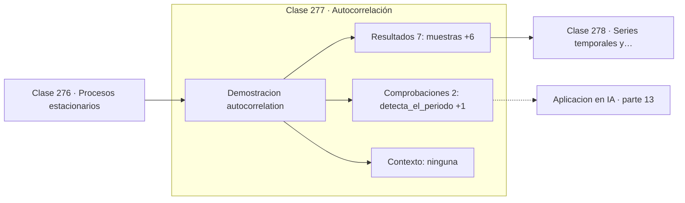

# 277 — Autocorrelación

> [⬅️ 276 Procesos estacionarios](../276-procesos-estacionarios/README.md) · [📚 Parte 13](../README.md) · [🏠 Programa](../../../README.md) · [278 Series temporales y ventanas ➡️](../278-series-temporales-y-ventanas/README.md)

**Parte:** 13 — Teoría de la información, señales y series · **Nivel:** `avanzado` · **Horas estimadas:** 4
**Motor:** `engines.part13` · **Demostración:** `autocorrelation` · **Clase 17 de 20** de la parte

---

## 🎯 Propósito

**Un pico en la autocorrelación en el retardo k delata un periodo de k muestras.**

Entropía, entropía cruzada, divergencias, información mutua, codificación, muestreo, convolución, Fourier, FFT, filtros y series temporales.

## ✅ Resultados de aprendizaje

Al terminar podrás:

1. Explicar **Autocorrelación** con lenguaje cotidiano y con notación matemática.
2. Resolver un caso pequeño a mano y anticipar el orden de magnitud del resultado.
3. Ejecutar y modificar `lab.py`, que corre la demostración `autocorrelation`.
4. Interpretar las 9 salidas del laboratorio y decir qué comprueba cada una.
5. Detectar el error típico de esta parte: comparar entropías calculadas en bases logarítmicas distintas.

## 🧩 Fórmulas de la clase

```text
ACF(k) = corr(x[t], x[t−k])
ACF(0) = 1 siempre
pico positivo en k ⟹ periodicidad de periodo k
```

## 🗺️ Ubicación en el programa



## 📖 Fundamentos

La autocorrelación es la correlación de una serie consigo misma desplazada un retardo `k`.
Responde a la pregunta de cuánto se parece la serie a su propio pasado, y su gráfico
—el correlograma— es la herramienta de diagnóstico más informativa de las series
temporales.

Su lectura es sistemática. En el retardo 0 vale siempre 1, porque toda serie es idéntica a
sí misma. Un decaimiento rápido indica poca memoria. Un decaimiento lento indica tendencia
o no estacionariedad. Y un **pico en un retardo concreto** indica periodicidad con ese
periodo, que es lo que la hace tan útil.

La periodicidad detectada así puede ser invisible a simple vista. Con ruido fuerte, una
señal periódica se pierde en el gráfico temporal, pero el ruido se descorrelaciona a
cualquier retardo mientras que la componente periódica no. La autocorrelación separa una de
otra sin necesidad de transformar al dominio de la frecuencia.

Es también el instrumento estándar para elegir el orden de un modelo autorregresivo, junto
con la autocorrelación parcial, y para validarlo: si los **residuos** de un modelo ajustado
conservan autocorrelación significativa, queda estructura sin explicar y el modelo es
mejorable.

## 🧮 Ejemplo trabajado

Serie con periodo 20 oculto bajo ruido.

```text
200 muestras, periodo real = 20

retardo    ACF
   0      1,000000     siempre 1
   5      0,014817     casi nula (cuarto de ciclo)
  10     −0,879342     fuerte negativa (medio ciclo)
  20      0,835547     fuerte positiva (ciclo completo)

Lectura:
  pico positivo en 20 → periodo de 20 muestras       ✓
  pico negativo en 10 → medio periodo, en antifase   ✓
  nula en 5           → cuadratura, sin correlación  ✓

El periodo se detecta sin haber transformado a frecuencia.
```

## 🔬 Qué ejecuta el laboratorio

`autocorrelation` — Autocorrelación revela la periodicidad oculta.

| Grupo | Salidas |
|---|---|
| 🔢 Resultados numéricos (7) | `muestras`, `periodo_real`, `acf_lag_0`, `acf_lag_5`, `acf_lag_10`, `acf_lag_20`, `primer_pico_positivo_en_lag` |
| ✅ Comprobaciones de invariante (2) | `detecta_el_periodo`, `acf_en_lag_0_siempre_es_1` |

Las claves booleanas no son adorno: si alguna fuera `False`, el resultado numérico
no sería fiable aunque el programa terminase sin error.

```bash
python classes/part-13-teoria-de-la-informacion-senales-y-series/277-autocorrelacion/lab.py
compmath run 277
```

> [!TIP]
> Antes de ejecutar, **escribe tu predicción**. Un laboratorio que confirma lo que
> esperabas enseña tanto como uno que te contradice, pero solo si la predicción
> existía antes del resultado.

## ⚠️ Errores conceptuales frecuentes

1. Calcular la ACF sobre una serie no estacionaria y leerla como periodicidad.
2. Interpretar picos en retardos grandes con pocos datos de apoyo.
3. Olvidar comprobar la autocorrelación de los residuos del modelo.

## 🚀 Dónde se usa de verdad

Detección de estacionalidad, selección de orden en modelos ARIMA, validación de residuos y
análisis de señales biomédicas.

## 🤖 Conexión con IA

La función de pérdida de casi todo clasificador es entropía cruzada; el VAE optimiza un ELBO con un término KL; las CNN son convoluciones aprendidas.

## 📓 Notebooks

| Archivo | Para qué |
|---|---|
| [`notebook.ipynb`](notebook.ipynb) | recorrido guiado con la demostración ejecutada |
| [`notebook_student.ipynb`](notebook_student.ipynb) | versión con `TODO` para resolver |
| [`notebook_solution.ipynb`](notebook_solution.ipynb) | solución de referencia verificada |

## 📝 Evaluación

| Criterio | Peso |
|---|---:|
| Comprensión conceptual | 25 % |
| Resolución manual | 25 % |
| Implementación y verificación | 25 % |
| Interpretación y comunicación | 15 % |
| Conexión con aplicación real | 10 % |

Detalle y criterios de error crítico en [`assessment.md`](assessment.md).

## ❓ Preguntas de comprobación

1. ¿Cuál es la entrada, cuál la salida y qué unidades tienen?
2. ¿Qué operación domina el comportamiento del resultado?
3. ¿Qué caso extremo revelaría un error conceptual?
4. ¿Cómo verificarías el resultado por un método independiente?
5. ¿Dónde aparece esto en compresión?

Si necesitas releer el código para responderlas, la clase todavía no está superada.

## 📥 Entregable

`notebook_student.ipynb` resuelto más un párrafo que explique el resultado **sin citar
código**: qué entra, qué sale, qué invariante se comprueba y qué pasaría en un caso límite.

## 🔗 Referencias

- [Hyndman, R.; Athanasopoulos, G. *Forecasting: Principles and Practice*, 3ª ed., OTexts, 2021](https://otexts.com/fpp3/) — *uso:* obra de referencia consultada en «Autocorrelación».
- [Shumway, R.; Stoffer, D. *Time Series Analysis and Its Applications*, 4ª ed., Springer, 2017](https://doi.org/10.1007/978-3-319-52452-8) — *uso:* desarrollo formal del tema en «Autocorrelación».

Bibliografía completa de la parte en [`../../../docs/BIBLIOGRAPHY.md`](../../../docs/BIBLIOGRAPHY.md) · localizador verificable de cada obra en [`sources/bibliography.json`](../../../sources/bibliography.json).

## 📂 Material de la clase

[`intuition.md`](intuition.md) · [`theory.md`](theory.md) · [`derivation.md`](derivation.md) · [`exercises.md`](exercises.md) · [`assessment.md`](assessment.md) · [`where-is-this-used.md`](where-is-this-used.md) · [`lesson.yaml`](lesson.yaml)

---

> [⬅️ 276 Procesos estacionarios](../276-procesos-estacionarios/README.md) · [📚 Parte 13](../README.md) · [🏠 Programa](../../../README.md) · [278 Series temporales y ventanas ➡️](../278-series-temporales-y-ventanas/README.md)
