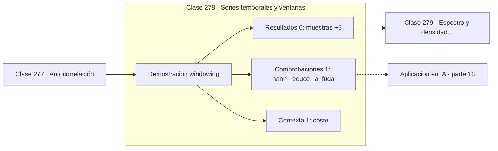

# 278 — Series temporales y ventanas

> [⬅️ 277 Autocorrelación](../277-autocorrelacion/README.md) · [📚 Parte 13](../README.md) · [🏠 Programa](../../../README.md) · [279 Espectro y densidad espectral ➡️](../279-espectro-y-densidad-espectral/README.md)

**Parte:** 13 — Teoría de la información, señales y series · **Nivel:** `avanzado` · **Horas estimadas:** 4
**Motor:** `engines.part13` · **Demostración:** `windowing` · **Clase 18 de 20** de la parte

---

## 🎯 Propósito

**Analizar un trozo finito de señal esparce su energía a frecuencias vecinas.**

Entropía, entropía cruzada, divergencias, información mutua, codificación, muestreo, convolución, Fourier, FFT, filtros y series temporales.

## ✅ Resultados de aprendizaje

Al terminar podrás:

1. Explicar **Series temporales y ventanas** con lenguaje cotidiano y con notación matemática.
2. Resolver un caso pequeño a mano y anticipar el orden de magnitud del resultado.
3. Ejecutar y modificar `lab.py`, que corre la demostración `windowing`.
4. Interpretar las 8 salidas del laboratorio y decir qué comprueba cada una.
5. Detectar el error típico de esta parte: muestrear por debajo de nyquist y culpar al modelo del ruido resultante.

## 🧩 Fórmulas de la clase

```text
ventana rectangular: cortar sin más
ventana de Hann: w[n] = 0,5·(1 − cos(2πn/N))
compromiso: menos fuga, peor resolución
```

## 🗺️ Ubicación en el programa



## 📖 Fundamentos

La transformada de Fourier supone señales infinitas. En la práctica solo se dispone de un
trozo, y cortarlo equivale a multiplicar la señal por una **ventana rectangular**. Esa
multiplicación en el tiempo se convierte en convolución en frecuencia, y ahí está el
problema.

El resultado es la **fuga espectral**: la energía de una componente se dispersa hacia las
frecuencias vecinas. El efecto es máximo cuando la frecuencia real no cae exactamente en
uno de los bins del análisis, porque entonces el corte introduce discontinuidades en los
extremos que la transformada interpreta como contenido de alta frecuencia.

Las **ventanas suaves** —Hann, Hamming, Blackman— multiplican la señal por una función que
decae a cero en los bordes, eliminando la discontinuidad. La fuga se reduce
sustancialmente, y el pico principal queda mucho más limpio.

El precio es la resolución. Suavizar los bordes ensancha el pico principal, así que dos
frecuencias muy próximas pueden dejar de distinguirse. La elección de ventana es un
compromiso entre **resolución** —distinguir frecuencias cercanas— y **rango dinámico**
—ver componentes débiles junto a fuertes—. Hann es el compromiso razonable por defecto.

## 🧮 Ejemplo trabajado

Señal de 8,5 Hz analizada con 64 muestras: el peor caso.

```text
frecuencia real: 8,5 Hz, justo entre dos bins

ventana rectangular:
  pico detectado en el bin 8
  fuga espectral: 50,02 %

ventana de Hann:
  pico detectado en el bin 9
  fuga espectral: 12,45 %

La fuga se reduce a la cuarta parte.

Ninguna de las dos acierta exactamente 8,5:
la resolución del análisis es de 1 bin, y la frecuencia
real cae en medio. Para resolverla haría falta
más duración de señal, no más muestras por segundo.
```

## 🔬 Qué ejecuta el laboratorio

`windowing` — Ventaneo: el precio de analizar un trozo finito de señal.

| Grupo | Salidas |
|---|---|
| 🔢 Resultados numéricos (6) | `muestras`, `frecuencia_real`, `pico_con_ventana_rectangular`, `pico_con_ventana_de_Hann`, `fuga_espectral_rectangular_%`, `fuga_espectral_hann_%` |
| ✅ Comprobaciones de invariante (1) | `hann_reduce_la_fuga` |

Las claves booleanas no son adorno: si alguna fuera `False`, el resultado numérico
no sería fiable aunque el programa terminase sin error.

```bash
python classes/part-13-teoria-de-la-informacion-senales-y-series/278-series-temporales-y-ventanas/lab.py
compmath run 278
```

> [!TIP]
> Antes de ejecutar, **escribe tu predicción**. Un laboratorio que confirma lo que
> esperabas enseña tanto como uno que te contradice, pero solo si la predicción
> existía antes del resultado.

## ⚠️ Errores conceptuales frecuentes

1. Analizar sin ventanear y atribuir la fuga a contenido real de la señal.
2. Elegir una ventana muy suave y perder resolución necesaria.
3. Confundir resolución en frecuencia con frecuencia de muestreo.

## 🚀 Dónde se usa de verdad

Espectrogramas de audio, análisis de vibraciones, detección de tonos y preprocesamiento
para modelos de reconocimiento de voz.

## 🤖 Conexión con IA

La función de pérdida de casi todo clasificador es entropía cruzada; el VAE optimiza un ELBO con un término KL; las CNN son convoluciones aprendidas.

## 📓 Notebooks

| Archivo | Para qué |
|---|---|
| [`notebook.ipynb`](notebook.ipynb) | recorrido guiado con la demostración ejecutada |
| [`notebook_student.ipynb`](notebook_student.ipynb) | versión con `TODO` para resolver |
| [`notebook_solution.ipynb`](notebook_solution.ipynb) | solución de referencia verificada |

## 📝 Evaluación

| Criterio | Peso |
|---|---:|
| Comprensión conceptual | 25 % |
| Resolución manual | 25 % |
| Implementación y verificación | 25 % |
| Interpretación y comunicación | 15 % |
| Conexión con aplicación real | 10 % |

Detalle y criterios de error crítico en [`assessment.md`](assessment.md).

## ❓ Preguntas de comprobación

1. ¿Cuál es la entrada, cuál la salida y qué unidades tienen?
2. ¿Qué operación domina el comportamiento del resultado?
3. ¿Qué caso extremo revelaría un error conceptual?
4. ¿Cómo verificarías el resultado por un método independiente?
5. ¿Dónde aparece esto en compresión?

Si necesitas releer el código para responderlas, la clase todavía no está superada.

## 📥 Entregable

`notebook_student.ipynb` resuelto más un párrafo que explique el resultado **sin citar
código**: qué entra, qué sale, qué invariante se comprueba y qué pasaría en un caso límite.

## 🔗 Referencias

- [Harris, F. J. *On the use of windows for harmonic analysis with the DFT*, Proceedings of the IEEE, 1978](https://doi.org/10.1109/PROC.1978.10837)
- [Oppenheim, A.; Schafer, R. *Discrete-Time Signal Processing*, 3ª ed., Pearson, 2009](https://www.pearson.com/)

Bibliografía completa de la parte en [`../../../docs/BIBLIOGRAPHY.md`](../../../docs/BIBLIOGRAPHY.md).

## 📂 Material de la clase

[`intuition.md`](intuition.md) · [`theory.md`](theory.md) · [`derivation.md`](derivation.md) · [`exercises.md`](exercises.md) · [`assessment.md`](assessment.md) · [`where-is-this-used.md`](where-is-this-used.md) · [`lesson.yaml`](lesson.yaml)

---

> [⬅️ 277 Autocorrelación](../277-autocorrelacion/README.md) · [📚 Parte 13](../README.md) · [🏠 Programa](../../../README.md) · [279 Espectro y densidad espectral ➡️](../279-espectro-y-densidad-espectral/README.md)
