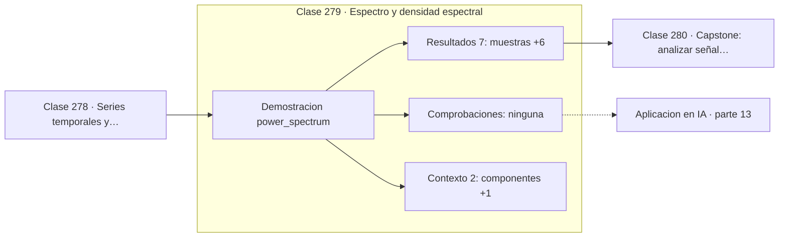

# 279 — Espectro y densidad espectral

> [⬅️ 278 Series temporales y ventanas](../278-series-temporales-y-ventanas/README.md) · [📚 Parte 13](../README.md) · [🏠 Programa](../../../README.md) · [280 Capstone: analizar señal y construir features ➡️](../280-capstone-analizar-senal-y-construir-features/README.md)

**Parte:** 13 — Teoría de la información, señales y series · **Nivel:** `avanzado` · **Horas estimadas:** 4
**Motor:** `engines.part13` · **Demostración:** `power_spectrum` · **Clase 19 de 20** de la parte

---

## 🎯 Propósito

**La potencia va con el cuadrado de la amplitud: doble amplitud es cuádruple potencia.**

Entropía, entropía cruzada, divergencias, información mutua, codificación, muestreo, convolución, Fourier, FFT, filtros y series temporales.

## ✅ Resultados de aprendizaje

Al terminar podrás:

1. Explicar **Espectro y densidad espectral** con lenguaje cotidiano y con notación matemática.
2. Resolver un caso pequeño a mano y anticipar el orden de magnitud del resultado.
3. Ejecutar y modificar `lab.py`, que corre la demostración `power_spectrum`.
4. Interpretar las 9 salidas del laboratorio y decir qué comprueba cada una.
5. Detectar el error típico de esta parte: calcular log(0) sin epsilon de estabilidad.

## 🧩 Fórmulas de la clase

```text
PSD[k] = |X[k]|² / N
potencia relativa = PSD[k] / Σ PSD
amplitud ×2  ⟹  potencia ×4
```

## 🗺️ Ubicación en el programa



## 📖 Fundamentos

La densidad espectral de potencia describe cómo se reparte la energía de una señal entre
sus frecuencias. Se obtiene del cuadrado de la magnitud de la transformada, y a diferencia
del espectro de amplitud **descarta la fase**, quedándose solo con cuánta energía hay en
cada banda.

La relación cuadrática entre amplitud y potencia tiene consecuencias que sorprenden al
leer un espectro. Una componente con el doble de amplitud aporta **cuatro veces** más
potencia, y por tanto domina el reparto mucho más de lo que sugiere el espectro de
amplitud. Las componentes pequeñas quedan aplastadas, y por eso la PSD suele graficarse en
decibelios, que es escala logarítmica.

La PSD es la herramienta habitual para caracterizar ruido y para diagnosticar sistemas. El
ruido blanco tiene potencia uniforme en todas las frecuencias, el ruido rosa decae como
`1/f`, y muchos procesos naturales exhiben ese comportamiento. Comparar la PSD medida con
la esperada revela componentes anómalas: un pico a 50 Hz delata acoplamiento con la red
eléctrica.

En aprendizaje automático, la PSD por bandas es un descriptor clásico. En señales
biomédicas las bandas alfa, beta y theta del EEG se definen así; en audio, el reparto de
potencia por bandas es la base de los coeficientes MFCC que alimentaron el reconocimiento
de voz durante décadas.

## 🧮 Ejemplo trabajado

Dos componentes con amplitudes 2 y 1, y su reparto de potencia.

```text
128 muestras
  componente de 5 Hz  con amplitud 2,0
  componente de 20 Hz con amplitud 1,0

bins dominantes: [5, 20]                             ✓

potencia relativa 5 Hz:   80,0 %
potencia relativa 20 Hz:  20,0 %
razón de potencias: 4,0

Las amplitudes están en razón 2:1
Las potencias están en razón 4:1                     ✓

Aunque la segunda componente tiene la mitad de amplitud,
solo aporta la cuarta parte de la energía.
```

## 🔬 Qué ejecuta el laboratorio

`power_spectrum` — Densidad espectral de potencia y reparto de la energía.

| Grupo | Salidas |
|---|---|
| 🔢 Resultados numéricos (7) | `muestras`, `potencia_relativa_5Hz_%`, `potencia_relativa_20Hz_%`, `razon_de_potencias`, `razon_teorica_amplitudes²`, `energia_total_tiempo`, `energia_total_frecuencia` |
| ✅ Comprobaciones de invariante (0) | — |

Las claves booleanas no son adorno: si alguna fuera `False`, el resultado numérico
no sería fiable aunque el programa terminase sin error.

```bash
python classes/part-13-teoria-de-la-informacion-senales-y-series/279-espectro-y-densidad-espectral/lab.py
compmath run 279
```

> [!TIP]
> Antes de ejecutar, **escribe tu predicción**. Un laboratorio que confirma lo que
> esperabas enseña tanto como uno que te contradice, pero solo si la predicción
> existía antes del resultado.

## ⚠️ Errores conceptuales frecuentes

1. Interpretar la PSD como si fuera espectro de amplitud.
2. Graficar en escala lineal y no ver las componentes débiles.
3. Comparar PSD de señales de distinta duración sin normalizar.

## 🚀 Dónde se usa de verdad

Caracterización de ruido, análisis de EEG por bandas, MFCC en reconocimiento de voz y
diagnóstico de maquinaria por vibraciones.

## 🤖 Conexión con IA

La función de pérdida de casi todo clasificador es entropía cruzada; el VAE optimiza un ELBO con un término KL; las CNN son convoluciones aprendidas.

## 📓 Notebooks

| Archivo | Para qué |
|---|---|
| [`notebook.ipynb`](notebook.ipynb) | recorrido guiado con la demostración ejecutada |
| [`notebook_student.ipynb`](notebook_student.ipynb) | versión con `TODO` para resolver |
| [`notebook_solution.ipynb`](notebook_solution.ipynb) | solución de referencia verificada |

## 📝 Evaluación

| Criterio | Peso |
|---|---:|
| Comprensión conceptual | 25 % |
| Resolución manual | 25 % |
| Implementación y verificación | 25 % |
| Interpretación y comunicación | 15 % |
| Conexión con aplicación real | 10 % |

Detalle y criterios de error crítico en [`assessment.md`](assessment.md).

## ❓ Preguntas de comprobación

1. ¿Cuál es la entrada, cuál la salida y qué unidades tienen?
2. ¿Qué operación domina el comportamiento del resultado?
3. ¿Qué caso extremo revelaría un error conceptual?
4. ¿Cómo verificarías el resultado por un método independiente?
5. ¿Dónde aparece esto en compresión?

Si necesitas releer el código para responderlas, la clase todavía no está superada.

## 📥 Entregable

`notebook_student.ipynb` resuelto más un párrafo que explique el resultado **sin citar
código**: qué entra, qué sale, qué invariante se comprueba y qué pasaría en un caso límite.

## 🔗 Referencias

- [Oppenheim, A.; Schafer, R. *Discrete-Time Signal Processing*, 3ª ed., Pearson, 2009, cap. 10](https://www.pearson.com/) — *uso:* obra de referencia consultada en «Espectro y densidad espectral».
- [Welch, P. *The use of FFT for the estimation of power spectra*, IEEE Trans. Audio, 1967](https://doi.org/10.1109/TAU.1967.1161901) — *uso:* artículo de origen consultado en «Espectro y densidad espectral».

Bibliografía completa de la parte en [`../../../docs/BIBLIOGRAPHY.md`](../../../docs/BIBLIOGRAPHY.md) · localizador verificable de cada obra en [`sources/bibliography.json`](../../../sources/bibliography.json).

## 📂 Material de la clase

[`intuition.md`](intuition.md) · [`theory.md`](theory.md) · [`derivation.md`](derivation.md) · [`exercises.md`](exercises.md) · [`assessment.md`](assessment.md) · [`where-is-this-used.md`](where-is-this-used.md) · [`lesson.yaml`](lesson.yaml)

---

> [⬅️ 278 Series temporales y ventanas](../278-series-temporales-y-ventanas/README.md) · [📚 Parte 13](../README.md) · [🏠 Programa](../../../README.md) · [280 Capstone: analizar señal y construir features ➡️](../280-capstone-analizar-senal-y-construir-features/README.md)
