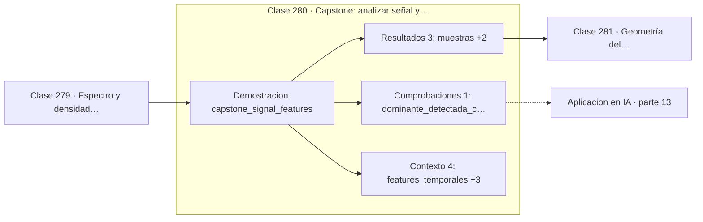

# 280 — Capstone: analizar señal y construir features

> [⬅️ 279 Espectro y densidad espectral](../279-espectro-y-densidad-espectral/README.md) · [📚 Parte 13](../README.md) · [🏠 Programa](../../../README.md) · [281 Geometría del aprendizaje supervisado ➡️](../../part-14-matematica-de-machine-learning/281-geometria-del-aprendizaje-supervisado/README.md)

**Parte:** 13 — Teoría de la información, señales y series · **Nivel:** `avanzado` · **Horas estimadas:** 4
**Motor:** `engines.part13` · **Demostración:** `capstone_signal_features` · **Clase 20 de 20** de la parte

---

## 🎯 Propósito

**Un vector de características resume la señal en números que un modelo puede usar.**

Entropía, entropía cruzada, divergencias, información mutua, codificación, muestreo, convolución, Fourier, FFT, filtros y series temporales.

## ✅ Resultados de aprendizaje

Al terminar podrás:

1. Explicar **Capstone: analizar señal y construir features** con lenguaje cotidiano y con notación matemática.
2. Resolver un caso pequeño a mano y anticipar el orden de magnitud del resultado.
3. Ejecutar y modificar `lab.py`, que corre la demostración `capstone_signal_features`.
4. Interpretar las 8 salidas del laboratorio y decir qué comprueba cada una.
5. Detectar el error típico de esta parte: comparar entropías calculadas en bases logarítmicas distintas.

## 🧩 Fórmulas de la clase

```text
temporales: media, varianza, RMS, cruces por cero
espectrales: frecuencia dominante, centroide, entropía espectral
centroide = Σ f·P(f) / Σ P(f)
```

## 🗺️ Ubicación en el programa



## 📖 Fundamentos

Alimentar un modelo con una señal cruda de miles de muestras rara vez es la mejor opción:
la dimensión es enorme, la información está diluida y el modelo tiene que aprender de cero
lo que el procesamiento de señales ya sabe. La extracción de características condensa la
señal en pocos números interpretables.

Las características **temporales** son baratas y describen la forma de la onda. La media
detecta desplazamientos del nivel base, la varianza y el RMS miden la energía, y los
**cruces por cero** son un estimador rudimentario pero muy usado del contenido de
frecuencia: cuantos más cruces, más rápida es la señal.

Las características **espectrales** describen el contenido de frecuencia. La frecuencia
dominante identifica la componente principal; el **centroide espectral** es la frecuencia
media ponderada por potencia y se corresponde con la percepción de brillo en audio; la
**entropía espectral** distingue una señal tonal —energía concentrada, entropía baja— de
una ruidosa —energía repartida, entropía alta—. Esa última reutiliza la entropía de la
clase 262 aplicada al espectro normalizado.

La disyuntiva frente al aprendizaje profundo es real y no tiene respuesta única. Las
características diseñadas a mano son interpretables, baratas y funcionan con pocos datos;
las aprendidas por una red superan a las manuales cuando hay datos abundantes. En la
práctica se combinan, y entender las manuales sigue siendo necesario para diagnosticar qué
está capturando el modelo.

## 🧮 Ejemplo trabajado

Vector de características extraído de una señal de 256 muestras.

```text
256 muestras a 256 Hz, componentes reales en 7 Hz y 23 Hz

características temporales:
  media           = −0,000308
  varianza        =  1,316705
  RMS             =  1,147478
  cruces por cero =  (proporcional al contenido rápido)

características espectrales:
  frecuencia dominante = 7 Hz          ✓ correcta
  centroide espectral  = 10,287014
  entropía espectral   = (concentración de la energía)

El centroide cae entre 7 y 23, más cerca de 7 porque
esa componente aporta más potencia.

De 256 números a un vector de 7: eso es lo que
recibe el modelo.
```

## 🔬 Qué ejecuta el laboratorio

`capstone_signal_features` — Capstone: de una señal cruda a un vector de características.

| Grupo | Salidas |
|---|---|
| 🔢 Resultados numéricos (3) | `muestras`, `frecuencia_de_muestreo_Hz`, `vector_de_features` |
| ✅ Comprobaciones de invariante (1) | `dominante_detectada_correctamente` |

Las claves booleanas no son adorno: si alguna fuera `False`, el resultado numérico
no sería fiable aunque el programa terminase sin error.

```bash
python classes/part-13-teoria-de-la-informacion-senales-y-series/280-capstone-analizar-senal-y-construir-features/lab.py
compmath run 280
```

> [!TIP]
> Antes de ejecutar, **escribe tu predicción**. Un laboratorio que confirma lo que
> esperabas enseña tanto como uno que te contradice, pero solo si la predicción
> existía antes del resultado.

## ⚠️ Errores conceptuales frecuentes

1. Extraer características sin normalizar entre señales de escalas distintas.
2. Calcular características espectrales sobre señales no estacionarias sin segmentar.
3. Descartar el aprendizaje de representaciones cuando hay datos abundantes.

## 🚀 Dónde se usa de verdad

Clasificación de audio, reconocimiento de actividad con acelerómetros, diagnóstico de
maquinaria, análisis de EEG y detección de anomalías en sensores.

## 🤖 Conexión con IA

La función de pérdida de casi todo clasificador es entropía cruzada; el VAE optimiza un ELBO con un término KL; las CNN son convoluciones aprendidas.

## 📓 Notebooks

| Archivo | Para qué |
|---|---|
| [`notebook.ipynb`](notebook.ipynb) | recorrido guiado con la demostración ejecutada |
| [`notebook_student.ipynb`](notebook_student.ipynb) | versión con `TODO` para resolver |
| [`notebook_solution.ipynb`](notebook_solution.ipynb) | solución de referencia verificada |

## 📝 Evaluación

| Criterio | Peso |
|---|---:|
| Comprensión conceptual | 25 % |
| Resolución manual | 25 % |
| Implementación y verificación | 25 % |
| Interpretación y comunicación | 15 % |
| Conexión con aplicación real | 10 % |

Detalle y criterios de error crítico en [`assessment.md`](assessment.md).

## ❓ Preguntas de comprobación

1. ¿Cuál es la entrada, cuál la salida y qué unidades tienen?
2. ¿Qué operación domina el comportamiento del resultado?
3. ¿Qué caso extremo revelaría un error conceptual?
4. ¿Cómo verificarías el resultado por un método independiente?
5. ¿Dónde aparece esto en compresión?

Si necesitas releer el código para responderlas, la clase todavía no está superada.

## 📥 Entregable

`notebook_student.ipynb` resuelto más un párrafo que explique el resultado **sin citar
código**: qué entra, qué sale, qué invariante se comprueba y qué pasaría en un caso límite.

## 🔗 Referencias

- [Oppenheim, A.; Schafer, R. *Discrete-Time Signal Processing*, 3ª ed., Pearson, 2009](https://www.pearson.com/) — *uso:* obra de referencia consultada en «Capstone: analizar señal y construir features».
- [Peeters, G. *A large set of audio features for sound description*, IRCAM, 2004](https://recherche.ircam.fr/anasyn/peeters/ARTICLES/Peeters_2003_cuidadoaudiofeatures.pdf) — *uso:* obra de referencia consultada en «Capstone: analizar señal y construir features».

Bibliografía completa de la parte en [`../../../docs/BIBLIOGRAPHY.md`](../../../docs/BIBLIOGRAPHY.md) · localizador verificable de cada obra en [`sources/bibliography.json`](../../../sources/bibliography.json).

## 📂 Material de la clase

[`intuition.md`](intuition.md) · [`theory.md`](theory.md) · [`derivation.md`](derivation.md) · [`exercises.md`](exercises.md) · [`assessment.md`](assessment.md) · [`where-is-this-used.md`](where-is-this-used.md) · [`lesson.yaml`](lesson.yaml)

---

> [⬅️ 279 Espectro y densidad espectral](../279-espectro-y-densidad-espectral/README.md) · [📚 Parte 13](../README.md) · [🏠 Programa](../../../README.md) · [281 Geometría del aprendizaje supervisado ➡️](../../part-14-matematica-de-machine-learning/281-geometria-del-aprendizaje-supervisado/README.md)
