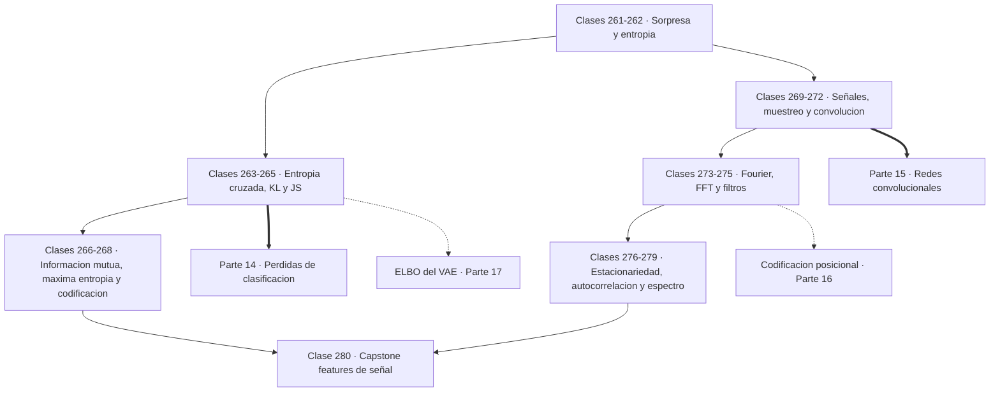

# 📡 Parte 13 — Teoría de la información, señales y series

> [⬅️ Parte 12 — Optimización matemática y computacional](../part-12-optimizacion-matematica-y-computacional/README.md) · [🏠 Programa](../../README.md) · [📇 Catálogo](../README.md) · [Parte 14 — Matemática de Machine Learning ➡️](../part-14-matematica-de-machine-learning/README.md)

**Nivel:** `avanzado` · **Clases:** 20 · **Horas estimadas:** 80 · **Motor:** [`part13.py`](../../src/computational_math/engines/part13.py)

---

## 🎯 De qué trata esta parte

Entropía, entropía cruzada, divergencias, información mutua, codificación, muestreo, convolución, Fourier, FFT, filtros y series temporales.

Esta parte contesta dos preguntas que parecen inconexas y resultan ser la misma. La primera:
¿cuánta información hay en un mensaje, y cuánto se puede comprimir sin perder nada? La
segunda: ¿qué hay dentro de una señal, y cómo se extrae? Shannon respondió la primera en
1948 y Fourier la segunda en 1822, y ambas convergen en el aprendizaje automático moderno,
donde la función de pérdida es una divergencia entre distribuciones y las capas son
convoluciones.

Las clases 261 a 268 construyen la teoría de la información desde su ladrillo: la
**sorpresa** `−log p`. Un evento seguro no sorprende, uno improbable sorprende mucho, y el
logaritmo garantiza que la sorpresa de dos eventos independientes sea la suma de las suyas.
La **entropía** es la sorpresa esperada, y el teorema de codificación de Shannon le da un
significado operativo que no es metafórico: es el límite inferior exacto de bits por símbolo
de cualquier compresión sin pérdida.

De ahí salen las medidas que usa el aprendizaje automático a diario. La **entropía cruzada**
es el coste de codificar la distribución real con un código diseñado para otra, y minimizarla
es exactamente maximizar la verosimilitud: la función de pérdida de casi todo clasificador
no es una elección de diseño, es una consecuencia. La **divergencia KL** mide el exceso sobre
el óptimo, y su asimetría no es un defecto sino información: `KL(p‖q)` y `KL(q‖p)` penalizan
errores distintos, y esa diferencia decide el comportamiento de un VAE frente a una GAN. La
**información mutua** cuantifica cuánto dice una variable sobre otra, y vale cero si y solo si
son independientes, que es más de lo que la correlación puede garantizar.

Las clases 269 a 275 pasan a las señales. El **teorema de Nyquist** impone una frontera dura:
hay que muestrear a más del doble de la frecuencia máxima presente, y por debajo de ese
límite el **aliasing** es irreversible —no hay procesamiento posterior que recupere lo que se
perdió—. La **convolución** aparece como el operador central, primero como filtrado y luego
como el núcleo de las CNN, y **Fourier** revela que toda señal es una suma de sinusoides y
que convolucionar en el tiempo es multiplicar en frecuencia. La **FFT** hace ese cambio de
dominio computable: `O(n log n)` en vez de `O(n²)`, lo que para un millón de muestras es la
diferencia entre milisegundos y semanas.

El cierre (276 a 280) trata las series temporales: estacionariedad como supuesto que casi
todo el análisis clásico necesita, autocorrelación para descubrir periodicidad oculta,
ventaneo y la fuga espectral que provoca analizar un trozo finito, y densidad espectral. El
capstone recorre el camino completo: de una señal cruda a un vector de características
temporales y espectrales listo para alimentar un modelo.

El puente con la inteligencia artificial es explícito en cada bloque. La entropía cruzada es
la pérdida de todo clasificador; el VAE optimiza un ELBO con un término KL; las GAN se
analizaron originalmente en términos de divergencia de Jensen-Shannon; las CNN son
convoluciones con núcleos aprendidos; la atención es una correlación normalizada; y la
codificación posicional de un Transformer son senos y cosenos de frecuencias distintas.

## 🗺️ Mapa conceptual



## 🧠 Ideas centrales

- La entropía es el límite inferior de compresión sin pérdida.
- Minimizar cross-entropy equivale a maximizar verosimilitud.
- KL no es simétrica ni es una distancia; JS sí es simétrica.
- Nyquist fija la frecuencia mínima de muestreo; por debajo hay aliasing irreversible.
- Convolución en el tiempo es multiplicación en frecuencia.

## 🤖 Por qué importa en IA

> [!IMPORTANT]
> La función de pérdida de casi todo clasificador es entropía cruzada; el VAE optimiza un ELBO con un término KL; las CNN son convoluciones aprendidas.

## ⚠️ Errores frecuentes de esta parte

- Calcular log(0) sin epsilon de estabilidad.
- Comparar entropías calculadas en bases logarítmicas distintas.
- Muestrear por debajo de Nyquist y culpar al modelo del ruido resultante.

## 🧭 Secuencia de la parte


## 📚 Las clases

| # | Clase | Demostración | Idea central |
|---|---|---|---|
| `261` | [Información y sorpresa](261-informacion-y-sorpresa/README.md) | `surprise` | La información de un evento es su sorpresa, y el logaritmo la hace aditiva. |
| `262` | [Entropía de Shannon](262-entropia-de-shannon/README.md) | `shannon_entropy` | La entropía es el número mínimo de bits por símbolo que cualquier compresor puede lograr. |
| `263` | [Entropía cruzada](263-entropia-cruzada/README.md) | `cross_entropy` | Minimizar entropía cruzada es exactamente maximizar la verosimilitud. |
| `264` | [Divergencia KL](264-divergencia-kl/README.md) | `kl_divergence` | KL no es simétrica, y cada dirección castiga un error distinto. |
| `265` | [Jensen-Shannon divergence](265-jensen-shannon-divergence/README.md) | `js_divergence` | Jensen-Shannon simetriza la KL midiendo ambas contra la mezcla. |
| `266` | [Información mutua](266-informacion-mutua/README.md) | `mutual_information` | La información mutua vale cero solo si hay independencia, y detecta lo que la correlación no ve. |
| `267` | [Principio de máxima entropía](267-principio-de-maxima-entropia/README.md) | `max_entropy` | Entre todas las distribuciones compatibles con lo que se sabe, elegir la que menos añade. |
| `268` | [Codificación y compresión](268-codificacion-y-compresion/README.md) | `coding_compression` | Huffman da códigos cortos a lo frecuente y se acerca al límite de Shannon. |
| `269` | [Señales discretas y continuas](269-senales-discretas-y-continuas/README.md) | `signals` | Muestrear convierte una función continua en una lista de números con la que se puede calcular. |
| `270` | [Muestreo y aliasing](270-muestreo-y-aliasing/README.md) | `sampling_aliasing` | Por debajo de Nyquist la información se pierde y ningún procesamiento la recupera. |
| `271` | [Convolución](271-convolucion/README.md) | `convolution` | Convolucionar es deslizar un núcleo y sumar productos: filtrar y detectar son lo mismo. |
| `272` | [Correlación de señales](272-correlacion-de-senales/README.md) | `cross_correlation` | La correlación cruzada localiza dónde aparece un patrón dentro de una señal. |
| `273` | [Series y transformada de Fourier](273-series-y-transformada-de-fourier/README.md) | `fourier_series` | Toda señal es una suma de sinusoides, y Fourier dice cuáles y con qué peso. |
| `274` | [FFT](274-fft/README.md) | `fft` | La FFT da el mismo resultado que la DFT y convierte n² en n log n. |
| `275` | [Filtros y respuesta en frecuencia](275-filtros-y-respuesta-en-frecuencia/README.md) | `filters` | Filtrar es decidir qué frecuencias sobreviven, y una media móvil ya es un filtro. |
| `276` | [Procesos estacionarios](276-procesos-estacionarios/README.md) | `stationarity` | Casi todo el análisis clásico de series supone estacionariedad, y diferenciar la consigue. |
| `277` | [Autocorrelación](277-autocorrelacion/README.md) | `autocorrelation` | Un pico en la autocorrelación en el retardo k delata un periodo de k muestras. |
| `278` | [Series temporales y ventanas](278-series-temporales-y-ventanas/README.md) | `windowing` | Analizar un trozo finito de señal esparce su energía a frecuencias vecinas. |
| `279` | [Espectro y densidad espectral](279-espectro-y-densidad-espectral/README.md) | `power_spectrum` | La potencia va con el cuadrado de la amplitud: doble amplitud es cuádruple potencia. |
| `280` | [Capstone: analizar señal y construir features](280-capstone-analizar-senal-y-construir-features/README.md) | `capstone_signal_features` | Un vector de características resume la señal en números que un modelo puede usar. |

## 📖 Glosario de la parte (34 términos)

Definiciones precisas en [`GLOSARIO.md`](GLOSARIO.md).

## 🧰 Stack de referencia

`math`, `cmath`, `numpy (opcional)`

Los laboratorios se ejecutan con biblioteca estándar; estas herramientas aparecen
como contraste profesional, no como requisito.

## 🧪 Ejecutar toda la parte

```bash
compmath run --part 13
compmath catalog --part 13
```

## 📊 Evaluación de la parte

| Componente | Peso |
|---|---:|
| Clases y ejercicios | 40 % |
| Laboratorios y notebooks | 25 % |
| Explicación oral o escrita | 15 % |
| Capstone ([280](280-capstone-analizar-senal-y-construir-features/README.md)) | 20 % |

## 📖 Bibliografía

Obras de referencia de la parte:

- Cover, T.; Thomas, J. *Elements of Information Theory*. 2ª ed., Wiley, 2006.
- MacKay, D. *Information Theory, Inference, and Learning Algorithms*. Cambridge, 2003.
- Oppenheim, A.; Schafer, R. *Discrete-Time Signal Processing*. 3ª ed., Pearson, 2009.

Las 20 clases de esta parte citan 24 obras distintas. Cuál sostiene cada clase, y por qué, en [`docs/BIBLIOGRAPHY.md`](../../docs/BIBLIOGRAPHY.md#parte-13-teoria-de-la-informacion-senales-y-series).

---

> [⬅️ Parte 12 — Optimización matemática y computacional](../part-12-optimizacion-matematica-y-computacional/README.md) · [🏠 Programa](../../README.md) · [📇 Catálogo](../README.md) · [Parte 14 — Matemática de Machine Learning ➡️](../part-14-matematica-de-machine-learning/README.md)
