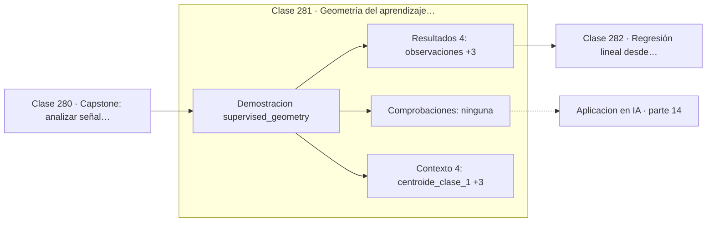

# 281 — Geometría del aprendizaje supervisado

> [⬅️ 280 Capstone: analizar señal y construir features](../../part-13-teoria-de-la-informacion-senales-y-series/280-capstone-analizar-senal-y-construir-features/README.md) · [📚 Parte 14](../README.md) · [🏠 Programa](../../../README.md) · [282 Regresión lineal desde mínimos cuadrados ➡️](../282-regresion-lineal-desde-minimos-cuadrados/README.md)

**Parte:** 14 — Matemática de Machine Learning · **Nivel:** `ml-avanzado` · **Horas estimadas:** 4
**Motor:** `engines.part14` · **Demostración:** `supervised_geometry` · **Clase 1 de 20** de la parte

---

## 🎯 Propósito

**Aprender de forma supervisada es encontrar una frontera en el espacio de características.**

Derivación matemática de los algoritmos clásicos: regresión, regularización, clasificación, kernels, árboles, ensambles, clustering, EM y compromiso sesgo-varianza.

## ✅ Resultados de aprendizaje

Al terminar podrás:

1. Explicar **Geometría del aprendizaje supervisado** con lenguaje cotidiano y con notación matemática.
2. Resolver un caso pequeño a mano y anticipar el orden de magnitud del resultado.
3. Ejecutar y modificar `lab.py`, que corre la demostración `supervised_geometry`.
4. Interpretar las 8 salidas del laboratorio y decir qué comprueba cada una.
5. Detectar el error típico de esta parte: no estandarizar antes de aplicar regularización o k-nn.

## 🧩 Fórmulas de la clase

```text
cada observación es un punto de ℝᵈ
dirección discriminante ∝ μ₁ − μ₀
frontera lineal: wᵀx + b = 0
```

## 🗺️ Ubicación en el programa



## 📖 Fundamentos

Todo conjunto de datos supervisado admite la misma lectura geométrica: cada observación es
un punto en un espacio de tantas dimensiones como características, y la etiqueta es un
color. Aprender es encontrar una superficie que separe los colores, o una función que los
prediga.

Esa visión unifica algoritmos que parecen ajenos entre sí. Regresión logística busca un
hiperplano; SVM busca el hiperplano de margen máximo; k-NN construye una frontera irregular
a partir de los vecinos; un árbol construye una frontera de escalones paralelos a los ejes;
y una red neuronal construye una frontera curva arbitraria. Todos resuelven el mismo
problema geométrico con distintas restricciones sobre la forma de la frontera.

El punto de partida más simple es el **clasificador por centroides**: calcular la media de
cada clase y asignar cada punto al centroide más cercano. La frontera resultante es el
hiperplano perpendicular al segmento que une los centroides, y la dirección de ese segmento
es la **dirección discriminante**. Es lo mínimo que se puede hacer, y sirve de línea base
honesta.

Lo que hace difícil el problema en la práctica no es la forma de la frontera sino la
**dimensión**. Con dos características se puede dibujar y la intuición funciona; con
quinientas, todas las distancias se parecen, el volumen se concentra en los bordes, y la
intuición geométrica de dos dimensiones deja de ser fiable. Esa es la maldición de la
dimensionalidad, que reaparece en la clase 288.

## 🧮 Ejemplo trabajado

Dos clases separables y su dirección discriminante.

```text
80 observaciones en 2 dimensiones

centroide clase 1: ( 2,1592 ;  1,8087)
centroide clase 0: (−1,1503 ; −1,0020)

diferencia = (3,3095 ; 2,8107)
distancia entre centroides = 4,342

dirección discriminante normalizada:
  (0,7622 ; 0,6473)

La frontera del clasificador por centroides es el
hiperplano perpendicular a esa dirección, situado
en el punto medio: (0,5045 ; 0,4034).

Es la línea base contra la que comparar todo lo demás.
```

## 🔬 Qué ejecuta el laboratorio

`supervised_geometry` — Aprendizaje supervisado como búsqueda de una frontera en el espacio.

| Grupo | Salidas |
|---|---|
| 🔢 Resultados numéricos (4) | `observaciones`, `dimension`, `distancia_entre_centroides`, `accuracy_del_clasificador_de_centroides` |
| ✅ Comprobaciones de invariante (0) | — |

Las claves booleanas no son adorno: si alguna fuera `False`, el resultado numérico
no sería fiable aunque el programa terminase sin error.

```bash
python classes/part-14-matematica-de-machine-learning/281-geometria-del-aprendizaje-supervisado/lab.py
compmath run 281
```

> [!TIP]
> Antes de ejecutar, **escribe tu predicción**. Un laboratorio que confirma lo que
> esperabas enseña tanto como uno que te contradice, pero solo si la predicción
> existía antes del resultado.

## ⚠️ Errores conceptuales frecuentes

1. Confiar en la intuición geométrica bidimensional en dimensión alta.
2. Comparar distancias entre características de escalas distintas.
3. Omitir la línea base trivial al evaluar un modelo complejo.

## 🚀 Dónde se usa de verdad

Comprensión unificada de clasificadores, análisis discriminante lineal, diagnóstico visual
de separabilidad y elección de la familia de modelos.

## 🤖 Conexión con IA

Estos algoritmos siguen siendo la línea base honesta contra la que se debe comparar cualquier modelo profundo.

## 📓 Notebooks

| Archivo | Para qué |
|---|---|
| [`notebook.ipynb`](notebook.ipynb) | recorrido guiado con la demostración ejecutada |
| [`notebook_student.ipynb`](notebook_student.ipynb) | versión con `TODO` para resolver |
| [`notebook_solution.ipynb`](notebook_solution.ipynb) | solución de referencia verificada |

## 📝 Evaluación

| Criterio | Peso |
|---|---:|
| Comprensión conceptual | 25 % |
| Resolución manual | 25 % |
| Implementación y verificación | 25 % |
| Interpretación y comunicación | 15 % |
| Conexión con aplicación real | 10 % |

Detalle y criterios de error crítico en [`assessment.md`](assessment.md).

## ❓ Preguntas de comprobación

1. ¿Cuál es la entrada, cuál la salida y qué unidades tienen?
2. ¿Qué operación domina el comportamiento del resultado?
3. ¿Qué caso extremo revelaría un error conceptual?
4. ¿Cómo verificarías el resultado por un método independiente?
5. ¿Dónde aparece esto en scoring crediticio?

Si necesitas releer el código para responderlas, la clase todavía no está superada.

## 📥 Entregable

`notebook_student.ipynb` resuelto más un párrafo que explique el resultado **sin citar
código**: qué entra, qué sale, qué invariante se comprueba y qué pasaría en un caso límite.

## 🔗 Referencias

- [Hastie, T.; Tibshirani, R.; Friedman, J. *The Elements of Statistical Learning*, 2ª ed., Springer, 2009, cap. 2](https://hastie.su.domains/ElemStatLearn/) — *uso:* obra de referencia consultada en «Geometría del aprendizaje supervisado».
- [Bishop, C. *Pattern Recognition and Machine Learning*, Springer, 2006, cap. 4](https://www.microsoft.com/en-us/research/publication/pattern-recognition-machine-learning/) — *uso:* obra de referencia consultada en «Geometría del aprendizaje supervisado».

Bibliografía completa de la parte en [`../../../docs/BIBLIOGRAPHY.md`](../../../docs/BIBLIOGRAPHY.md) · localizador verificable de cada obra en [`sources/bibliography.json`](../../../sources/bibliography.json).

## 📂 Material de la clase

[`intuition.md`](intuition.md) · [`theory.md`](theory.md) · [`derivation.md`](derivation.md) · [`exercises.md`](exercises.md) · [`assessment.md`](assessment.md) · [`where-is-this-used.md`](where-is-this-used.md) · [`lesson.yaml`](lesson.yaml)

---

> [⬅️ 280 Capstone: analizar señal y construir features](../../part-13-teoria-de-la-informacion-senales-y-series/280-capstone-analizar-senal-y-construir-features/README.md) · [📚 Parte 14](../README.md) · [🏠 Programa](../../../README.md) · [282 Regresión lineal desde mínimos cuadrados ➡️](../282-regresion-lineal-desde-minimos-cuadrados/README.md)
