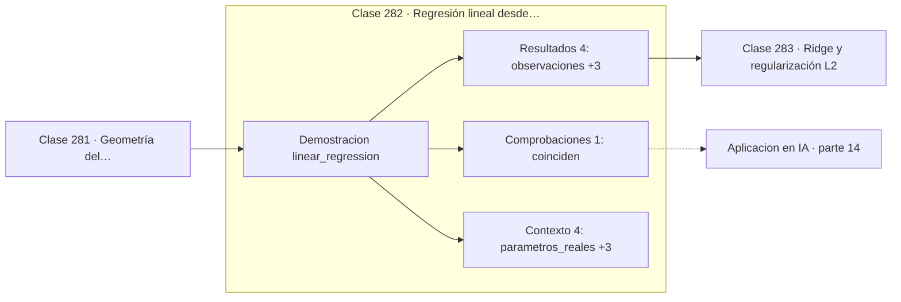

# 282 — Regresión lineal desde mínimos cuadrados

> [⬅️ 281 Geometría del aprendizaje supervisado](../281-geometria-del-aprendizaje-supervisado/README.md) · [📚 Parte 14](../README.md) · [🏠 Programa](../../../README.md) · [283 Ridge y regularización L2 ➡️](../283-ridge-y-regularizacion-l2/README.md)

**Parte:** 14 — Matemática de Machine Learning · **Nivel:** `ml-avanzado` · **Horas estimadas:** 4
**Motor:** `engines.part14` · **Demostración:** `linear_regression` · **Clase 2 de 20** de la parte

---

## 🎯 Propósito

**Regresión lineal tiene solución cerrada, y el descenso de gradiente llega al mismo sitio.**

Derivación matemática de los algoritmos clásicos: regresión, regularización, clasificación, kernels, árboles, ensambles, clustering, EM y compromiso sesgo-varianza.

## ✅ Resultados de aprendizaje

Al terminar podrás:

1. Explicar **Regresión lineal desde mínimos cuadrados** con lenguaje cotidiano y con notación matemática.
2. Resolver un caso pequeño a mano y anticipar el orden de magnitud del resultado.
3. Ejecutar y modificar `lab.py`, que corre la demostración `linear_regression`.
4. Interpretar las 9 salidas del laboratorio y decir qué comprueba cada una.
5. Detectar el error típico de esta parte: elegir hiperparámetros con el conjunto de test.

## 🧩 Fórmulas de la clase

```text
ŷ = Xw;   J(w) = ‖Xw − y‖²
solución cerrada: w = (XᵀX)⁻¹Xᵀy
gradiente: ∇J = 2Xᵀ(Xw − y)
```

## 🗺️ Ubicación en el programa



## 📖 Fundamentos

La regresión lineal minimiza la suma de residuos al cuadrado. Es el algoritmo más antiguo
del catálogo —Gauss y Legendre, principios del siglo XIX— y sigue siendo la línea base
obligada porque es interpretable, rápido y difícil de superar cuando la relación es
realmente lineal.

Tiene la propiedad rara de admitir **solución cerrada**. Anular el gradiente da las
ecuaciones normales, y su solución es la fórmula de la proyección de la parte 05. Casi
ningún otro modelo permite eso: la regresión logística, sin ir más lejos, ya requiere
iterar.

Aun así, en la práctica se usa el **descenso de gradiente** cuando hay muchas
observaciones o muchas características, porque invertir `XᵀX` cuesta `O(d³)` y la matriz
puede estar mal condicionada. Que ambos caminos converjan al mismo punto es la
comprobación numérica que valida las dos implementaciones a la vez.

Elegir el error **cuadrático** no es arbitrario: equivale a suponer ruido gaussiano y
maximizar la verosimilitud, como se vio en la clase 215. Sus consecuencias son conocidas:
penaliza los errores grandes de forma desproporcionada y por tanto es muy sensible a
valores atípicos. Si esa sensibilidad molesta, la respuesta correcta es cambiar el modelo
de ruido —pérdida de Huber, regresión cuantílica— y no parchear el algoritmo.

## 🧮 Ejemplo trabajado

Sesenta observaciones, tres características, dos métodos.

```text
parámetros reales: [2,0 ; 1,5 ; −0,4]

solución cerrada:      [2,032145 ; 1,488677 ; −0,353039]
descenso de gradiente: [2,031712 ; 1,489061 ; −0,353651]

coinciden a 3 decimales                              ✓
MSE de la solución cerrada: 0,0757

La diferencia con los parámetros reales viene del ruido
de las 60 observaciones, no del método.

Coste: cerrada O(d³) por la inversión;
       gradiente O(n·d) por iteración.
```

## 🔬 Qué ejecuta el laboratorio

`linear_regression` — Regresión lineal: solución cerrada y descenso de gradiente.

| Grupo | Salidas |
|---|---|
| 🔢 Resultados numéricos (4) | `observaciones`, `features`, `MSE_cerrada`, `MSE_gradiente` |
| ✅ Comprobaciones de invariante (1) | `coinciden` |

Las claves booleanas no son adorno: si alguna fuera `False`, el resultado numérico
no sería fiable aunque el programa terminase sin error.

```bash
python classes/part-14-matematica-de-machine-learning/282-regresion-lineal-desde-minimos-cuadrados/lab.py
compmath run 282
```

> [!TIP]
> Antes de ejecutar, **escribe tu predicción**. Un laboratorio que confirma lo que
> esperabas enseña tanto como uno que te contradice, pero solo si la predicción
> existía antes del resultado.

## ⚠️ Errores conceptuales frecuentes

1. Invertir XᵀX explícitamente en vez de resolver el sistema o usar QR.
2. Aplicar mínimos cuadrados con valores atípicos sin considerar pérdidas robustas.
3. Interpretar coeficientes con características fuertemente correlacionadas.

## 🚀 Dónde se usa de verdad

Línea base en cualquier problema de regresión, análisis de tendencias, calibración de
instrumentos y capa final de muchos modelos.

## 🤖 Conexión con IA

Estos algoritmos siguen siendo la línea base honesta contra la que se debe comparar cualquier modelo profundo.

## 📓 Notebooks

| Archivo | Para qué |
|---|---|
| [`notebook.ipynb`](notebook.ipynb) | recorrido guiado con la demostración ejecutada |
| [`notebook_student.ipynb`](notebook_student.ipynb) | versión con `TODO` para resolver |
| [`notebook_solution.ipynb`](notebook_solution.ipynb) | solución de referencia verificada |

## 📝 Evaluación

| Criterio | Peso |
|---|---:|
| Comprensión conceptual | 25 % |
| Resolución manual | 25 % |
| Implementación y verificación | 25 % |
| Interpretación y comunicación | 15 % |
| Conexión con aplicación real | 10 % |

Detalle y criterios de error crítico en [`assessment.md`](assessment.md).

## ❓ Preguntas de comprobación

1. ¿Cuál es la entrada, cuál la salida y qué unidades tienen?
2. ¿Qué operación domina el comportamiento del resultado?
3. ¿Qué caso extremo revelaría un error conceptual?
4. ¿Cómo verificarías el resultado por un método independiente?
5. ¿Dónde aparece esto en scoring crediticio?

Si necesitas releer el código para responderlas, la clase todavía no está superada.

## 📥 Entregable

`notebook_student.ipynb` resuelto más un párrafo que explique el resultado **sin citar
código**: qué entra, qué sale, qué invariante se comprueba y qué pasaría en un caso límite.

## 📚 Bibliografía de la clase

Esta clase enseña **Machine learning · Teoría del aprendizaje · Métodos de kernel**. Cada obra dice qué aporta aquí y cómo se comprobó su localizador:

- [Hastie, T.; Tibshirani, R.; Friedman, J. *The Elements of Statistical Learning*, 2ª ed., Springer, 2009, cap. 3](https://hastie.su.domains/ElemStatLearn/) — Machine learning: el tema de esta clase · ISBN-13 `9780387848570` verificado en International ISBN Agency (2026-08-19).
- [Murphy, K. *Probabilistic Machine Learning: An Introduction*, MIT Press, 2022](https://probml.github.io/pml-book/book1.html) — Machine learning: el tema de esta clase · URL de la fuente primaria comprobada en sitio oficial del autor (2026-08-19).

Bibliografía de todas las clases, con el porqué de cada obra, en [`docs/BIBLIOGRAPHY.md`](../../../docs/BIBLIOGRAPHY.md) · localizador y estado de cada obra en [`sources/bibliography.json`](../../../sources/bibliography.json).

## 📂 Material de la clase

[`intuition.md`](intuition.md) · [`theory.md`](theory.md) · [`derivation.md`](derivation.md) · [`exercises.md`](exercises.md) · [`assessment.md`](assessment.md) · [`where-is-this-used.md`](where-is-this-used.md) · [`lesson.yaml`](lesson.yaml)

---

> [⬅️ 281 Geometría del aprendizaje supervisado](../281-geometria-del-aprendizaje-supervisado/README.md) · [📚 Parte 14](../README.md) · [🏠 Programa](../../../README.md) · [283 Ridge y regularización L2 ➡️](../283-ridge-y-regularizacion-l2/README.md)
