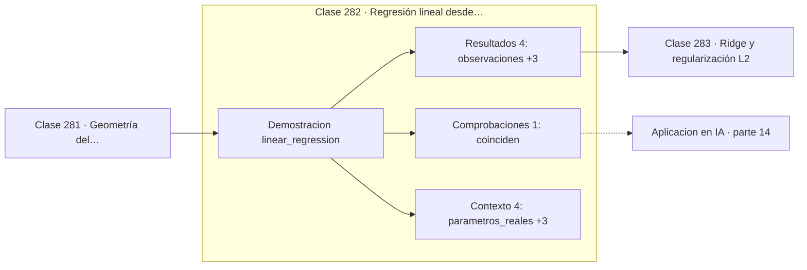

# 282 — Regresión lineal desde mínimos cuadrados

> [⬅️ 281 Geometría del aprendizaje supervisado](../281-geometria-del-aprendizaje-supervisado/README.md) · [📚 Parte 14](../README.md) · [🏠 Programa](../../../README.md) · [283 Ridge y regularización L2 ➡️](../283-ridge-y-regularizacion-l2/README.md)

**Parte:** 14 — Matemática de Machine Learning · **Nivel:** `ml-avanzado` · **Horas estimadas:** 4
**Motor:** `engines.part14` · **Demostración:** `linear_regression` · **Clase 2 de 20** de la parte

---

## 🎯 Propósito

Derivación matemática de los algoritmos clásicos: regresión, regularización, clasificación, kernels, árboles, ensambles, clustering, EM y compromiso sesgo-varianza.

Esta clase concreta ese objetivo sobre **Regresión lineal desde mínimos cuadrados**: qué es, cómo se
calcula a mano, cómo se implementa sin ocultar el procedimiento y cómo se verifica
que el resultado es correcto y no solo plausible.

## ✅ Resultados de aprendizaje

Al terminar podrás:

1. Explicar **Regresión lineal desde mínimos cuadrados** con lenguaje cotidiano y con notación matemática.
2. Resolver un caso pequeño a mano y anticipar el orden de magnitud del resultado.
3. Ejecutar y modificar `lab.py`, que corre la demostración `linear_regression`.
4. Interpretar las 9 salidas del laboratorio y decir qué comprueba cada una.
5. Detectar el error típico de esta parte: elegir hiperparámetros con el conjunto de test.

## 🗺️ Ubicación en el programa



## 🧠 Idea rectora de la parte 14

> Ridge y Lasso resuelven el mismo problema con normas distintas y geometría distinta.

## 🔬 Qué ejecuta el laboratorio

`linear_regression` — Regresión lineal: solución cerrada y descenso de gradiente.

| Grupo | Salidas |
|---|---|
| 🔢 Resultados numéricos (4) | `observaciones`, `features`, `MSE_cerrada`, `MSE_gradiente` |
| ✅ Comprobaciones de invariante (1) | `coinciden` |

Las claves booleanas no son adorno: si alguna fuera `False`, el resultado numérico
no sería fiable aunque el programa terminase sin error.

```bash
python classes/part-14-matematica-de-machine-learning/282-regresion-lineal-desde-minimos-cuadrados/lab.py
compmath run 282
```

> [!TIP]
> Antes de ejecutar, **escribe tu predicción**. Un laboratorio que confirma lo que
> esperabas enseña tanto como uno que te contradice, pero solo si la predicción
> existía antes del resultado.

## ⚠️ Errores frecuentes en esta parte

- No estandarizar antes de aplicar regularización o k-NN.
- Elegir hiperparámetros con el conjunto de test.
- Interpretar coeficientes de un modelo con features correlacionadas.

## 🤖 Conexión con IA

Estos algoritmos siguen siendo la línea base honesta contra la que se debe comparar cualquier modelo profundo.

## 📓 Notebooks

| Archivo | Para qué |
|---|---|
| [`notebook.ipynb`](notebook.ipynb) | recorrido guiado con la demostración ejecutada |
| [`notebook_student.ipynb`](notebook_student.ipynb) | versión con `TODO` para resolver |
| [`notebook_solution.ipynb`](notebook_solution.ipynb) | solución de referencia verificada |

## 📝 Evaluación

| Criterio | Peso |
|---|---:|
| Comprensión conceptual | 25 % |
| Resolución manual | 25 % |
| Implementación y verificación | 25 % |
| Interpretación y comunicación | 15 % |
| Conexión con aplicación real | 10 % |

Detalle y criterios de error crítico en [`assessment.md`](assessment.md).

## ❓ Preguntas de comprobación

1. ¿Cuál es la entrada, cuál la salida y qué unidades tienen?
2. ¿Qué operación domina el comportamiento del resultado?
3. ¿Qué caso extremo revelaría un error conceptual?
4. ¿Cómo verificarías el resultado por un método independiente?
5. ¿Dónde aparece esto en scoring crediticio?

Si necesitas releer el código para responderlas, la clase todavía no está superada.

## 📥 Entregable

`notebook_student.ipynb` resuelto más un párrafo que explique el resultado **sin citar
código**: qué entra, qué sale, qué invariante se comprueba y qué pasaría en un caso límite.

## 🔗 Referencias

- Hastie, T.; Tibshirani, R.; Friedman, J. *The Elements of Statistical Learning*. 2ª ed., Springer, 2009.
- Bishop, C. *Pattern Recognition and Machine Learning*. Springer, 2006.
- Murphy, K. *Probabilistic Machine Learning: An Introduction*. MIT Press, 2022.

## 📂 Material de la clase

[`intuition.md`](intuition.md) · [`theory.md`](theory.md) · [`derivation.md`](derivation.md) · [`exercises.md`](exercises.md) · [`assessment.md`](assessment.md) · [`where-is-this-used.md`](where-is-this-used.md) · [`lesson.yaml`](lesson.yaml)

---

> [⬅️ 281 Geometría del aprendizaje supervisado](../281-geometria-del-aprendizaje-supervisado/README.md) · [📚 Parte 14](../README.md) · [🏠 Programa](../../../README.md) · [283 Ridge y regularización L2 ➡️](../283-ridge-y-regularizacion-l2/README.md)
