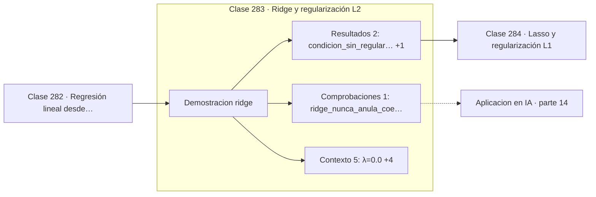

# 283 — Ridge y regularización L2

> [⬅️ 282 Regresión lineal desde mínimos cuadrados](../282-regresion-lineal-desde-minimos-cuadrados/README.md) · [📚 Parte 14](../README.md) · [🏠 Programa](../../../README.md) · [284 Lasso y regularización L1 ➡️](../284-lasso-y-regularizacion-l1/README.md)

**Parte:** 14 — Matemática de Machine Learning · **Nivel:** `ml-avanzado` · **Horas estimadas:** 4
**Motor:** `engines.part14` · **Demostración:** `ridge` · **Clase 3 de 20** de la parte

---

## 🎯 Propósito

**Ridge encoge los coeficientes y con ello arregla el mal condicionamiento.**

Derivación matemática de los algoritmos clásicos: regresión, regularización, clasificación, kernels, árboles, ensambles, clustering, EM y compromiso sesgo-varianza.

## ✅ Resultados de aprendizaje

Al terminar podrás:

1. Explicar **Ridge y regularización L2** con lenguaje cotidiano y con notación matemática.
2. Resolver un caso pequeño a mano y anticipar el orden de magnitud del resultado.
3. Ejecutar y modificar `lab.py`, que corre la demostración `ridge`.
4. Interpretar las 8 salidas del laboratorio y decir qué comprueba cada una.
5. Detectar el error típico de esta parte: interpretar coeficientes de un modelo con features correlacionadas.

## 🧩 Fórmulas de la clase

```text
J(w) = ‖Xw − y‖² + λ‖w‖²
solución: w = (XᵀX + λI)⁻¹Xᵀy
sumar λI mejora el número de condición
```

## 🗺️ Ubicación en el programa



## 📖 Fundamentos

Ridge añade a la regresión una penalización proporcional a la suma de los cuadrados de los
coeficientes. El efecto es encoger todos los coeficientes hacia cero, con más intensidad
cuanto mayor sea `λ`, sin anular ninguno.

La solución cerrada revela algo elegante: el término de regularización aparece como `λI`
sumado a `XᵀX`. Eso **desplaza todos los autovalores hacia arriba** en `λ`, lo que mejora
el número de condición y garantiza que la matriz sea invertible aunque `XᵀX` fuera
singular. Ridge resuelve un problema numérico y un problema estadístico con la misma
operación.

El problema estadístico es la colinealidad. Cuando dos características están muy
correlacionadas, sus coeficientes individuales quedan mal determinados: pueden compensarse
con valores enormes y de signo opuesto sin que el ajuste empeore. Ridge penaliza esa
magnitud y reparte el peso entre ambas de forma estable.

Dos precauciones que importan. Primera: hay que **estandarizar** antes, porque la
penalización depende de la escala y una característica medida en milímetros recibiría un
trato distinto que la misma en metros. Segunda: el **término independiente no se
regulariza**, porque encogerlo no tiene sentido —solo desplaza el nivel— y sesgaría las
predicciones.

## 🧮 Ejemplo trabajado

Efecto de λ sobre coeficientes, error y condicionamiento.

```text
  λ         pesos                        ‖w‖₂
 0,0   [2,032145 ; 1,488677 ; −0,353039]  2,5437
 0,1   [2,022454 ; 1,490112 ; −0,351255]  2,5366
 1,0   [1,944037 ; 1,497998 ; −0,328931]  2,4762
10,0   [1,473261 ; 1,486815 ; −0,080571]  2,0947

Ningún coeficiente llega a ser exactamente cero.

Número de condición:
  sin regularizar: 364,65
  con λ = 1:       258,72

La regularización estabiliza el problema numérico
además de controlar el sobreajuste.
```

## 🔬 Qué ejecuta el laboratorio

`ridge` — Ridge: L2 encoge los coeficientes y estabiliza el mal condicionamiento.

| Grupo | Salidas |
|---|---|
| 🔢 Resultados numéricos (2) | `condicion_sin_regularizar`, `condicion_con_λ=1` |
| ✅ Comprobaciones de invariante (1) | `ridge_nunca_anula_coeficientes` |

Las claves booleanas no son adorno: si alguna fuera `False`, el resultado numérico
no sería fiable aunque el programa terminase sin error.

```bash
python classes/part-14-matematica-de-machine-learning/283-ridge-y-regularizacion-l2/lab.py
compmath run 283
```

> [!TIP]
> Antes de ejecutar, **escribe tu predicción**. Un laboratorio que confirma lo que
> esperabas enseña tanto como uno que te contradice, pero solo si la predicción
> existía antes del resultado.

## ⚠️ Errores conceptuales frecuentes

1. Aplicar Ridge sin estandarizar las características.
2. Regularizar también el término independiente.
3. Esperar que Ridge produzca coeficientes nulos.

## 🚀 Dónde se usa de verdad

Regresión con características correlacionadas, weight decay en redes, estabilización de
problemas mal condicionados y regularización por defecto.

## 🤖 Conexión con IA

Estos algoritmos siguen siendo la línea base honesta contra la que se debe comparar cualquier modelo profundo.

## 📓 Notebooks

| Archivo | Para qué |
|---|---|
| [`notebook.ipynb`](notebook.ipynb) | recorrido guiado con la demostración ejecutada |
| [`notebook_student.ipynb`](notebook_student.ipynb) | versión con `TODO` para resolver |
| [`notebook_solution.ipynb`](notebook_solution.ipynb) | solución de referencia verificada |

## 📝 Evaluación

| Criterio | Peso |
|---|---:|
| Comprensión conceptual | 25 % |
| Resolución manual | 25 % |
| Implementación y verificación | 25 % |
| Interpretación y comunicación | 15 % |
| Conexión con aplicación real | 10 % |

Detalle y criterios de error crítico en [`assessment.md`](assessment.md).

## ❓ Preguntas de comprobación

1. ¿Cuál es la entrada, cuál la salida y qué unidades tienen?
2. ¿Qué operación domina el comportamiento del resultado?
3. ¿Qué caso extremo revelaría un error conceptual?
4. ¿Cómo verificarías el resultado por un método independiente?
5. ¿Dónde aparece esto en scoring crediticio?

Si necesitas releer el código para responderlas, la clase todavía no está superada.

## 📥 Entregable

`notebook_student.ipynb` resuelto más un párrafo que explique el resultado **sin citar
código**: qué entra, qué sale, qué invariante se comprueba y qué pasaría en un caso límite.

## 🔗 Referencias

- [Hoerl, A.; Kennard, R. *Ridge regression: biased estimation for nonorthogonal problems*, Technometrics, 1970](https://doi.org/10.1080/00401706.1970.10488634) — *uso:* artículo de origen consultado en «Ridge y regularización L2».
- [Hastie, T.; Tibshirani, R.; Friedman, J. *The Elements of Statistical Learning*, 2ª ed., Springer, 2009, cap. 3](https://hastie.su.domains/ElemStatLearn/) — *uso:* obra de referencia consultada en «Ridge y regularización L2».

Bibliografía completa de la parte en [`../../../docs/BIBLIOGRAPHY.md`](../../../docs/BIBLIOGRAPHY.md) · localizador verificable de cada obra en [`sources/bibliography.json`](../../../sources/bibliography.json).

## 📂 Material de la clase

[`intuition.md`](intuition.md) · [`theory.md`](theory.md) · [`derivation.md`](derivation.md) · [`exercises.md`](exercises.md) · [`assessment.md`](assessment.md) · [`where-is-this-used.md`](where-is-this-used.md) · [`lesson.yaml`](lesson.yaml)

---

> [⬅️ 282 Regresión lineal desde mínimos cuadrados](../282-regresion-lineal-desde-minimos-cuadrados/README.md) · [📚 Parte 14](../README.md) · [🏠 Programa](../../../README.md) · [284 Lasso y regularización L1 ➡️](../284-lasso-y-regularizacion-l1/README.md)
