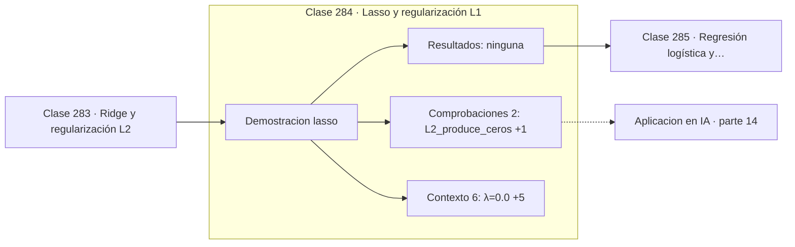

# 284 — Lasso y regularización L1

> [⬅️ 283 Ridge y regularización L2](../283-ridge-y-regularizacion-l2/README.md) · [📚 Parte 14](../README.md) · [🏠 Programa](../../../README.md) · [285 Regresión logística y sigmoid ➡️](../285-regresion-logistica-y-sigmoid/README.md)

**Parte:** 14 — Matemática de Machine Learning · **Nivel:** `ml-avanzado` · **Horas estimadas:** 4
**Motor:** `engines.part14` · **Demostración:** `lasso` · **Clase 4 de 20** de la parte

---

## 🎯 Propósito

**La bola L1 tiene vértices sobre los ejes, y por eso Lasso produce ceros exactos.**

Derivación matemática de los algoritmos clásicos: regresión, regularización, clasificación, kernels, árboles, ensambles, clustering, EM y compromiso sesgo-varianza.

## ✅ Resultados de aprendizaje

Al terminar podrás:

1. Explicar **Lasso y regularización L1** con lenguaje cotidiano y con notación matemática.
2. Resolver un caso pequeño a mano y anticipar el orden de magnitud del resultado.
3. Ejecutar y modificar `lab.py`, que corre la demostración `lasso`.
4. Interpretar las 8 salidas del laboratorio y decir qué comprueba cada una.
5. Detectar el error típico de esta parte: no estandarizar antes de aplicar regularización o k-nn.

## 🧩 Fórmulas de la clase

```text
J(w) = ‖Xw − y‖² + λ‖w‖₁
sin solución cerrada: descenso por coordenadas o subgradiente
λ mayor ⟹ más coeficientes exactamente cero
```

## 🗺️ Ubicación en el programa



## 📖 Fundamentos

Lasso penaliza la suma de valores absolutos en vez de la de cuadrados. El cambio parece
menor y produce un comportamiento cualitativamente distinto: los coeficientes no solo se
encogen, sino que llegan a valer **exactamente cero**, lo que convierte a Lasso en un
selector automático de variables.

La explicación es geométrica y merece verse. La restricción `‖w‖₂ ≤ t` es una bola
redonda; la restricción `‖w‖₁ ≤ t` es un rombo con **vértices sobre los ejes**. La
solución es el punto donde las curvas de nivel del error tocan por primera vez la región
admisible, y una curva de nivel elíptica toca un rombo con muchísima más probabilidad en
un vértice que en una arista. Un vértice del rombo tiene coordenadas nulas.

El precio es que el valor absoluto no es derivable en cero, así que no hay solución cerrada
y hay que recurrir al descenso por coordenadas o a métodos de subgradiente. Es un coste
computacional asumible y ampliamente resuelto en las bibliotecas.

La elección entre Ridge y Lasso depende de lo que se crea del problema. Si se sospecha que
solo unas pocas variables importan, Lasso las encuentra. Si se cree que todas contribuyen
un poco, Ridge es mejor. Con variables muy correlacionadas Lasso elige una arbitrariamente
y descarta el resto, lo que puede ser inestable, y por eso existe **elastic net**, que
combina ambas penalizaciones.

## 🧮 Ejemplo trabajado

Cuatro valores de λ y el número de ceros exactos.

```text
  λ         pesos                          ceros
0,00   [2,031169 ; 1,489542 ; −0,354419]     0
0,05   [2,155953 ; 1,300580 ; −0,006201]     0
0,30   [1,795790 ; 1,377911 ;  0,000000]     1
1,00   [0,774479 ; 1,605474 ;  0,000000]     1

Con λ = 0,30 el tercer coeficiente es exactamente 0,
no un número pequeño: la variable queda eliminada.

Ridge con el mismo λ dejaría −0,0806: pequeño pero no nulo.

Geometría: la bola L1 tiene vértices en los ejes,
y el óptimo cae sobre ellos con alta probabilidad.
```

## 🔬 Qué ejecuta el laboratorio

`lasso` — Lasso: L1 produce ceros exactos gracias a su geometría.

| Grupo | Salidas |
|---|---|
| 🔢 Resultados numéricos (0) | — |
| ✅ Comprobaciones de invariante (2) | `L2_produce_ceros`, `L1_selecciona_features` |

Las claves booleanas no son adorno: si alguna fuera `False`, el resultado numérico
no sería fiable aunque el programa terminase sin error.

```bash
python classes/part-14-matematica-de-machine-learning/284-lasso-y-regularizacion-l1/lab.py
compmath run 284
```

> [!TIP]
> Antes de ejecutar, **escribe tu predicción**. Un laboratorio que confirma lo que
> esperabas enseña tanto como uno que te contradice, pero solo si la predicción
> existía antes del resultado.

## ⚠️ Errores conceptuales frecuentes

1. Aplicar Lasso sin estandarizar las características.
2. Interpretar la selección de Lasso como causalidad.
3. Usar Lasso con variables muy correlacionadas esperando estabilidad.

## 🚀 Dónde se usa de verdad

Selección automática de variables, modelos dispersos, compressed sensing y análisis con
muchas más características que observaciones.

## 🤖 Conexión con IA

Estos algoritmos siguen siendo la línea base honesta contra la que se debe comparar cualquier modelo profundo.

## 📓 Notebooks

| Archivo | Para qué |
|---|---|
| [`notebook.ipynb`](notebook.ipynb) | recorrido guiado con la demostración ejecutada |
| [`notebook_student.ipynb`](notebook_student.ipynb) | versión con `TODO` para resolver |
| [`notebook_solution.ipynb`](notebook_solution.ipynb) | solución de referencia verificada |

## 📝 Evaluación

| Criterio | Peso |
|---|---:|
| Comprensión conceptual | 25 % |
| Resolución manual | 25 % |
| Implementación y verificación | 25 % |
| Interpretación y comunicación | 15 % |
| Conexión con aplicación real | 10 % |

Detalle y criterios de error crítico en [`assessment.md`](assessment.md).

## ❓ Preguntas de comprobación

1. ¿Cuál es la entrada, cuál la salida y qué unidades tienen?
2. ¿Qué operación domina el comportamiento del resultado?
3. ¿Qué caso extremo revelaría un error conceptual?
4. ¿Cómo verificarías el resultado por un método independiente?
5. ¿Dónde aparece esto en scoring crediticio?

Si necesitas releer el código para responderlas, la clase todavía no está superada.

## 📥 Entregable

`notebook_student.ipynb` resuelto más un párrafo que explique el resultado **sin citar
código**: qué entra, qué sale, qué invariante se comprueba y qué pasaría en un caso límite.

## 🔗 Referencias

- [Tibshirani, R. *Regression shrinkage and selection via the lasso*, JRSS-B, 1996](https://doi.org/10.1111/j.2517-6161.1996.tb02080.x) — *uso:* artículo de origen consultado en «Lasso y regularización L1».
- [Zou, H.; Hastie, T. *Regularization and variable selection via the elastic net*, JRSS-B, 2005](https://doi.org/10.1111/j.1467-9868.2005.00503.x) — *uso:* artículo de origen consultado en «Lasso y regularización L1».

Bibliografía completa de la parte en [`../../../docs/BIBLIOGRAPHY.md`](../../../docs/BIBLIOGRAPHY.md) · localizador verificable de cada obra en [`sources/bibliography.json`](../../../sources/bibliography.json).

## 📂 Material de la clase

[`intuition.md`](intuition.md) · [`theory.md`](theory.md) · [`derivation.md`](derivation.md) · [`exercises.md`](exercises.md) · [`assessment.md`](assessment.md) · [`where-is-this-used.md`](where-is-this-used.md) · [`lesson.yaml`](lesson.yaml)

---

> [⬅️ 283 Ridge y regularización L2](../283-ridge-y-regularizacion-l2/README.md) · [📚 Parte 14](../README.md) · [🏠 Programa](../../../README.md) · [285 Regresión logística y sigmoid ➡️](../285-regresion-logistica-y-sigmoid/README.md)
