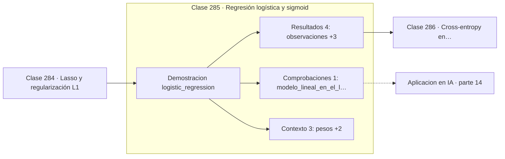

# 285 — Regresión logística y sigmoid

> [⬅️ 284 Lasso y regularización L1](../284-lasso-y-regularizacion-l1/README.md) · [📚 Parte 14](../README.md) · [🏠 Programa](../../../README.md) · [286 Cross-entropy en clasificación ➡️](../286-cross-entropy-en-clasificacion/README.md)

**Parte:** 14 — Matemática de Machine Learning · **Nivel:** `ml-avanzado` · **Horas estimadas:** 4
**Motor:** `engines.part14` · **Demostración:** `logistic_regression` · **Clase 5 de 20** de la parte

---

## 🎯 Propósito

**El gradiente de la regresión logística es (p − y)·x, idéntico en forma al de la lineal.**

Derivación matemática de los algoritmos clásicos: regresión, regularización, clasificación, kernels, árboles, ensambles, clustering, EM y compromiso sesgo-varianza.

## ✅ Resultados de aprendizaje

Al terminar podrás:

1. Explicar **Regresión logística y sigmoid** con lenguaje cotidiano y con notación matemática.
2. Resolver un caso pequeño a mano y anticipar el orden de magnitud del resultado.
3. Ejecutar y modificar `lab.py`, que corre la demostración `logistic_regression`.
4. Interpretar las 8 salidas del laboratorio y decir qué comprueba cada una.
5. Detectar el error típico de esta parte: elegir hiperparámetros con el conjunto de test.

## 🧩 Fórmulas de la clase

```text
σ(z) = 1/(1 + e⁻ᶻ)
P(y=1|x) = σ(wᵀx + b)
∇ = (σ(wᵀx) − y)·x
```

## 🗺️ Ubicación en el programa



## 📖 Fundamentos

La regresión logística resuelve el problema de que una salida lineal puede valer cualquier
número real mientras que una probabilidad debe estar entre 0 y 1. La **sigmoide** hace esa
conversión de forma suave y monótona, y su inversa —el logit— tiene una interpretación
limpia: el logaritmo de la razón de probabilidades es lineal en las características.

Los parámetros se estiman por **máxima verosimilitud**. Bajo un modelo Bernoulli, la
log-verosimilitud negativa es exactamente la entropía cruzada de la clase 263, así que la
pérdida no se elige: se deduce del modelo probabilístico. A diferencia de la regresión
lineal, no hay solución cerrada y hay que iterar.

El resultado más útil de la derivación es la forma del gradiente: `(p − y)·x`, donde `p` es
la probabilidad predicha. Es **idéntico en forma** al de la regresión lineal con error
cuadrático, sustituyendo la predicción por la probabilidad. Esa coincidencia no es
casualidad —ambos son modelos lineales generalizados— y permite implementar los dos casos
con el mismo bucle.

Pese al nombre, es un clasificador y no un regresor. Y pese a su simplicidad sigue siendo
una línea base extraordinariamente competitiva: es interpretable, entrena en segundos, da
probabilidades bien calibradas y en muchos problemas tabulares queda a pocos puntos del
mejor modelo complejo. Empezar por otra cosa suele ser un error.

## 🧮 Ejemplo trabajado

Ochenta observaciones separables en dos dimensiones.

```text
pesos aprendidos: [−3,354299 ; 4,597644 ; 5,088564]
                   (sesgo, w₁, w₂)

accuracy = 1,0
log loss = 0,006853

σ(0) = 0,5   →  la frontera está en wᵀx + b = 0

Gradiente: (σ(wᵀx) − y)·x
  si p = 0,99 y y = 1  →  factor 0,01, corrección mínima
  si p = 0,01 y y = 1  →  factor −0,99, corrección máxima

La misma forma que el gradiente de la regresión lineal,
con p en lugar de ŷ.
```

## 🔬 Qué ejecuta el laboratorio

`logistic_regression` — Regresión logística derivada desde la log-verosimilitud.

| Grupo | Salidas |
|---|---|
| 🔢 Resultados numéricos (4) | `observaciones`, `accuracy`, `log_loss`, `sigmoid(0)` |
| ✅ Comprobaciones de invariante (1) | `modelo_lineal_en_el_log_odds` |

Las claves booleanas no son adorno: si alguna fuera `False`, el resultado numérico
no sería fiable aunque el programa terminase sin error.

```bash
python classes/part-14-matematica-de-machine-learning/285-regresion-logistica-y-sigmoid/lab.py
compmath run 285
```

> [!TIP]
> Antes de ejecutar, **escribe tu predicción**. Un laboratorio que confirma lo que
> esperabas enseña tanto como uno que te contradice, pero solo si la predicción
> existía antes del resultado.

## ⚠️ Errores conceptuales frecuentes

1. Tratarla como un modelo de regresión por su nombre.
2. Aplicarla a datos perfectamente separables sin regularizar: los pesos divergen.
3. Interpretar los coeficientes como probabilidades en vez de como logits.

## 🚀 Dónde se usa de verdad

Clasificación binaria, scoring crediticio, línea base en cualquier problema tabular y capa
de salida de redes neuronales.

## 🤖 Conexión con IA

Estos algoritmos siguen siendo la línea base honesta contra la que se debe comparar cualquier modelo profundo.

## 📓 Notebooks

| Archivo | Para qué |
|---|---|
| [`notebook.ipynb`](notebook.ipynb) | recorrido guiado con la demostración ejecutada |
| [`notebook_student.ipynb`](notebook_student.ipynb) | versión con `TODO` para resolver |
| [`notebook_solution.ipynb`](notebook_solution.ipynb) | solución de referencia verificada |

## 📝 Evaluación

| Criterio | Peso |
|---|---:|
| Comprensión conceptual | 25 % |
| Resolución manual | 25 % |
| Implementación y verificación | 25 % |
| Interpretación y comunicación | 15 % |
| Conexión con aplicación real | 10 % |

Detalle y criterios de error crítico en [`assessment.md`](assessment.md).

## ❓ Preguntas de comprobación

1. ¿Cuál es la entrada, cuál la salida y qué unidades tienen?
2. ¿Qué operación domina el comportamiento del resultado?
3. ¿Qué caso extremo revelaría un error conceptual?
4. ¿Cómo verificarías el resultado por un método independiente?
5. ¿Dónde aparece esto en scoring crediticio?

Si necesitas releer el código para responderlas, la clase todavía no está superada.

## 📥 Entregable

`notebook_student.ipynb` resuelto más un párrafo que explique el resultado **sin citar
código**: qué entra, qué sale, qué invariante se comprueba y qué pasaría en un caso límite.

## 🔗 Referencias

- [Hastie, T.; Tibshirani, R.; Friedman, J. *The Elements of Statistical Learning*, 2ª ed., Springer, 2009, cap. 4](https://hastie.su.domains/ElemStatLearn/)
- [Murphy, K. *Probabilistic Machine Learning: An Introduction*, MIT Press, 2022, cap. 10](https://probml.github.io/pml-book/book1.html)

Bibliografía completa de la parte en [`../../../docs/BIBLIOGRAPHY.md`](../../../docs/BIBLIOGRAPHY.md).

## 📂 Material de la clase

[`intuition.md`](intuition.md) · [`theory.md`](theory.md) · [`derivation.md`](derivation.md) · [`exercises.md`](exercises.md) · [`assessment.md`](assessment.md) · [`where-is-this-used.md`](where-is-this-used.md) · [`lesson.yaml`](lesson.yaml)

---

> [⬅️ 284 Lasso y regularización L1](../284-lasso-y-regularizacion-l1/README.md) · [📚 Parte 14](../README.md) · [🏠 Programa](../../../README.md) · [286 Cross-entropy en clasificación ➡️](../286-cross-entropy-en-clasificacion/README.md)
