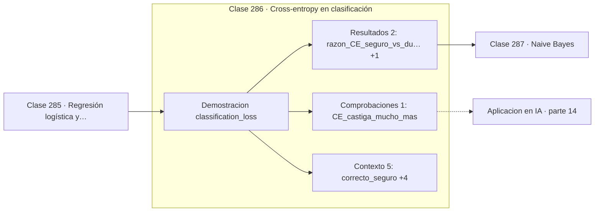

# 286 — Cross-entropy en clasificación

> [⬅️ 285 Regresión logística y sigmoid](../285-regresion-logistica-y-sigmoid/README.md) · [📚 Parte 14](../README.md) · [🏠 Programa](../../../README.md) · [287 Naive Bayes ➡️](../287-naive-bayes/README.md)

**Parte:** 14 — Matemática de Machine Learning · **Nivel:** `ml-avanzado` · **Horas estimadas:** 4
**Motor:** `engines.part14` · **Demostración:** `classification_loss` · **Clase 6 de 20** de la parte

---

## 🎯 Propósito

**Estar seguro y equivocado cuesta sin límite con entropía cruzada, y poco con error cuadrático.**

Derivación matemática de los algoritmos clásicos: regresión, regularización, clasificación, kernels, árboles, ensambles, clustering, EM y compromiso sesgo-varianza.

## ✅ Resultados de aprendizaje

Al terminar podrás:

1. Explicar **Cross-entropy en clasificación** con lenguaje cotidiano y con notación matemática.
2. Resolver un caso pequeño a mano y anticipar el orden de magnitud del resultado.
3. Ejecutar y modificar `lab.py`, que corre la demostración `classification_loss`.
4. Interpretar las 8 salidas del laboratorio y decir qué comprueba cada una.
5. Detectar el error típico de esta parte: interpretar coeficientes de un modelo con features correlacionadas.

## 🧩 Fórmulas de la clase

```text
CE = −log p(clase correcta)
MSE = (p − y)²  ≤ 1  siempre
CE → ∞ cuando p → 0
```

## 🗺️ Ubicación en el programa



## 📖 Fundamentos

Comparar entropía cruzada con error cuadrático en clasificación revela por qué la primera
es la elección correcta, y la razón es cuantitativa antes que teórica: **cómo penalizan la
confianza equivocada**.

El error cuadrático está acotado. Con probabilidades entre 0 y 1, el error máximo posible
es 1, así que un modelo completamente seguro y completamente equivocado recibe una
penalización finita y modesta. La entropía cruzada, en cambio, **crece sin límite**: si la
probabilidad asignada a la respuesta correcta tiende a cero, la pérdida tiende a infinito.

Ese comportamiento es exactamente el deseable. Un modelo que dice «99 % seguro» y falla
merece un castigo mucho mayor que uno que dice «55 % seguro» y falla, porque la
afirmación era mucho más fuerte. La entropía cruzada codifica esa asimetría y el error
cuadrático la aplana.

Hay además una razón de optimización. Con sigmoide y error cuadrático, el gradiente
contiene la derivada de la sigmoide, que se satura y se hace casi nula cuando la
predicción es extrema: el modelo equivocado y seguro **deja de aprender**. Con entropía
cruzada esa derivada se cancela algebraicamente y el gradiente queda `(p − y)`,
proporcional al error. La elección de pérdida arregla un problema de gradientes, no solo de
interpretación.

## 🧮 Ejemplo trabajado

Cuatro situaciones, dos funciones de pérdida.

```text
caso                    p predicha    CE        MSE
correcto y seguro          0,99     0,01005   0,0001
correcto y dudoso          0,55     0,59784   0,2025
incorrecto y dudoso        0,45     0,79851   0,2025
incorrecto y seguro        0,01     4,60517   0,9801

Razón entre incorrecto-seguro e incorrecto-dudoso:
  entropía cruzada: 5,77×
  error cuadrático: 3,24×

La entropía cruzada castiga mucho más la seguridad
equivocada, que es exactamente lo que se busca.

Y su gradiente no se satura: (p − y), sin factor σ'.
```

## 🔬 Qué ejecuta el laboratorio

`classification_loss` — Cross-entropy penaliza la confianza equivocada de forma no acotada.

| Grupo | Salidas |
|---|---|
| 🔢 Resultados numéricos (2) | `razon_CE_seguro_vs_dudoso`, `razon_MSE_seguro_vs_dudoso` |
| ✅ Comprobaciones de invariante (1) | `CE_castiga_mucho_mas` |

Las claves booleanas no son adorno: si alguna fuera `False`, el resultado numérico
no sería fiable aunque el programa terminase sin error.

```bash
python classes/part-14-matematica-de-machine-learning/286-cross-entropy-en-clasificacion/lab.py
compmath run 286
```

> [!TIP]
> Antes de ejecutar, **escribe tu predicción**. Un laboratorio que confirma lo que
> esperabas enseña tanto como uno que te contradice, pero solo si la predicción
> existía antes del resultado.

## ⚠️ Errores conceptuales frecuentes

1. Usar error cuadrático con salidas sigmoides y sufrir gradientes saturados.
2. Aplicar softmax dos veces cuando la pérdida ya lo incluye.
3. Confundir accuracy con calidad de las probabilidades predichas.

## 🚀 Dónde se usa de verdad

Función de pérdida de todo clasificador, calibración de modelos, entrenamiento de modelos
de lenguaje y evaluación probabilística.

## 🤖 Conexión con IA

Estos algoritmos siguen siendo la línea base honesta contra la que se debe comparar cualquier modelo profundo.

## 📓 Notebooks

| Archivo | Para qué |
|---|---|
| [`notebook.ipynb`](notebook.ipynb) | recorrido guiado con la demostración ejecutada |
| [`notebook_student.ipynb`](notebook_student.ipynb) | versión con `TODO` para resolver |
| [`notebook_solution.ipynb`](notebook_solution.ipynb) | solución de referencia verificada |

## 📝 Evaluación

| Criterio | Peso |
|---|---:|
| Comprensión conceptual | 25 % |
| Resolución manual | 25 % |
| Implementación y verificación | 25 % |
| Interpretación y comunicación | 15 % |
| Conexión con aplicación real | 10 % |

Detalle y criterios de error crítico en [`assessment.md`](assessment.md).

## ❓ Preguntas de comprobación

1. ¿Cuál es la entrada, cuál la salida y qué unidades tienen?
2. ¿Qué operación domina el comportamiento del resultado?
3. ¿Qué caso extremo revelaría un error conceptual?
4. ¿Cómo verificarías el resultado por un método independiente?
5. ¿Dónde aparece esto en scoring crediticio?

Si necesitas releer el código para responderlas, la clase todavía no está superada.

## 📥 Entregable

`notebook_student.ipynb` resuelto más un párrafo que explique el resultado **sin citar
código**: qué entra, qué sale, qué invariante se comprueba y qué pasaría en un caso límite.

## 🔗 Referencias

- [Goodfellow, I.; Bengio, Y.; Courville, A. *Deep Learning*, MIT Press, 2016, cap. 6](https://www.deeplearningbook.org/)
- [Bishop, C. *Pattern Recognition and Machine Learning*, Springer, 2006, cap. 4](https://www.microsoft.com/en-us/research/publication/pattern-recognition-machine-learning/)

Bibliografía completa de la parte en [`../../../docs/BIBLIOGRAPHY.md`](../../../docs/BIBLIOGRAPHY.md).

## 📂 Material de la clase

[`intuition.md`](intuition.md) · [`theory.md`](theory.md) · [`derivation.md`](derivation.md) · [`exercises.md`](exercises.md) · [`assessment.md`](assessment.md) · [`where-is-this-used.md`](where-is-this-used.md) · [`lesson.yaml`](lesson.yaml)

---

> [⬅️ 285 Regresión logística y sigmoid](../285-regresion-logistica-y-sigmoid/README.md) · [📚 Parte 14](../README.md) · [🏠 Programa](../../../README.md) · [287 Naive Bayes ➡️](../287-naive-bayes/README.md)
