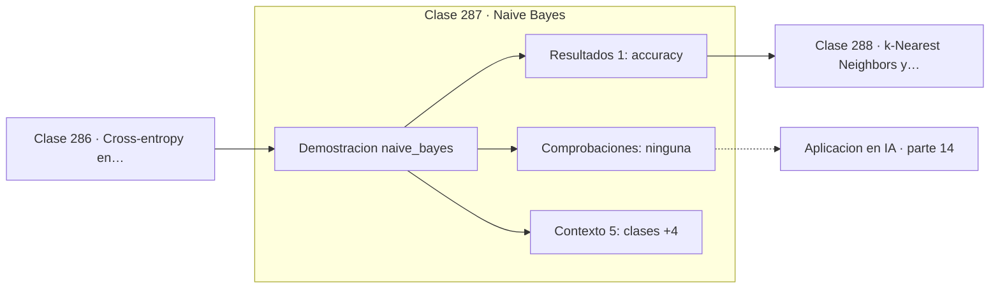

# 287 — Naive Bayes

> [⬅️ 286 Cross-entropy en clasificación](../286-cross-entropy-en-clasificacion/README.md) · [📚 Parte 14](../README.md) · [🏠 Programa](../../../README.md) · [288 k-Nearest Neighbors y métricas ➡️](../288-k-nearest-neighbors-y-metricas/README.md)

**Parte:** 14 — Matemática de Machine Learning · **Nivel:** `ml-avanzado` · **Horas estimadas:** 4
**Motor:** `engines.part14` · **Demostración:** `naive_bayes` · **Clase 7 de 20** de la parte

---

## 🎯 Propósito

**Naive Bayes supone algo falso y clasifica bien, porque solo necesita el orden.**

Derivación matemática de los algoritmos clásicos: regresión, regularización, clasificación, kernels, árboles, ensambles, clustering, EM y compromiso sesgo-varianza.

## ✅ Resultados de aprendizaje

Al terminar podrás:

1. Explicar **Naive Bayes** con lenguaje cotidiano y con notación matemática.
2. Resolver un caso pequeño a mano y anticipar el orden de magnitud del resultado.
3. Ejecutar y modificar `lab.py`, que corre la demostración `naive_bayes`.
4. Interpretar las 6 salidas del laboratorio y decir qué comprueba cada una.
5. Detectar el error típico de esta parte: no estandarizar antes de aplicar regularización o k-nn.

## 🧩 Fórmulas de la clase

```text
P(c|x) ∝ P(c)·Π P(xᵢ|c)
supuesto: independencia condicional dada la clase
se trabaja en logaritmos para evitar subdesbordamiento
```

## 🗺️ Ubicación en el programa



## 📖 Fundamentos

Naive Bayes aplica el teorema de Bayes de la clase 186 a la clasificación, y para hacer el
cálculo tratable supone que las características son **independientes dada la clase**. Ese
supuesto permite factorizar la verosimilitud conjunta en un producto de términos
unidimensionales, que sí se pueden estimar con pocos datos.

El supuesto casi nunca es cierto. En un texto, la aparición de una palabra está claramente
correlacionada con la de otras; en datos médicos, los síntomas se agrupan. Y sin embargo el
clasificador funciona sorprendentemente bien, hecho comprobado durante décadas en filtrado
de spam.

La explicación es que **la clasificación solo necesita el orden**, no el valor. Aunque las
probabilidades estimadas estén mal calibradas —y con el supuesto ingenuo lo están, tienden
a valores extremos—, la clase con mayor probabilidad suele seguir siendo la correcta.
Naive Bayes es mal estimador de probabilidad y buen clasificador, y conviene no usarlo
cuando lo que se necesita es el valor de la probabilidad.

Dos detalles de implementación son obligatorios. Trabajar en **logaritmos**, porque
multiplicar cientos de densidades produce subdesbordamiento a cero. Y aplicar
**suavizado de Laplace**, sumando un pseudo-conteo, para que una categoría nunca vista no
anule toda la probabilidad de la clase con un cero multiplicativo.

## 🧮 Ejemplo trabajado

Naive Bayes gaussiano sobre dos clases y dos características.

```text
clase 0: prior 0,5   medias (−1,1503 ; −1,0020)
                      varianzas (0,5396 ; …)
clase 1: prior 0,5   medias ( 2,1592 ;  1,8087)

accuracy = 1,0

Supuesto: P(x₁,x₂|c) = P(x₁|c)·P(x₂|c)
Aquí se cumple aproximadamente porque las características
se generaron independientes.

Cálculo en logaritmos:
  log P(c|x) = log P(c) + Σ log P(xᵢ|c) + constante
Sin logaritmos, con 100 características el producto
sería del orden de 1e-200 y se redondearía a cero.
```

## 🔬 Qué ejecuta el laboratorio

`naive_bayes` — Naive Bayes gaussiano: independencia condicional como supuesto explícito.

| Grupo | Salidas |
|---|---|
| 🔢 Resultados numéricos (1) | `accuracy` |
| ✅ Comprobaciones de invariante (0) | — |

Las claves booleanas no son adorno: si alguna fuera `False`, el resultado numérico
no sería fiable aunque el programa terminase sin error.

```bash
python classes/part-14-matematica-de-machine-learning/287-naive-bayes/lab.py
compmath run 287
```

> [!TIP]
> Antes de ejecutar, **escribe tu predicción**. Un laboratorio que confirma lo que
> esperabas enseña tanto como uno que te contradice, pero solo si la predicción
> existía antes del resultado.

## ⚠️ Errores conceptuales frecuentes

1. Multiplicar probabilidades en vez de sumar logaritmos.
2. Omitir el suavizado y dejar que un conteo cero anule la clase.
3. Usar sus probabilidades como estimaciones calibradas.

## 🚀 Dónde se usa de verdad

Filtrado de spam, clasificación de texto, diagnóstico rápido con muchas variables y línea
base con pocos datos.

## 🤖 Conexión con IA

Estos algoritmos siguen siendo la línea base honesta contra la que se debe comparar cualquier modelo profundo.

## 📓 Notebooks

| Archivo | Para qué |
|---|---|
| [`notebook.ipynb`](notebook.ipynb) | recorrido guiado con la demostración ejecutada |
| [`notebook_student.ipynb`](notebook_student.ipynb) | versión con `TODO` para resolver |
| [`notebook_solution.ipynb`](notebook_solution.ipynb) | solución de referencia verificada |

## 📝 Evaluación

| Criterio | Peso |
|---|---:|
| Comprensión conceptual | 25 % |
| Resolución manual | 25 % |
| Implementación y verificación | 25 % |
| Interpretación y comunicación | 15 % |
| Conexión con aplicación real | 10 % |

Detalle y criterios de error crítico en [`assessment.md`](assessment.md).

## ❓ Preguntas de comprobación

1. ¿Cuál es la entrada, cuál la salida y qué unidades tienen?
2. ¿Qué operación domina el comportamiento del resultado?
3. ¿Qué caso extremo revelaría un error conceptual?
4. ¿Cómo verificarías el resultado por un método independiente?
5. ¿Dónde aparece esto en scoring crediticio?

Si necesitas releer el código para responderlas, la clase todavía no está superada.

## 📥 Entregable

`notebook_student.ipynb` resuelto más un párrafo que explique el resultado **sin citar
código**: qué entra, qué sale, qué invariante se comprueba y qué pasaría en un caso límite.

## 🔗 Referencias

- [Hastie, T.; Tibshirani, R.; Friedman, J. *The Elements of Statistical Learning*, 2ª ed., Springer, 2009, cap. 6](https://hastie.su.domains/ElemStatLearn/) — *uso:* obra de referencia consultada en «Naive Bayes».
- [Domingos, P.; Pazzani, M. *On the optimality of the simple Bayesian classifier*, Machine Learning, 1997](https://doi.org/10.1023/A:1007413511361) — *uso:* artículo de origen consultado en «Naive Bayes».

Bibliografía completa de la parte en [`../../../docs/BIBLIOGRAPHY.md`](../../../docs/BIBLIOGRAPHY.md) · localizador verificable de cada obra en [`sources/bibliography.json`](../../../sources/bibliography.json).

## 📂 Material de la clase

[`intuition.md`](intuition.md) · [`theory.md`](theory.md) · [`derivation.md`](derivation.md) · [`exercises.md`](exercises.md) · [`assessment.md`](assessment.md) · [`where-is-this-used.md`](where-is-this-used.md) · [`lesson.yaml`](lesson.yaml)

---

> [⬅️ 286 Cross-entropy en clasificación](../286-cross-entropy-en-clasificacion/README.md) · [📚 Parte 14](../README.md) · [🏠 Programa](../../../README.md) · [288 k-Nearest Neighbors y métricas ➡️](../288-k-nearest-neighbors-y-metricas/README.md)
