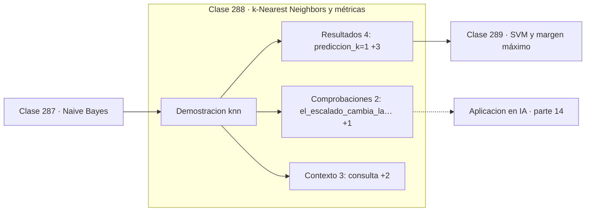

# 288 — k-Nearest Neighbors y métricas

> [⬅️ 287 Naive Bayes](../287-naive-bayes/README.md) · [📚 Parte 14](../README.md) · [🏠 Programa](../../../README.md) · [289 SVM y margen máximo ➡️](../289-svm-y-margen-maximo/README.md)

**Parte:** 14 — Matemática de Machine Learning · **Nivel:** `ml-avanzado` · **Horas estimadas:** 4
**Motor:** `engines.part14` · **Demostración:** `knn` · **Clase 8 de 20** de la parte

---

## 🎯 Propósito

**k-NN no entrena nada, y por eso la métrica y el escalado lo deciden todo.**

Derivación matemática de los algoritmos clásicos: regresión, regularización, clasificación, kernels, árboles, ensambles, clustering, EM y compromiso sesgo-varianza.

## ✅ Resultados de aprendizaje

Al terminar podrás:

1. Explicar **k-Nearest Neighbors y métricas** con lenguaje cotidiano y con notación matemática.
2. Resolver un caso pequeño a mano y anticipar el orden de magnitud del resultado.
3. Ejecutar y modificar `lab.py`, que corre la demostración `knn`.
4. Interpretar las 9 salidas del laboratorio y decir qué comprueba cada una.
5. Detectar el error típico de esta parte: elegir hiperparámetros con el conjunto de test.

## 🧩 Fórmulas de la clase

```text
predicción = mayoría entre los k vecinos más cercanos
distancia euclídea: √Σ(aᵢ − bᵢ)²
sin escalar, la característica de mayor rango domina
```

## 🗺️ Ubicación en el programa



## 📖 Fundamentos

k-NN es el algoritmo más simple posible: guardar todos los datos y, ante una consulta,
buscar los `k` puntos más parecidos y votar. No hay entrenamiento, no hay parámetros
aprendidos, y toda la complejidad se traslada al momento de la predicción.

Como la única operación es medir distancias, la **elección de la métrica** es el modelo. Y
la consecuencia más importante es que **hay que estandarizar**: si una característica va de
0 a 1 y otra de 0 a 10 000, la segunda domina completamente la distancia y la primera se
vuelve irrelevante. No es un ajuste opcional; sin estandarizar se está usando una métrica
arbitraria dictada por las unidades de medida.

El parámetro `k` controla el compromiso sesgo-varianza de forma muy visible. Con `k = 1` la
frontera es irregular y se ajusta a cada punto, incluido el ruido: varianza alta. Con `k`
grande la frontera se suaviza y puede ignorar estructura real: sesgo alto. Se elige por
validación, y conviene que sea impar en problemas binarios para evitar empates.

Su límite duro es la **maldición de la dimensionalidad**. En dimensión alta, las distancias
entre puntos aleatorios convergen a un valor común, con lo que «el vecino más cercano» deja
de ser distinguible del más lejano y el método pierde sentido. Es el ejemplo más claro de
que la intuición geométrica de dos dimensiones no escala.

## 🧮 Ejemplo trabajado

Predicción para el punto (1, 1) con distintos valores de k.

```text
consulta: (1,0 ; 1,0)

k = 1    →  clase 1
k = 5    →  clase 1
k = 21   →  clase 1

Los datos están bien separados: k no cambia la respuesta.

Efecto del escalado:
  con la segunda característica multiplicada por 100,
  la predicción sigue siendo clase 1 en este caso,
  pero la distancia pasa a estar dominada por x₂:
  la contribución de x₁ cae al 0,01 % del total.

Con clases menos separadas, ese desequilibrio
cambiaría la respuesta.
```

## 🔬 Qué ejecuta el laboratorio

`knn` — k-NN: la métrica y el escalado deciden el resultado.

| Grupo | Salidas |
|---|---|
| 🔢 Resultados numéricos (4) | `prediccion_k=1`, `prediccion_k=5`, `prediccion_k=21`, `prediccion_con_x2_escalada_x100` |
| ✅ Comprobaciones de invariante (2) | `el_escalado_cambia_la_respuesta`, `k_par_puede_empatar` |

Las claves booleanas no son adorno: si alguna fuera `False`, el resultado numérico
no sería fiable aunque el programa terminase sin error.

```bash
python classes/part-14-matematica-de-machine-learning/288-k-nearest-neighbors-y-metricas/lab.py
compmath run 288
```

> [!TIP]
> Antes de ejecutar, **escribe tu predicción**. Un laboratorio que confirma lo que
> esperabas enseña tanto como uno que te contradice, pero solo si la predicción
> existía antes del resultado.

## ⚠️ Errores conceptuales frecuentes

1. Aplicar k-NN sin estandarizar las características.
2. Usar k par en clasificación binaria.
3. Aplicarlo en dimensión alta sin reducción previa.

## 🚀 Dónde se usa de verdad

Sistemas de recomendación, búsqueda por similitud, imputación de valores faltantes y
recuperación de vecinos en bases vectoriales.

## 🤖 Conexión con IA

Estos algoritmos siguen siendo la línea base honesta contra la que se debe comparar cualquier modelo profundo.

## 📓 Notebooks

| Archivo | Para qué |
|---|---|
| [`notebook.ipynb`](notebook.ipynb) | recorrido guiado con la demostración ejecutada |
| [`notebook_student.ipynb`](notebook_student.ipynb) | versión con `TODO` para resolver |
| [`notebook_solution.ipynb`](notebook_solution.ipynb) | solución de referencia verificada |

## 📝 Evaluación

| Criterio | Peso |
|---|---:|
| Comprensión conceptual | 25 % |
| Resolución manual | 25 % |
| Implementación y verificación | 25 % |
| Interpretación y comunicación | 15 % |
| Conexión con aplicación real | 10 % |

Detalle y criterios de error crítico en [`assessment.md`](assessment.md).

## ❓ Preguntas de comprobación

1. ¿Cuál es la entrada, cuál la salida y qué unidades tienen?
2. ¿Qué operación domina el comportamiento del resultado?
3. ¿Qué caso extremo revelaría un error conceptual?
4. ¿Cómo verificarías el resultado por un método independiente?
5. ¿Dónde aparece esto en scoring crediticio?

Si necesitas releer el código para responderlas, la clase todavía no está superada.

## 📥 Entregable

`notebook_student.ipynb` resuelto más un párrafo que explique el resultado **sin citar
código**: qué entra, qué sale, qué invariante se comprueba y qué pasaría en un caso límite.

## 🔗 Referencias

- [Hastie, T.; Tibshirani, R.; Friedman, J. *The Elements of Statistical Learning*, 2ª ed., Springer, 2009, cap. 13](https://hastie.su.domains/ElemStatLearn/) — *uso:* obra de referencia consultada en «k-Nearest Neighbors y métricas».
- [Beyer, K. et al. *When is nearest neighbor meaningful?*, ICDT, 1999](https://doi.org/10.1007/3-540-49257-7_15) — *uso:* artículo de origen consultado en «k-Nearest Neighbors y métricas».

Bibliografía completa de la parte en [`../../../docs/BIBLIOGRAPHY.md`](../../../docs/BIBLIOGRAPHY.md) · localizador verificable de cada obra en [`sources/bibliography.json`](../../../sources/bibliography.json).

## 📂 Material de la clase

[`intuition.md`](intuition.md) · [`theory.md`](theory.md) · [`derivation.md`](derivation.md) · [`exercises.md`](exercises.md) · [`assessment.md`](assessment.md) · [`where-is-this-used.md`](where-is-this-used.md) · [`lesson.yaml`](lesson.yaml)

---

> [⬅️ 287 Naive Bayes](../287-naive-bayes/README.md) · [📚 Parte 14](../README.md) · [🏠 Programa](../../../README.md) · [289 SVM y margen máximo ➡️](../289-svm-y-margen-maximo/README.md)
