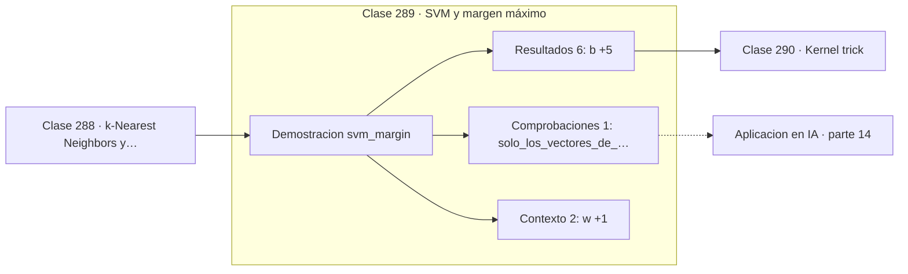

# 289 — SVM y margen máximo

> [⬅️ 288 k-Nearest Neighbors y métricas](../288-k-nearest-neighbors-y-metricas/README.md) · [📚 Parte 14](../README.md) · [🏠 Programa](../../../README.md) · [290 Kernel trick ➡️](../290-kernel-trick/README.md)

**Parte:** 14 — Matemática de Machine Learning · **Nivel:** `ml-avanzado` · **Horas estimadas:** 4
**Motor:** `engines.part14` · **Demostración:** `svm_margin` · **Clase 9 de 20** de la parte

---

## 🎯 Propósito

**Maximizar el margen equivale a minimizar la norma de w, y solo unos pocos puntos deciden.**

Derivación matemática de los algoritmos clásicos: regresión, regularización, clasificación, kernels, árboles, ensambles, clustering, EM y compromiso sesgo-varianza.

## ✅ Resultados de aprendizaje

Al terminar podrás:

1. Explicar **SVM y margen máximo** con lenguaje cotidiano y con notación matemática.
2. Resolver un caso pequeño a mano y anticipar el orden de magnitud del resultado.
3. Ejecutar y modificar `lab.py`, que corre la demostración `svm_margin`.
4. Interpretar las 9 salidas del laboratorio y decir qué comprueba cada una.
5. Detectar el error típico de esta parte: interpretar coeficientes de un modelo con features correlacionadas.

## 🧩 Fórmulas de la clase

```text
frontera: wᵀx + b = 0
ancho del margen = 2/‖w‖
minimizar ‖w‖²  sujeto a  yᵢ(wᵀxᵢ + b) ≥ 1
```

## 🗺️ Ubicación en el programa



## 📖 Fundamentos

Cuando dos clases son separables hay infinitos hiperplanos que las separan. SVM elige uno
con un criterio concreto: el que deja el **margen más ancho** a ambos lados. La intuición
es que un margen amplio es más robusto ante datos nuevos ligeramente desplazados.

La formalización es bonita. Si se normaliza para que los puntos más cercanos cumplan
`|wᵀx + b| = 1`, el ancho del margen resulta ser `2/‖w‖`. Maximizar el margen es por tanto
**minimizar `‖w‖`**, y el problema completo es un programa cuadrático con restricciones
lineales: exactamente la clase 258.

La propiedad más característica es que la solución depende únicamente de los **vectores de
soporte**, los puntos que tocan el margen. Todos los demás podrían eliminarse del conjunto
de entrenamiento sin que la frontera cambiara. Eso hace el modelo compacto y explica su
buen comportamiento con conjuntos pequeños.

Con clases no separables se introduce el **margen blando**: variables de holgura que
permiten violaciones penalizadas, con un parámetro `C` que regula el compromiso entre
margen ancho y errores tolerados. Combinado con el kernel de la clase siguiente, SVM fue
el método dominante en clasificación entre 1995 y 2012.

## 🧮 Ejemplo trabajado

SVM lineal sobre dos clases separables.

```text
w = (1,151743 ; 1,007988)      b = −0,82

‖w‖ = 1,53054
ancho del margen = 2/‖w‖ = 1,306729

vectores de soporte: 3
accuracy = 1,0

Solo 3 de las 80 observaciones determinan la frontera.
Las otras 77 podrían borrarse sin cambiar nada.

Si se quisiera un margen más ancho habría que reducir ‖w‖,
pero entonces las restricciones yᵢ(wᵀxᵢ+b) ≥ 1 dejarían
de cumplirse: el óptimo es el equilibrio exacto.
```

## 🔬 Qué ejecuta el laboratorio

`svm_margin` — SVM: maximizar el margen equivale a minimizar ‖w‖.

| Grupo | Salidas |
|---|---|
| 🔢 Resultados numéricos (6) | `b`, `norma_de_w`, `ancho_del_margen_2/|w|`, `vectores_de_soporte`, `accuracy`, `hinge_loss` |
| ✅ Comprobaciones de invariante (1) | `solo_los_vectores_de_soporte_definen_la_frontera` |

Las claves booleanas no son adorno: si alguna fuera `False`, el resultado numérico
no sería fiable aunque el programa terminase sin error.

```bash
python classes/part-14-matematica-de-machine-learning/289-svm-y-margen-maximo/lab.py
compmath run 289
```

> [!TIP]
> Antes de ejecutar, **escribe tu predicción**. Un laboratorio que confirma lo que
> esperabas enseña tanto como uno que te contradice, pero solo si la predicción
> existía antes del resultado.

## ⚠️ Errores conceptuales frecuentes

1. Aplicar SVM sin estandarizar, ya que el margen depende de la escala.
2. Usar margen duro con datos ruidosos o no separables.
3. Elegir C sin validación cruzada.

## 🚀 Dónde se usa de verdad

Clasificación con pocos datos y muchas características, bioinformática, clasificación de
texto y detección de anomalías con SVM de una clase.

## 🤖 Conexión con IA

Estos algoritmos siguen siendo la línea base honesta contra la que se debe comparar cualquier modelo profundo.

## 📓 Notebooks

| Archivo | Para qué |
|---|---|
| [`notebook.ipynb`](notebook.ipynb) | recorrido guiado con la demostración ejecutada |
| [`notebook_student.ipynb`](notebook_student.ipynb) | versión con `TODO` para resolver |
| [`notebook_solution.ipynb`](notebook_solution.ipynb) | solución de referencia verificada |

## 📝 Evaluación

| Criterio | Peso |
|---|---:|
| Comprensión conceptual | 25 % |
| Resolución manual | 25 % |
| Implementación y verificación | 25 % |
| Interpretación y comunicación | 15 % |
| Conexión con aplicación real | 10 % |

Detalle y criterios de error crítico en [`assessment.md`](assessment.md).

## ❓ Preguntas de comprobación

1. ¿Cuál es la entrada, cuál la salida y qué unidades tienen?
2. ¿Qué operación domina el comportamiento del resultado?
3. ¿Qué caso extremo revelaría un error conceptual?
4. ¿Cómo verificarías el resultado por un método independiente?
5. ¿Dónde aparece esto en scoring crediticio?

Si necesitas releer el código para responderlas, la clase todavía no está superada.

## 📥 Entregable

`notebook_student.ipynb` resuelto más un párrafo que explique el resultado **sin citar
código**: qué entra, qué sale, qué invariante se comprueba y qué pasaría en un caso límite.

## 🔗 Referencias

- [Cortes, C.; Vapnik, V. *Support-vector networks*, Machine Learning, 1995](https://doi.org/10.1007/BF00994018)
- [Bishop, C. *Pattern Recognition and Machine Learning*, Springer, 2006, cap. 7](https://www.microsoft.com/en-us/research/publication/pattern-recognition-machine-learning/)

Bibliografía completa de la parte en [`../../../docs/BIBLIOGRAPHY.md`](../../../docs/BIBLIOGRAPHY.md).

## 📂 Material de la clase

[`intuition.md`](intuition.md) · [`theory.md`](theory.md) · [`derivation.md`](derivation.md) · [`exercises.md`](exercises.md) · [`assessment.md`](assessment.md) · [`where-is-this-used.md`](where-is-this-used.md) · [`lesson.yaml`](lesson.yaml)

---

> [⬅️ 288 k-Nearest Neighbors y métricas](../288-k-nearest-neighbors-y-metricas/README.md) · [📚 Parte 14](../README.md) · [🏠 Programa](../../../README.md) · [290 Kernel trick ➡️](../290-kernel-trick/README.md)
