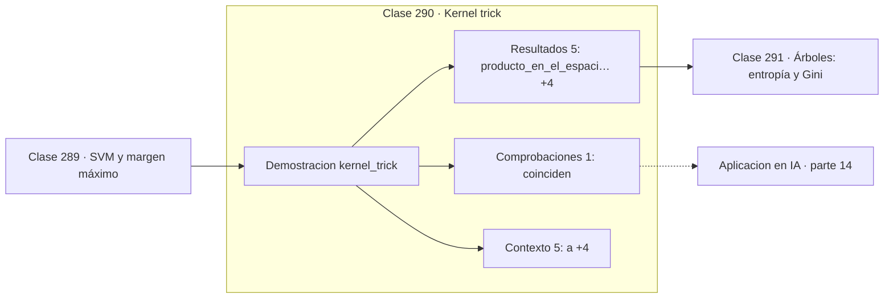

# 290 — Kernel trick

> [⬅️ 289 SVM y margen máximo](../289-svm-y-margen-maximo/README.md) · [📚 Parte 14](../README.md) · [🏠 Programa](../../../README.md) · [291 Árboles: entropía y Gini ➡️](../291-arboles-entropia-y-gini/README.md)

**Parte:** 14 — Matemática de Machine Learning · **Nivel:** `ml-avanzado` · **Horas estimadas:** 4
**Motor:** `engines.part14` · **Demostración:** `kernel_trick` · **Clase 10 de 20** de la parte

---

## 🎯 Propósito

**El kernel calcula el producto escalar en el espacio expandido sin construirlo nunca.**

Derivación matemática de los algoritmos clásicos: regresión, regularización, clasificación, kernels, árboles, ensambles, clustering, EM y compromiso sesgo-varianza.

## ✅ Resultados de aprendizaje

Al terminar podrás:

1. Explicar **Kernel trick** con lenguaje cotidiano y con notación matemática.
2. Resolver un caso pequeño a mano y anticipar el orden de magnitud del resultado.
3. Ejecutar y modificar `lab.py`, que corre la demostración `kernel_trick`.
4. Interpretar las 11 salidas del laboratorio y decir qué comprueba cada una.
5. Detectar el error típico de esta parte: no estandarizar antes de aplicar regularización o k-nn.

## 🧩 Fórmulas de la clase

```text
K(a,b) = φ(a)ᵀφ(b)
kernel polinómico: K(a,b) = (aᵀb + c)^d
kernel RBF: K(a,b) = exp(−γ‖a−b‖²)
```

## 🗺️ Ubicación en el programa



## 📖 Fundamentos

Cuando los datos no son linealmente separables, una salida es transformarlos a un espacio
de mayor dimensión donde sí lo sean. El problema es que ese espacio crece muy rápido: un
polinomio de grado 3 sobre 100 características genera del orden de 170 000 términos, y
calcularlos explícitamente es inviable.

El **kernel trick** observa que muchos algoritmos —SVM, PCA, regresión ridge— solo usan los
datos a través de **productos escalares**. Si existe una función `K(a,b)` que devuelve
directamente el producto escalar en el espacio expandido, nunca hace falta construir ese
espacio. Se sustituyen los productos escalares por llamadas al kernel y todo funciona.

El ejemplo mínimo lo hace evidente: para el kernel polinómico de grado 2, calcular
`(aᵀb)²` cuesta una multiplicación y una potencia, mientras que expandir a `φ` y hacer el
producto en el espacio expandido cuesta bastante más y da exactamente el mismo número.

El caso extremo es el **kernel RBF**, que corresponde a un espacio de características de
dimensión **infinita** y aun así se evalúa con una exponencial. El teorema de Mercer
caracteriza qué funciones son kernels válidos: aquellas cuya matriz de Gram es siempre
semidefinida positiva. Toda la maquinaria de los procesos gaussianos se apoya en esta misma
idea.

## 🧮 Ejemplo trabajado

Kernel polinómico de grado 2 frente al espacio expandido.

```text
a = (1, 2)       b = (3, 4)

Expansión explícita:
  φ(x) = (x₁², √2·x₁x₂, x₂²)
  φ(a) = (1,0 ; 2,828427 ; 4,0)
  φ(b) = (9,0 ; 16,970563 ; 16,0)

producto en el espacio expandido:
  1·9 + 2,828427·16,970563 + 4·16 = 121,0

Kernel directo:
  (aᵀb)² = (1·3 + 2·4)² = 11² = 121,0

Coinciden                                            ✓

Con d = 3 y 100 características, la expansión tendría
unos 170 000 términos; el kernel sigue costando lo mismo.
```

## 🔬 Qué ejecuta el laboratorio

`kernel_trick` — El kernel calcula el producto punto sin construir el espacio.

| Grupo | Salidas |
|---|---|
| 🔢 Resultados numéricos (5) | `producto_en_el_espacio_expandido`, `kernel_polinomico_(aᵀb)²`, `dimension_explicita`, `operaciones_kernel`, `kernel_RBF` |
| ✅ Comprobaciones de invariante (1) | `coinciden` |

Las claves booleanas no son adorno: si alguna fuera `False`, el resultado numérico
no sería fiable aunque el programa terminase sin error.

```bash
python classes/part-14-matematica-de-machine-learning/290-kernel-trick/lab.py
compmath run 290
```

> [!TIP]
> Antes de ejecutar, **escribe tu predicción**. Un laboratorio que confirma lo que
> esperabas enseña tanto como uno que te contradice, pero solo si la predicción
> existía antes del resultado.

## ⚠️ Errores conceptuales frecuentes

1. Construir explícitamente el espacio de características cuando hay kernel.
2. Usar RBF sin estandarizar ni ajustar γ.
3. Aplicar como kernel una función que no es semidefinida positiva.

## 🚀 Dónde se usa de verdad

SVM no lineales, procesos gaussianos, PCA con kernel, métodos espectrales y análisis de
similitud entre estructuras complejas.

## 🤖 Conexión con IA

Estos algoritmos siguen siendo la línea base honesta contra la que se debe comparar cualquier modelo profundo.

## 📓 Notebooks

| Archivo | Para qué |
|---|---|
| [`notebook.ipynb`](notebook.ipynb) | recorrido guiado con la demostración ejecutada |
| [`notebook_student.ipynb`](notebook_student.ipynb) | versión con `TODO` para resolver |
| [`notebook_solution.ipynb`](notebook_solution.ipynb) | solución de referencia verificada |

## 📝 Evaluación

| Criterio | Peso |
|---|---:|
| Comprensión conceptual | 25 % |
| Resolución manual | 25 % |
| Implementación y verificación | 25 % |
| Interpretación y comunicación | 15 % |
| Conexión con aplicación real | 10 % |

Detalle y criterios de error crítico en [`assessment.md`](assessment.md).

## ❓ Preguntas de comprobación

1. ¿Cuál es la entrada, cuál la salida y qué unidades tienen?
2. ¿Qué operación domina el comportamiento del resultado?
3. ¿Qué caso extremo revelaría un error conceptual?
4. ¿Cómo verificarías el resultado por un método independiente?
5. ¿Dónde aparece esto en scoring crediticio?

Si necesitas releer el código para responderlas, la clase todavía no está superada.

## 📥 Entregable

`notebook_student.ipynb` resuelto más un párrafo que explique el resultado **sin citar
código**: qué entra, qué sale, qué invariante se comprueba y qué pasaría en un caso límite.

## 📚 Bibliografía de la clase

Esta clase enseña **Machine learning · Teoría del aprendizaje · Métodos de kernel**. Cada obra dice qué aporta aquí y cómo se comprobó su localizador:

- [Schölkopf, B.; Smola, A. *Learning with Kernels*, MIT Press, 2002](https://mitpress.mit.edu/9780262536578/learning-with-kernels/) — Machine learning y Métodos de kernel: el tema de esta clase · ISBN-13 `9780262536578` verificado en International ISBN Agency (2026-08-19).
- [Bishop, C. *Pattern Recognition and Machine Learning*, Springer, 2006, cap. 6](https://www.microsoft.com/en-us/research/publication/pattern-recognition-machine-learning/) — Machine learning: el tema de esta clase · URL de la fuente primaria comprobada en www.microsoft.com (2026-08-19).

Bibliografía de todas las clases, con el porqué de cada obra, en [`docs/BIBLIOGRAPHY.md`](../../../docs/BIBLIOGRAPHY.md) · localizador y estado de cada obra en [`sources/bibliography.json`](../../../sources/bibliography.json).

## 📂 Material de la clase

[`intuition.md`](intuition.md) · [`theory.md`](theory.md) · [`derivation.md`](derivation.md) · [`exercises.md`](exercises.md) · [`assessment.md`](assessment.md) · [`where-is-this-used.md`](where-is-this-used.md) · [`lesson.yaml`](lesson.yaml)

---

> [⬅️ 289 SVM y margen máximo](../289-svm-y-margen-maximo/README.md) · [📚 Parte 14](../README.md) · [🏠 Programa](../../../README.md) · [291 Árboles: entropía y Gini ➡️](../291-arboles-entropia-y-gini/README.md)
