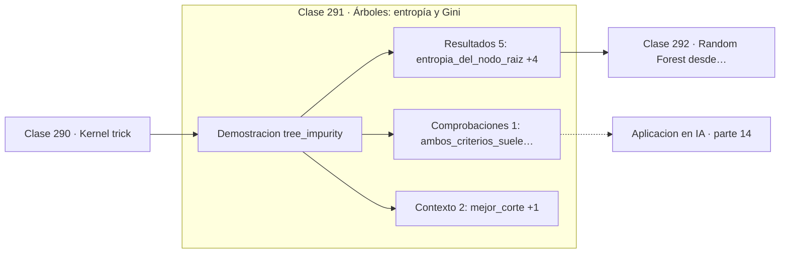

# 291 — Árboles: entropía y Gini

> [⬅️ 290 Kernel trick](../290-kernel-trick/README.md) · [📚 Parte 14](../README.md) · [🏠 Programa](../../../README.md) · [292 Random Forest desde probabilidad ➡️](../292-random-forest-desde-probabilidad/README.md)

**Parte:** 14 — Matemática de Machine Learning · **Nivel:** `ml-avanzado` · **Horas estimadas:** 4
**Motor:** `engines.part14` · **Demostración:** `tree_impurity` · **Clase 11 de 20** de la parte

---

## 🎯 Propósito

**Un árbol elige el corte que más reduce la impureza, y Gini y entropía casi siempre coinciden.**

Derivación matemática de los algoritmos clásicos: regresión, regularización, clasificación, kernels, árboles, ensambles, clustering, EM y compromiso sesgo-varianza.

## ✅ Resultados de aprendizaje

Al terminar podrás:

1. Explicar **Árboles: entropía y Gini** con lenguaje cotidiano y con notación matemática.
2. Resolver un caso pequeño a mano y anticipar el orden de magnitud del resultado.
3. Ejecutar y modificar `lab.py`, que corre la demostración `tree_impurity`.
4. Interpretar las 8 salidas del laboratorio y decir qué comprueba cada una.
5. Detectar el error típico de esta parte: elegir hiperparámetros con el conjunto de test.

## 🧩 Fórmulas de la clase

```text
entropía = −Σ p·log₂ p
Gini = 1 − Σ p²
ganancia = impureza(padre) − Σ (nᵢ/n)·impureza(hijoᵢ)
```

## 🗺️ Ubicación en el programa



## 📖 Fundamentos

Un árbol de decisión parte el espacio con cortes paralelos a los ejes, eligiendo en cada
nodo la característica y el umbral que producen hijos lo más **puros** posible. La
construcción es voraz: se elige el mejor corte local sin garantía de optimalidad global,
porque encontrar el árbol óptimo es un problema NP-completo.

Hay dos medidas habituales de impureza. La **entropía** es la de la clase 262 aplicada a la
distribución de clases del nodo. El **índice de Gini** es la probabilidad de clasificar mal
si se etiquetase al azar según la distribución del nodo. Ambas valen cero en un nodo puro y
son máximas cuando las clases están equilibradas.

En la práctica **rara vez producen árboles distintos**. Gini es ligeramente más rápido
porque evita el logaritmo, y por eso suele ser el valor por defecto. Elegir entre uno y
otro es una de las decisiones menos importantes del modelado, pese a la atención que
recibe.

La virtud del árbol es la interpretabilidad: la secuencia de decisiones se lee como reglas
y se explica a cualquiera. Su defecto es la **inestabilidad**: cambiar unos pocos datos
puede alterar el corte raíz y con él todo el árbol. Esa varianza alta es exactamente lo que
el bagging de la clase siguiente ataca, y lo que hizo de los bosques aleatorios un método
tan superior al árbol individual.

## 🧮 Ejemplo trabajado

Elección del mejor corte en el nodo raíz.

```text
nodo raíz con clases equilibradas:
  entropía = 1,0 bits        Gini = 0,5

cortes evaluados: 28

mejor corte: característica 0, umbral 0,5
  ganancia de información = 0,915219 bits
  Gini tras el corte      = 0,02439

La impureza cae de 0,5 a 0,024: los hijos son
casi puros con un solo corte.

Entropía y Gini eligieron el mismo corte,
como ocurre en la inmensa mayoría de los casos.
```

## 🔬 Qué ejecuta el laboratorio

`tree_impurity` — Entropía y Gini: dos medidas de impureza para elegir el corte.

| Grupo | Salidas |
|---|---|
| 🔢 Resultados numéricos (5) | `entropia_del_nodo_raiz`, `gini_del_nodo_raiz`, `ganancia_de_informacion`, `gini_tras_el_corte`, `cortes_evaluados` |
| ✅ Comprobaciones de invariante (1) | `ambos_criterios_suelen_coincidir` |

Las claves booleanas no son adorno: si alguna fuera `False`, el resultado numérico
no sería fiable aunque el programa terminase sin error.

```bash
python classes/part-14-matematica-de-machine-learning/291-arboles-entropia-y-gini/lab.py
compmath run 291
```

> [!TIP]
> Antes de ejecutar, **escribe tu predicción**. Un laboratorio que confirma lo que
> esperabas enseña tanto como uno que te contradice, pero solo si la predicción
> existía antes del resultado.

## ⚠️ Errores conceptuales frecuentes

1. Dejar crecer el árbol sin límite y sobreajustar.
2. Interpretar la importancia de variables sin considerar su correlación.
3. Debatir entre Gini y entropía en vez de controlar la profundidad.

## 🚀 Dónde se usa de verdad

Modelos interpretables, segmentación de clientes, sistemas de reglas y componente base de
Random Forest y gradient boosting.

## 🤖 Conexión con IA

Estos algoritmos siguen siendo la línea base honesta contra la que se debe comparar cualquier modelo profundo.

## 📓 Notebooks

| Archivo | Para qué |
|---|---|
| [`notebook.ipynb`](notebook.ipynb) | recorrido guiado con la demostración ejecutada |
| [`notebook_student.ipynb`](notebook_student.ipynb) | versión con `TODO` para resolver |
| [`notebook_solution.ipynb`](notebook_solution.ipynb) | solución de referencia verificada |

## 📝 Evaluación

| Criterio | Peso |
|---|---:|
| Comprensión conceptual | 25 % |
| Resolución manual | 25 % |
| Implementación y verificación | 25 % |
| Interpretación y comunicación | 15 % |
| Conexión con aplicación real | 10 % |

Detalle y criterios de error crítico en [`assessment.md`](assessment.md).

## ❓ Preguntas de comprobación

1. ¿Cuál es la entrada, cuál la salida y qué unidades tienen?
2. ¿Qué operación domina el comportamiento del resultado?
3. ¿Qué caso extremo revelaría un error conceptual?
4. ¿Cómo verificarías el resultado por un método independiente?
5. ¿Dónde aparece esto en scoring crediticio?

Si necesitas releer el código para responderlas, la clase todavía no está superada.

## 📥 Entregable

`notebook_student.ipynb` resuelto más un párrafo que explique el resultado **sin citar
código**: qué entra, qué sale, qué invariante se comprueba y qué pasaría en un caso límite.

## 🔗 Referencias

- [Breiman, L. et al. *Classification and Regression Trees*, Wadsworth, 1984](https://doi.org/10.1201/9781315139470) — *uso:* desarrollo formal del tema en «Árboles: entropía y Gini».
- [Hastie, T.; Tibshirani, R.; Friedman, J. *The Elements of Statistical Learning*, 2ª ed., Springer, 2009, cap. 9](https://hastie.su.domains/ElemStatLearn/) — *uso:* obra de referencia consultada en «Árboles: entropía y Gini».

Bibliografía completa de la parte en [`../../../docs/BIBLIOGRAPHY.md`](../../../docs/BIBLIOGRAPHY.md) · localizador verificable de cada obra en [`sources/bibliography.json`](../../../sources/bibliography.json).

## 📂 Material de la clase

[`intuition.md`](intuition.md) · [`theory.md`](theory.md) · [`derivation.md`](derivation.md) · [`exercises.md`](exercises.md) · [`assessment.md`](assessment.md) · [`where-is-this-used.md`](where-is-this-used.md) · [`lesson.yaml`](lesson.yaml)

---

> [⬅️ 290 Kernel trick](../290-kernel-trick/README.md) · [📚 Parte 14](../README.md) · [🏠 Programa](../../../README.md) · [292 Random Forest desde probabilidad ➡️](../292-random-forest-desde-probabilidad/README.md)
