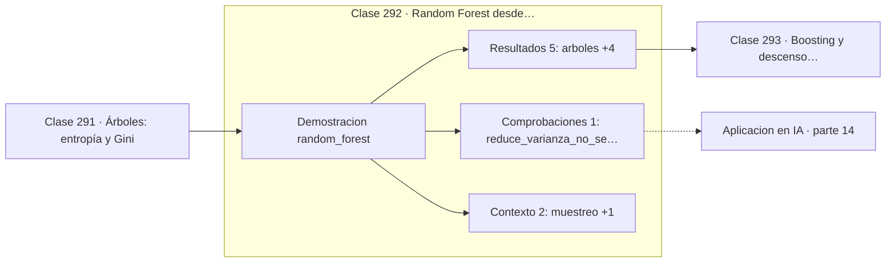

# 292 — Random Forest desde probabilidad

> [⬅️ 291 Árboles: entropía y Gini](../291-arboles-entropia-y-gini/README.md) · [📚 Parte 14](../README.md) · [🏠 Programa](../../../README.md) · [293 Boosting y descenso funcional ➡️](../293-boosting-y-descenso-funcional/README.md)

**Parte:** 14 — Matemática de Machine Learning · **Nivel:** `ml-avanzado` · **Horas estimadas:** 4
**Motor:** `engines.part14` · **Demostración:** `random_forest` · **Clase 12 de 20** de la parte

---

## 🎯 Propósito

**Promediar modelos solo reduce la varianza en la medida en que estén decorrelacionados.**

Derivación matemática de los algoritmos clásicos: regresión, regularización, clasificación, kernels, árboles, ensambles, clustering, EM y compromiso sesgo-varianza.

## ✅ Resultados de aprendizaje

Al terminar podrás:

1. Explicar **Random Forest desde probabilidad** con lenguaje cotidiano y con notación matemática.
2. Resolver un caso pequeño a mano y anticipar el orden de magnitud del resultado.
3. Ejecutar y modificar `lab.py`, que corre la demostración `random_forest`.
4. Interpretar las 8 salidas del laboratorio y decir qué comprueba cada una.
5. Detectar el error típico de esta parte: interpretar coeficientes de un modelo con features correlacionadas.

## 🧩 Fórmulas de la clase

```text
Var(media de k modelos) = ρσ² + (1−ρ)σ²/k
ρ = 0  ⟹  varianza / k
ρ = 1  ⟹  no hay ganancia
```

## 🗺️ Ubicación en el programa



## 📖 Fundamentos

El bagging entrena varios modelos sobre remuestras bootstrap de los datos y promedia sus
predicciones. La idea es que los errores independientes se cancelan al promediarse, igual
que el error de la media muestral decae en la clase 203.

La fórmula de la varianza del promedio dice exactamente cuánta ganancia hay, y su lectura
es la lección de la clase. El segundo término se divide por `k` y desaparece con muchos
modelos; el primero, `ρσ²`, **no depende de `k`** y no se puede reducir añadiendo árboles.
Si los modelos están muy correlacionados, promediar mil no sirve de mucho más que promediar
diez.

De ahí viene la aportación específica de **Random Forest** sobre el bagging simple: además
de remuestrear las observaciones, en cada corte considera solo un subconjunto aleatorio de
características. Eso fuerza a los árboles a usar variables distintas y **reduce `ρ`**, que
es el término que limita la ganancia. La aleatoriedad extra empeora cada árbol individual y
mejora el conjunto.

El bagging ataca la varianza, no el sesgo. Promediar cien modelos igualmente sesgados da un
modelo igual de sesgado. Por eso funciona tan bien con árboles profundos, que tienen sesgo
bajo y varianza alta, y apenas aporta con modelos rígidos como la regresión lineal.

## 🧮 Ejemplo trabajado

Bosque de tocones frente a un tocón único.

```text
25 árboles de profundidad 1 (tocones)
muestreo: bootstrap con reemplazo

accuracy de un árbol único: 0,9875
accuracy del bosque:        0,9875

Aquí no hay ganancia porque el problema es tan fácil
que el tocón único ya acierta casi todo: no queda
varianza que reducir.

Fórmula: Var = ρσ² + (1−ρ)σ²/k
  ρ = 0,0  →  varianza / 25
  ρ = 0,5  →  varianza × 0,52, no × 0,04
  ρ = 1,0  →  sin ganancia

Por eso Random Forest muestrea también características:
para bajar ρ, no para subir k.
```

## 🔬 Qué ejecuta el laboratorio

`random_forest` — Bagging: promediar modelos decorrelacionados reduce la varianza.

| Grupo | Salidas |
|---|---|
| 🔢 Resultados numéricos (5) | `arboles`, `profundidad`, `accuracy_arbol_unico`, `accuracy_del_bosque`, `semilla` |
| ✅ Comprobaciones de invariante (1) | `reduce_varianza_no_sesgo` |

Las claves booleanas no son adorno: si alguna fuera `False`, el resultado numérico
no sería fiable aunque el programa terminase sin error.

```bash
python classes/part-14-matematica-de-machine-learning/292-random-forest-desde-probabilidad/lab.py
compmath run 292
```

> [!TIP]
> Antes de ejecutar, **escribe tu predicción**. Un laboratorio que confirma lo que
> esperabas enseña tanto como uno que te contradice, pero solo si la predicción
> existía antes del resultado.

## ⚠️ Errores conceptuales frecuentes

1. Añadir árboles esperando ganancia cuando están muy correlacionados.
2. Aplicar bagging a modelos de sesgo alto y varianza baja.
3. Olvidar que el error out-of-bag es una estimación gratuita de validación.

## 🚀 Dónde se usa de verdad

Random Forest en datos tabulares, estimación de importancia de variables, ensembles de
modelos y reducción de varianza en predicciones.

## 🤖 Conexión con IA

Estos algoritmos siguen siendo la línea base honesta contra la que se debe comparar cualquier modelo profundo.

## 📓 Notebooks

| Archivo | Para qué |
|---|---|
| [`notebook.ipynb`](notebook.ipynb) | recorrido guiado con la demostración ejecutada |
| [`notebook_student.ipynb`](notebook_student.ipynb) | versión con `TODO` para resolver |
| [`notebook_solution.ipynb`](notebook_solution.ipynb) | solución de referencia verificada |

## 📝 Evaluación

| Criterio | Peso |
|---|---:|
| Comprensión conceptual | 25 % |
| Resolución manual | 25 % |
| Implementación y verificación | 25 % |
| Interpretación y comunicación | 15 % |
| Conexión con aplicación real | 10 % |

Detalle y criterios de error crítico en [`assessment.md`](assessment.md).

## ❓ Preguntas de comprobación

1. ¿Cuál es la entrada, cuál la salida y qué unidades tienen?
2. ¿Qué operación domina el comportamiento del resultado?
3. ¿Qué caso extremo revelaría un error conceptual?
4. ¿Cómo verificarías el resultado por un método independiente?
5. ¿Dónde aparece esto en scoring crediticio?

Si necesitas releer el código para responderlas, la clase todavía no está superada.

## 📥 Entregable

`notebook_student.ipynb` resuelto más un párrafo que explique el resultado **sin citar
código**: qué entra, qué sale, qué invariante se comprueba y qué pasaría en un caso límite.

## 📚 Bibliografía de la clase

Esta clase enseña **Machine learning · Teoría del aprendizaje · Métodos de kernel**. Cada obra dice qué aporta aquí y cómo se comprobó su localizador:

- [Breiman, L. *Random Forests*, Machine Learning, 2001](https://doi.org/10.1023/A:1010933404324) — Machine learning: el tema de esta clase · DOI `10.1023/a:1010933404324` verificado en Crossref (2026-08-19).
- [Hastie, T.; Tibshirani, R.; Friedman, J. *The Elements of Statistical Learning*, 2ª ed., Springer, 2009, cap. 15](https://hastie.su.domains/ElemStatLearn/) — Machine learning: el tema de esta clase · ISBN-13 `9780387848570` verificado en International ISBN Agency (2026-08-19).

Bibliografía de todas las clases, con el porqué de cada obra, en [`docs/BIBLIOGRAPHY.md`](../../../docs/BIBLIOGRAPHY.md) · localizador y estado de cada obra en [`sources/bibliography.json`](../../../sources/bibliography.json).

## 📂 Material de la clase

[`intuition.md`](intuition.md) · [`theory.md`](theory.md) · [`derivation.md`](derivation.md) · [`exercises.md`](exercises.md) · [`assessment.md`](assessment.md) · [`where-is-this-used.md`](where-is-this-used.md) · [`lesson.yaml`](lesson.yaml)

---

> [⬅️ 291 Árboles: entropía y Gini](../291-arboles-entropia-y-gini/README.md) · [📚 Parte 14](../README.md) · [🏠 Programa](../../../README.md) · [293 Boosting y descenso funcional ➡️](../293-boosting-y-descenso-funcional/README.md)
