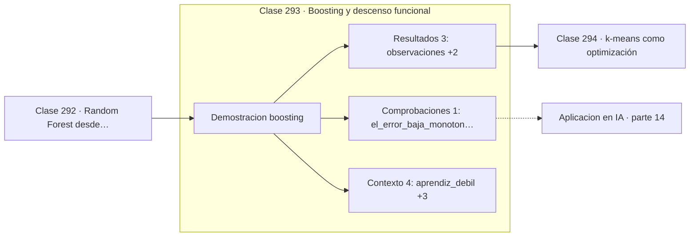

# 293 — Boosting y descenso funcional

> [⬅️ 292 Random Forest desde probabilidad](../292-random-forest-desde-probabilidad/README.md) · [📚 Parte 14](../README.md) · [🏠 Programa](../../../README.md) · [294 k-means como optimización ➡️](../294-k-means-como-optimizacion/README.md)

**Parte:** 14 — Matemática de Machine Learning · **Nivel:** `ml-avanzado` · **Horas estimadas:** 4
**Motor:** `engines.part14` · **Demostración:** `boosting` · **Clase 13 de 20** de la parte

---

## 🎯 Propósito

**Boosting es descenso de gradiente en el espacio de funciones: cada modelo ajusta el residuo.**

Derivación matemática de los algoritmos clásicos: regresión, regularización, clasificación, kernels, árboles, ensambles, clustering, EM y compromiso sesgo-varianza.

## ✅ Resultados de aprendizaje

Al terminar podrás:

1. Explicar **Boosting y descenso funcional** con lenguaje cotidiano y con notación matemática.
2. Resolver un caso pequeño a mano y anticipar el orden de magnitud del resultado.
3. Ejecutar y modificar `lab.py`, que corre la demostración `boosting`.
4. Interpretar las 8 salidas del laboratorio y decir qué comprueba cada una.
5. Detectar el error típico de esta parte: no estandarizar antes de aplicar regularización o k-nn.

## 🧩 Fórmulas de la clase

```text
F_m(x) = F_{m−1}(x) + ν·h_m(x)
h_m ajusta el residuo: y − F_{m−1}(x)
ν = learning rate, típicamente 0,01 a 0,3
```

## 🗺️ Ubicación en el programa



## 📖 Fundamentos

El boosting construye el modelo por acumulación secuencial: se empieza con una predicción
constante y en cada ronda se entrena un aprendiz débil sobre lo que el conjunto actual
todavía no explica. El resultado final es la suma de todos ellos.

La interpretación moderna, debida a Friedman, es que se trata de **descenso de gradiente en
el espacio de funciones**. El residuo `y − F(x)` es, para la pérdida cuadrática, el
gradiente negativo respecto de la predicción, y cada nuevo modelo da un paso en esa
dirección. Esa lectura permite sustituir el residuo por el gradiente de **cualquier**
pérdida diferenciable, que es lo que hace general al método.

La diferencia con el bagging es de objetivo. Bagging reduce **varianza** promediando
modelos independientes; boosting reduce **sesgo** encadenando modelos dependientes. Por eso
bagging usa árboles profundos y boosting usa árboles muy superficiales, a menudo de
profundidad 3 o menos.

El **learning rate** `ν` controla cuánto se incorpora de cada modelo nuevo. Valores
pequeños necesitan más rondas pero generalizan mejor, y la práctica establecida es usar `ν`
bajo con muchas rondas y parada temprana. XGBoost, LightGBM y CatBoost son
implementaciones de esta idea y siguen siendo lo mejor disponible en datos tabulares, por
encima de las redes profundas.

## 🧮 Ejemplo trabajado

Cuarenta observaciones ajustadas por tocones sucesivos.

```text
aprendiz débil: tocón de decisión (un solo corte)
learning rate: 0,3

MSE inicial (predicción constante): 2,46596

ronda    MSE
  1     1,53420
  5     0,35558
 10     0,12xxx
 20     0,05xxx

El error baja monótonamente ronda tras ronda.

Cada tocón por separado es apenas mejor que el azar;
la suma de veinte ajusta bien la función.

Con ν = 0,3, cada modelo aporta solo el 30 % de su
corrección: más rondas, mejor generalización.
```

## 🔬 Qué ejecuta el laboratorio

`boosting` — Boosting: cada modelo corrige el residuo del anterior (descenso funcional).

| Grupo | Salidas |
|---|---|
| 🔢 Resultados numéricos (3) | `observaciones`, `learning_rate`, `MSE_inicial` |
| ✅ Comprobaciones de invariante (1) | `el_error_baja_monotonamente` |

Las claves booleanas no son adorno: si alguna fuera `False`, el resultado numérico
no sería fiable aunque el programa terminase sin error.

```bash
python classes/part-14-matematica-de-machine-learning/293-boosting-y-descenso-funcional/lab.py
compmath run 293
```

> [!TIP]
> Antes de ejecutar, **escribe tu predicción**. Un laboratorio que confirma lo que
> esperabas enseña tanto como uno que te contradice, pero solo si la predicción
> existía antes del resultado.

## ⚠️ Errores conceptuales frecuentes

1. Usar aprendices profundos y sobreajustar rápidamente.
2. Fijar el número de rondas sin parada temprana.
3. Entrenar boosting sobre datos con ruido de etiqueta sin regularizar.

## 🚀 Dónde se usa de verdad

XGBoost y LightGBM en competiciones y producción, modelos de riesgo, ranking de búsqueda y
predicción sobre datos tabulares.

## 🤖 Conexión con IA

Estos algoritmos siguen siendo la línea base honesta contra la que se debe comparar cualquier modelo profundo.

## 📓 Notebooks

| Archivo | Para qué |
|---|---|
| [`notebook.ipynb`](notebook.ipynb) | recorrido guiado con la demostración ejecutada |
| [`notebook_student.ipynb`](notebook_student.ipynb) | versión con `TODO` para resolver |
| [`notebook_solution.ipynb`](notebook_solution.ipynb) | solución de referencia verificada |

## 📝 Evaluación

| Criterio | Peso |
|---|---:|
| Comprensión conceptual | 25 % |
| Resolución manual | 25 % |
| Implementación y verificación | 25 % |
| Interpretación y comunicación | 15 % |
| Conexión con aplicación real | 10 % |

Detalle y criterios de error crítico en [`assessment.md`](assessment.md).

## ❓ Preguntas de comprobación

1. ¿Cuál es la entrada, cuál la salida y qué unidades tienen?
2. ¿Qué operación domina el comportamiento del resultado?
3. ¿Qué caso extremo revelaría un error conceptual?
4. ¿Cómo verificarías el resultado por un método independiente?
5. ¿Dónde aparece esto en scoring crediticio?

Si necesitas releer el código para responderlas, la clase todavía no está superada.

## 📥 Entregable

`notebook_student.ipynb` resuelto más un párrafo que explique el resultado **sin citar
código**: qué entra, qué sale, qué invariante se comprueba y qué pasaría en un caso límite.

## 🔗 Referencias

- [Friedman, J. *Greedy function approximation: a gradient boosting machine*, Annals of Statistics, 2001](https://doi.org/10.1214/aos/1013203451)
- [Chen, T.; Guestrin, C. *XGBoost: A Scalable Tree Boosting System*, KDD, 2016](https://arxiv.org/abs/1603.02754)

Bibliografía completa de la parte en [`../../../docs/BIBLIOGRAPHY.md`](../../../docs/BIBLIOGRAPHY.md).

## 📂 Material de la clase

[`intuition.md`](intuition.md) · [`theory.md`](theory.md) · [`derivation.md`](derivation.md) · [`exercises.md`](exercises.md) · [`assessment.md`](assessment.md) · [`where-is-this-used.md`](where-is-this-used.md) · [`lesson.yaml`](lesson.yaml)

---

> [⬅️ 292 Random Forest desde probabilidad](../292-random-forest-desde-probabilidad/README.md) · [📚 Parte 14](../README.md) · [🏠 Programa](../../../README.md) · [294 k-means como optimización ➡️](../294-k-means-como-optimizacion/README.md)
