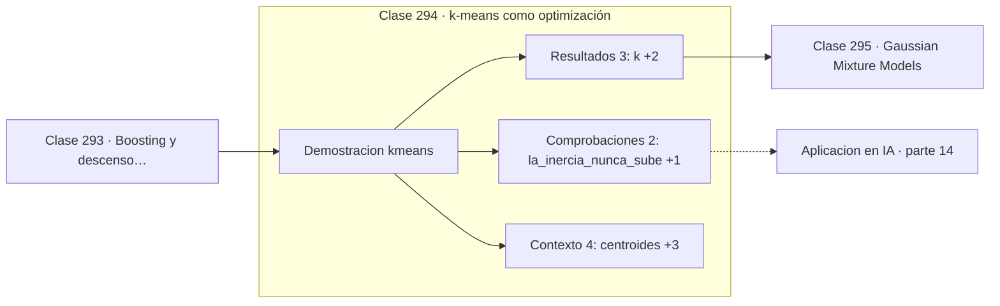

# 294 — k-means como optimización

> [⬅️ 293 Boosting y descenso funcional](../293-boosting-y-descenso-funcional/README.md) · [📚 Parte 14](../README.md) · [🏠 Programa](../../../README.md) · [295 Gaussian Mixture Models ➡️](../295-gaussian-mixture-models/README.md)

**Parte:** 14 — Matemática de Machine Learning · **Nivel:** `ml-avanzado` · **Horas estimadas:** 4
**Motor:** `engines.part14` · **Demostración:** `kmeans` · **Clase 14 de 20** de la parte

---

## 🎯 Propósito

**k-means minimiza la inercia alternando asignación y recálculo, y nunca empeora.**

Derivación matemática de los algoritmos clásicos: regresión, regularización, clasificación, kernels, árboles, ensambles, clustering, EM y compromiso sesgo-varianza.

## ✅ Resultados de aprendizaje

Al terminar podrás:

1. Explicar **k-means como optimización** con lenguaje cotidiano y con notación matemática.
2. Resolver un caso pequeño a mano y anticipar el orden de magnitud del resultado.
3. Ejecutar y modificar `lab.py`, que corre la demostración `kmeans`.
4. Interpretar las 9 salidas del laboratorio y decir qué comprueba cada una.
5. Detectar el error típico de esta parte: elegir hiperparámetros con el conjunto de test.

## 🧩 Fórmulas de la clase

```text
objetivo: min Σ‖xᵢ − μ_{c(i)}‖²
paso 1: asignar cada punto a su centroide más cercano
paso 2: recalcular cada centroide como la media de los suyos
```

## 🗺️ Ubicación en el programa



## 📖 Fundamentos

k-means agrupa datos minimizando la **inercia**: la suma de distancias al cuadrado de cada
punto a su centroide. El algoritmo de Lloyd alterna dos pasos, y cada uno reduce esa
cantidad, lo que garantiza convergencia monótona a un óptimo local.

La garantía es solo local. El resultado depende de la inicialización, y con centroides
iniciales malos puede converger a una solución claramente peor. La inicialización
**k-means++** elige puntos iniciales dispersos con una regla probabilística y reduce mucho
ese riesgo; ejecutar varias veces y quedarse con la de menor inercia es la práctica
complementaria.

El método impone supuestos que conviene tener presentes porque no siempre se dicen: usar
distancia euclídea equivale a suponer agrupamientos **esféricos y de tamaño similar**. Con
grupos alargados, con densidades muy distintas o con formas no convexas, k-means falla de
forma sistemática, y ahí corresponden DBSCAN o agrupamiento espectral.

Elegir `k` es el problema abierto. La inercia siempre baja al aumentar `k` —con `k = n` vale
cero— así que no sirve como criterio directo. Las heurísticas habituales son el método del
codo, el coeficiente de silueta o el gap statistic, y ninguna es definitiva: `k` suele
decidirse por conocimiento del dominio.

## 🧮 Ejemplo trabajado

Dos grupos, convergencia en tres iteraciones.

```text
k = 2

iteración    inercia
    1       92,527761
    3       89,596534

centroides finales:
  ( 2,1592 ;  1,8087)
  (−1,1503 ; −1,0020)

La inercia nunca sube: cada paso la reduce o la deja igual. ✓
Convergió en 3 iteraciones.

Los centroides coinciden con las medias reales de las
clases, aunque el algoritmo no vio ninguna etiqueta.
```

## 🔬 Qué ejecuta el laboratorio

`kmeans` — k-means como minimización de la inercia (Lloyd).

| Grupo | Salidas |
|---|---|
| 🔢 Resultados numéricos (3) | `k`, `iteraciones_hasta_converger`, `semilla` |
| ✅ Comprobaciones de invariante (2) | `la_inercia_nunca_sube`, `converge_a_un_optimo_local` |

Las claves booleanas no son adorno: si alguna fuera `False`, el resultado numérico
no sería fiable aunque el programa terminase sin error.

```bash
python classes/part-14-matematica-de-machine-learning/294-k-means-como-optimizacion/lab.py
compmath run 294
```

> [!TIP]
> Antes de ejecutar, **escribe tu predicción**. Un laboratorio que confirma lo que
> esperabas enseña tanto como uno que te contradice, pero solo si la predicción
> existía antes del resultado.

## ⚠️ Errores conceptuales frecuentes

1. Ejecutarlo una sola vez con inicialización aleatoria.
2. Aplicarlo a grupos alargados o de densidades muy distintas.
3. Elegir k minimizando la inercia, que siempre baja con k.

## 🚀 Dónde se usa de verdad

Segmentación de clientes, cuantización de color, compresión vectorial, inicialización de
GMM y agrupamiento de embeddings.

## 🤖 Conexión con IA

Estos algoritmos siguen siendo la línea base honesta contra la que se debe comparar cualquier modelo profundo.

## 📓 Notebooks

| Archivo | Para qué |
|---|---|
| [`notebook.ipynb`](notebook.ipynb) | recorrido guiado con la demostración ejecutada |
| [`notebook_student.ipynb`](notebook_student.ipynb) | versión con `TODO` para resolver |
| [`notebook_solution.ipynb`](notebook_solution.ipynb) | solución de referencia verificada |

## 📝 Evaluación

| Criterio | Peso |
|---|---:|
| Comprensión conceptual | 25 % |
| Resolución manual | 25 % |
| Implementación y verificación | 25 % |
| Interpretación y comunicación | 15 % |
| Conexión con aplicación real | 10 % |

Detalle y criterios de error crítico en [`assessment.md`](assessment.md).

## ❓ Preguntas de comprobación

1. ¿Cuál es la entrada, cuál la salida y qué unidades tienen?
2. ¿Qué operación domina el comportamiento del resultado?
3. ¿Qué caso extremo revelaría un error conceptual?
4. ¿Cómo verificarías el resultado por un método independiente?
5. ¿Dónde aparece esto en scoring crediticio?

Si necesitas releer el código para responderlas, la clase todavía no está superada.

## 📥 Entregable

`notebook_student.ipynb` resuelto más un párrafo que explique el resultado **sin citar
código**: qué entra, qué sale, qué invariante se comprueba y qué pasaría en un caso límite.

## 🔗 Referencias

- [Lloyd, S. *Least squares quantization in PCM*, IEEE Trans. Information Theory, 1982](https://doi.org/10.1109/TIT.1982.1056489) — *uso:* artículo de origen consultado en «k-means como optimización».
- [Arthur, D.; Vassilvitskii, S. *k-means++: the advantages of careful seeding*, SODA, 2007](https://dl.acm.org/doi/10.5555/1283383.1283494) — *uso:* artículo de origen consultado en «k-means como optimización».

Bibliografía completa de la parte en [`../../../docs/BIBLIOGRAPHY.md`](../../../docs/BIBLIOGRAPHY.md) · localizador verificable de cada obra en [`sources/bibliography.json`](../../../sources/bibliography.json).

## 📂 Material de la clase

[`intuition.md`](intuition.md) · [`theory.md`](theory.md) · [`derivation.md`](derivation.md) · [`exercises.md`](exercises.md) · [`assessment.md`](assessment.md) · [`where-is-this-used.md`](where-is-this-used.md) · [`lesson.yaml`](lesson.yaml)

---

> [⬅️ 293 Boosting y descenso funcional](../293-boosting-y-descenso-funcional/README.md) · [📚 Parte 14](../README.md) · [🏠 Programa](../../../README.md) · [295 Gaussian Mixture Models ➡️](../295-gaussian-mixture-models/README.md)
