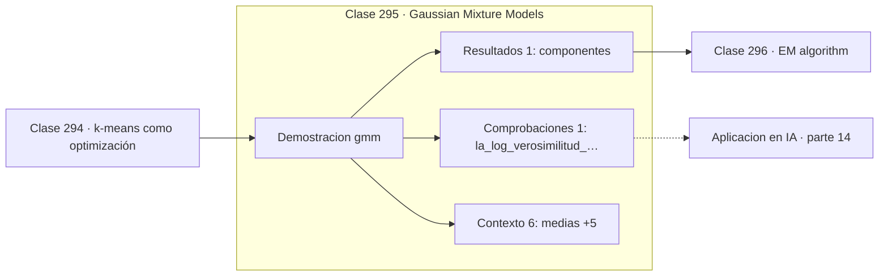

# 295 — Gaussian Mixture Models

> [⬅️ 294 k-means como optimización](../294-k-means-como-optimizacion/README.md) · [📚 Parte 14](../README.md) · [🏠 Programa](../../../README.md) · [296 EM algorithm ➡️](../296-em-algorithm/README.md)

**Parte:** 14 — Matemática de Machine Learning · **Nivel:** `ml-avanzado` · **Horas estimadas:** 4
**Motor:** `engines.part14` · **Demostración:** `gmm` · **Clase 15 de 20** de la parte

---

## 🎯 Propósito

**Una mezcla de gaussianas asigna probabilidades en vez de etiquetas, y modela grupos de formas distintas.**

Derivación matemática de los algoritmos clásicos: regresión, regularización, clasificación, kernels, árboles, ensambles, clustering, EM y compromiso sesgo-varianza.

## ✅ Resultados de aprendizaje

Al terminar podrás:

1. Explicar **Gaussian Mixture Models** con lenguaje cotidiano y con notación matemática.
2. Resolver un caso pequeño a mano y anticipar el orden de magnitud del resultado.
3. Ejecutar y modificar `lab.py`, que corre la demostración `gmm`.
4. Interpretar las 8 salidas del laboratorio y decir qué comprueba cada una.
5. Detectar el error típico de esta parte: interpretar coeficientes de un modelo con features correlacionadas.

## 🧩 Fórmulas de la clase

```text
p(x) = Σ πₖ·N(x | μₖ, σₖ²)
responsabilidad: γₖ(x) = πₖN(x|μₖ,σₖ²) / p(x)
Σ πₖ = 1
```

## 🗺️ Ubicación en el programa



## 📖 Fundamentos

Una mezcla de gaussianas es un **modelo generativo**: supone que cada punto se generó
eligiendo primero una componente según los pesos `π` y muestreando después de su normal.
Ajustar el modelo es estimar los pesos, las medias y las varianzas que mejor explican los
datos observados.

Su diferencia con k-means es la **asignación blanda**. En vez de decidir a qué grupo
pertenece cada punto, calcula la probabilidad de pertenecer a cada uno —la
**responsabilidad**—. Un punto entre dos grupos recibe 0,5 y 0,5 en vez de una asignación
arbitraria, y esa información es valiosa: identifica los casos ambiguos.

La segunda diferencia es la flexibilidad de forma. k-means impone grupos esféricos del
mismo tamaño; un GMM con covarianza completa modela grupos **elípticos, rotados y de
tamaños distintos**. De hecho k-means es el caso límite de un GMM con covarianzas
esféricas iguales y responsabilidades llevadas al extremo.

El ajuste se hace con EM, y la log-verosimilitud crece monótonamente, lo que sirve de
comprobación de la implementación. Hay una trampa conocida: si una componente colapsa sobre
un solo punto, su varianza tiende a cero y la verosimilitud a infinito. Se evita con una
cota inferior en la varianza o con regularización.

## 🧮 Ejemplo trabajado

Mezcla de dos componentes ajustada por EM.

```text
componentes: 2

medias:            (−1,3009 ;  1,9702)
varianzas:         ( 0,3721 ;  0,9484)
pesos de mezcla:   ( 0,4481 ;  0,5519)     suman 1   ✓

log-verosimilitud por iteración:
  −145,345385
  −144,860751
  −144,766128

Nunca baja                                           ✓

Las varianzas son distintas: 0,37 frente a 0,95.
k-means habría impuesto grupos del mismo tamaño y
habría clasificado mal la frontera entre ambos.
```

## 🔬 Qué ejecuta el laboratorio

`gmm` — Mezcla de gaussianas: asignación blanda en lugar de dura.

| Grupo | Salidas |
|---|---|
| 🔢 Resultados numéricos (1) | `componentes` |
| ✅ Comprobaciones de invariante (1) | `la_log_verosimilitud_nunca_baja` |

Las claves booleanas no son adorno: si alguna fuera `False`, el resultado numérico
no sería fiable aunque el programa terminase sin error.

```bash
python classes/part-14-matematica-de-machine-learning/295-gaussian-mixture-models/lab.py
compmath run 295
```

> [!TIP]
> Antes de ejecutar, **escribe tu predicción**. Un laboratorio que confirma lo que
> esperabas enseña tanto como uno que te contradice, pero solo si la predicción
> existía antes del resultado.

## ⚠️ Errores conceptuales frecuentes

1. Dejar que una componente colapse sobre un punto sin cota en la varianza.
2. Inicializar al azar en vez de con k-means.
3. Suponer normalidad de los grupos sin comprobarla.

## 🚀 Dónde se usa de verdad

Agrupamiento probabilístico, modelado de densidad, detección de anomalías, separación de
hablantes y segmentación de imágenes.

## 🤖 Conexión con IA

Estos algoritmos siguen siendo la línea base honesta contra la que se debe comparar cualquier modelo profundo.

## 📓 Notebooks

| Archivo | Para qué |
|---|---|
| [`notebook.ipynb`](notebook.ipynb) | recorrido guiado con la demostración ejecutada |
| [`notebook_student.ipynb`](notebook_student.ipynb) | versión con `TODO` para resolver |
| [`notebook_solution.ipynb`](notebook_solution.ipynb) | solución de referencia verificada |

## 📝 Evaluación

| Criterio | Peso |
|---|---:|
| Comprensión conceptual | 25 % |
| Resolución manual | 25 % |
| Implementación y verificación | 25 % |
| Interpretación y comunicación | 15 % |
| Conexión con aplicación real | 10 % |

Detalle y criterios de error crítico en [`assessment.md`](assessment.md).

## ❓ Preguntas de comprobación

1. ¿Cuál es la entrada, cuál la salida y qué unidades tienen?
2. ¿Qué operación domina el comportamiento del resultado?
3. ¿Qué caso extremo revelaría un error conceptual?
4. ¿Cómo verificarías el resultado por un método independiente?
5. ¿Dónde aparece esto en scoring crediticio?

Si necesitas releer el código para responderlas, la clase todavía no está superada.

## 📥 Entregable

`notebook_student.ipynb` resuelto más un párrafo que explique el resultado **sin citar
código**: qué entra, qué sale, qué invariante se comprueba y qué pasaría en un caso límite.

## 🔗 Referencias

- [Bishop, C. *Pattern Recognition and Machine Learning*, Springer, 2006, cap. 9](https://www.microsoft.com/en-us/research/publication/pattern-recognition-machine-learning/) — *uso:* obra de referencia consultada en «Gaussian Mixture Models».
- [Murphy, K. *Probabilistic Machine Learning: An Introduction*, MIT Press, 2022](https://probml.github.io/pml-book/book1.html) — *uso:* obra de referencia consultada en «Gaussian Mixture Models».

Bibliografía completa de la parte en [`../../../docs/BIBLIOGRAPHY.md`](../../../docs/BIBLIOGRAPHY.md) · localizador verificable de cada obra en [`sources/bibliography.json`](../../../sources/bibliography.json).

## 📂 Material de la clase

[`intuition.md`](intuition.md) · [`theory.md`](theory.md) · [`derivation.md`](derivation.md) · [`exercises.md`](exercises.md) · [`assessment.md`](assessment.md) · [`where-is-this-used.md`](where-is-this-used.md) · [`lesson.yaml`](lesson.yaml)

---

> [⬅️ 294 k-means como optimización](../294-k-means-como-optimizacion/README.md) · [📚 Parte 14](../README.md) · [🏠 Programa](../../../README.md) · [296 EM algorithm ➡️](../296-em-algorithm/README.md)
