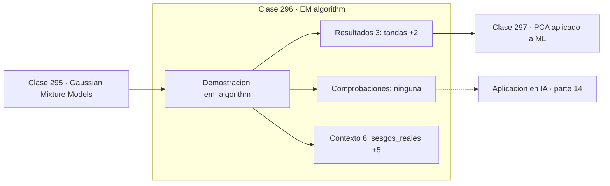

# 296 — EM algorithm

> [⬅️ 295 Gaussian Mixture Models](../295-gaussian-mixture-models/README.md) · [📚 Parte 14](../README.md) · [🏠 Programa](../../../README.md) · [297 PCA aplicado a ML ➡️](../297-pca-aplicado-a-ml/README.md)

**Parte:** 14 — Matemática de Machine Learning · **Nivel:** `ml-avanzado` · **Horas estimadas:** 4
**Motor:** `engines.part14` · **Demostración:** `em_algorithm` · **Clase 16 de 20** de la parte

---

## 🎯 Propósito

**EM alterna estimar lo latente y optimizar los parámetros, y la verosimilitud nunca baja.**

Derivación matemática de los algoritmos clásicos: regresión, regularización, clasificación, kernels, árboles, ensambles, clustering, EM y compromiso sesgo-varianza.

## ✅ Resultados de aprendizaje

Al terminar podrás:

1. Explicar **EM algorithm** con lenguaje cotidiano y con notación matemática.
2. Resolver un caso pequeño a mano y anticipar el orden de magnitud del resultado.
3. Ejecutar y modificar `lab.py`, que corre la demostración `em_algorithm`.
4. Interpretar las 9 salidas del laboratorio y decir qué comprueba cada una.
5. Detectar el error típico de esta parte: no estandarizar antes de aplicar regularización o k-nn.

## 🧩 Fórmulas de la clase

```text
E-step: estimar la distribución de las latentes dados los parámetros
M-step: maximizar los parámetros dada esa distribución
garantía: la log-verosimilitud crece o se mantiene
```

## 🗺️ Ubicación en el programa



## 📖 Fundamentos

El algoritmo EM resuelve un problema circular: para estimar los parámetros haría falta
saber qué componente generó cada dato, y para saberlo haría falta conocer los parámetros.
La salida es alternar, empezando por una suposición cualquiera y refinando ambas cosas por
turnos.

El **paso E** calcula, con los parámetros actuales, la distribución de probabilidad de las
variables latentes. El **paso M** toma esas asignaciones blandas como si fueran datos
ponderados y maximiza los parámetros. Se repite hasta que deja de haber cambio apreciable.

La garantía teórica es que **la log-verosimilitud nunca decrece**. La demostración
construye una cota inferior que toca la verosimilitud en el punto actual y se maximiza en
cada paso; esa cota es el ELBO, el mismo objeto que optimiza un autoencoder variacional.
Ver EM primero hace que el ELBO de la parte 17 deje de parecer una construcción arbitraria.

Lo que no garantiza es alcanzar el óptimo global: converge a un óptimo local que depende de
la inicialización, igual que k-means. Y puede ser lento cerca del óptimo. Su valor está en
la generalidad: sirve para GMM, para modelos ocultos de Markov, para datos faltantes y para
cualquier modelo con estructura latente.

## 🧮 Ejemplo trabajado

Dos monedas con sesgos desconocidos, sin saber cuál se usó.

```text
20 tandas de 10 lanzamientos cada una
sesgos reales:    [0,80 ; 0,30]
inicialización:   [0,60 ; 0,40]

iteración    p_A        p_B
    1      0,726455   0,428502
    5      0,8xxxxx   0,4xxxxx
  final    0,848956   0,451121

Sin saber nunca qué moneda generó cada tanda,
EM recupera aproximadamente los dos sesgos.

El error residual viene de los datos finitos:
20 tandas no bastan para separar perfectamente.
La log-verosimilitud creció en cada iteración.   ✓
```

## 🔬 Qué ejecuta el laboratorio

`em_algorithm` — EM: E-step y M-step sobre datos con una variable latente.

| Grupo | Salidas |
|---|---|
| 🔢 Resultados numéricos (3) | `tandas`, `lanzamientos_por_tanda`, `semilla` |
| ✅ Comprobaciones de invariante (0) | — |

Las claves booleanas no son adorno: si alguna fuera `False`, el resultado numérico
no sería fiable aunque el programa terminase sin error.

```bash
python classes/part-14-matematica-de-machine-learning/296-em-algorithm/lab.py
compmath run 296
```

> [!TIP]
> Antes de ejecutar, **escribe tu predicción**. Un laboratorio que confirma lo que
> esperabas enseña tanto como uno que te contradice, pero solo si la predicción
> existía antes del resultado.

## ⚠️ Errores conceptuales frecuentes

1. Ejecutar EM una sola vez desde una inicialización arbitraria.
2. Confundir convergencia de la verosimilitud con optimalidad global.
3. Detener el algoritmo por número de iteraciones sin criterio de cambio.

## 🚀 Dónde se usa de verdad

Ajuste de GMM, modelos ocultos de Markov, imputación de datos faltantes, topic models y
base conceptual de la inferencia variacional.

## 🤖 Conexión con IA

Estos algoritmos siguen siendo la línea base honesta contra la que se debe comparar cualquier modelo profundo.

## 📓 Notebooks

| Archivo | Para qué |
|---|---|
| [`notebook.ipynb`](notebook.ipynb) | recorrido guiado con la demostración ejecutada |
| [`notebook_student.ipynb`](notebook_student.ipynb) | versión con `TODO` para resolver |
| [`notebook_solution.ipynb`](notebook_solution.ipynb) | solución de referencia verificada |

## 📝 Evaluación

| Criterio | Peso |
|---|---:|
| Comprensión conceptual | 25 % |
| Resolución manual | 25 % |
| Implementación y verificación | 25 % |
| Interpretación y comunicación | 15 % |
| Conexión con aplicación real | 10 % |

Detalle y criterios de error crítico en [`assessment.md`](assessment.md).

## ❓ Preguntas de comprobación

1. ¿Cuál es la entrada, cuál la salida y qué unidades tienen?
2. ¿Qué operación domina el comportamiento del resultado?
3. ¿Qué caso extremo revelaría un error conceptual?
4. ¿Cómo verificarías el resultado por un método independiente?
5. ¿Dónde aparece esto en scoring crediticio?

Si necesitas releer el código para responderlas, la clase todavía no está superada.

## 📥 Entregable

`notebook_student.ipynb` resuelto más un párrafo que explique el resultado **sin citar
código**: qué entra, qué sale, qué invariante se comprueba y qué pasaría en un caso límite.

## 🔗 Referencias

- [Dempster, A.; Laird, N.; Rubin, D. *Maximum likelihood from incomplete data via the EM algorithm*, JRSS-B, 1977](https://doi.org/10.1111/j.2517-6161.1977.tb01600.x)
- [Bishop, C. *Pattern Recognition and Machine Learning*, Springer, 2006, cap. 9](https://www.microsoft.com/en-us/research/publication/pattern-recognition-machine-learning/)

Bibliografía completa de la parte en [`../../../docs/BIBLIOGRAPHY.md`](../../../docs/BIBLIOGRAPHY.md).

## 📂 Material de la clase

[`intuition.md`](intuition.md) · [`theory.md`](theory.md) · [`derivation.md`](derivation.md) · [`exercises.md`](exercises.md) · [`assessment.md`](assessment.md) · [`where-is-this-used.md`](where-is-this-used.md) · [`lesson.yaml`](lesson.yaml)

---

> [⬅️ 295 Gaussian Mixture Models](../295-gaussian-mixture-models/README.md) · [📚 Parte 14](../README.md) · [🏠 Programa](../../../README.md) · [297 PCA aplicado a ML ➡️](../297-pca-aplicado-a-ml/README.md)
