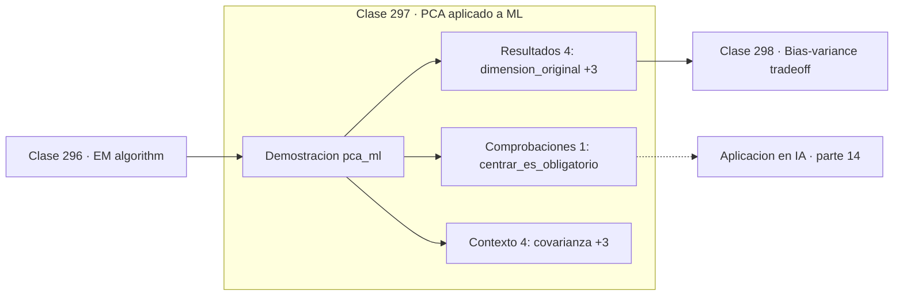

# 297 — PCA aplicado a ML

> [⬅️ 296 EM algorithm](../296-em-algorithm/README.md) · [📚 Parte 14](../README.md) · [🏠 Programa](../../../README.md) · [298 Bias-variance tradeoff ➡️](../298-bias-variance-tradeoff/README.md)

**Parte:** 14 — Matemática de Machine Learning · **Nivel:** `ml-avanzado` · **Horas estimadas:** 4
**Motor:** `engines.part14` · **Demostración:** `pca_ml` · **Clase 17 de 20** de la parte

---

## 🎯 Propósito

**PCA elige las direcciones de máxima varianza, y a menudo unas pocas bastan.**

Derivación matemática de los algoritmos clásicos: regresión, regularización, clasificación, kernels, árboles, ensambles, clustering, EM y compromiso sesgo-varianza.

## ✅ Resultados de aprendizaje

Al terminar podrás:

1. Explicar **PCA aplicado a ML** con lenguaje cotidiano y con notación matemática.
2. Resolver un caso pequeño a mano y anticipar el orden de magnitud del resultado.
3. Ejecutar y modificar `lab.py`, que corre la demostración `pca_ml`.
4. Interpretar las 9 salidas del laboratorio y decir qué comprueba cada una.
5. Detectar el error típico de esta parte: elegir hiperparámetros con el conjunto de test.

## 🧩 Fórmulas de la clase

```text
autovectores de la matriz de covarianza
varianza explicada por PCᵢ = λᵢ / Σλⱼ
equivale a la SVD de los datos centrados
```

## 🗺️ Ubicación en el programa



## 📖 Fundamentos

PCA busca las direcciones en las que los datos varían más y las usa como nuevo sistema de
coordenadas. Las componentes son los autovectores de la matriz de covarianza, ordenados
por autovalor, y cada autovalor mide cuánta varianza captura su dirección.

Su valor práctico está en que la varianza suele concentrarse en pocas componentes. Si dos
componentes de cincuenta explican el 95 % de la varianza, se puede trabajar con dos
dimensiones en vez de cincuenta, perdiendo poco. Eso acelera el cómputo, reduce el ruido y
permite visualizar.

Como se vio en la parte 06, PCA **es** la SVD de los datos centrados, y por eso en la
práctica se calcula así en vez de formando la covarianza: la SVD es numéricamente más
estable y evita elevar al cuadrado el número de condición, exactamente el problema de la
clase 234.

Dos precauciones. Hay que **estandarizar** si las características tienen escalas distintas,
porque si no la de mayor rango domina las componentes por razones de unidades. Y las
componentes son combinaciones lineales de todas las variables originales, lo que las hace
difíciles de interpretar: PCA sacrifica interpretabilidad a cambio de compresión, y para
selección de variables interpretable es mejor Lasso.

## 🧮 Ejemplo trabajado

PCA sobre datos bidimensionales correlacionados.

```text
matriz de covarianza:
  [[3,3785  2,4463]
   [2,4463  2,5285]]

autovalores: [5,436476 ; 0,470507]

varianza explicada por PC1: 92,03 %
PC1 = (0,765237 ; 0,643749)

Reduciendo de 2 dimensiones a 1:
  accuracy usando solo PC1 = 1,0                     ✓

Se descartó el 8 % de la varianza y no se perdió
nada de capacidad discriminante.

Advertencia: la varianza no siempre coincide con
la información útil para clasificar.
```

## 🔬 Qué ejecuta el laboratorio

`pca_ml` — PCA como preprocesamiento: cuánta varianza se conserva.

| Grupo | Salidas |
|---|---|
| 🔢 Resultados numéricos (4) | `dimension_original`, `varianza_explicada_PC1_%`, `accuracy_usando_solo_PC1`, `dimension_reducida` |
| ✅ Comprobaciones de invariante (1) | `centrar_es_obligatorio` |

Las claves booleanas no son adorno: si alguna fuera `False`, el resultado numérico
no sería fiable aunque el programa terminase sin error.

```bash
python classes/part-14-matematica-de-machine-learning/297-pca-aplicado-a-ml/lab.py
compmath run 297
```

> [!TIP]
> Antes de ejecutar, **escribe tu predicción**. Un laboratorio que confirma lo que
> esperabas enseña tanto como uno que te contradice, pero solo si la predicción
> existía antes del resultado.

## ⚠️ Errores conceptuales frecuentes

1. Aplicar PCA sin centrar ni estandarizar.
2. Suponer que las direcciones de máxima varianza son las más discriminantes.
3. Ajustar PCA sobre todo el conjunto antes de separar train y test.

## 🚀 Dónde se usa de verdad

Reducción de dimensión, visualización de datos, compresión, eliminación de ruido y
preprocesamiento antes de modelos sensibles a la dimensión.

## 🤖 Conexión con IA

Estos algoritmos siguen siendo la línea base honesta contra la que se debe comparar cualquier modelo profundo.

## 📓 Notebooks

| Archivo | Para qué |
|---|---|
| [`notebook.ipynb`](notebook.ipynb) | recorrido guiado con la demostración ejecutada |
| [`notebook_student.ipynb`](notebook_student.ipynb) | versión con `TODO` para resolver |
| [`notebook_solution.ipynb`](notebook_solution.ipynb) | solución de referencia verificada |

## 📝 Evaluación

| Criterio | Peso |
|---|---:|
| Comprensión conceptual | 25 % |
| Resolución manual | 25 % |
| Implementación y verificación | 25 % |
| Interpretación y comunicación | 15 % |
| Conexión con aplicación real | 10 % |

Detalle y criterios de error crítico en [`assessment.md`](assessment.md).

## ❓ Preguntas de comprobación

1. ¿Cuál es la entrada, cuál la salida y qué unidades tienen?
2. ¿Qué operación domina el comportamiento del resultado?
3. ¿Qué caso extremo revelaría un error conceptual?
4. ¿Cómo verificarías el resultado por un método independiente?
5. ¿Dónde aparece esto en scoring crediticio?

Si necesitas releer el código para responderlas, la clase todavía no está superada.

## 📥 Entregable

`notebook_student.ipynb` resuelto más un párrafo que explique el resultado **sin citar
código**: qué entra, qué sale, qué invariante se comprueba y qué pasaría en un caso límite.

## 🔗 Referencias

- [Jolliffe, I. *Principal Component Analysis*, 2ª ed., Springer, 2002](https://doi.org/10.1007/b98835) — *uso:* artículo de origen consultado en «PCA aplicado a ML».
- [Hastie, T.; Tibshirani, R.; Friedman, J. *The Elements of Statistical Learning*, 2ª ed., Springer, 2009, cap. 14](https://hastie.su.domains/ElemStatLearn/) — *uso:* obra de referencia consultada en «PCA aplicado a ML».

Bibliografía completa de la parte en [`../../../docs/BIBLIOGRAPHY.md`](../../../docs/BIBLIOGRAPHY.md) · localizador verificable de cada obra en [`sources/bibliography.json`](../../../sources/bibliography.json).

## 📂 Material de la clase

[`intuition.md`](intuition.md) · [`theory.md`](theory.md) · [`derivation.md`](derivation.md) · [`exercises.md`](exercises.md) · [`assessment.md`](assessment.md) · [`where-is-this-used.md`](where-is-this-used.md) · [`lesson.yaml`](lesson.yaml)

---

> [⬅️ 296 EM algorithm](../296-em-algorithm/README.md) · [📚 Parte 14](../README.md) · [🏠 Programa](../../../README.md) · [298 Bias-variance tradeoff ➡️](../298-bias-variance-tradeoff/README.md)
