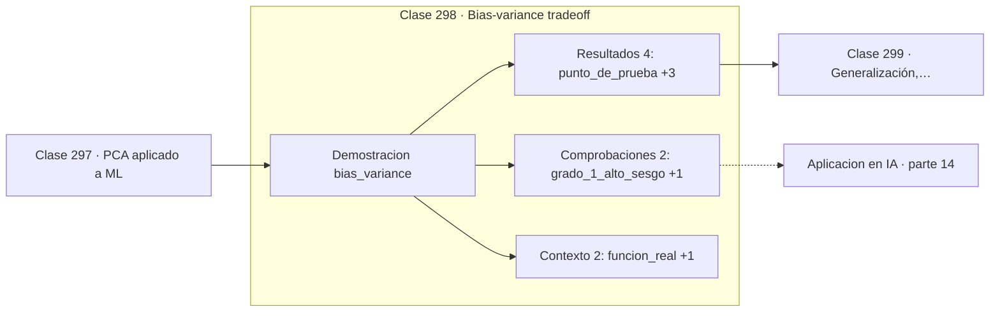

# 298 — Bias-variance tradeoff

> [⬅️ 297 PCA aplicado a ML](../297-pca-aplicado-a-ml/README.md) · [📚 Parte 14](../README.md) · [🏠 Programa](../../../README.md) · [299 Generalización, validación y leakage ➡️](../299-generalizacion-validacion-y-leakage/README.md)

**Parte:** 14 — Matemática de Machine Learning · **Nivel:** `ml-avanzado` · **Horas estimadas:** 4
**Motor:** `engines.part14` · **Demostración:** `bias_variance` · **Clase 18 de 20** de la parte

---

## 🎯 Propósito

**El error se descompone en sesgo, varianza y ruido, y solo los dos primeros se pueden tocar.**

Derivación matemática de los algoritmos clásicos: regresión, regularización, clasificación, kernels, árboles, ensambles, clustering, EM y compromiso sesgo-varianza.

## ✅ Resultados de aprendizaje

Al terminar podrás:

1. Explicar **Bias-variance tradeoff** con lenguaje cotidiano y con notación matemática.
2. Resolver un caso pequeño a mano y anticipar el orden de magnitud del resultado.
3. Ejecutar y modificar `lab.py`, que corre la demostración `bias_variance`.
4. Interpretar las 8 salidas del laboratorio y decir qué comprueba cada una.
5. Detectar el error típico de esta parte: interpretar coeficientes de un modelo con features correlacionadas.

## 🧩 Fórmulas de la clase

```text
E[(y − ŷ)²] = sesgo² + varianza + ruido
modelo simple: sesgo alto, varianza baja
modelo complejo: sesgo bajo, varianza alta
```

## 🗺️ Ubicación en el programa



## 📖 Fundamentos

El error esperado de predicción se descompone exactamente en tres términos. El **sesgo**
mide el error sistemático por suponer una forma demasiado simple; la **varianza** mide
cuánto cambia la predicción según qué muestra concreta se haya usado para entrenar; y el
**ruido irreducible** es la aleatoriedad de los propios datos, que ningún modelo puede
eliminar.

La descomposición explica por qué más complejidad no es siempre mejor. Al aumentar la
capacidad del modelo, el sesgo baja pero la varianza sube, y el error total tiene un mínimo
en algún punto intermedio. Ese punto es lo que la validación busca, y por eso la curva de
error de test tiene forma de U mientras la de entrenamiento solo baja.

Ambos extremos son diagnosticables. Sesgo alto se manifiesta como error alto tanto en
entrenamiento como en test: el modelo no puede ni ajustar lo que ve. Varianza alta se
manifiesta como error bajo en entrenamiento y alto en test: memoriza en vez de generalizar.
Los remedios son opuestos, y confundir el diagnóstico lleva a empeorar el modelo.

Conviene añadir un matiz honesto. En redes muy sobreparametrizadas se observa el fenómeno
del **doble descenso**: pasado el punto de interpolación, el error de test vuelve a bajar,
contradiciendo la forma de U clásica. La descomposición sigue siendo válida y es la mejor
guía disponible en el régimen habitual, pero no describe todo lo que ocurre en el
aprendizaje profundo moderno.

## 🧮 Ejemplo trabajado

Polinomios de distinto grado ajustados a sin(2x).

```text
función real: sin(2x)     punto de prueba: x = 1,0
valor real: 0,909297      120 réplicas de entrenamiento

grado 1:
  predicción media = 0,364146
  sesgo²           = 0,29719     alto
  varianza         = baja
  → subajuste: ni siquiera puede curvarse

grados intermedios:
  sesgo² baja, varianza sube, error total mínimo

grado alto:
  sesgo² ≈ 0
  varianza elevada
  → sobreajuste: cada muestra da una curva distinta

El error total tiene forma de U en el grado.
```

## 🔬 Qué ejecuta el laboratorio

`bias_variance` — Descomposición sesgo-varianza medida por simulación.

| Grupo | Salidas |
|---|---|
| 🔢 Resultados numéricos (4) | `punto_de_prueba`, `valor_real`, `replicas`, `ruido_irreducible` |
| ✅ Comprobaciones de invariante (2) | `grado_1_alto_sesgo`, `grado_9_alta_varianza` |

Las claves booleanas no son adorno: si alguna fuera `False`, el resultado numérico
no sería fiable aunque el programa terminase sin error.

```bash
python classes/part-14-matematica-de-machine-learning/298-bias-variance-tradeoff/lab.py
compmath run 298
```

> [!TIP]
> Antes de ejecutar, **escribe tu predicción**. Un laboratorio que confirma lo que
> esperabas enseña tanto como uno que te contradice, pero solo si la predicción
> existía antes del resultado.

## ⚠️ Errores conceptuales frecuentes

1. Aumentar la complejidad ante un problema de varianza.
2. Añadir datos esperando reducir el sesgo, que no depende de n.
3. Ignorar que el ruido irreducible pone un suelo al error alcanzable.

## 🚀 Dónde se usa de verdad

Diagnóstico de modelos, elección de capacidad, decisión entre recoger más datos o cambiar
de modelo y diseño de curvas de aprendizaje.

## 🤖 Conexión con IA

Estos algoritmos siguen siendo la línea base honesta contra la que se debe comparar cualquier modelo profundo.

## 📓 Notebooks

| Archivo | Para qué |
|---|---|
| [`notebook.ipynb`](notebook.ipynb) | recorrido guiado con la demostración ejecutada |
| [`notebook_student.ipynb`](notebook_student.ipynb) | versión con `TODO` para resolver |
| [`notebook_solution.ipynb`](notebook_solution.ipynb) | solución de referencia verificada |

## 📝 Evaluación

| Criterio | Peso |
|---|---:|
| Comprensión conceptual | 25 % |
| Resolución manual | 25 % |
| Implementación y verificación | 25 % |
| Interpretación y comunicación | 15 % |
| Conexión con aplicación real | 10 % |

Detalle y criterios de error crítico en [`assessment.md`](assessment.md).

## ❓ Preguntas de comprobación

1. ¿Cuál es la entrada, cuál la salida y qué unidades tienen?
2. ¿Qué operación domina el comportamiento del resultado?
3. ¿Qué caso extremo revelaría un error conceptual?
4. ¿Cómo verificarías el resultado por un método independiente?
5. ¿Dónde aparece esto en scoring crediticio?

Si necesitas releer el código para responderlas, la clase todavía no está superada.

## 📥 Entregable

`notebook_student.ipynb` resuelto más un párrafo que explique el resultado **sin citar
código**: qué entra, qué sale, qué invariante se comprueba y qué pasaría en un caso límite.

## 🔗 Referencias

- [Hastie, T.; Tibshirani, R.; Friedman, J. *The Elements of Statistical Learning*, 2ª ed., Springer, 2009, cap. 7](https://hastie.su.domains/ElemStatLearn/) — *uso:* obra de referencia consultada en «Bias-variance tradeoff».
- [Belkin, M. et al. *Reconciling modern machine-learning practice and the classical bias-variance trade-off*, PNAS, 2019](https://doi.org/10.1073/pnas.1903070116) — *uso:* artículo de origen consultado en «Bias-variance tradeoff».

Bibliografía completa de la parte en [`../../../docs/BIBLIOGRAPHY.md`](../../../docs/BIBLIOGRAPHY.md) · localizador verificable de cada obra en [`sources/bibliography.json`](../../../sources/bibliography.json).

## 📂 Material de la clase

[`intuition.md`](intuition.md) · [`theory.md`](theory.md) · [`derivation.md`](derivation.md) · [`exercises.md`](exercises.md) · [`assessment.md`](assessment.md) · [`where-is-this-used.md`](where-is-this-used.md) · [`lesson.yaml`](lesson.yaml)

---

> [⬅️ 297 PCA aplicado a ML](../297-pca-aplicado-a-ml/README.md) · [📚 Parte 14](../README.md) · [🏠 Programa](../../../README.md) · [299 Generalización, validación y leakage ➡️](../299-generalizacion-validacion-y-leakage/README.md)
