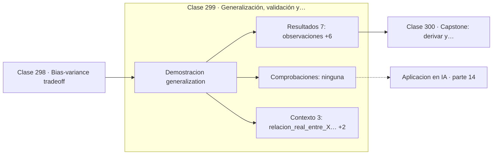

# 299 — Generalización, validación y leakage

> [⬅️ 298 Bias-variance tradeoff](../298-bias-variance-tradeoff/README.md) · [📚 Parte 14](../README.md) · [🏠 Programa](../../../README.md) · [300 Capstone: derivar y comparar 6 algoritmos ML ➡️](../300-capstone-derivar-y-comparar-6-algoritmos-ml/README.md)

**Parte:** 14 — Matemática de Machine Learning · **Nivel:** `ml-avanzado` · **Horas estimadas:** 4
**Motor:** `engines.part14` · **Demostración:** `generalization` · **Clase 19 de 20** de la parte

---

## 🎯 Propósito

**Con datos sin ninguna relación real se puede obtener un 70 % de acierto si se evalúa mal.**

Derivación matemática de los algoritmos clásicos: regresión, regularización, clasificación, kernels, árboles, ensambles, clustering, EM y compromiso sesgo-varianza.

## ✅ Resultados de aprendizaje

Al terminar podrás:

1. Explicar **Generalización, validación y leakage** con lenguaje cotidiano y con notación matemática.
2. Resolver un caso pequeño a mano y anticipar el orden de magnitud del resultado.
3. Ejecutar y modificar `lab.py`, que corre la demostración `generalization`.
4. Interpretar las 10 salidas del laboratorio y decir qué comprueba cada una.
5. Detectar el error típico de esta parte: no estandarizar antes de aplicar regularización o k-nn.

## 🧩 Fórmulas de la clase

```text
separar train, validación y test antes de mirar nada
leakage: información del test que llega al entrenamiento
validación cruzada anidada para hiperparámetros
```

## 🗺️ Ubicación en el programa



## 📖 Fundamentos

Un modelo solo vale por lo que hace con datos que no ha visto. Medir eso correctamente es
más difícil de lo que parece, y el **leakage** —cualquier filtración de información del
conjunto de evaluación al de entrenamiento— es el error que más veces produce resultados
brillantes y modelos inútiles en producción.

Sus formas son variadas y a menudo sutiles. Estandarizar usando la media de todo el
conjunto antes de separar. Seleccionar características mirando su correlación con la
etiqueta en todos los datos. Elegir hiperparámetros con el conjunto de test. Imputar
valores faltantes globalmente. Y en series temporales, mezclar pasado y futuro al hacer
validación cruzada aleatoria.

La demostración de esta clase es la más contundente posible: se generan datos donde `X` e
`y` **no tienen ninguna relación**, puro ruido, y evaluando sobre los mismos datos con los
que se entrenó se obtiene un 70 % de acierto. Con separación honesta la cifra cae al 60 %,
todavía por encima del 50 % esperado por el azar, porque con 12 características y 60
observaciones queda margen para memorizar.

La disciplina que lo evita es sencilla de enunciar: separar el test **al principio**, no
tocarlo hasta el final, hacer todo el preprocesamiento dentro de la validación cruzada, y
usar **validación anidada** cuando hay hiperparámetros. Con series temporales, separar
siempre por tiempo. Cuesta poco y es lo que distingue un resultado de una ilusión.

## 🧮 Ejemplo trabajado

Datos sin relación real entre X e y.

```text
60 observaciones, 12 características
relación real entre X e y: NINGUNA

accuracy entrenando y evaluando en todo: 0,70
accuracy en train:                       0,65
accuracy en test:                        0,60

línea base por azar: 0,50

Un 70 % de acierto sobre ruido puro, obtenido
simplemente por evaluar donde se entrenó.

Incluso el 60 % del test está inflado: con 12
características y 60 datos, hay margen de memorización.
Solo la validación repetida daría una cifra fiable.
```

## 🔬 Qué ejecuta el laboratorio

`generalization` — Validación honesta frente a leakage: la misma métrica, dos verdades.

| Grupo | Salidas |
|---|---|
| 🔢 Resultados numéricos (7) | `observaciones`, `features`, `accuracy_entrenando_y_evaluando_en_todo`, `accuracy_en_train`, `accuracy_en_test`, `brecha`, `accuracy_esperada_por_azar` |
| ✅ Comprobaciones de invariante (0) | — |

Las claves booleanas no son adorno: si alguna fuera `False`, el resultado numérico
no sería fiable aunque el programa terminase sin error.

```bash
python classes/part-14-matematica-de-machine-learning/299-generalizacion-validacion-y-leakage/lab.py
compmath run 299
```

> [!TIP]
> Antes de ejecutar, **escribe tu predicción**. Un laboratorio que confirma lo que
> esperabas enseña tanto como uno que te contradice, pero solo si la predicción
> existía antes del resultado.

## ⚠️ Errores conceptuales frecuentes

1. Estandarizar o imputar antes de separar train y test.
2. Elegir hiperparámetros con el conjunto de test.
3. Usar validación cruzada aleatoria en series temporales.

## 🚀 Dónde se usa de verdad

Diseño de experimentos de aprendizaje automático, auditoría de resultados, competiciones de
ciencia de datos y validación de modelos antes de producción.

## 🤖 Conexión con IA

Estos algoritmos siguen siendo la línea base honesta contra la que se debe comparar cualquier modelo profundo.

## 📓 Notebooks

| Archivo | Para qué |
|---|---|
| [`notebook.ipynb`](notebook.ipynb) | recorrido guiado con la demostración ejecutada |
| [`notebook_student.ipynb`](notebook_student.ipynb) | versión con `TODO` para resolver |
| [`notebook_solution.ipynb`](notebook_solution.ipynb) | solución de referencia verificada |

## 📝 Evaluación

| Criterio | Peso |
|---|---:|
| Comprensión conceptual | 25 % |
| Resolución manual | 25 % |
| Implementación y verificación | 25 % |
| Interpretación y comunicación | 15 % |
| Conexión con aplicación real | 10 % |

Detalle y criterios de error crítico en [`assessment.md`](assessment.md).

## ❓ Preguntas de comprobación

1. ¿Cuál es la entrada, cuál la salida y qué unidades tienen?
2. ¿Qué operación domina el comportamiento del resultado?
3. ¿Qué caso extremo revelaría un error conceptual?
4. ¿Cómo verificarías el resultado por un método independiente?
5. ¿Dónde aparece esto en scoring crediticio?

Si necesitas releer el código para responderlas, la clase todavía no está superada.

## 📥 Entregable

`notebook_student.ipynb` resuelto más un párrafo que explique el resultado **sin citar
código**: qué entra, qué sale, qué invariante se comprueba y qué pasaría en un caso límite.

## 🔗 Referencias

- [Kaufman, S. et al. *Leakage in data mining*, ACM TKDD, 2012](https://doi.org/10.1145/2382577.2382579) — *uso:* artículo de origen consultado en «Generalización, validación y leakage».
- [Hastie, T.; Tibshirani, R.; Friedman, J. *The Elements of Statistical Learning*, 2ª ed., Springer, 2009, cap. 7](https://hastie.su.domains/ElemStatLearn/) — *uso:* obra de referencia consultada en «Generalización, validación y leakage».

Bibliografía completa de la parte en [`../../../docs/BIBLIOGRAPHY.md`](../../../docs/BIBLIOGRAPHY.md) · localizador verificable de cada obra en [`sources/bibliography.json`](../../../sources/bibliography.json).

## 📂 Material de la clase

[`intuition.md`](intuition.md) · [`theory.md`](theory.md) · [`derivation.md`](derivation.md) · [`exercises.md`](exercises.md) · [`assessment.md`](assessment.md) · [`where-is-this-used.md`](where-is-this-used.md) · [`lesson.yaml`](lesson.yaml)

---

> [⬅️ 298 Bias-variance tradeoff](../298-bias-variance-tradeoff/README.md) · [📚 Parte 14](../README.md) · [🏠 Programa](../../../README.md) · [300 Capstone: derivar y comparar 6 algoritmos ML ➡️](../300-capstone-derivar-y-comparar-6-algoritmos-ml/README.md)
