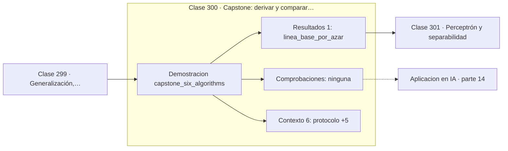

# 300 — Capstone: derivar y comparar 6 algoritmos ML

> [⬅️ 299 Generalización, validación y leakage](../299-generalizacion-validacion-y-leakage/README.md) · [📚 Parte 14](../README.md) · [🏠 Programa](../../../README.md) · [301 Perceptrón y separabilidad ➡️](../../part-15-matematica-de-deep-learning/301-perceptron-y-separabilidad/README.md)

**Parte:** 14 — Matemática de Machine Learning · **Nivel:** `ml-avanzado` · **Horas estimadas:** 4
**Motor:** `engines.part14` · **Demostración:** `capstone_six_algorithms` · **Clase 20 de 20** de la parte

---

## 🎯 Propósito

**Seis algoritmos, un mismo protocolo: lo que cambia es el objetivo que cada uno optimiza.**

Derivación matemática de los algoritmos clásicos: regresión, regularización, clasificación, kernels, árboles, ensambles, clustering, EM y compromiso sesgo-varianza.

## ✅ Resultados de aprendizaje

Al terminar podrás:

1. Explicar **Capstone: derivar y comparar 6 algoritmos ML** con lenguaje cotidiano y con notación matemática.
2. Resolver un caso pequeño a mano y anticipar el orden de magnitud del resultado.
3. Ejecutar y modificar `lab.py`, que corre la demostración `capstone_six_algorithms`.
4. Interpretar las 7 salidas del laboratorio y decir qué comprueba cada una.
5. Detectar el error típico de esta parte: elegir hiperparámetros con el conjunto de test.

## 🧩 Fórmulas de la clase

```text
mismo split, misma semilla, mismas características
línea base por azar: 0,5 en binario equilibrado
empate en accuracy ⟹ decidir por otros criterios
```

## 🗺️ Ubicación en el programa



## 📖 Fundamentos

El capstone entrena seis algoritmos sobre los mismos datos con el mismo protocolo:
idéntica partición, idéntica semilla, idénticas características. Solo así la comparación
mide el algoritmo y no las condiciones del experimento, que es la lección de la clase 260
aplicada aquí.

El resultado es que **todos aciertan el 100 %**, y eso es informativo en sí mismo: cuando
el problema es fácil, la elección de algoritmo no importa. Comparar modelos sobre datos
separables no distingue nada, y muchas comparaciones publicadas adolecen de ese defecto.
Un problema que no discrimina entre métodos no sirve para elegir método.

Lo que sí distingue a los seis es **qué objetivo optimiza cada uno**: la regresión logística
maximiza la log-verosimilitud, el clasificador por centroides minimiza distancia a la
media, k-NN no optimiza nada porque no entrena, Naive Bayes maximiza la posterior bajo
independencia, el árbol minimiza impureza y la SVM maximiza el margen. Seis objetivos
distintos, seis fronteras distintas, la misma respuesta en este conjunto.

Cuando el accuracy empata, la decisión debe tomarse con otros criterios, y conviene tenerlos
listos: interpretabilidad, coste de inferencia, calidad de las probabilidades, robustez
ante datos desplazados y facilidad de mantenimiento. Elegir el modelo con 0,3 puntos más de
accuracy ignorando que cuesta cien veces más en inferencia es una mala decisión de
ingeniería.

## 🧮 Ejemplo trabajado

Seis algoritmos bajo el mismo protocolo.

```text
protocolo: 80 observaciones, 56 train / 24 test
           semilla 20260821, mismas características

algoritmo                accuracy test    objetivo optimizado
regresión logística          1,00       log-verosimilitud
centroides                   1,00       distancia a la media
k-NN (k=5)                   1,00       ninguno, sin entrenar
Naive Bayes                  1,00       posterior con independencia
árbol de decisión            1,00       impureza
SVM lineal                   1,00       margen máximo

línea base por azar: 0,50

Empate total: el problema es demasiado fácil para
discriminar entre métodos.

Criterios de desempate: interpretabilidad, coste de
inferencia, calibración y robustez.
```

## 🔬 Qué ejecuta el laboratorio

`capstone_six_algorithms` — Capstone: seis algoritmos derivados y comparados sobre los mismos datos.

| Grupo | Salidas |
|---|---|
| 🔢 Resultados numéricos (1) | `linea_base_por_azar` |
| ✅ Comprobaciones de invariante (0) | — |

Las claves booleanas no son adorno: si alguna fuera `False`, el resultado numérico
no sería fiable aunque el programa terminase sin error.

```bash
python classes/part-14-matematica-de-machine-learning/300-capstone-derivar-y-comparar-6-algoritmos-ml/lab.py
compmath run 300
```

> [!TIP]
> Antes de ejecutar, **escribe tu predicción**. Un laboratorio que confirma lo que
> esperabas enseña tanto como uno que te contradice, pero solo si la predicción
> existía antes del resultado.

## ⚠️ Errores conceptuales frecuentes

1. Comparar algoritmos sin fijar semilla ni partición.
2. Sacar conclusiones de un problema donde todos empatan.
3. Elegir modelo solo por accuracy, ignorando coste y calibración.

## 🚀 Dónde se usa de verdad

Selección de modelo en proyectos reales, informes de evaluación, decisiones de arquitectura
y establecimiento de líneas base antes de probar modelos profundos.

## 🤖 Conexión con IA

Estos algoritmos siguen siendo la línea base honesta contra la que se debe comparar cualquier modelo profundo.

## 📓 Notebooks

| Archivo | Para qué |
|---|---|
| [`notebook.ipynb`](notebook.ipynb) | recorrido guiado con la demostración ejecutada |
| [`notebook_student.ipynb`](notebook_student.ipynb) | versión con `TODO` para resolver |
| [`notebook_solution.ipynb`](notebook_solution.ipynb) | solución de referencia verificada |

## 📝 Evaluación

| Criterio | Peso |
|---|---:|
| Comprensión conceptual | 25 % |
| Resolución manual | 25 % |
| Implementación y verificación | 25 % |
| Interpretación y comunicación | 15 % |
| Conexión con aplicación real | 10 % |

Detalle y criterios de error crítico en [`assessment.md`](assessment.md).

## ❓ Preguntas de comprobación

1. ¿Cuál es la entrada, cuál la salida y qué unidades tienen?
2. ¿Qué operación domina el comportamiento del resultado?
3. ¿Qué caso extremo revelaría un error conceptual?
4. ¿Cómo verificarías el resultado por un método independiente?
5. ¿Dónde aparece esto en scoring crediticio?

Si necesitas releer el código para responderlas, la clase todavía no está superada.

## 📥 Entregable

`notebook_student.ipynb` resuelto más un párrafo que explique el resultado **sin citar
código**: qué entra, qué sale, qué invariante se comprueba y qué pasaría en un caso límite.

## 🔗 Referencias

- [Hastie, T.; Tibshirani, R.; Friedman, J. *The Elements of Statistical Learning*, 2ª ed., Springer, 2009](https://hastie.su.domains/ElemStatLearn/) — *uso:* obra de referencia consultada en «Capstone: derivar y comparar 6 algoritmos ML».
- [Demšar, J. *Statistical comparisons of classifiers over multiple data sets*, JMLR, 2006](https://jmlr.org/papers/v7/demsar06a.html) — *uso:* obra de referencia consultada en «Capstone: derivar y comparar 6 algoritmos ML».

Bibliografía completa de la parte en [`../../../docs/BIBLIOGRAPHY.md`](../../../docs/BIBLIOGRAPHY.md) · localizador verificable de cada obra en [`sources/bibliography.json`](../../../sources/bibliography.json).

## 📂 Material de la clase

[`intuition.md`](intuition.md) · [`theory.md`](theory.md) · [`derivation.md`](derivation.md) · [`exercises.md`](exercises.md) · [`assessment.md`](assessment.md) · [`where-is-this-used.md`](where-is-this-used.md) · [`lesson.yaml`](lesson.yaml)

---

> [⬅️ 299 Generalización, validación y leakage](../299-generalizacion-validacion-y-leakage/README.md) · [📚 Parte 14](../README.md) · [🏠 Programa](../../../README.md) · [301 Perceptrón y separabilidad ➡️](../../part-15-matematica-de-deep-learning/301-perceptron-y-separabilidad/README.md)
