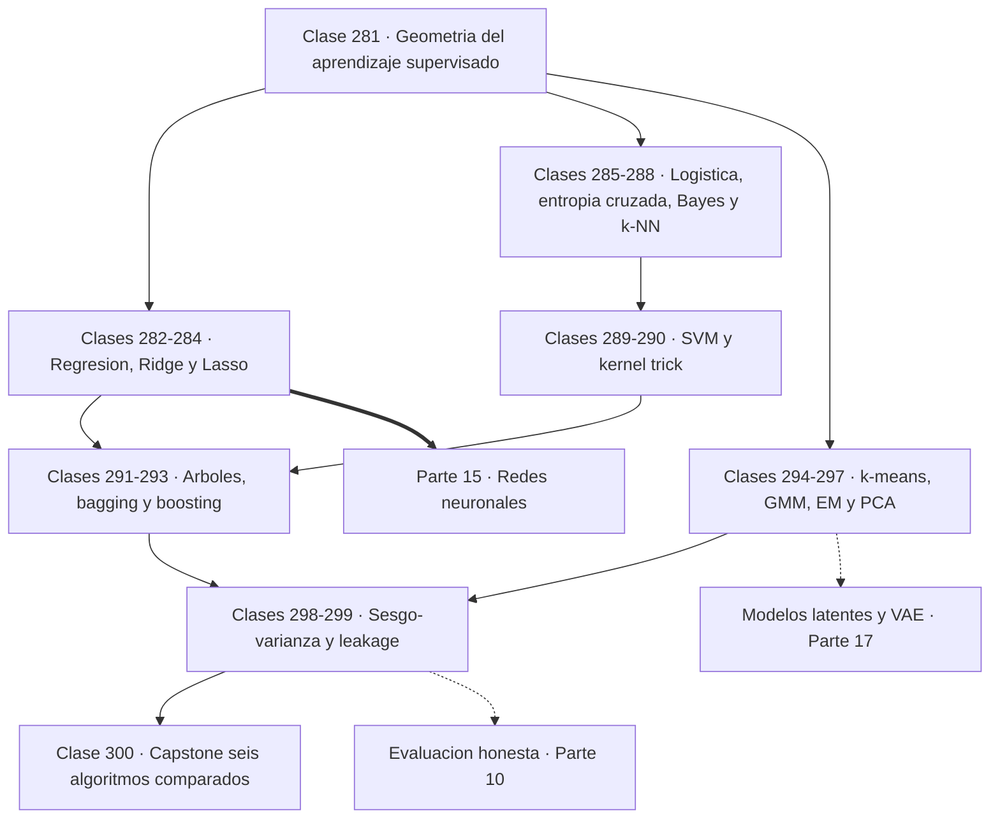

# 🤖 Parte 14 — Matemática de Machine Learning

> [⬅️ Parte 13 — Teoría de la información, señales y series](../part-13-teoria-de-la-informacion-senales-y-series/README.md) · [🏠 Programa](../../README.md) · [📇 Catálogo](../README.md) · [Parte 15 — Matemática de Deep Learning ➡️](../part-15-matematica-de-deep-learning/README.md)

**Nivel:** `ml-avanzado` · **Clases:** 20 · **Horas estimadas:** 80 · **Motor:** [`part14.py`](../../src/computational_math/engines/part14.py)

---

## 🎯 De qué trata esta parte

Derivación matemática de los algoritmos clásicos: regresión, regularización, clasificación, kernels, árboles, ensambles, clustering, EM y compromiso sesgo-varianza.

Los algoritmos clásicos de aprendizaje automático se suelen presentar como una colección de
recetas con nombres propios. No lo son. Cada uno es **una función objetivo más un método de
optimización**, y una vez visto así el catálogo deja de ser una lista que memorizar y pasa a
ser un conjunto de decisiones de diseño comparables entre sí. Esta parte deriva esos
algoritmos desde sus objetivos, usando exactamente la matemática de las partes anteriores.

Las clases 281 a 284 empiezan por la regresión y su regularización. Regresión lineal es
mínimos cuadrados, que ya se resolvió en la parte 05 como proyección y en la parte 11 como
problema numérico. **Ridge** y **Lasso** resuelven el mismo problema con normas distintas, y
la diferencia no es cosmética: la bola L2 es redonda y encoge todos los coeficientes sin
anularlos; la bola L1 tiene **vértices sobre los ejes** y por eso el óptimo cae en ellos,
produciendo ceros exactos. Esa geometría explica por qué Lasso selecciona variables y Ridge
no, y es una de las conexiones más limpias entre álgebra y estadística de todo el programa.

Las clases 285 a 290 tratan la clasificación. La regresión logística se deriva de la
log-verosimilitud, y su gradiente resulta ser `(p − y)·x`: **idéntico en forma** al de la
regresión lineal, que es lo que permite tratar ambos casos con el mismo código. La entropía
cruzada penaliza sin cota la confianza equivocada, a diferencia del error cuadrático, y eso
es exactamente lo que se quiere. Naive Bayes declara un supuesto de independencia que casi
siempre es falso y funciona igual, porque la decisión solo necesita el orden de las
probabilidades y no su valor. k-NN no tiene entrenamiento pero depende críticamente de la
métrica y del escalado. Y SVM introduce el **margen máximo** y el **kernel trick**: calcular
productos escalares en un espacio de dimensión enorme sin construirlo jamás.

Las clases 291 a 293 recorren los métodos basados en árboles, que siguen siendo el estado
del arte en datos tabulares. Un árbol elige cortes minimizando impureza; el **bagging**
promedia modelos decorrelacionados y reduce la varianza según una fórmula explícita que
muestra por qué la decorrelación importa más que el número de árboles; y el **boosting** es
descenso de gradiente en el espacio de funciones, donde cada modelo nuevo corrige el residuo
del conjunto anterior.

Las clases 294 a 297 pasan al aprendizaje no supervisado. k-means es minimización de inercia
con asignación dura; las mezclas de gaussianas la hacen **blanda** y probabilística; y EM es
el algoritmo general que las entrena, alternando expectativa y maximización con la garantía
de que la verosimilitud nunca baja. PCA cierra el bloque como preprocesamiento y como
aplicación directa de la SVD de la parte 06.

Las dos últimas clases antes del capstone son las que más determinan si un proyecto real
funciona. La descomposición **sesgo-varianza** explica por qué un modelo más complejo no es
mejor, y se mide aquí por simulación en vez de enunciarse. Y el **leakage** es el error que
produce métricas excelentes y modelos inútiles: la demostración usa datos donde `X` e `y` no
guardan ninguna relación y aun así se obtiene un 70 % de acierto si se evalúa mal. Ese 70 %
sobre ruido puro es la advertencia más útil de la parte.

## 🗺️ Mapa conceptual



## 🧠 Ideas centrales

- Cada algoritmo es un objetivo más un método de optimización; nada más.
- Ridge y Lasso resuelven el mismo problema con normas distintas y geometría distinta.
- El kernel trick evita construir el espacio de características explícitamente.
- El error de generalización se descompone en sesgo, varianza y ruido irreducible.
- El leakage produce métricas excelentes y modelos inútiles.

## 🤖 Por qué importa en IA

> [!IMPORTANT]
> Estos algoritmos siguen siendo la línea base honesta contra la que se debe comparar cualquier modelo profundo.

## ⚠️ Errores frecuentes de esta parte

- No estandarizar antes de aplicar regularización o k-NN.
- Elegir hiperparámetros con el conjunto de test.
- Interpretar coeficientes de un modelo con features correlacionadas.

## 🧭 Secuencia de la parte

```mermaid
flowchart LR
    subgraph B1["Bloque 1"]
        direction TB
        L281["281 · Geometría del aprendizaje…"]
        L282["282 · Regresión lineal desde…"]
        L283["283 · Ridge y regularización L2"]
        L284["284 · Lasso y regularización L1"]
        L285["285 · Regresión logística y sigmoid"]
        L281 --> L282
        L282 --> L283
        L283 --> L284
        L284 --> L285
    end
    subgraph B2["Bloque 2"]
        direction TB
        L286["286 · Cross-entropy en clasificación"]
        L287["287 · Naive Bayes"]
        L288["288 · k-Nearest Neighbors y métricas"]
        L289["289 · SVM y margen máximo"]
        L290["290 · Kernel trick"]
        L286 --> L287
        L287 --> L288
        L288 --> L289
        L289 --> L290
    end
    subgraph B3["Bloque 3"]
        direction TB
        L291["291 · Árboles: entropía y Gini"]
        L292["292 · Random Forest desde…"]
        L293["293 · Boosting y descenso funcional"]
        L294["294 · k-means como optimización"]
        L295["295 · Gaussian Mixture Models"]
        L291 --> L292
        L292 --> L293
        L293 --> L294
        L294 --> L295
    end
    subgraph B4["Bloque 4"]
        direction TB
        L296["296 · EM algorithm"]
        L297["297 · PCA aplicado a ML"]
        L298["298 · Bias-variance tradeoff"]
        L299["299 · Generalización, validación y…"]
        L300["300 · Capstone: derivar y comparar…"]
        L296 --> L297
        L297 --> L298
        L298 --> L299
        L299 --> L300
    end
    L285 --> L286
    L290 --> L291
    L295 --> L296
```



## 📚 Las clases

| # | Clase | Demostración | Idea central |
|---|---|---|---|
| `281` | [Geometría del aprendizaje supervisado](281-geometria-del-aprendizaje-supervisado/README.md) | `supervised_geometry` | Aprender de forma supervisada es encontrar una frontera en el espacio de características. |
| `282` | [Regresión lineal desde mínimos cuadrados](282-regresion-lineal-desde-minimos-cuadrados/README.md) | `linear_regression` | Regresión lineal tiene solución cerrada, y el descenso de gradiente llega al mismo sitio. |
| `283` | [Ridge y regularización L2](283-ridge-y-regularizacion-l2/README.md) | `ridge` | Ridge encoge los coeficientes y con ello arregla el mal condicionamiento. |
| `284` | [Lasso y regularización L1](284-lasso-y-regularizacion-l1/README.md) | `lasso` | La bola L1 tiene vértices sobre los ejes, y por eso Lasso produce ceros exactos. |
| `285` | [Regresión logística y sigmoid](285-regresion-logistica-y-sigmoid/README.md) | `logistic_regression` | El gradiente de la regresión logística es (p − y)·x, idéntico en forma al de la lineal. |
| `286` | [Cross-entropy en clasificación](286-cross-entropy-en-clasificacion/README.md) | `classification_loss` | Estar seguro y equivocado cuesta sin límite con entropía cruzada, y poco con error cuadrático. |
| `287` | [Naive Bayes](287-naive-bayes/README.md) | `naive_bayes` | Naive Bayes supone algo falso y clasifica bien, porque solo necesita el orden. |
| `288` | [k-Nearest Neighbors y métricas](288-k-nearest-neighbors-y-metricas/README.md) | `knn` | k-NN no entrena nada, y por eso la métrica y el escalado lo deciden todo. |
| `289` | [SVM y margen máximo](289-svm-y-margen-maximo/README.md) | `svm_margin` | Maximizar el margen equivale a minimizar la norma de w, y solo unos pocos puntos deciden. |
| `290` | [Kernel trick](290-kernel-trick/README.md) | `kernel_trick` | El kernel calcula el producto escalar en el espacio expandido sin construirlo nunca. |
| `291` | [Árboles: entropía y Gini](291-arboles-entropia-y-gini/README.md) | `tree_impurity` | Un árbol elige el corte que más reduce la impureza, y Gini y entropía casi siempre coinciden. |
| `292` | [Random Forest desde probabilidad](292-random-forest-desde-probabilidad/README.md) | `random_forest` | Promediar modelos solo reduce la varianza en la medida en que estén decorrelacionados. |
| `293` | [Boosting y descenso funcional](293-boosting-y-descenso-funcional/README.md) | `boosting` | Boosting es descenso de gradiente en el espacio de funciones: cada modelo ajusta el residuo. |
| `294` | [k-means como optimización](294-k-means-como-optimizacion/README.md) | `kmeans` | k-means minimiza la inercia alternando asignación y recálculo, y nunca empeora. |
| `295` | [Gaussian Mixture Models](295-gaussian-mixture-models/README.md) | `gmm` | Una mezcla de gaussianas asigna probabilidades en vez de etiquetas, y modela grupos de formas distintas. |
| `296` | [EM algorithm](296-em-algorithm/README.md) | `em_algorithm` | EM alterna estimar lo latente y optimizar los parámetros, y la verosimilitud nunca baja. |
| `297` | [PCA aplicado a ML](297-pca-aplicado-a-ml/README.md) | `pca_ml` | PCA elige las direcciones de máxima varianza, y a menudo unas pocas bastan. |
| `298` | [Bias-variance tradeoff](298-bias-variance-tradeoff/README.md) | `bias_variance` | El error se descompone en sesgo, varianza y ruido, y solo los dos primeros se pueden tocar. |
| `299` | [Generalización, validación y leakage](299-generalizacion-validacion-y-leakage/README.md) | `generalization` | Con datos sin ninguna relación real se puede obtener un 70 % de acierto si se evalúa mal. |
| `300` | [Capstone: derivar y comparar 6 algoritmos ML](300-capstone-derivar-y-comparar-6-algoritmos-ml/README.md) | `capstone_six_algorithms` | Seis algoritmos, un mismo protocolo: lo que cambia es el objetivo que cada uno optimiza. |

## 📖 Glosario de la parte (38 términos)

Definiciones precisas en [`GLOSARIO.md`](GLOSARIO.md).

## 🧰 Stack de referencia

`math`, `random`, `numpy (opcional)`, `scikit-learn (opcional)`

Los laboratorios se ejecutan con biblioteca estándar; estas herramientas aparecen
como contraste profesional, no como requisito.

## 🧪 Ejecutar toda la parte

```bash
compmath run --part 14
compmath catalog --part 14
```

## 📊 Evaluación de la parte

| Componente | Peso |
|---|---:|
| Clases y ejercicios | 40 % |
| Laboratorios y notebooks | 25 % |
| Explicación oral o escrita | 15 % |
| Capstone ([300](300-capstone-derivar-y-comparar-6-algoritmos-ml/README.md)) | 20 % |

## 📖 Bibliografía

- Hastie, T.; Tibshirani, R.; Friedman, J. *The Elements of Statistical Learning*. 2ª ed., Springer, 2009.
- Bishop, C. *Pattern Recognition and Machine Learning*. Springer, 2006.
- Murphy, K. *Probabilistic Machine Learning: An Introduction*. MIT Press, 2022.

---

> [⬅️ Parte 13 — Teoría de la información, señales y series](../part-13-teoria-de-la-informacion-senales-y-series/README.md) · [🏠 Programa](../../README.md) · [📇 Catálogo](../README.md) · [Parte 15 — Matemática de Deep Learning ➡️](../part-15-matematica-de-deep-learning/README.md)
