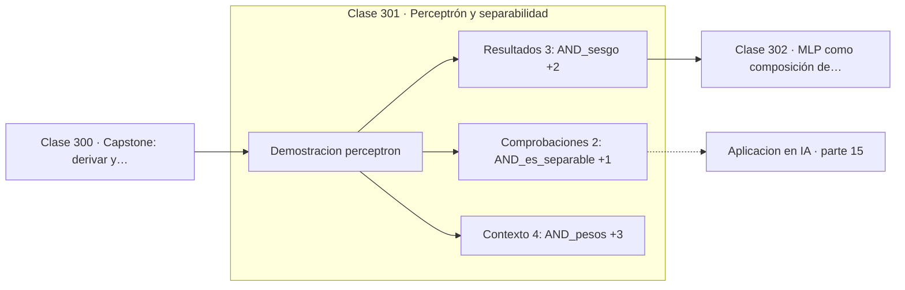

# 301 — Perceptrón y separabilidad

> [⬅️ 300 Capstone: derivar y comparar 6 algoritmos ML](../../part-14-matematica-de-machine-learning/300-capstone-derivar-y-comparar-6-algoritmos-ml/README.md) · [📚 Parte 15](../README.md) · [🏠 Programa](../../../README.md) · [302 MLP como composición de funciones ➡️](../302-mlp-como-composicion-de-funciones/README.md)

**Parte:** 15 — Matemática de Deep Learning · **Nivel:** `deep-learning` · **Horas estimadas:** 4
**Motor:** `engines.part15` · **Demostración:** `perceptron` · **Clase 1 de 20** de la parte

---

## 🎯 Propósito

**El perceptrón converge siempre en datos separables y nunca en XOR.**

Perceptrón, MLP, activaciones, pérdidas, backpropagation paso a paso, grafos de cómputo, inicialización, normalización, convolución, recurrencia y embeddings.

## ✅ Resultados de aprendizaje

Al terminar podrás:

1. Explicar **Perceptrón y separabilidad** con lenguaje cotidiano y con notación matemática.
2. Resolver un caso pequeño a mano y anticipar el orden de magnitud del resultado.
3. Ejecutar y modificar `lab.py`, que corre la demostración `perceptron`.
4. Interpretar las 9 salidas del laboratorio y decir qué comprueba cada una.
5. Detectar el error típico de esta parte: inicializar todos los pesos iguales y romper la simetría nunca.

## 🧩 Fórmulas de la clase

```text
salida = 1 si wᵀx + b > 0, si no 0
actualización: w ← w + η·(y − ŷ)·x
teorema de convergencia: finito si hay separabilidad
```

## 🗺️ Ubicación en el programa



## 📖 Fundamentos

El perceptrón de Rosenblatt es la unidad mínima: una suma ponderada de las entradas
seguida de un umbral. Su regla de aprendizaje es directa —cuando se equivoca, mueve los
pesos en la dirección del ejemplo mal clasificado— y tiene una garantía teórica sólida.

El **teorema de convergencia del perceptrón** dice que si los datos son linealmente
separables, el algoritmo encuentra un separador en un número finito de pasos. Es un
resultado fuerte y raro en aprendizaje automático: una garantía absoluta, sin condiciones
sobre el orden de los datos ni sobre la inicialización.

El problema es la otra cara. Si los datos **no** son separables, el algoritmo no converge
nunca: sigue oscilando indefinidamente sin acercarse a nada. Y la función XOR, con apenas
cuatro puntos, no es separable: no hay recta que deje `(0,0)` y `(1,1)` a un lado y
`(0,1)` y `(1,0)` al otro.

Ese ejemplo de cuatro puntos tuvo consecuencias históricas desproporcionadas. Minsky y
Papert lo publicaron en 1969, la financiación se retiró y el campo entró en el primer
invierno de la inteligencia artificial. La solución —apilar capas— ya se intuía, pero
faltaba el algoritmo para entrenarlas, y backpropagation no se popularizó hasta 1986.

## 🧮 Ejemplo trabajado

El mismo algoritmo sobre AND y sobre XOR.

```text
AND (separable):
  pesos aprendidos: (2,0 ; 1,0)     sesgo: −2,0
  errores tras 100 épocas: 0                         ✓

  Comprobación:
    (0,0): 0·2 + 0·1 − 2 = −2  →  0                  ✓
    (1,1): 1·2 + 1·1 − 2 =  1  →  1                  ✓

XOR (no separable):
  errores tras 100 épocas: 4
  el algoritmo oscila sin converger                   ✗

No es un problema del algoritmo: no existe ninguna recta
que separe los cuatro puntos de XOR.
```

## 🔬 Qué ejecuta el laboratorio

`perceptron` — Perceptrón: converge si y solo si los datos son linealmente separables.

| Grupo | Salidas |
|---|---|
| 🔢 Resultados numéricos (3) | `AND_sesgo`, `AND_errores_tras_100_epocas`, `XOR_errores_tras_100_epocas` |
| ✅ Comprobaciones de invariante (2) | `AND_es_separable`, `XOR_es_separable` |

Las claves booleanas no son adorno: si alguna fuera `False`, el resultado numérico
no sería fiable aunque el programa terminase sin error.

```bash
python classes/part-15-matematica-de-deep-learning/301-perceptron-y-separabilidad/lab.py
compmath run 301
```

> [!TIP]
> Antes de ejecutar, **escribe tu predicción**. Un laboratorio que confirma lo que
> esperabas enseña tanto como uno que te contradice, pero solo si la predicción
> existía antes del resultado.

## ⚠️ Errores conceptuales frecuentes

1. Esperar convergencia del perceptrón con datos no separables.
2. Concluir que la red no puede aprender cuando el problema es de arquitectura.
3. Confundir el perceptrón clásico con la regresión logística, que sí da probabilidades.

## 🚀 Dónde se usa de verdad

Comprensión histórica del campo, línea base mínima, comprobación de separabilidad y
unidad básica de toda red neuronal.

## 🤖 Conexión con IA

Toda arquitectura moderna, incluido el Transformer, se construye sobre estos bloques y sobre este mismo mecanismo de derivación.

## 📓 Notebooks

| Archivo | Para qué |
|---|---|
| [`notebook.ipynb`](notebook.ipynb) | recorrido guiado con la demostración ejecutada |
| [`notebook_student.ipynb`](notebook_student.ipynb) | versión con `TODO` para resolver |
| [`notebook_solution.ipynb`](notebook_solution.ipynb) | solución de referencia verificada |

## 📝 Evaluación

| Criterio | Peso |
|---|---:|
| Comprensión conceptual | 25 % |
| Resolución manual | 25 % |
| Implementación y verificación | 25 % |
| Interpretación y comunicación | 15 % |
| Conexión con aplicación real | 10 % |

Detalle y criterios de error crítico en [`assessment.md`](assessment.md).

## ❓ Preguntas de comprobación

1. ¿Cuál es la entrada, cuál la salida y qué unidades tienen?
2. ¿Qué operación domina el comportamiento del resultado?
3. ¿Qué caso extremo revelaría un error conceptual?
4. ¿Cómo verificarías el resultado por un método independiente?
5. ¿Dónde aparece esto en visión?

Si necesitas releer el código para responderlas, la clase todavía no está superada.

## 📥 Entregable

`notebook_student.ipynb` resuelto más un párrafo que explique el resultado **sin citar
código**: qué entra, qué sale, qué invariante se comprueba y qué pasaría en un caso límite.

## 🔗 Referencias

- [Rosenblatt, F. *The perceptron: a probabilistic model*, Psychological Review, 1958](https://doi.org/10.1037/h0042519) — *uso:* artículo de origen consultado en «Perceptrón y separabilidad».
- [Minsky, M.; Papert, S. *Perceptrons*, MIT Press, 1969](https://mitpress.mit.edu/9780262534772/perceptrons/) — *uso:* desarrollo formal del tema en «Perceptrón y separabilidad».

Bibliografía completa de la parte en [`../../../docs/BIBLIOGRAPHY.md`](../../../docs/BIBLIOGRAPHY.md) · localizador verificable de cada obra en [`sources/bibliography.json`](../../../sources/bibliography.json).

## 📂 Material de la clase

[`intuition.md`](intuition.md) · [`theory.md`](theory.md) · [`derivation.md`](derivation.md) · [`exercises.md`](exercises.md) · [`assessment.md`](assessment.md) · [`where-is-this-used.md`](where-is-this-used.md) · [`lesson.yaml`](lesson.yaml)

---

> [⬅️ 300 Capstone: derivar y comparar 6 algoritmos ML](../../part-14-matematica-de-machine-learning/300-capstone-derivar-y-comparar-6-algoritmos-ml/README.md) · [📚 Parte 15](../README.md) · [🏠 Programa](../../../README.md) · [302 MLP como composición de funciones ➡️](../302-mlp-como-composicion-de-funciones/README.md)
