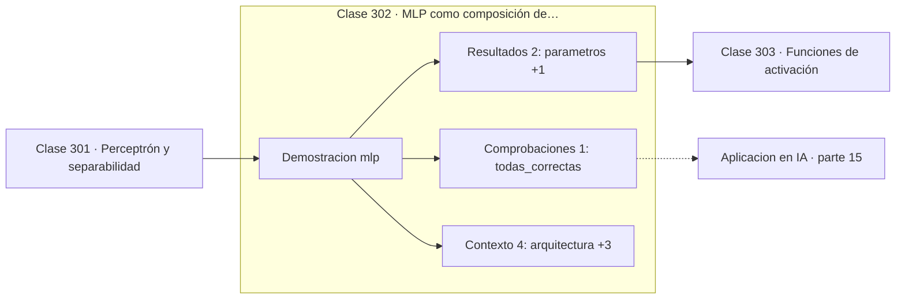

# 302 — MLP como composición de funciones

> [⬅️ 301 Perceptrón y separabilidad](../301-perceptron-y-separabilidad/README.md) · [📚 Parte 15](../README.md) · [🏠 Programa](../../../README.md) · [303 Funciones de activación ➡️](../303-funciones-de-activacion/README.md)

**Parte:** 15 — Matemática de Deep Learning · **Nivel:** `deep-learning` · **Horas estimadas:** 4
**Motor:** `engines.part15` · **Demostración:** `mlp` · **Clase 2 de 20** de la parte

---

## 🎯 Propósito

**Sin no linealidad entre capas, cien capas siguen siendo una sola transformación lineal.**

Perceptrón, MLP, activaciones, pérdidas, backpropagation paso a paso, grafos de cómputo, inicialización, normalización, convolución, recurrencia y embeddings.

## ✅ Resultados de aprendizaje

Al terminar podrás:

1. Explicar **MLP como composición de funciones** con lenguaje cotidiano y con notación matemática.
2. Resolver un caso pequeño a mano y anticipar el orden de magnitud del resultado.
3. Ejecutar y modificar `lab.py`, que corre la demostración `mlp`.
4. Interpretar las 7 salidas del laboratorio y decir qué comprueba cada una.
5. Detectar el error típico de esta parte: aplicar softmax sin restar el máximo y provocar overflow.

## 🧩 Fórmulas de la clase

```text
MLP: f(x) = W₂·σ(W₁x + b₁) + b₂
sin σ:  W₂(W₁x + b₁) + b₂ = W'x + b'
XOR: 2 → 4 (tanh) → 1 (sigmoid)
```

## 🗺️ Ubicación en el programa



## 📖 Fundamentos

Un perceptrón multicapa apila transformaciones lineales con una función no lineal entre
ellas. La no linealidad no es un adorno: **es lo único que hace que la profundidad
importe**. Componer dos transformaciones lineales da otra transformación lineal, y por
tanto una red sin activaciones, por profunda que sea, no puede hacer más que un modelo
lineal de una capa.

Con no linealidad, la capa oculta hace algo cualitativamente distinto: **transforma el
espacio**. Las neuronas ocultas no clasifican; construyen una nueva representación de la
entrada en la que el problema original se vuelve separable, y la capa de salida se limita a
trazar el hiperplano en ese espacio nuevo.

XOR es la demostración mínima. En el espacio original no hay recta que sirva; tras pasar
por cuatro neuronas tanh, los cuatro puntos ocupan posiciones en las que sí la hay. Con 17
parámetros y unas cientos de épocas, el problema que hundió el campo en 1969 se resuelve.

El **teorema de aproximación universal** garantiza que una sola capa oculta suficientemente
ancha aproxima cualquier función continua con la precisión que se quiera. Conviene leer con
cuidado lo que **no** dice: no dice cuántas neuronas hacen falta —pueden ser
exponencialmente muchas—, ni que el entrenamiento vaya a encontrarlas. Es un resultado de
existencia, no de aprendibilidad, y la profundidad resulta ser mucho más eficiente en
parámetros que la anchura.

## 🧮 Ejemplo trabajado

MLP resolviendo XOR con 17 parámetros.

```text
arquitectura: 2 → 4 (tanh) → 1 (sigmoid)
parámetros: 17

época      pérdida
   1      1,0765723
 100      0,0249xxx
 500      0,00xxxxx

predicciones finales:
  (0,0) → 0,000049      esperado 0                   ✓
  (0,1) → 0,999856      esperado 1                   ✓
  (1,0) → 0,999829      esperado 1                   ✓
  (1,1) → 0,000xxx      esperado 0                   ✓

Sin tanh entre las capas, el modelo colapsaría a
una única transformación lineal y fallaría igual
que el perceptrón.
```

## 🔬 Qué ejecuta el laboratorio

`mlp` — MLP resolviendo XOR: la capa oculta crea una representación separable.

| Grupo | Salidas |
|---|---|
| 🔢 Resultados numéricos (2) | `parametros`, `semilla` |
| ✅ Comprobaciones de invariante (1) | `todas_correctas` |

Las claves booleanas no son adorno: si alguna fuera `False`, el resultado numérico
no sería fiable aunque el programa terminase sin error.

```bash
python classes/part-15-matematica-de-deep-learning/302-mlp-como-composicion-de-funciones/lab.py
compmath run 302
```

> [!TIP]
> Antes de ejecutar, **escribe tu predicción**. Un laboratorio que confirma lo que
> esperabas enseña tanto como uno que te contradice, pero solo si la predicción
> existía antes del resultado.

## ⚠️ Errores conceptuales frecuentes

1. Apilar capas lineales sin activación entre ellas.
2. Interpretar el teorema de aproximación universal como garantía de entrenabilidad.
3. Aumentar la anchura cuando el problema pide profundidad.

## 🚀 Dónde se usa de verdad

Bloque básico de toda arquitectura moderna, capas feed-forward de los Transformers,
cabezas de clasificación y aproximación de funciones.

## 🤖 Conexión con IA

Toda arquitectura moderna, incluido el Transformer, se construye sobre estos bloques y sobre este mismo mecanismo de derivación.

## 📓 Notebooks

| Archivo | Para qué |
|---|---|
| [`notebook.ipynb`](notebook.ipynb) | recorrido guiado con la demostración ejecutada |
| [`notebook_student.ipynb`](notebook_student.ipynb) | versión con `TODO` para resolver |
| [`notebook_solution.ipynb`](notebook_solution.ipynb) | solución de referencia verificada |

## 📝 Evaluación

| Criterio | Peso |
|---|---:|
| Comprensión conceptual | 25 % |
| Resolución manual | 25 % |
| Implementación y verificación | 25 % |
| Interpretación y comunicación | 15 % |
| Conexión con aplicación real | 10 % |

Detalle y criterios de error crítico en [`assessment.md`](assessment.md).

## ❓ Preguntas de comprobación

1. ¿Cuál es la entrada, cuál la salida y qué unidades tienen?
2. ¿Qué operación domina el comportamiento del resultado?
3. ¿Qué caso extremo revelaría un error conceptual?
4. ¿Cómo verificarías el resultado por un método independiente?
5. ¿Dónde aparece esto en visión?

Si necesitas releer el código para responderlas, la clase todavía no está superada.

## 📥 Entregable

`notebook_student.ipynb` resuelto más un párrafo que explique el resultado **sin citar
código**: qué entra, qué sale, qué invariante se comprueba y qué pasaría en un caso límite.

## 📚 Bibliografía de la clase

Esta clase enseña **Deep learning**. Cada obra dice qué aporta aquí y cómo se comprobó su localizador:

- [Rumelhart, D.; Hinton, G.; Williams, R. *Learning representations by back-propagating errors*, Nature, 1986](https://doi.org/10.1038/323533a0) — Deep learning: el tema de esta clase · DOI `10.1038/323533a0` verificado en Crossref (2026-08-19).
- [Cybenko, G. *Approximation by superpositions of a sigmoidal function*, 1989](https://doi.org/10.1007/BF02551274) — Deep learning: el tema de esta clase · DOI `10.1007/bf02551274` verificado en Crossref (2026-08-19).

Bibliografía de todas las clases, con el porqué de cada obra, en [`docs/BIBLIOGRAPHY.md`](../../../docs/BIBLIOGRAPHY.md) · localizador y estado de cada obra en [`sources/bibliography.json`](../../../sources/bibliography.json).

## 📂 Material de la clase

[`intuition.md`](intuition.md) · [`theory.md`](theory.md) · [`derivation.md`](derivation.md) · [`exercises.md`](exercises.md) · [`assessment.md`](assessment.md) · [`where-is-this-used.md`](where-is-this-used.md) · [`lesson.yaml`](lesson.yaml)

---

> [⬅️ 301 Perceptrón y separabilidad](../301-perceptron-y-separabilidad/README.md) · [📚 Parte 15](../README.md) · [🏠 Programa](../../../README.md) · [303 Funciones de activación ➡️](../303-funciones-de-activacion/README.md)
