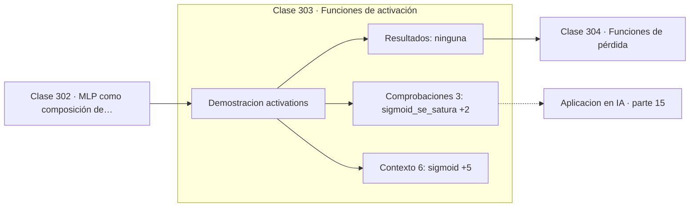

# 303 — Funciones de activación

> [⬅️ 302 MLP como composición de funciones](../302-mlp-como-composicion-de-funciones/README.md) · [📚 Parte 15](../README.md) · [🏠 Programa](../../../README.md) · [304 Funciones de pérdida ➡️](../304-funciones-de-perdida/README.md)

**Parte:** 15 — Matemática de Deep Learning · **Nivel:** `deep-learning` · **Horas estimadas:** 4
**Motor:** `engines.part15` · **Demostración:** `activations` · **Clase 3 de 20** de la parte

---

## 🎯 Propósito

**La derivada máxima de la sigmoide es 0,25: cada capa divide el gradiente por cuatro como mínimo.**

Perceptrón, MLP, activaciones, pérdidas, backpropagation paso a paso, grafos de cómputo, inicialización, normalización, convolución, recurrencia y embeddings.

## ✅ Resultados de aprendizaje

Al terminar podrás:

1. Explicar **Funciones de activación** con lenguaje cotidiano y con notación matemática.
2. Resolver un caso pequeño a mano y anticipar el orden de magnitud del resultado.
3. Ejecutar y modificar `lab.py`, que corre la demostración `activations`.
4. Interpretar las 9 salidas del laboratorio y decir qué comprueba cada una.
5. Detectar el error típico de esta parte: mezclar estadísticas de batch normalization entre entrenamiento e inferencia.

## 🧩 Fórmulas de la clase

```text
σ(x) = 1/(1+e⁻ˣ),   σ' ≤ 0,25
tanh' ≤ 1,   ReLU' = 1 en positivo
GELU: x·Φ(x), suave y no monótona cerca de cero
```

## 🗺️ Ubicación en el programa



## 📖 Fundamentos

La función de activación decide por dónde fluye el gradiente. Su elección parece un detalle
y determina si una red profunda se puede entrenar, y la razón es puramente cuantitativa:
**el valor máximo de su derivada**.

La **sigmoide** tiene derivada máxima 0,25, alcanzada en el origen. Eso significa que cada
capa multiplica el gradiente por 0,25 **como mucho**, y con diez capas el factor acumulado
es `0,25¹⁰ ≈ 10⁻⁶`. La **tanh** mejora a 1,0 y además está centrada en cero, lo que ayuda
a la optimización, pero sigue saturándose en ambos extremos.

**ReLU** cambió el panorama por su simplicidad: derivada exactamente 1 en la región
positiva, así que el gradiente pasa intacto. Es además trivialmente barata de calcular. Su
problema conocido es la **muerte de neuronas**: una unidad que queda siempre en la región
negativa tiene gradiente cero y no vuelve a actualizarse nunca. Leaky ReLU y ELU mitigan
eso con una pendiente pequeña en el lado negativo.

**GELU** es la activación de los Transformers modernos. Es suave en todo el dominio y no
monótona cerca del origen, lo que empíricamente funciona mejor en esas arquitecturas. La
elección de activación tiene menos margen del que sugiere la literatura: ReLU para redes
convolucionales y GELU para Transformers cubre casi todos los casos razonables.

## 🧮 Ejemplo trabajado

Valores y derivadas de cinco activaciones.

```text
x        sigmoid    tanh      relu   leaky    gelu
−5,0     0,006693  −0,999909  0,0   −0,05   −0,000001
−1,0     0,268941  −0,761594  0,0   −0,01   −0,158655
 0,0     0,500000   0,000000  0,0    0,00    0,000000
 1,0     0,731059   0,761594  1,0    1,00    0,841345
 5,0     0,993307   0,999909  5,0    5,00    4,999999

Derivadas máximas:
  sigmoid  0,25    →  10 capas: factor 1e-6
  tanh     1,00    →  mejor, pero satura en los extremos
  relu     1,00    →  sin saturación por la derecha

La sigmoide se satura claramente ya en |x| = 5:
su derivada allí es 0,0066.
```

## 🔬 Qué ejecuta el laboratorio

`activations` — Activaciones y sus derivadas: dónde se saturan.

| Grupo | Salidas |
|---|---|
| 🔢 Resultados numéricos (0) | — |
| ✅ Comprobaciones de invariante (3) | `sigmoid_se_satura`, `relu_no_se_satura_en_positivos`, `relu_muere_en_negativos` |

Las claves booleanas no son adorno: si alguna fuera `False`, el resultado numérico
no sería fiable aunque el programa terminase sin error.

```bash
python classes/part-15-matematica-de-deep-learning/303-funciones-de-activacion/lab.py
compmath run 303
```

> [!TIP]
> Antes de ejecutar, **escribe tu predicción**. Un laboratorio que confirma lo que
> esperabas enseña tanto como uno que te contradice, pero solo si la predicción
> existía antes del resultado.

## ⚠️ Errores conceptuales frecuentes

1. Usar sigmoide en capas ocultas de redes profundas.
2. Ignorar la muerte de neuronas ReLU con learning rates altos.
3. Cambiar de activación para arreglar un problema que era de inicialización.

## 🚀 Dónde se usa de verdad

Diseño de arquitecturas, diagnóstico de gradientes que no fluyen, elección entre ReLU y
GELU y depuración de entrenamientos estancados.

## 🤖 Conexión con IA

Toda arquitectura moderna, incluido el Transformer, se construye sobre estos bloques y sobre este mismo mecanismo de derivación.

## 📓 Notebooks

| Archivo | Para qué |
|---|---|
| [`notebook.ipynb`](notebook.ipynb) | recorrido guiado con la demostración ejecutada |
| [`notebook_student.ipynb`](notebook_student.ipynb) | versión con `TODO` para resolver |
| [`notebook_solution.ipynb`](notebook_solution.ipynb) | solución de referencia verificada |

## 📝 Evaluación

| Criterio | Peso |
|---|---:|
| Comprensión conceptual | 25 % |
| Resolución manual | 25 % |
| Implementación y verificación | 25 % |
| Interpretación y comunicación | 15 % |
| Conexión con aplicación real | 10 % |

Detalle y criterios de error crítico en [`assessment.md`](assessment.md).

## ❓ Preguntas de comprobación

1. ¿Cuál es la entrada, cuál la salida y qué unidades tienen?
2. ¿Qué operación domina el comportamiento del resultado?
3. ¿Qué caso extremo revelaría un error conceptual?
4. ¿Cómo verificarías el resultado por un método independiente?
5. ¿Dónde aparece esto en visión?

Si necesitas releer el código para responderlas, la clase todavía no está superada.

## 📥 Entregable

`notebook_student.ipynb` resuelto más un párrafo que explique el resultado **sin citar
código**: qué entra, qué sale, qué invariante se comprueba y qué pasaría en un caso límite.

## 📚 Bibliografía de la clase

Esta clase enseña **Deep learning**. Cada obra dice qué aporta aquí y cómo se comprobó su localizador:

- [Glorot, X.; Bordes, A.; Bengio, Y. *Deep sparse rectifier neural networks*, AISTATS, 2011](https://proceedings.mlr.press/v15/glorot11a.html) — Deep learning: el tema de esta clase · URL de la fuente primaria comprobada en Proceedings of Machine Learning Research (2026-08-19).
- [Hendrycks, D.; Gimpel, K. *Gaussian Error Linear Units*, 2016](https://arxiv.org/abs/1606.08415) — Deep learning: el tema de esta clase · DOI `10.48550/arxiv.1606.08415` verificado en DataCite (2026-08-19).

Bibliografía de todas las clases, con el porqué de cada obra, en [`docs/BIBLIOGRAPHY.md`](../../../docs/BIBLIOGRAPHY.md) · localizador y estado de cada obra en [`sources/bibliography.json`](../../../sources/bibliography.json).

## 📂 Material de la clase

[`intuition.md`](intuition.md) · [`theory.md`](theory.md) · [`derivation.md`](derivation.md) · [`exercises.md`](exercises.md) · [`assessment.md`](assessment.md) · [`where-is-this-used.md`](where-is-this-used.md) · [`lesson.yaml`](lesson.yaml)

---

> [⬅️ 302 MLP como composición de funciones](../302-mlp-como-composicion-de-funciones/README.md) · [📚 Parte 15](../README.md) · [🏠 Programa](../../../README.md) · [304 Funciones de pérdida ➡️](../304-funciones-de-perdida/README.md)
