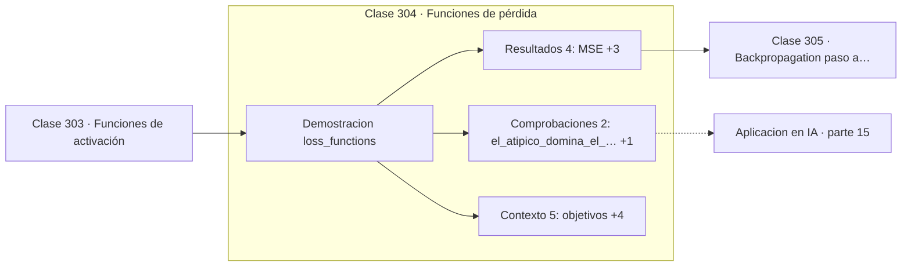

# 304 — Funciones de pérdida

> [⬅️ 303 Funciones de activación](../303-funciones-de-activacion/README.md) · [📚 Parte 15](../README.md) · [🏠 Programa](../../../README.md) · [305 Backpropagation paso a paso ➡️](../305-backpropagation-paso-a-paso/README.md)

**Parte:** 15 — Matemática de Deep Learning · **Nivel:** `deep-learning` · **Horas estimadas:** 4
**Motor:** `engines.part15` · **Demostración:** `loss_functions` · **Clase 4 de 20** de la parte

---

## 🎯 Propósito

**Un solo valor atípico multiplica el MSE por cien mil; Huber lo absorbe.**

Perceptrón, MLP, activaciones, pérdidas, backpropagation paso a paso, grafos de cómputo, inicialización, normalización, convolución, recurrencia y embeddings.

## ✅ Resultados de aprendizaje

Al terminar podrás:

1. Explicar **Funciones de pérdida** con lenguaje cotidiano y con notación matemática.
2. Resolver un caso pequeño a mano y anticipar el orden de magnitud del resultado.
3. Ejecutar y modificar `lab.py`, que corre la demostración `loss_functions`.
4. Interpretar las 11 salidas del laboratorio y decir qué comprueba cada una.
5. Detectar el error típico de esta parte: inicializar todos los pesos iguales y romper la simetría nunca.

## 🧩 Fórmulas de la clase

```text
MSE = media de (y − ŷ)²
MAE = media de |y − ŷ|
Huber: cuadrática si |e| ≤ δ, lineal si no
```

## 🗺️ Ubicación en el programa



## 📖 Fundamentos

La función de pérdida define qué significa equivocarse, y esa definición cambia por
completo el modelo resultante. No es un parámetro secundario: es la especificación del
problema.

El **error cuadrático medio** penaliza el cuadrado del error, así que un error diez veces
mayor pesa cien veces más. Eso lo hace extremadamente sensible a los valores atípicos: una
sola observación anómala puede dominar la suma y arrastrar el ajuste entero. El **error
absoluto medio** penaliza linealmente y es mucho más robusto, a cambio de no ser derivable
en cero y de converger más lentamente.

La **pérdida de Huber** combina lo mejor de ambas: se comporta como cuadrática para
errores pequeños —donde interesa la sensibilidad y la derivabilidad— y como lineal para
errores grandes —donde interesa la robustez—. El parámetro `δ` marca la transición, y es
la opción por defecto razonable cuando se sospecha que hay ruido de medición.

Detrás de cada elección hay un modelo probabilístico implícito, como se vio en la clase
215: MSE supone ruido gaussiano, MAE supone ruido de Laplace con colas más pesadas, y
entropía cruzada supone un modelo categórico. Elegir pérdida es declarar qué se cree del
ruido, y hacerlo explícitamente evita elegir por costumbre.

## 🧮 Ejemplo trabajado

Cinco observaciones, una de ellas claramente anómala.

```text
objetivos:    [1,0 ; 2,0 ; 3,0 ; 4,0 ; 100,0]
predicciones: [1,1 ; 2,1 ; 2,9 ; 4,2 ;   5,0]

MSE            = 1805,014
MAE            =   19,100
Huber (δ = 1)  =   18,907

MSE sin el atípico = 0,0175

El atípico multiplica el MSE por 103 000.
MAE y Huber apenas se descolocan.

Si ese 100,0 es un error de medición, MSE arruina
el ajuste entero por una sola observación.
```

## 🔬 Qué ejecuta el laboratorio

`loss_functions` — MSE, MAE, Huber y cross-entropy frente a un valor atípico.

| Grupo | Salidas |
|---|---|
| 🔢 Resultados numéricos (4) | `MSE`, `MAE`, `Huber_delta_1`, `MSE_sin_el_atipico` |
| ✅ Comprobaciones de invariante (2) | `el_atipico_domina_el_MSE`, `MAE_es_robusto` |

Las claves booleanas no son adorno: si alguna fuera `False`, el resultado numérico
no sería fiable aunque el programa terminase sin error.

```bash
python classes/part-15-matematica-de-deep-learning/304-funciones-de-perdida/lab.py
compmath run 304
```

> [!TIP]
> Antes de ejecutar, **escribe tu predicción**. Un laboratorio que confirma lo que
> esperabas enseña tanto como uno que te contradice, pero solo si la predicción
> existía antes del resultado.

## ⚠️ Errores conceptuales frecuentes

1. Usar MSE con datos que contienen errores de medición.
2. Elegir la pérdida por costumbre sin considerar el modelo de ruido.
3. Comparar valores de pérdidas distintas como si fueran la misma escala.

## 🚀 Dónde se usa de verdad

Regresión robusta, detección de objetos con pérdida Huber, entrenamiento con datos
ruidosos y diseño de objetivos personalizados.

## 🤖 Conexión con IA

Toda arquitectura moderna, incluido el Transformer, se construye sobre estos bloques y sobre este mismo mecanismo de derivación.

## 📓 Notebooks

| Archivo | Para qué |
|---|---|
| [`notebook.ipynb`](notebook.ipynb) | recorrido guiado con la demostración ejecutada |
| [`notebook_student.ipynb`](notebook_student.ipynb) | versión con `TODO` para resolver |
| [`notebook_solution.ipynb`](notebook_solution.ipynb) | solución de referencia verificada |

## 📝 Evaluación

| Criterio | Peso |
|---|---:|
| Comprensión conceptual | 25 % |
| Resolución manual | 25 % |
| Implementación y verificación | 25 % |
| Interpretación y comunicación | 15 % |
| Conexión con aplicación real | 10 % |

Detalle y criterios de error crítico en [`assessment.md`](assessment.md).

## ❓ Preguntas de comprobación

1. ¿Cuál es la entrada, cuál la salida y qué unidades tienen?
2. ¿Qué operación domina el comportamiento del resultado?
3. ¿Qué caso extremo revelaría un error conceptual?
4. ¿Cómo verificarías el resultado por un método independiente?
5. ¿Dónde aparece esto en visión?

Si necesitas releer el código para responderlas, la clase todavía no está superada.

## 📥 Entregable

`notebook_student.ipynb` resuelto más un párrafo que explique el resultado **sin citar
código**: qué entra, qué sale, qué invariante se comprueba y qué pasaría en un caso límite.

## 📚 Bibliografía de la clase

Esta clase enseña **Deep learning**. Cada obra dice qué aporta aquí y cómo se comprobó su localizador:

- [Huber, P. *Robust estimation of a location parameter*, Annals of Mathematical Statistics, 1964](https://doi.org/10.1214/aoms/1177703732) — Estadística e inferencia: conexión declarada de esta parte · DOI `10.1214/aoms/1177703732` verificado en Crossref (2026-08-19).
- [Goodfellow, I.; Bengio, Y.; Courville, A. *Deep Learning*, MIT Press, 2016, cap. 6](https://www.deeplearningbook.org/) — Deep learning: el tema de esta clase · ISBN-13 `9780262337373` verificado en International ISBN Agency (2026-08-19).

Bibliografía de todas las clases, con el porqué de cada obra, en [`docs/BIBLIOGRAPHY.md`](../../../docs/BIBLIOGRAPHY.md) · localizador y estado de cada obra en [`sources/bibliography.json`](../../../sources/bibliography.json).

## 📂 Material de la clase

[`intuition.md`](intuition.md) · [`theory.md`](theory.md) · [`derivation.md`](derivation.md) · [`exercises.md`](exercises.md) · [`assessment.md`](assessment.md) · [`where-is-this-used.md`](where-is-this-used.md) · [`lesson.yaml`](lesson.yaml)

---

> [⬅️ 303 Funciones de activación](../303-funciones-de-activacion/README.md) · [📚 Parte 15](../README.md) · [🏠 Programa](../../../README.md) · [305 Backpropagation paso a paso ➡️](../305-backpropagation-paso-a-paso/README.md)
