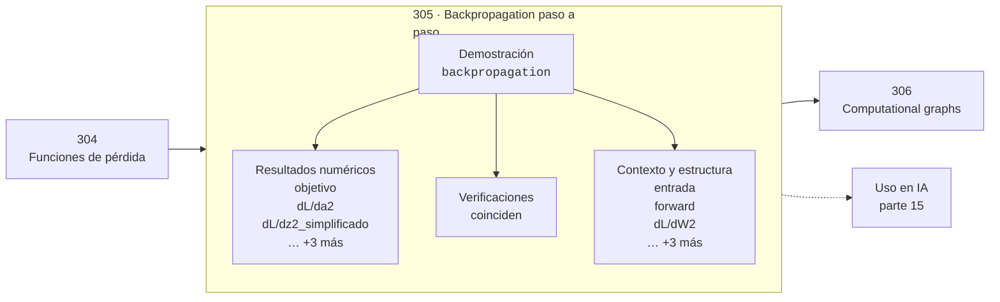

# 305 — Backpropagation paso a paso

> [⬅️ 304 Funciones de pérdida](../304-funciones-de-perdida/README.md) · [📚 Parte 15](../README.md) · [🏠 Programa](../../../README.md) · [306 Computational graphs ➡️](../306-computational-graphs/README.md)

**Parte:** 15 — Matemática de Deep Learning · **Nivel:** `deep-learning` · **Horas estimadas:** 4
**Motor:** `engines.part15` · **Demostración:** `backpropagation` · **Clase 5 de 20** de la parte

---

## 🎯 Propósito

Perceptrón, MLP, activaciones, pérdidas, backpropagation paso a paso, grafos de cómputo, inicialización, normalización, convolución, recurrencia y embeddings.

Esta clase concreta ese objetivo sobre **Backpropagation paso a paso**: qué es, cómo se
calcula a mano, cómo se implementa sin ocultar el procedimiento y cómo se verifica
que el resultado es correcto y no solo plausible.

## ✅ Resultados de aprendizaje

Al terminar podrás:

1. Explicar **Backpropagation paso a paso** con lenguaje cotidiano y con notación matemática.
2. Resolver un caso pequeño a mano y anticipar el orden de magnitud del resultado.
3. Ejecutar y modificar `lab.py`, que corre la demostración `backpropagation`.
4. Interpretar las 13 salidas del laboratorio y decir qué comprueba cada una.
5. Detectar el error típico de esta parte: aplicar softmax sin restar el máximo y provocar overflow.

## 🗺️ Ubicación en el programa



## 🧠 Idea rectora de la parte 15

> El gradiente que se desvanece es un producto de derivadas menores que uno.

## 🔬 Qué ejecuta el laboratorio

`backpropagation` — Backpropagation paso a paso sobre una red 2-2-1.

| Grupo | Salidas |
|---|---|
| 🔢 Resultados numéricos (6) | `objetivo`, `dL/da2`, `dL/dz2_simplificado`, `dL/db2`, `gradiente_numerico_W1[0][0]`, `gradiente_analitico_W1[0][0]` |
| ✅ Comprobaciones de invariante (1) | `coinciden` |

Las claves booleanas no son adorno: si alguna fuera `False`, el resultado numérico
no sería fiable aunque el programa terminase sin error.

```bash
python classes/part-15-matematica-de-deep-learning/305-backpropagation-paso-a-paso/lab.py
compmath run 305
```

> [!TIP]
> Antes de ejecutar, **escribe tu predicción**. Un laboratorio que confirma lo que
> esperabas enseña tanto como uno que te contradice, pero solo si la predicción
> existía antes del resultado.

## ⚠️ Errores frecuentes en esta parte

- Inicializar todos los pesos iguales y romper la simetría nunca.
- Aplicar softmax sin restar el máximo y provocar overflow.
- Mezclar estadísticas de batch normalization entre entrenamiento e inferencia.

## 🤖 Conexión con IA

Toda arquitectura moderna, incluido el Transformer, se construye sobre estos bloques y sobre este mismo mecanismo de derivación.

## 📓 Notebooks

| Archivo | Para qué |
|---|---|
| [`notebook.ipynb`](notebook.ipynb) | recorrido guiado con la demostración ejecutada |
| [`notebook_student.ipynb`](notebook_student.ipynb) | versión con `TODO` para resolver |
| [`notebook_solution.ipynb`](notebook_solution.ipynb) | solución de referencia verificada |

## 📝 Evaluación

| Criterio | Peso |
|---|---:|
| Comprensión conceptual | 25 % |
| Resolución manual | 25 % |
| Implementación y verificación | 25 % |
| Interpretación y comunicación | 15 % |
| Conexión con aplicación real | 10 % |

Detalle y criterios de error crítico en [`assessment.md`](assessment.md).

## ❓ Preguntas de comprobación

1. ¿Cuál es la entrada, cuál la salida y qué unidades tienen?
2. ¿Qué operación domina el comportamiento del resultado?
3. ¿Qué caso extremo revelaría un error conceptual?
4. ¿Cómo verificarías el resultado por un método independiente?
5. ¿Dónde aparece esto en visión?

Si necesitas releer el código para responderlas, la clase todavía no está superada.

## 📥 Entregable

`notebook_student.ipynb` resuelto más un párrafo que explique el resultado **sin citar
código**: qué entra, qué sale, qué invariante se comprueba y qué pasaría en un caso límite.

## 🔗 Referencias

- Goodfellow, I.; Bengio, Y.; Courville, A. *Deep Learning*. MIT Press, 2016.
- Glorot, X.; Bengio, Y. *Understanding the difficulty of training deep feedforward neural networks*. AISTATS, 2010.
- He, K. et al. *Delving Deep into Rectifiers*. ICCV, 2015.

## 📂 Material de la clase

[`intuition.md`](intuition.md) · [`theory.md`](theory.md) · [`derivation.md`](derivation.md) · [`exercises.md`](exercises.md) · [`assessment.md`](assessment.md) · [`where-is-this-used.md`](where-is-this-used.md) · [`lesson.yaml`](lesson.yaml)

---

> [⬅️ 304 Funciones de pérdida](../304-funciones-de-perdida/README.md) · [📚 Parte 15](../README.md) · [🏠 Programa](../../../README.md) · [306 Computational graphs ➡️](../306-computational-graphs/README.md)
