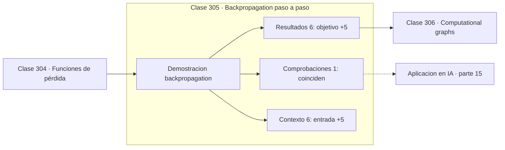

# 305 — Backpropagation paso a paso

> [⬅️ 304 Funciones de pérdida](../304-funciones-de-perdida/README.md) · [📚 Parte 15](../README.md) · [🏠 Programa](../../../README.md) · [306 Computational graphs ➡️](../306-computational-graphs/README.md)

**Parte:** 15 — Matemática de Deep Learning · **Nivel:** `deep-learning` · **Horas estimadas:** 4
**Motor:** `engines.part15` · **Demostración:** `backpropagation` · **Clase 5 de 20** de la parte

---

## 🎯 Propósito

**Backpropagation es la regla de la cadena recorrida hacia atrás, y se puede seguir con números.**

Perceptrón, MLP, activaciones, pérdidas, backpropagation paso a paso, grafos de cómputo, inicialización, normalización, convolución, recurrencia y embeddings.

## ✅ Resultados de aprendizaje

Al terminar podrás:

1. Explicar **Backpropagation paso a paso** con lenguaje cotidiano y con notación matemática.
2. Resolver un caso pequeño a mano y anticipar el orden de magnitud del resultado.
3. Ejecutar y modificar `lab.py`, que corre la demostración `backpropagation`.
4. Interpretar las 13 salidas del laboratorio y decir qué comprueba cada una.
5. Detectar el error típico de esta parte: aplicar softmax sin restar el máximo y provocar overflow.

## 🧩 Fórmulas de la clase

```text
forward: z = Wx + b,  a = σ(z)
backward: dL/dW = dL/dz · xᵀ
con cross-entropy y sigmoide: dL/dz = a − y
```

## 🗺️ Ubicación en el programa



## 📖 Fundamentos

Backpropagation no es un algoritmo aparte: es la regla de la cadena de la clase 147
aplicada sistemáticamente al grafo de la red, recorriendo los nodos en orden topológico
inverso. Su valor es de eficiencia, no de concepto: calcula **todos** los gradientes en una
sola pasada hacia atrás.

El procedimiento tiene dos fases. En el **paso hacia adelante** se calculan las salidas
capa a capa y se **guardan** los valores intermedios, que harán falta después; ese
almacenamiento es la razón de que la memoria de entrenamiento crezca con la profundidad. En
el **paso hacia atrás** se propaga la derivada de la pérdida desde la salida hasta los
parámetros.

Hay una simplificación algebraica que conviene ver una vez con detalle. Al combinar
entropía cruzada con sigmoide en la salida, el gradiente respecto de la preactivación se
reduce a `a − y`: la derivada de la sigmoide se cancela exactamente contra el denominador
de la pérdida. Esa cancelación es la que evita los gradientes saturados de la clase 286, y
es la razón técnica de emparejar esas dos funciones.

Recorrer los números a mano una vez, como hace este ejemplo, vale más que leer la
demostración diez veces. Después conviene no volver a implementarlo: la autodiferenciación
de la clase 319 hace exactamente esto sin errores de signo ni de transposición.

## 🧮 Ejemplo trabajado

Backpropagation completo sobre una red 2-2-1.

```text
entrada: (0,5 ; −1,2)      objetivo: 1,0

FORWARD
  z1 = (1,09 ; 0,01)
  a1 = (0,796878 ; 0,01)        tras la activación
  z2 = 0,524127
  a2 = 0,628xxx                 salida sigmoide

BACKWARD
  dL/da2 = −1,592072
  dL/dz2 = a2 − y = −0,371888   ← la sigmoide se canceló
  dL/dW2 = dL/dz2 · a1ᵀ
         = (−0,296349 ; −0,003719)

El segundo peso recibe un gradiente 80 veces menor
porque su activación a1 vale solo 0,01.
```

## 🔬 Qué ejecuta el laboratorio

`backpropagation` — Backpropagation paso a paso sobre una red 2-2-1.

| Grupo | Salidas |
|---|---|
| 🔢 Resultados numéricos (6) | `objetivo`, `dL/da2`, `dL/dz2_simplificado`, `dL/db2`, `gradiente_numerico_W1[0][0]`, `gradiente_analitico_W1[0][0]` |
| ✅ Comprobaciones de invariante (1) | `coinciden` |

Las claves booleanas no son adorno: si alguna fuera `False`, el resultado numérico
no sería fiable aunque el programa terminase sin error.

```bash
python classes/part-15-matematica-de-deep-learning/305-backpropagation-paso-a-paso/lab.py
compmath run 305
```

> [!TIP]
> Antes de ejecutar, **escribe tu predicción**. Un laboratorio que confirma lo que
> esperabas enseña tanto como uno que te contradice, pero solo si la predicción
> existía antes del resultado.

## ⚠️ Errores conceptuales frecuentes

1. No guardar las activaciones del paso hacia adelante.
2. Aplicar por separado la derivada de la sigmoide y la de la pérdida, duplicando el factor.
3. Equivocar transposiciones al pasar de escalares a matrices.

## 🚀 Dónde se usa de verdad

Entrenamiento de cualquier red, comprensión de los frameworks, depuración de gradientes y
diseño de capas personalizadas.

## 🤖 Conexión con IA

Toda arquitectura moderna, incluido el Transformer, se construye sobre estos bloques y sobre este mismo mecanismo de derivación.

## 📓 Notebooks

| Archivo | Para qué |
|---|---|
| [`notebook.ipynb`](notebook.ipynb) | recorrido guiado con la demostración ejecutada |
| [`notebook_student.ipynb`](notebook_student.ipynb) | versión con `TODO` para resolver |
| [`notebook_solution.ipynb`](notebook_solution.ipynb) | solución de referencia verificada |

## 📝 Evaluación

| Criterio | Peso |
|---|---:|
| Comprensión conceptual | 25 % |
| Resolución manual | 25 % |
| Implementación y verificación | 25 % |
| Interpretación y comunicación | 15 % |
| Conexión con aplicación real | 10 % |

Detalle y criterios de error crítico en [`assessment.md`](assessment.md).

## ❓ Preguntas de comprobación

1. ¿Cuál es la entrada, cuál la salida y qué unidades tienen?
2. ¿Qué operación domina el comportamiento del resultado?
3. ¿Qué caso extremo revelaría un error conceptual?
4. ¿Cómo verificarías el resultado por un método independiente?
5. ¿Dónde aparece esto en visión?

Si necesitas releer el código para responderlas, la clase todavía no está superada.

## 📥 Entregable

`notebook_student.ipynb` resuelto más un párrafo que explique el resultado **sin citar
código**: qué entra, qué sale, qué invariante se comprueba y qué pasaría en un caso límite.

## 🔗 Referencias

- [Rumelhart, D.; Hinton, G.; Williams, R. *Learning representations by back-propagating errors*, Nature, 1986](https://doi.org/10.1038/323533a0)
- [Nielsen, M. *Neural Networks and Deep Learning*, cap. 2, 2015](http://neuralnetworksanddeeplearning.com/chap2.html)

Bibliografía completa de la parte en [`../../../docs/BIBLIOGRAPHY.md`](../../../docs/BIBLIOGRAPHY.md).

## 📂 Material de la clase

[`intuition.md`](intuition.md) · [`theory.md`](theory.md) · [`derivation.md`](derivation.md) · [`exercises.md`](exercises.md) · [`assessment.md`](assessment.md) · [`where-is-this-used.md`](where-is-this-used.md) · [`lesson.yaml`](lesson.yaml)

---

> [⬅️ 304 Funciones de pérdida](../304-funciones-de-perdida/README.md) · [📚 Parte 15](../README.md) · [🏠 Programa](../../../README.md) · [306 Computational graphs ➡️](../306-computational-graphs/README.md)
