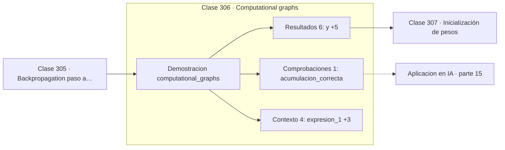

# 306 — Computational graphs

> [⬅️ 305 Backpropagation paso a paso](../305-backpropagation-paso-a-paso/README.md) · [📚 Parte 15](../README.md) · [🏠 Programa](../../../README.md) · [307 Inicialización de pesos ➡️](../307-inicializacion-de-pesos/README.md)

**Parte:** 15 — Matemática de Deep Learning · **Nivel:** `deep-learning` · **Horas estimadas:** 4
**Motor:** `engines.part15` · **Demostración:** `computational_graphs` · **Clase 6 de 20** de la parte

---

## 🎯 Propósito

**Un nodo usado dos veces recibe la suma de los dos gradientes, no uno de ellos.**

Perceptrón, MLP, activaciones, pérdidas, backpropagation paso a paso, grafos de cómputo, inicialización, normalización, convolución, recurrencia y embeddings.

## ✅ Resultados de aprendizaje

Al terminar podrás:

1. Explicar **Computational graphs** con lenguaje cotidiano y con notación matemática.
2. Resolver un caso pequeño a mano y anticipar el orden de magnitud del resultado.
3. Ejecutar y modificar `lab.py`, que corre la demostración `computational_graphs`.
4. Interpretar las 11 salidas del laboratorio y decir qué comprueba cada una.
5. Detectar el error típico de esta parte: mezclar estadísticas de batch normalization entre entrenamiento e inferencia.

## 🧩 Fórmulas de la clase

```text
cada operación es un nodo; cada dependencia, una arista
orden topológico inverso para el paso hacia atrás
nodo con k consumos: dL/dv = Σ de las k contribuciones
```

## 🗺️ Ubicación en el programa



## 📖 Fundamentos

Representar una expresión como grafo —nodos para las operaciones, aristas para las
dependencias— convierte la derivación en un procedimiento mecánico. Cada tipo de nodo sabe
derivar su operación local, y la regla de la cadena encadena esas derivadas locales a lo
largo del grafo.

La regla que genera más errores al implementar autodiferenciación a mano es la
**acumulación**. Si una variable se usa en varios sitios, su gradiente total es la
**suma** de las contribuciones de todos sus consumos, no la última calculada. Sobrescribir
en vez de sumar produce gradientes silenciosamente incorrectos, y el entrenamiento
simplemente converge peor sin dar ningún error.

El ejemplo mínimo lo muestra: en `y = x² + x`, la variable `x` alimenta dos ramas. La
derivada es `2x + 1`, que es exactamente la suma de las dos contribuciones. Si solo se
tomara una, el gradiente sería `2x` o `1`, y ambos son incorrectos.

Esa misma regla explica un detalle práctico de PyTorch que confunde al principio:
`optimizer.zero_grad()` hace falta precisamente porque el framework **acumula** por diseño.
Esa acumulación no es un fallo: es lo que permite simular lotes grandes sumando gradientes
de varios lotes pequeños antes de actualizar.

## 🧮 Ejemplo trabajado

Dos expresiones con nodos reutilizados.

```text
Expresión 1:  y = x² + x   en x = 2

  y = 4 + 2 = 6,0

  rama 1: d(x²)/dx = 2x = 4
  rama 2: d(x)/dx  = 1
  acumulado: dy/dx = 4 + 1 = 5,0

  comprobación analítica 2x + 1 = 5,0                ✓

  Si se sobrescribiera en vez de sumar, saldría 4 o 1.

Expresión 2:  e = (ab + a)·(ab)   en a = 3, b = 4

  el producto ab se usa dos veces:
  su gradiente acumula ambas contribuciones.
```

## 🔬 Qué ejecuta el laboratorio

`computational_graphs` — El grafo de cómputo y la acumulación de gradientes en nodos reutilizados.

| Grupo | Salidas |
|---|---|
| 🔢 Resultados numéricos (6) | `y`, `dy/dx`, `dy/dx_analitico_2x+1`, `e`, `de/da`, `de/db` |
| ✅ Comprobaciones de invariante (1) | `acumulacion_correcta` |

Las claves booleanas no son adorno: si alguna fuera `False`, el resultado numérico
no sería fiable aunque el programa terminase sin error.

```bash
python classes/part-15-matematica-de-deep-learning/306-computational-graphs/lab.py
compmath run 306
```

> [!TIP]
> Antes de ejecutar, **escribe tu predicción**. Un laboratorio que confirma lo que
> esperabas enseña tanto como uno que te contradice, pero solo si la predicción
> existía antes del resultado.

## ⚠️ Errores conceptuales frecuentes

1. Sobrescribir el gradiente de un nodo en vez de acumularlo.
2. Recorrer el grafo en orden incorrecto y usar gradientes aún no calculados.
3. Olvidar poner a cero los gradientes entre iteraciones en PyTorch.

## 🚀 Dónde se usa de verdad

Implementación de autodiferenciación, capas personalizadas, acumulación de gradientes para
lotes grandes y depuración de frameworks.

## 🤖 Conexión con IA

Toda arquitectura moderna, incluido el Transformer, se construye sobre estos bloques y sobre este mismo mecanismo de derivación.

## 📓 Notebooks

| Archivo | Para qué |
|---|---|
| [`notebook.ipynb`](notebook.ipynb) | recorrido guiado con la demostración ejecutada |
| [`notebook_student.ipynb`](notebook_student.ipynb) | versión con `TODO` para resolver |
| [`notebook_solution.ipynb`](notebook_solution.ipynb) | solución de referencia verificada |

## 📝 Evaluación

| Criterio | Peso |
|---|---:|
| Comprensión conceptual | 25 % |
| Resolución manual | 25 % |
| Implementación y verificación | 25 % |
| Interpretación y comunicación | 15 % |
| Conexión con aplicación real | 10 % |

Detalle y criterios de error crítico en [`assessment.md`](assessment.md).

## ❓ Preguntas de comprobación

1. ¿Cuál es la entrada, cuál la salida y qué unidades tienen?
2. ¿Qué operación domina el comportamiento del resultado?
3. ¿Qué caso extremo revelaría un error conceptual?
4. ¿Cómo verificarías el resultado por un método independiente?
5. ¿Dónde aparece esto en visión?

Si necesitas releer el código para responderlas, la clase todavía no está superada.

## 📥 Entregable

`notebook_student.ipynb` resuelto más un párrafo que explique el resultado **sin citar
código**: qué entra, qué sale, qué invariante se comprueba y qué pasaría en un caso límite.

## 🔗 Referencias

- [Baydin, A. et al. *Automatic differentiation in machine learning: a survey*, JMLR, 2018](https://jmlr.org/papers/v18/17-468.html) — *uso:* obra de referencia consultada en «Computational graphs».
- [Karpathy, A. *micrograd*, 2020](https://github.com/karpathy/micrograd) — *uso:* obra de referencia consultada en «Computational graphs».

Bibliografía completa de la parte en [`../../../docs/BIBLIOGRAPHY.md`](../../../docs/BIBLIOGRAPHY.md) · localizador verificable de cada obra en [`sources/bibliography.json`](../../../sources/bibliography.json).

## 📂 Material de la clase

[`intuition.md`](intuition.md) · [`theory.md`](theory.md) · [`derivation.md`](derivation.md) · [`exercises.md`](exercises.md) · [`assessment.md`](assessment.md) · [`where-is-this-used.md`](where-is-this-used.md) · [`lesson.yaml`](lesson.yaml)

---

> [⬅️ 305 Backpropagation paso a paso](../305-backpropagation-paso-a-paso/README.md) · [📚 Parte 15](../README.md) · [🏠 Programa](../../../README.md) · [307 Inicialización de pesos ➡️](../307-inicializacion-de-pesos/README.md)
