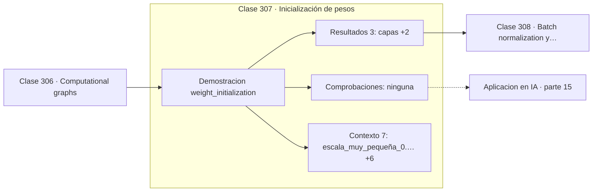

# 307 — Inicialización de pesos

> [⬅️ 306 Computational graphs](../306-computational-graphs/README.md) · [📚 Parte 15](../README.md) · [🏠 Programa](../../../README.md) · [308 Batch normalization y layer normalization ➡️](../308-batch-normalization-y-layer-normalization/README.md)

**Parte:** 15 — Matemática de Deep Learning · **Nivel:** `deep-learning` · **Horas estimadas:** 4
**Motor:** `engines.part15` · **Demostración:** `weight_initialization` · **Clase 7 de 20** de la parte

---

## 🎯 Propósito

**Con escala 0,01 las activaciones mueren en ocho capas; con escala 1,0 se saturan.**

Perceptrón, MLP, activaciones, pérdidas, backpropagation paso a paso, grafos de cómputo, inicialización, normalización, convolución, recurrencia y embeddings.

## ✅ Resultados de aprendizaje

Al terminar podrás:

1. Explicar **Inicialización de pesos** con lenguaje cotidiano y con notación matemática.
2. Resolver un caso pequeño a mano y anticipar el orden de magnitud del resultado.
3. Ejecutar y modificar `lab.py`, que corre la demostración `weight_initialization`.
4. Interpretar las 10 salidas del laboratorio y decir qué comprueba cada una.
5. Detectar el error típico de esta parte: inicializar todos los pesos iguales y romper la simetría nunca.

## 🧩 Fórmulas de la clase

```text
Xavier: Var(W) = 1/n_in   (tanh, sigmoide)
He: Var(W) = 2/n_in   (ReLU)
todos los pesos iguales ⟹ todas las neuronas aprenden lo mismo
```

## 🗺️ Ubicación en el programa



## 📖 Fundamentos

Inicializar los pesos parece trivial y decide si una red profunda entrena o no. El
criterio es mantener **estable la varianza de las activaciones** al atravesar capas: si
cada capa la reduce, las señales se apagan; si la amplifica, se saturan o desbordan.

La demostración numérica es contundente. Con escala 0,01 y ocho capas, la desviación de las
activaciones cae de 0,009 a `1e-8` y luego a cero exacto: la señal ha desaparecido y no hay
gradiente que propagar. Con escala 1,0 ocurre lo contrario con tanh: las activaciones se
pegan a ±1, la derivada se anula y el gradiente tampoco fluye.

**Xavier** deriva la escala `1/√n` imponiendo que la varianza se conserve, y funciona con
activaciones simétricas como tanh. **He** ajusta a `√(2/n)` porque ReLU anula la mitad de
las activaciones y hay que compensar ese factor 2. Son las dos inicializaciones por defecto
y la elección se sigue de la activación, no del gusto.

Hay una condición previa que ninguna fórmula cubre: **romper la simetría**. Si todos los
pesos de una capa se inicializan al mismo valor, todas las neuronas calculan lo mismo,
reciben el mismo gradiente y siguen siendo idénticas para siempre. La capa entera equivale
a una sola neurona. Por eso se inicializa al azar, y por eso los sesgos sí pueden empezar
en cero: la simetría ya está rota por los pesos.

## 🧮 Ejemplo trabajado

Desviación de las activaciones en capas 1, 4 y 8.

```text
8 capas de 100 neuronas

escala 0,01 con tanh:
  [0,00933503 ; 1e-08 ; 0,0]
  las activaciones se apagan por completo            ✗

Xavier (1/√n) con tanh:
  [0,36236997 ; 0,13964668 ; 0,08762870]
  decae despacio, sigue habiendo señal                ✓

He (√(2/n)) con ReLU:
  [0,67589597 ; 0,76192729 ; 0,62293017]
  varianza estable en las ocho capas                  ✓

escala 1,0 con tanh:
  [0,84424669 ; 0,85537312 ; 0,92118981]
  saturación: casi todo en ±1, derivada nula          ✗
```

## 🔬 Qué ejecuta el laboratorio

`weight_initialization` — Xavier y He: controlar la varianza de las activaciones capa a capa.

| Grupo | Salidas |
|---|---|
| 🔢 Resultados numéricos (3) | `capas`, `neuronas_por_capa`, `semilla` |
| ✅ Comprobaciones de invariante (0) | — |

Las claves booleanas no son adorno: si alguna fuera `False`, el resultado numérico
no sería fiable aunque el programa terminase sin error.

```bash
python classes/part-15-matematica-de-deep-learning/307-inicializacion-de-pesos/lab.py
compmath run 307
```

> [!TIP]
> Antes de ejecutar, **escribe tu predicción**. Un laboratorio que confirma lo que
> esperabas enseña tanto como uno que te contradice, pero solo si la predicción
> existía antes del resultado.

## ⚠️ Errores conceptuales frecuentes

1. Inicializar todos los pesos con el mismo valor.
2. Usar Xavier con ReLU en vez de He.
3. Elegir la escala por prueba y error sin mirar la varianza de las activaciones.

## 🚀 Dónde se usa de verdad

Entrenamiento de redes profundas, diagnóstico de entrenamientos que no arrancan, diseño de
arquitecturas nuevas y transferencia de aprendizaje.

## 🤖 Conexión con IA

Toda arquitectura moderna, incluido el Transformer, se construye sobre estos bloques y sobre este mismo mecanismo de derivación.

## 📓 Notebooks

| Archivo | Para qué |
|---|---|
| [`notebook.ipynb`](notebook.ipynb) | recorrido guiado con la demostración ejecutada |
| [`notebook_student.ipynb`](notebook_student.ipynb) | versión con `TODO` para resolver |
| [`notebook_solution.ipynb`](notebook_solution.ipynb) | solución de referencia verificada |

## 📝 Evaluación

| Criterio | Peso |
|---|---:|
| Comprensión conceptual | 25 % |
| Resolución manual | 25 % |
| Implementación y verificación | 25 % |
| Interpretación y comunicación | 15 % |
| Conexión con aplicación real | 10 % |

Detalle y criterios de error crítico en [`assessment.md`](assessment.md).

## ❓ Preguntas de comprobación

1. ¿Cuál es la entrada, cuál la salida y qué unidades tienen?
2. ¿Qué operación domina el comportamiento del resultado?
3. ¿Qué caso extremo revelaría un error conceptual?
4. ¿Cómo verificarías el resultado por un método independiente?
5. ¿Dónde aparece esto en visión?

Si necesitas releer el código para responderlas, la clase todavía no está superada.

## 📥 Entregable

`notebook_student.ipynb` resuelto más un párrafo que explique el resultado **sin citar
código**: qué entra, qué sale, qué invariante se comprueba y qué pasaría en un caso límite.

## 🔗 Referencias

- [Glorot, X.; Bengio, Y. *Understanding the difficulty of training deep feedforward neural networks*, AISTATS, 2010](https://proceedings.mlr.press/v9/glorot10a.html)
- [He, K. et al. *Delving Deep into Rectifiers*, ICCV, 2015](https://arxiv.org/abs/1502.01852)

Bibliografía completa de la parte en [`../../../docs/BIBLIOGRAPHY.md`](../../../docs/BIBLIOGRAPHY.md).

## 📂 Material de la clase

[`intuition.md`](intuition.md) · [`theory.md`](theory.md) · [`derivation.md`](derivation.md) · [`exercises.md`](exercises.md) · [`assessment.md`](assessment.md) · [`where-is-this-used.md`](where-is-this-used.md) · [`lesson.yaml`](lesson.yaml)

---

> [⬅️ 306 Computational graphs](../306-computational-graphs/README.md) · [📚 Parte 15](../README.md) · [🏠 Programa](../../../README.md) · [308 Batch normalization y layer normalization ➡️](../308-batch-normalization-y-layer-normalization/README.md)
