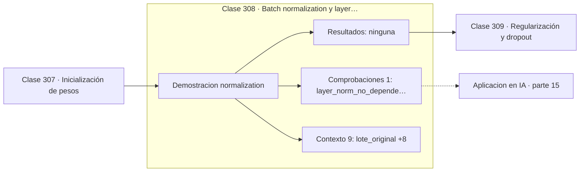

# 308 — Batch normalization y layer normalization

> [⬅️ 307 Inicialización de pesos](../307-inicializacion-de-pesos/README.md) · [📚 Parte 15](../README.md) · [🏠 Programa](../../../README.md) · [309 Regularización y dropout ➡️](../309-regularizacion-y-dropout/README.md)

**Parte:** 15 — Matemática de Deep Learning · **Nivel:** `deep-learning` · **Horas estimadas:** 4
**Motor:** `engines.part15` · **Demostración:** `normalization` · **Clase 8 de 20** de la parte

---

## 🎯 Propósito

**Batch norm promedia por columna y layer norm por fila: ese eje es toda la diferencia.**

Perceptrón, MLP, activaciones, pérdidas, backpropagation paso a paso, grafos de cómputo, inicialización, normalización, convolución, recurrencia y embeddings.

## ✅ Resultados de aprendizaje

Al terminar podrás:

1. Explicar **Batch normalization y layer normalization** con lenguaje cotidiano y con notación matemática.
2. Resolver un caso pequeño a mano y anticipar el orden de magnitud del resultado.
3. Ejecutar y modificar `lab.py`, que corre la demostración `normalization`.
4. Interpretar las 10 salidas del laboratorio y decir qué comprueba cada una.
5. Detectar el error típico de esta parte: aplicar softmax sin restar el máximo y provocar overflow.

## 🧩 Fórmulas de la clase

```text
x̂ = (x − μ)/√(σ² + ε);   y = γx̂ + β
batch norm: μ y σ por característica sobre el lote
layer norm: μ y σ por muestra sobre las características
```

## 🗺️ Ubicación en el programa



## 📖 Fundamentos

Normalizar las activaciones internas estabiliza el entrenamiento y permite learning rates
mayores. La operación es la misma en ambos casos —restar media, dividir por desviación,
reescalar con parámetros aprendidos `γ` y `β`—; lo único que cambia es **sobre qué eje se
calculan las estadísticas**.

**Batch normalization** normaliza cada característica a lo largo del lote: la columna. Eso
la hace muy eficaz en redes convolucionales, donde los lotes son grandes, pero introduce
una dependencia incómoda del tamaño de lote y obliga a mantener estadísticas móviles para
inferencia. Mezclar las estadísticas de entrenamiento con las de inferencia es un error
clásico que produce resultados desastrosos e inexplicables.

**Layer normalization** normaliza cada muestra a lo largo de sus características: la fila.
No depende del lote en absoluto, funciona igual con lote de tamaño 1, y se comporta
idénticamente en entrenamiento y en inferencia. Por eso es la elección de los
Transformers, donde las secuencias tienen longitudes variables y el tamaño de lote efectivo
cambia.

El **mecanismo** por el que ayudan resultó no ser el que se propuso originalmente. El
artículo de batch norm lo atribuyó a reducir el «desplazamiento interno de covariables»;
trabajo posterior mostró que esa explicación no se sostiene, y que el efecto real es
**suavizar el paisaje de optimización**, permitiendo pasos más grandes. Es un buen ejemplo
de técnica que funciona antes de entenderse.

## 🧮 Ejemplo trabajado

El mismo lote normalizado por columna y por fila.

```text
lote original (4 muestras × 3 características):
  [ 10  200    3]
  [ 12  190    5]
  [  8  210    1]
  [ 14  195    x]

escalas por característica: [6,0 ; 20,0 ; 6,0]
la segunda característica domina completamente

batch norm (por columna):
  [−0,4472   0,1690  −0,4472]
  [ 0,4472  −1,1832   0,4472]
  media por columna tras BN: [0, 0, 0]              ✓

layer norm (por fila):
  [−0,6684   1,4135  −0,7451]
  [−0,6658   1,4134  −0,7476]
  media por fila tras LN: [0, 0, 0, 0]              ✓
```

## 🔬 Qué ejecuta el laboratorio

`normalization` — Batch norm y layer norm: qué eje se normaliza.

| Grupo | Salidas |
|---|---|
| 🔢 Resultados numéricos (0) | — |
| ✅ Comprobaciones de invariante (1) | `layer_norm_no_depende_del_lote` |

Las claves booleanas no son adorno: si alguna fuera `False`, el resultado numérico
no sería fiable aunque el programa terminase sin error.

```bash
python classes/part-15-matematica-de-deep-learning/308-batch-normalization-y-layer-normalization/lab.py
compmath run 308
```

> [!TIP]
> Antes de ejecutar, **escribe tu predicción**. Un laboratorio que confirma lo que
> esperabas enseña tanto como uno que te contradice, pero solo si la predicción
> existía antes del resultado.

## ⚠️ Errores conceptuales frecuentes

1. Usar estadísticas del lote durante la inferencia.
2. Aplicar batch norm con lotes muy pequeños.
3. Colocar la normalización sin decidir si va antes o después de la activación.

## 🚀 Dónde se usa de verdad

Estabilización de redes convolucionales, layer norm en Transformers, entrenamiento con
learning rates altos y arquitecturas residuales.

## 🤖 Conexión con IA

Toda arquitectura moderna, incluido el Transformer, se construye sobre estos bloques y sobre este mismo mecanismo de derivación.

## 📓 Notebooks

| Archivo | Para qué |
|---|---|
| [`notebook.ipynb`](notebook.ipynb) | recorrido guiado con la demostración ejecutada |
| [`notebook_student.ipynb`](notebook_student.ipynb) | versión con `TODO` para resolver |
| [`notebook_solution.ipynb`](notebook_solution.ipynb) | solución de referencia verificada |

## 📝 Evaluación

| Criterio | Peso |
|---|---:|
| Comprensión conceptual | 25 % |
| Resolución manual | 25 % |
| Implementación y verificación | 25 % |
| Interpretación y comunicación | 15 % |
| Conexión con aplicación real | 10 % |

Detalle y criterios de error crítico en [`assessment.md`](assessment.md).

## ❓ Preguntas de comprobación

1. ¿Cuál es la entrada, cuál la salida y qué unidades tienen?
2. ¿Qué operación domina el comportamiento del resultado?
3. ¿Qué caso extremo revelaría un error conceptual?
4. ¿Cómo verificarías el resultado por un método independiente?
5. ¿Dónde aparece esto en visión?

Si necesitas releer el código para responderlas, la clase todavía no está superada.

## 📥 Entregable

`notebook_student.ipynb` resuelto más un párrafo que explique el resultado **sin citar
código**: qué entra, qué sale, qué invariante se comprueba y qué pasaría en un caso límite.

## 📚 Bibliografía de la clase

Esta clase enseña **Deep learning**. Cada obra dice qué aporta aquí y cómo se comprobó su localizador:

- [Ioffe, S.; Szegedy, C. *Batch Normalization*, ICML, 2015](https://arxiv.org/abs/1502.03167) — Deep learning: el tema de esta clase · DOI `10.48550/arxiv.1502.03167` verificado en DataCite (2026-08-19).
- [Santurkar, S. et al. *How does batch normalization help optimization?*, NeurIPS, 2018](https://arxiv.org/abs/1805.11604) — Deep learning: el tema de esta clase · DOI `10.48550/arxiv.1805.11604` verificado en DataCite (2026-08-19).

Bibliografía de todas las clases, con el porqué de cada obra, en [`docs/BIBLIOGRAPHY.md`](../../../docs/BIBLIOGRAPHY.md) · localizador y estado de cada obra en [`sources/bibliography.json`](../../../sources/bibliography.json).

## 📂 Material de la clase

[`intuition.md`](intuition.md) · [`theory.md`](theory.md) · [`derivation.md`](derivation.md) · [`exercises.md`](exercises.md) · [`assessment.md`](assessment.md) · [`where-is-this-used.md`](where-is-this-used.md) · [`lesson.yaml`](lesson.yaml)

---

> [⬅️ 307 Inicialización de pesos](../307-inicializacion-de-pesos/README.md) · [📚 Parte 15](../README.md) · [🏠 Programa](../../../README.md) · [309 Regularización y dropout ➡️](../309-regularizacion-y-dropout/README.md)
