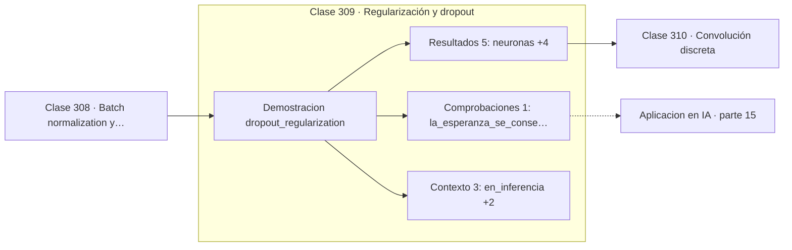

# 309 — Regularización y dropout

> [⬅️ 308 Batch normalization y layer normalization](../308-batch-normalization-y-layer-normalization/README.md) · [📚 Parte 15](../README.md) · [🏠 Programa](../../../README.md) · [310 Convolución discreta ➡️](../310-convolucion-discreta/README.md)

**Parte:** 15 — Matemática de Deep Learning · **Nivel:** `deep-learning` · **Horas estimadas:** 4
**Motor:** `engines.part15` · **Demostración:** `dropout_regularization` · **Clase 9 de 20** de la parte

---

## 🎯 Propósito

**Dropout apaga neuronas al azar y escala en entrenamiento para que la inferencia no cambie.**

Perceptrón, MLP, activaciones, pérdidas, backpropagation paso a paso, grafos de cómputo, inicialización, normalización, convolución, recurrencia y embeddings.

## ✅ Resultados de aprendizaje

Al terminar podrás:

1. Explicar **Regularización y dropout** con lenguaje cotidiano y con notación matemática.
2. Resolver un caso pequeño a mano y anticipar el orden de magnitud del resultado.
3. Ejecutar y modificar `lab.py`, que corre la demostración `dropout_regularization`.
4. Interpretar las 9 salidas del laboratorio y decir qué comprueba cada una.
5. Detectar el error típico de esta parte: mezclar estadísticas de batch normalization entre entrenamiento e inferencia.

## 🧩 Fórmulas de la clase

```text
entrenamiento: apagar con probabilidad p y dividir por (1−p)
inferencia: no hacer nada
E[activación] se conserva
```

## 🗺️ Ubicación en el programa



## 📖 Fundamentos

Dropout apaga cada neurona con probabilidad `p` en cada paso de entrenamiento. La idea es
impedir la **coadaptación**: si una neurona no puede confiar en que sus compañeras estén
presentes, tiene que aprender características útiles por sí misma en lugar de depender de
combinaciones frágiles.

Otra lectura, complementaria, es que dropout entrena implícitamente un **ensemble
exponencial** de subredes que comparten pesos, y en inferencia promedia sus predicciones.
Eso lo emparenta con el bagging de la clase 292: reduce varianza combinando modelos que
cometen errores distintos.

El detalle de implementación importa. Apagar neuronas reduce la activación media, así que
hay que compensar. La versión moderna —**inverted dropout**— divide entre `(1−p)` durante
el entrenamiento, con lo que la esperanza se conserva y la inferencia no requiere ningún
ajuste. La versión antigua escalaba en inferencia, y mezclar ambas convenciones produce un
factor de escala erróneo difícil de detectar.

Su uso ha cambiado con el tiempo. En redes convolucionales fue desplazado por batch
normalization, que regulariza como efecto secundario. En Transformers sigue muy presente,
con valores bajos —0,1 es típico—, aplicado tras la atención y en las capas feed-forward.

## 🧮 Ejemplo trabajado

Cien neuronas con probabilidad de apagado 0,5.

```text
neuronas: 100      p = 0,5

media sin dropout:              1,00000
media con inverted dropout:     0,99976
la esperanza se conserva                             ✓

varianza introducida: 0,00958074

Mecanismo:
  se apaga cada neurona con p = 0,5
  las supervivientes se dividen entre (1 − 0,5) = 0,5
  es decir, se multiplican por 2

En inferencia no se hace nada: ni apagado ni escalado.
Escalar también en inferencia daría el doble de activación.
```

## 🔬 Qué ejecuta el laboratorio

`dropout_regularization` — Dropout: ruido en entrenamiento, escalado coherente en inferencia.

| Grupo | Salidas |
|---|---|
| 🔢 Resultados numéricos (5) | `neuronas`, `probabilidad_de_apagado`, `media_sin_dropout`, `media_con_inverted_dropout`, `varianza_introducida` |
| ✅ Comprobaciones de invariante (1) | `la_esperanza_se_conserva` |

Las claves booleanas no son adorno: si alguna fuera `False`, el resultado numérico
no sería fiable aunque el programa terminase sin error.

```bash
python classes/part-15-matematica-de-deep-learning/309-regularizacion-y-dropout/lab.py
compmath run 309
```

> [!TIP]
> Antes de ejecutar, **escribe tu predicción**. Un laboratorio que confirma lo que
> esperabas enseña tanto como uno que te contradice, pero solo si la predicción
> existía antes del resultado.

## ⚠️ Errores conceptuales frecuentes

1. Dejar dropout activo durante la evaluación.
2. Mezclar la convención antigua con inverted dropout y duplicar la escala.
3. Aplicar valores altos de p en capas convolucionales.

## 🚀 Dónde se usa de verdad

Regularización de redes profundas, Transformers, estimación de incertidumbre con MC
dropout y prevención del sobreajuste con pocos datos.

## 🤖 Conexión con IA

Toda arquitectura moderna, incluido el Transformer, se construye sobre estos bloques y sobre este mismo mecanismo de derivación.

## 📓 Notebooks

| Archivo | Para qué |
|---|---|
| [`notebook.ipynb`](notebook.ipynb) | recorrido guiado con la demostración ejecutada |
| [`notebook_student.ipynb`](notebook_student.ipynb) | versión con `TODO` para resolver |
| [`notebook_solution.ipynb`](notebook_solution.ipynb) | solución de referencia verificada |

## 📝 Evaluación

| Criterio | Peso |
|---|---:|
| Comprensión conceptual | 25 % |
| Resolución manual | 25 % |
| Implementación y verificación | 25 % |
| Interpretación y comunicación | 15 % |
| Conexión con aplicación real | 10 % |

Detalle y criterios de error crítico en [`assessment.md`](assessment.md).

## ❓ Preguntas de comprobación

1. ¿Cuál es la entrada, cuál la salida y qué unidades tienen?
2. ¿Qué operación domina el comportamiento del resultado?
3. ¿Qué caso extremo revelaría un error conceptual?
4. ¿Cómo verificarías el resultado por un método independiente?
5. ¿Dónde aparece esto en visión?

Si necesitas releer el código para responderlas, la clase todavía no está superada.

## 📥 Entregable

`notebook_student.ipynb` resuelto más un párrafo que explique el resultado **sin citar
código**: qué entra, qué sale, qué invariante se comprueba y qué pasaría en un caso límite.

## 🔗 Referencias

- [Srivastava, N. et al. *Dropout: a simple way to prevent neural networks from overfitting*, JMLR, 2014](https://jmlr.org/papers/v15/srivastava14a.html) — *uso:* obra de referencia consultada en «Regularización y dropout».
- [Gal, Y.; Ghahramani, Z. *Dropout as a Bayesian approximation*, ICML, 2016](https://arxiv.org/abs/1506.02142) — *uso:* artículo de origen consultado en «Regularización y dropout».

Bibliografía completa de la parte en [`../../../docs/BIBLIOGRAPHY.md`](../../../docs/BIBLIOGRAPHY.md) · localizador verificable de cada obra en [`sources/bibliography.json`](../../../sources/bibliography.json).

## 📂 Material de la clase

[`intuition.md`](intuition.md) · [`theory.md`](theory.md) · [`derivation.md`](derivation.md) · [`exercises.md`](exercises.md) · [`assessment.md`](assessment.md) · [`where-is-this-used.md`](where-is-this-used.md) · [`lesson.yaml`](lesson.yaml)

---

> [⬅️ 308 Batch normalization y layer normalization](../308-batch-normalization-y-layer-normalization/README.md) · [📚 Parte 15](../README.md) · [🏠 Programa](../../../README.md) · [310 Convolución discreta ➡️](../310-convolucion-discreta/README.md)
