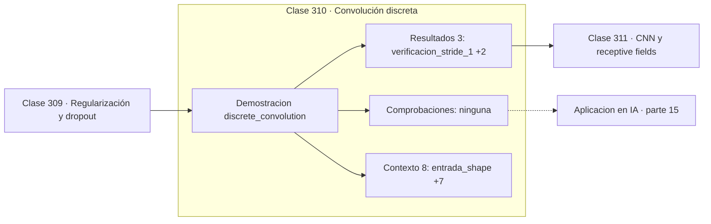

# 310 — Convolución discreta

> [⬅️ 309 Regularización y dropout](../309-regularizacion-y-dropout/README.md) · [📚 Parte 15](../README.md) · [🏠 Programa](../../../README.md) · [311 CNN y receptive fields ➡️](../311-cnn-y-receptive-fields/README.md)

**Parte:** 15 — Matemática de Deep Learning · **Nivel:** `deep-learning` · **Horas estimadas:** 4
**Motor:** `engines.part15` · **Demostración:** `discrete_convolution` · **Clase 10 de 20** de la parte

---

## 🎯 Propósito

**El tamaño de salida sale de una fórmula, y equivocarla es el error más común al montar una CNN.**

Perceptrón, MLP, activaciones, pérdidas, backpropagation paso a paso, grafos de cómputo, inicialización, normalización, convolución, recurrencia y embeddings.

## ✅ Resultados de aprendizaje

Al terminar podrás:

1. Explicar **Convolución discreta** con lenguaje cotidiano y con notación matemática.
2. Resolver un caso pequeño a mano y anticipar el orden de magnitud del resultado.
3. Ejecutar y modificar `lab.py`, que corre la demostración `discrete_convolution`.
4. Interpretar las 11 salidas del laboratorio y decir qué comprueba cada una.
5. Detectar el error típico de esta parte: inicializar todos los pesos iguales y romper la simetría nunca.

## 🧩 Fórmulas de la clase

```text
salida = ⌊(n + 2p − k)/s⌋ + 1
padding 'same' con s=1: p = (k−1)/2
parámetros de la capa: k²·c_in·c_out + c_out
```

## 🗺️ Ubicación en el programa



## 📖 Fundamentos

La convolución 2D desliza un núcleo sobre una imagen calculando sumas ponderadas locales.
Sus tres parámetros geométricos —tamaño del núcleo `k`, padding `p` y stride `s`—
determinan el tamaño de la salida mediante una fórmula que conviene tener memorizada,
porque el 90 % de los errores al construir una CNN son desajustes de forma.

El **padding** rellena el borde, normalmente con ceros, y sirve para dos cosas: conservar
el tamaño espacial y evitar que los píxeles del borde se usen menos que los del centro. El
modo `same` con stride 1 requiere `p = (k−1)/2`, que es la razón de que los núcleos suelan
tener tamaño impar.

El **stride** es el salto entre posiciones. Con `s = 2` la salida tiene aproximadamente la
mitad de tamaño en cada dimensión, lo que sirve como alternativa aprendida al pooling. Las
arquitecturas modernas tienden a usar convoluciones con stride en lugar de pooling, porque
la reducción se aprende en vez de imponerse.

El núcleo del ejemplo es un **filtro de Sobel**, un detector clásico de bordes verticales
diseñado a mano en los años 60. En una CNN, un núcleo con esa forma **emerge del
entrenamiento** sin que nadie lo programe: las primeras capas aprenden detectores de bordes
y de color porque son las características más útiles para casi cualquier tarea visual.

## 🧮 Ejemplo trabajado

Sobel vertical sobre una entrada 5×5.

```text
entrada: 5×5      kernel: 3×3 (Sobel vertical)

kernel = [[−1  0  1]
          [−2  0  2]
          [−1  0  1]]

salida con stride 1, sin padding:
  [[ 8,0  −16,0  −22,0]
   [ 6,0  −13,0  −21,0]
   [ 0,0    0,0   −2,0]]
  forma: (3, 3)

Fórmula: (5 + 0 − 3)/1 + 1 = 3                       ✓

con stride 2:  (5 + 0 − 3)/2 + 1 = 2  →  forma (2,2) ✓

Para conservar 5×5 con k=3 y s=1 haría falta p = 1.
```

## 🔬 Qué ejecuta el laboratorio

`discrete_convolution` — Convolución 2D con padding y stride: el cálculo de la forma de salida.

| Grupo | Salidas |
|---|---|
| 🔢 Resultados numéricos (3) | `verificacion_stride_1`, `parametros_del_kernel`, `parametros_de_una_densa_equivalente` |
| ✅ Comprobaciones de invariante (0) | — |

Las claves booleanas no son adorno: si alguna fuera `False`, el resultado numérico
no sería fiable aunque el programa terminase sin error.

```bash
python classes/part-15-matematica-de-deep-learning/310-convolucion-discreta/lab.py
compmath run 310
```

> [!TIP]
> Antes de ejecutar, **escribe tu predicción**. Un laboratorio que confirma lo que
> esperabas enseña tanto como uno que te contradice, pero solo si la predicción
> existía antes del resultado.

## ⚠️ Errores conceptuales frecuentes

1. Equivocar la fórmula del tamaño de salida y encadenar desajustes de forma.
2. Usar núcleos de tamaño par y no poder aplicar padding simétrico.
3. Olvidar que los canales de entrada multiplican el número de parámetros.

## 🚀 Dónde se usa de verdad

Diseño de redes convolucionales, procesamiento de imágenes, detección de bordes y capas
convolucionales en audio y series.

## 🤖 Conexión con IA

Toda arquitectura moderna, incluido el Transformer, se construye sobre estos bloques y sobre este mismo mecanismo de derivación.

## 📓 Notebooks

| Archivo | Para qué |
|---|---|
| [`notebook.ipynb`](notebook.ipynb) | recorrido guiado con la demostración ejecutada |
| [`notebook_student.ipynb`](notebook_student.ipynb) | versión con `TODO` para resolver |
| [`notebook_solution.ipynb`](notebook_solution.ipynb) | solución de referencia verificada |

## 📝 Evaluación

| Criterio | Peso |
|---|---:|
| Comprensión conceptual | 25 % |
| Resolución manual | 25 % |
| Implementación y verificación | 25 % |
| Interpretación y comunicación | 15 % |
| Conexión con aplicación real | 10 % |

Detalle y criterios de error crítico en [`assessment.md`](assessment.md).

## ❓ Preguntas de comprobación

1. ¿Cuál es la entrada, cuál la salida y qué unidades tienen?
2. ¿Qué operación domina el comportamiento del resultado?
3. ¿Qué caso extremo revelaría un error conceptual?
4. ¿Cómo verificarías el resultado por un método independiente?
5. ¿Dónde aparece esto en visión?

Si necesitas releer el código para responderlas, la clase todavía no está superada.

## 📥 Entregable

`notebook_student.ipynb` resuelto más un párrafo que explique el resultado **sin citar
código**: qué entra, qué sale, qué invariante se comprueba y qué pasaría en un caso límite.

## 🔗 Referencias

- [Dumoulin, V.; Visin, F. *A guide to convolution arithmetic for deep learning*, 2016](https://arxiv.org/abs/1603.07285)
- [Goodfellow, I.; Bengio, Y.; Courville, A. *Deep Learning*, MIT Press, 2016, cap. 9](https://www.deeplearningbook.org/)

Bibliografía completa de la parte en [`../../../docs/BIBLIOGRAPHY.md`](../../../docs/BIBLIOGRAPHY.md).

## 📂 Material de la clase

[`intuition.md`](intuition.md) · [`theory.md`](theory.md) · [`derivation.md`](derivation.md) · [`exercises.md`](exercises.md) · [`assessment.md`](assessment.md) · [`where-is-this-used.md`](where-is-this-used.md) · [`lesson.yaml`](lesson.yaml)

---

> [⬅️ 309 Regularización y dropout](../309-regularizacion-y-dropout/README.md) · [📚 Parte 15](../README.md) · [🏠 Programa](../../../README.md) · [311 CNN y receptive fields ➡️](../311-cnn-y-receptive-fields/README.md)
