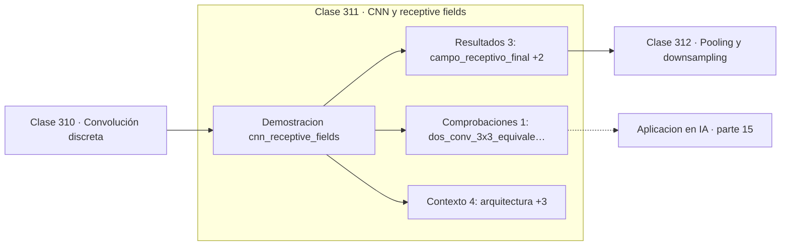

# 311 — CNN y receptive fields

> [⬅️ 310 Convolución discreta](../310-convolucion-discreta/README.md) · [📚 Parte 15](../README.md) · [🏠 Programa](../../../README.md) · [312 Pooling y downsampling ➡️](../312-pooling-y-downsampling/README.md)

**Parte:** 15 — Matemática de Deep Learning · **Nivel:** `deep-learning` · **Horas estimadas:** 4
**Motor:** `engines.part15` · **Demostración:** `cnn_receptive_fields` · **Clase 11 de 20** de la parte

---

## 🎯 Propósito

**Dos convoluciones de 3×3 ven lo mismo que una de 5×5 con menos parámetros y más no linealidad.**

Perceptrón, MLP, activaciones, pérdidas, backpropagation paso a paso, grafos de cómputo, inicialización, normalización, convolución, recurrencia y embeddings.

## ✅ Resultados de aprendizaje

Al terminar podrás:

1. Explicar **CNN y receptive fields** con lenguaje cotidiano y con notación matemática.
2. Resolver un caso pequeño a mano y anticipar el orden de magnitud del resultado.
3. Ejecutar y modificar `lab.py`, que corre la demostración `cnn_receptive_fields`.
4. Interpretar las 8 salidas del laboratorio y decir qué comprueba cada una.
5. Detectar el error típico de esta parte: aplicar softmax sin restar el máximo y provocar overflow.

## 🧩 Fórmulas de la clase

```text
RF_l = RF_{l−1} + (k_l − 1)·Π sᵢ
dos 3×3 ⟹ campo receptivo 5, 18 parámetros
una 5×5 ⟹ campo receptivo 5, 25 parámetros
```

## 🗺️ Ubicación en el programa



## 📖 Fundamentos

El **campo receptivo** de una activación es la región de la imagen de entrada que puede
influir en su valor. En la primera capa coincide con el núcleo; al apilar capas crece, y
con pooling o stride crece mucho más rápido porque cada paso vale por varios píxeles
originales.

La fórmula recursiva lo cuantifica: cada capa añade `(k−1)` multiplicado por el producto de
todos los strides anteriores. Ese producto —el «salto»— es lo que hace que el crecimiento
sea multiplicativo y no aditivo, y por eso unas pocas capas con reducción bastan para ver
la imagen entera.

La observación práctica más rentable es la de VGG: **dos convoluciones de 3×3 apiladas
tienen el mismo campo receptivo que una de 5×5**, pero usan 18 parámetros en vez de 25 y
aplican dos no linealidades en vez de una. Tres de 3×3 equivalen a una de 7×7 con 27
parámetros frente a 49. Por eso las arquitecturas modernas usan casi exclusivamente núcleos
3×3.

El campo receptivo importa porque limita lo que la red puede ver. Si un objeto ocupa 100
píxeles y el campo receptivo efectivo de la capa final es de 50, ninguna neurona podrá
integrarlo completo. Diseñar la profundidad y la reducción es, en buena medida, diseñar el
campo receptivo.

## 🧮 Ejemplo trabajado

Crecimiento del campo receptivo en cinco capas.

```text
arquitectura:
  conv k=3 s=1  →  conv k=3 s=1  →  pool k=2 s=2
  →  conv k=3 s=1  →  conv k=3 s=1

capa   tipo   campo receptivo   salto
  1    conv          3            1
  2    conv          5            1
  3    pool          6            2
  4    conv         10            2
  5    conv         14            2

campo receptivo final: 14 píxeles

Comparación de coste:
  dos conv 3×3:  campo 5,  18 parámetros, 2 ReLU
  una conv 5×5:  campo 5,  25 parámetros, 1 ReLU

28 % menos parámetros y el doble de no linealidad.
```

## 🔬 Qué ejecuta el laboratorio

`cnn_receptive_fields` — Campo receptivo: cómo crece al apilar capas.

| Grupo | Salidas |
|---|---|
| 🔢 Resultados numéricos (3) | `campo_receptivo_final`, `parametros_2x(3x3)`, `parametros_1x(5x5)` |
| ✅ Comprobaciones de invariante (1) | `dos_conv_3x3_equivalen_a_una_5x5` |

Las claves booleanas no son adorno: si alguna fuera `False`, el resultado numérico
no sería fiable aunque el programa terminase sin error.

```bash
python classes/part-15-matematica-de-deep-learning/311-cnn-y-receptive-fields/lab.py
compmath run 311
```

> [!TIP]
> Antes de ejecutar, **escribe tu predicción**. Un laboratorio que confirma lo que
> esperabas enseña tanto como uno que te contradice, pero solo si la predicción
> existía antes del resultado.

## ⚠️ Errores conceptuales frecuentes

1. Diseñar la profundidad sin calcular el campo receptivo resultante.
2. Usar núcleos grandes donde varios pequeños son mejores.
3. Confundir campo receptivo teórico con el efectivo, que es menor.

## 🚀 Dónde se usa de verdad

Diseño de arquitecturas convolucionales, segmentación semántica, detección de objetos y
elección de profundidad según el tamaño de los objetos.

## 🤖 Conexión con IA

Toda arquitectura moderna, incluido el Transformer, se construye sobre estos bloques y sobre este mismo mecanismo de derivación.

## 📓 Notebooks

| Archivo | Para qué |
|---|---|
| [`notebook.ipynb`](notebook.ipynb) | recorrido guiado con la demostración ejecutada |
| [`notebook_student.ipynb`](notebook_student.ipynb) | versión con `TODO` para resolver |
| [`notebook_solution.ipynb`](notebook_solution.ipynb) | solución de referencia verificada |

## 📝 Evaluación

| Criterio | Peso |
|---|---:|
| Comprensión conceptual | 25 % |
| Resolución manual | 25 % |
| Implementación y verificación | 25 % |
| Interpretación y comunicación | 15 % |
| Conexión con aplicación real | 10 % |

Detalle y criterios de error crítico en [`assessment.md`](assessment.md).

## ❓ Preguntas de comprobación

1. ¿Cuál es la entrada, cuál la salida y qué unidades tienen?
2. ¿Qué operación domina el comportamiento del resultado?
3. ¿Qué caso extremo revelaría un error conceptual?
4. ¿Cómo verificarías el resultado por un método independiente?
5. ¿Dónde aparece esto en visión?

Si necesitas releer el código para responderlas, la clase todavía no está superada.

## 📥 Entregable

`notebook_student.ipynb` resuelto más un párrafo que explique el resultado **sin citar
código**: qué entra, qué sale, qué invariante se comprueba y qué pasaría en un caso límite.

## 🔗 Referencias

- [Simonyan, K.; Zisserman, A. *Very Deep Convolutional Networks (VGG)*, ICLR, 2015](https://arxiv.org/abs/1409.1556) — *uso:* artículo de origen consultado en «CNN y receptive fields».
- [Luo, W. et al. *Understanding the effective receptive field*, NeurIPS, 2016](https://arxiv.org/abs/1701.04128) — *uso:* artículo de origen consultado en «CNN y receptive fields».

Bibliografía completa de la parte en [`../../../docs/BIBLIOGRAPHY.md`](../../../docs/BIBLIOGRAPHY.md) · localizador verificable de cada obra en [`sources/bibliography.json`](../../../sources/bibliography.json).

## 📂 Material de la clase

[`intuition.md`](intuition.md) · [`theory.md`](theory.md) · [`derivation.md`](derivation.md) · [`exercises.md`](exercises.md) · [`assessment.md`](assessment.md) · [`where-is-this-used.md`](where-is-this-used.md) · [`lesson.yaml`](lesson.yaml)

---

> [⬅️ 310 Convolución discreta](../310-convolucion-discreta/README.md) · [📚 Parte 15](../README.md) · [🏠 Programa](../../../README.md) · [312 Pooling y downsampling ➡️](../312-pooling-y-downsampling/README.md)
