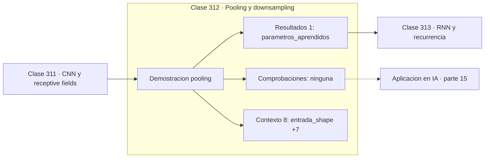

# 312 — Pooling y downsampling

> [⬅️ 311 CNN y receptive fields](../311-cnn-y-receptive-fields/README.md) · [📚 Parte 15](../README.md) · [🏠 Programa](../../../README.md) · [313 RNN y recurrencia ➡️](../313-rnn-y-recurrencia/README.md)

**Parte:** 15 — Matemática de Deep Learning · **Nivel:** `deep-learning` · **Horas estimadas:** 4
**Motor:** `engines.part15` · **Demostración:** `pooling` · **Clase 12 de 20** de la parte

---

## 🎯 Propósito

**Pooling reduce sin parámetros: max conserva la intensidad, average conserva el contexto.**

Perceptrón, MLP, activaciones, pérdidas, backpropagation paso a paso, grafos de cómputo, inicialización, normalización, convolución, recurrencia y embeddings.

## ✅ Resultados de aprendizaje

Al terminar podrás:

1. Explicar **Pooling y downsampling** con lenguaje cotidiano y con notación matemática.
2. Resolver un caso pequeño a mano y anticipar el orden de magnitud del resultado.
3. Ejecutar y modificar `lab.py`, que corre la demostración `pooling`.
4. Interpretar las 9 salidas del laboratorio y decir qué comprueba cada una.
5. Detectar el error típico de esta parte: mezclar estadísticas de batch normalization entre entrenamiento e inferencia.

## 🧩 Fórmulas de la clase

```text
max pooling: máximo de cada ventana
average pooling: media de cada ventana
parámetros aprendidos: 0
```

## 🗺️ Ubicación en el programa



## 📖 Fundamentos

El pooling reduce la resolución espacial agregando ventanas de activaciones. No tiene
parámetros aprendidos: es una operación fija que reduce el cómputo, amplía el campo
receptivo e introduce cierta invariancia a pequeños desplazamientos.

**Max pooling** conserva la activación más fuerte de cada ventana. Es el más usado en
clasificación porque preserva la evidencia de que una característica está presente,
descartando dónde exactamente. **Average pooling** promedia y conserva más información de
contexto, y es el habitual en la capa final como *global average pooling*, que sustituye a
las capas densas y reduce enormemente los parámetros.

La invariancia que proporciona tiene un límite del que conviene ser consciente: es
invariancia a desplazamientos **pequeños**, del orden del tamaño de la ventana. No hace la
red invariante a traslaciones grandes, y como se vio en la clase 270, hacer submuestreo sin
suavizado previo introduce aliasing que **rompe** la invariancia en vez de crearla.

La tendencia arquitectónica ha ido reduciendo su papel. Muchas redes modernas usan
convoluciones con stride 2 en lugar de pooling, con el argumento de que así la reducción
es aprendida en vez de impuesta. El pooling sobrevive sobre todo en su forma global al
final de la red.

## 🧮 Ejemplo trabajado

Max y average pooling 2×2 sobre la misma entrada.

```text
entrada 4×4

max pool 2×2:
  [[6,0   4,0]
   [7,0   9,0]]

average pool 2×2:
  [[3,75  2,25]
   [3,50  5,50]]

forma de salida: (2, 2)
reducción: 16 elementos → 4
parámetros aprendidos: 0

Max conserva el pico de cada ventana; average lo diluye.
Para "¿está presente esta característica?" conviene max;
para "¿cuánta hay en promedio?" conviene average.
```

## 🔬 Qué ejecuta el laboratorio

`pooling` — Max y average pooling: reducción con y sin pérdida de posición.

| Grupo | Salidas |
|---|---|
| 🔢 Resultados numéricos (1) | `parametros_aprendidos` |
| ✅ Comprobaciones de invariante (0) | — |

Las claves booleanas no son adorno: si alguna fuera `False`, el resultado numérico
no sería fiable aunque el programa terminase sin error.

```bash
python classes/part-15-matematica-de-deep-learning/312-pooling-y-downsampling/lab.py
compmath run 312
```

> [!TIP]
> Antes de ejecutar, **escribe tu predicción**. Un laboratorio que confirma lo que
> esperabas enseña tanto como uno que te contradice, pero solo si la predicción
> existía antes del resultado.

## ⚠️ Errores conceptuales frecuentes

1. Aplicar pooling agresivo y perder resolución necesaria para localizar.
2. Esperar invariancia a traslaciones grandes.
3. Submuestrear sin suavizado previo e introducir aliasing.

## 🚀 Dónde se usa de verdad

Redes convolucionales de clasificación, global average pooling como cabeza, reducción de
cómputo y agregación en redes sobre grafos.

## 🤖 Conexión con IA

Toda arquitectura moderna, incluido el Transformer, se construye sobre estos bloques y sobre este mismo mecanismo de derivación.

## 📓 Notebooks

| Archivo | Para qué |
|---|---|
| [`notebook.ipynb`](notebook.ipynb) | recorrido guiado con la demostración ejecutada |
| [`notebook_student.ipynb`](notebook_student.ipynb) | versión con `TODO` para resolver |
| [`notebook_solution.ipynb`](notebook_solution.ipynb) | solución de referencia verificada |

## 📝 Evaluación

| Criterio | Peso |
|---|---:|
| Comprensión conceptual | 25 % |
| Resolución manual | 25 % |
| Implementación y verificación | 25 % |
| Interpretación y comunicación | 15 % |
| Conexión con aplicación real | 10 % |

Detalle y criterios de error crítico en [`assessment.md`](assessment.md).

## ❓ Preguntas de comprobación

1. ¿Cuál es la entrada, cuál la salida y qué unidades tienen?
2. ¿Qué operación domina el comportamiento del resultado?
3. ¿Qué caso extremo revelaría un error conceptual?
4. ¿Cómo verificarías el resultado por un método independiente?
5. ¿Dónde aparece esto en visión?

Si necesitas releer el código para responderlas, la clase todavía no está superada.

## 📥 Entregable

`notebook_student.ipynb` resuelto más un párrafo que explique el resultado **sin citar
código**: qué entra, qué sale, qué invariante se comprueba y qué pasaría en un caso límite.

## 🔗 Referencias

- [Goodfellow, I.; Bengio, Y.; Courville, A. *Deep Learning*, MIT Press, 2016, cap. 9](https://www.deeplearningbook.org/)
- [Lin, M.; Chen, Q.; Yan, S. *Network In Network*, ICLR, 2014](https://arxiv.org/abs/1312.4400)

Bibliografía completa de la parte en [`../../../docs/BIBLIOGRAPHY.md`](../../../docs/BIBLIOGRAPHY.md).

## 📂 Material de la clase

[`intuition.md`](intuition.md) · [`theory.md`](theory.md) · [`derivation.md`](derivation.md) · [`exercises.md`](exercises.md) · [`assessment.md`](assessment.md) · [`where-is-this-used.md`](where-is-this-used.md) · [`lesson.yaml`](lesson.yaml)

---

> [⬅️ 311 CNN y receptive fields](../311-cnn-y-receptive-fields/README.md) · [📚 Parte 15](../README.md) · [🏠 Programa](../../../README.md) · [313 RNN y recurrencia ➡️](../313-rnn-y-recurrencia/README.md)
